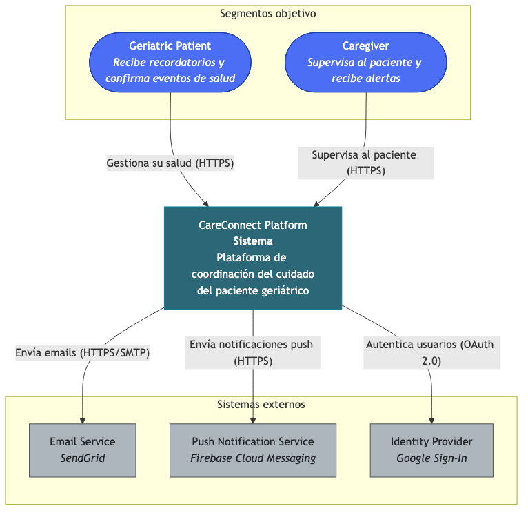
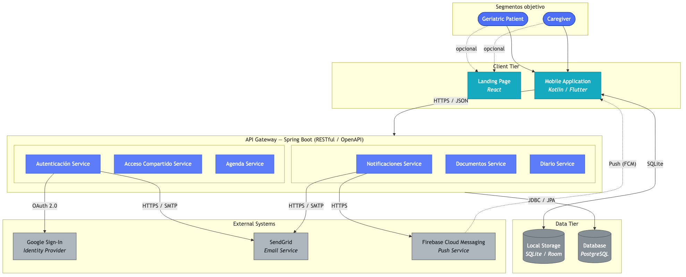
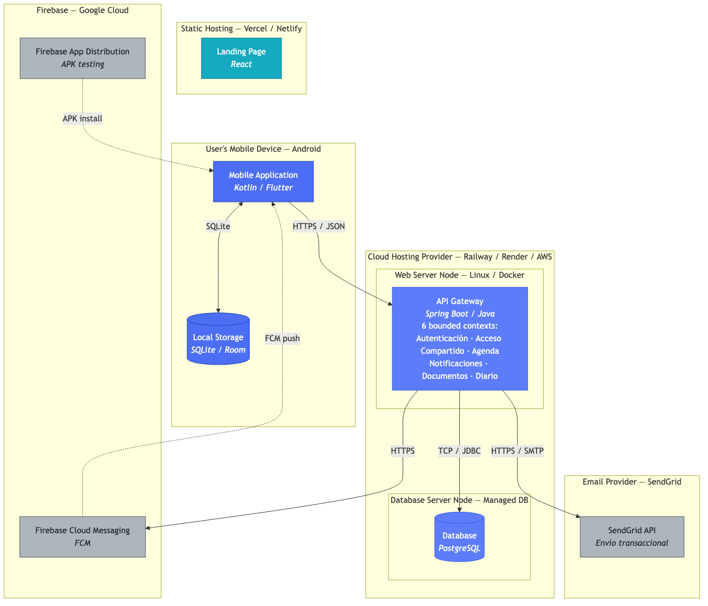
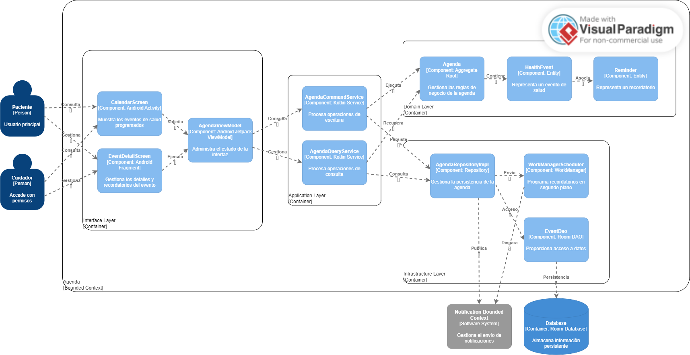
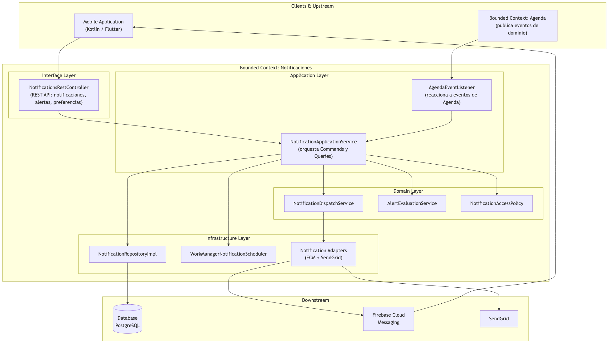
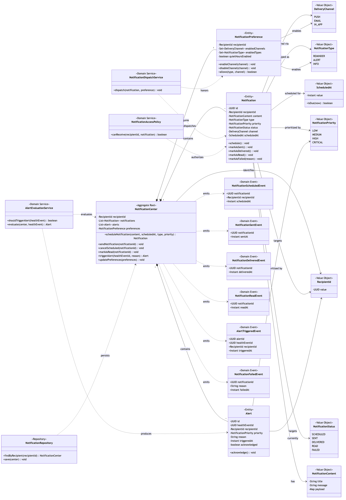

### Logo de Universidad

**Universida Peruana de Ciencias Aplicadas**  

**Ingeniería de Software**  

**2026-01**  
 

**1ACC0238 - Aplicaciones para Dispositivos Móviles**  
 

**NRC:** 3690

**Docente:** Mayta Guillermo, Jorge Luis
 

### Informe de Trabajo Final
 

**Startup:**

**Producto:**
 

<table>
  <tr>
    <th>Integrante</th>
    <th>Código</th>
  </tr>
  <tr>
    <td></td>
    <td></td>
  </tr>
  <tr>
    <td></td>
    <td></td>
  </tr>
  <tr>
    <td></td>
    <td></td>
  </tr>
  <tr>
    <td></td>
    <td></td>
  </tr>
  <tr>
    <td>Santillan Alvarado, Melina Liz</td>
    <td>U202216058</td>
  </tr>
</table>
 

**Abril del 2026**  

---

# Registro de Versiones del Informe

---

# Project Report Collaboration Insights

---

# Contenido

## Capítulo I: Presentación
- [1.1. Startup Profile](#11-startup-profile)  
  - [1.1.1. Descripción de la Startup](#111-descripcion-de-la-startup)  
  - [1.1.2. Perfiles de integrantes del equipo](#112-perfiles-de-integrantes-del-equipo)  
- [1.2. Solution Profile](#12-solution-profile)  
  - [1.2.1. Antecedentes y problemática](#121-antecedentes-y-problematica)  
  - [1.2.2. Lean UX Process](#122-lean-ux-process)  
    - [1.2.2.1. Lean UX Problem Statements](#1221-lean-ux-problem-statements)  
    - [1.2.2.2. Lean UX Assumptions](#1222-lean-ux-assumptions)  
    - [1.2.2.3. Lean UX Hypothesis Statements](#1223-lean-ux-hypothesis-statements)  
    - [1.2.2.4. Lean UX Canvas](#1224-lean-ux-canvas)  
- [1.3. Segmentos objetivo](#13-segmentos-objetivo)  

## Capítulo II: Requirements Development and Software Solution Design
- [2.1. Competidores](#21-competidores)  
  - [2.1.1. Análisis competitivo](#211-analisis-competitivo)  
  - [2.1.2. Estrategias y tácticas frente a competidores](#212-estrategias-y-tacticas-frente-a-competidores)  

- [2.2. Entrevistas](#22-entrevistas)  
  - [2.2.1. Diseño de entrevistas](#221-diseno-de-entrevistas)  
  - [2.2.2. Registro de entrevistas](#222-registro-de-entrevistas)  
  - [2.2.3. Análisis de entrevistas](#223-analisis-de-entrevistas)  

- [2.3. Needfinding](#23-needfinding)  
  - [2.3.1. User Personas](#231-user-personas)  
  - [2.3.2. User Task Matrix](#232-user-task-matrix)  
  - [2.3.3. User Journey Mapping](#233-user-journey-mapping)  
  - [2.3.4. Empathy Mapping](#234-empathy-mapping)  
  - [2.3.5. Ubiquitous Language](#235-ubiquitous-language)  

- [2.4. Requirements specification](#24-requirements-specification)  
  - [2.4.1. User Stories](#241-user-stories)  
  - [2.4.2. Impact Mapping](#242-impact-mapping)  
  - [2.4.3. Product Backlog](#243-product-backlog)  

- [2.5. Strategic-Level Domain-Driven Design](#25-strategic-level-domain-driven-design)  
  - [2.5.1. EventStorming](#251-eventstorming)  
    - [2.5.1.1. Candidate Context Discovery](#2511-candidate-context-discovery)  
    - [2.5.1.2. Domain Message Flows Modeling](#2512-domain-message-flows-modeling)  
    - [2.5.1.3. Bounded Context Canvases](#2513-bounded-context-canvases)  
  - [2.5.2. Context Mapping](#252-context-mapping)  
  - [2.5.3. Software Architecture](#253-software-architecture)  
    - [2.5.3.1. Software Architecture Context Level Diagrams](#2531-software-architecture-context-level-diagrams)  
    - [2.5.3.2. Software Architecture Container Level Diagrams](#2532-software-architecture-container-level-diagrams)  
    - [2.5.3.3. Software Architecture Deployment Diagrams](#2533-software-architecture-deployment-diagrams)  

- [2.6. Tactical-Level Domain-Driven Design](#26-tactical-level-domain-driven-design)  
  - [2.6.x. Bounded Context](#26x-bounded-context)  
    - [2.6.x.1. Domain Layer](#26x1-domain-layer)  
    - [2.6.x.2. Interface Layer](#26x2-interface-layer)  
    - [2.6.x.3. Application Layer](#26x3-application-layer)  
    - [2.6.x.4. Infrastructure Layer](#26x4-infrastructure-layer)  
    - [2.6.x.5. Bounded Context Software Architecture Component Level Diagrams](#26x5-component-level-diagrams)  
    - [2.6.x.6. Bounded Context Software Architecture Code Level Diagrams](#26x6-code-level-diagrams)  
      - [2.6.x.6.1. Bounded Context Domain Layer Class Diagrams](#26x61-domain-layer-class-diagrams)  
      - [2.6.x.6.2. Bounded Context Database Design Diagram](#26x62-database-design-diagram)  

## Capítulo III: Solution UI/UX Design
- [3.1. Product design](#31-product-design)  
  - [3.1.1. Style Guidelines](#311-style-guidelines)  
    - [3.1.1.1. General Style Guidelines](#3111-general-style-guidelines)  
  - [3.1.2. Information Architecture](#312-information-architecture)  
    - [3.1.2.1. Organization Systems](#3121-organization-systems)  
    - [3.1.2.2. Labelling Systems](#3122-labelling-systems)  
    - [3.1.2.3. SEO Tags and Meta Tags](#3123-seo-tags-and-meta-tags)  
    - [3.1.2.4. Searching Systems](#3124-searching-systems)  
    - [3.1.2.5. Navigation Systems](#3125-navigation-systems)  
  - [3.1.3. Landing Page UI Design](#313-landing-page-ui-design)  
    - [3.1.3.1. Landing Page Wireframe](#3131-landing-page-wireframe)  
    - [3.1.3.2. Landing Page Mock-up](#3132-landing-page-mock-up)  
  - [3.1.4. Mobile Applications UX/UI Design](#314-mobile-applications-uxui-design)  
    - [3.1.4.1. Mobile Applications Wireframes](#3141-mobile-applications-wireframes)  
    - [3.1.4.2. Mobile Applications Wireflow Diagrams](#3142-mobile-applications-wireflow-diagrams)  
    - [3.1.4.3. Mobile Applications Mock-ups](#3143-mobile-applications-mock-ups)  
    - [3.1.4.4. Mobile Applications User Flow Diagrams](#3144-mobile-applications-user-flow-diagrams)  
    - [3.1.4.5. Mobile Applications Prototyping](#3145-mobile-applications-prototyping)  

## Capítulo IV: Product Implementation & Validation
- [4.1. Product Implementation & Validation](#41-product-implementation--validation)  
  - [4.1.1. Software Configuration Management](#411-software-configuration-management)  
    - [4.1.1.1. Software Development Environment Configuration](#4111-software-development-environment-configuration)  
    - [4.1.1.2. Source Code Management](#4112-source-code-management)  
    - [4.1.1.3. Source Code Style Guide & Conventions](#4113-source-code-style-guide--conventions)  
    - [4.1.1.4. Software Deployment Configuration](#4114-software-deployment-configuration)  

- [4.2. Landing Page & Mobile Application Implementation](#42-landing-page--mobile-application-implementation)  
  - [4.2.1. Sprint n](#421-sprint-n)  
    - [4.2.1.1. Sprint Planning n](#4211-sprint-planning-n)  
    - [4.2.1.2. Sprint Backlog n](#4212-sprint-backlog-n)  
    - [4.2.1.3. Development Evidence for Sprint Review](#4213-development-evidence)  
    - [4.2.1.4. Testing Suite Evidence for Sprint Review](#4214-testing-suite-evidence)  
    - [4.2.1.5. Execution Evidence for Sprint Review](#4215-execution-evidence)  
    - [4.2.1.6. Services Documentation Evidence for Sprint Review](#4216-services-documentation-evidence)  
    - [4.2.1.7. Software Deployment Evidence for Sprint Review](#4217-software-deployment-evidence)  
    - [4.2.1.8. Team Collaboration Insights during Sprint](#4218-team-collaboration-insights)  

- [4.3. Validation Interviews](#43-validation-interviews)  
  - [4.3.1. Diseño de Entrevistas](#431-diseno-de-entrevistas)  
  - [4.3.2. Registro de Entrevistas](#432-registro-de-entrevistas)  
  - [4.3.3. Evaluaciones según heurísticas](#433-evaluaciones-segun-heuristicas)  

## [Conclusiones](#conclusiones)  
## [Glosario](#glosario)  
## [Bibliografía](#bibliografia)  
## [Anexos](#anexos)  

---

# Capítulo I: Presentación

## 1.1. Startup Profile
### 1.1.1. Descripción de la Startup 
### 1.1.2. Perfiles de integrantes del equipo 

## 1.2. Solution Profile 
### 1.2.1. Antecedentes y problemática 
### 1.2.2. Lean UX Process 
#### 1.2.2.1. Lean UX Problem Statements 
#### 1.2.2.2. Lean UX Assumptions 
#### 1.2.2.3. Lean UX Hypothesis Statements 
#### 1.2.2.4. Lean UX Canvas 

## 1.3. Segmentos objetivo 

---

# Capítulo II: Requirements Development and Software Solution Design

## 2.1. Competidores
### 2.1.1. Análisis competitivo 

# Capítulo II: Requirements & Analysis

### 2.1.1 Competitive Analysis Landscape

<table>
  <tr>
    <th colspan="6">Competitive Analysis Landscape</th>
  </tr>

  <tr>
    <th>¿Por qué llevar a cabo este análisis?</th>
    <th colspan="5">
      ¿Cómo podemos diseñar una solución digital eficiente, confiable y diferenciada que permita a los cuidadores y familiares coordinar el cuidado de personas con discapacidad en tiempo real, reduciendo errores, mejorando la comunicación y brindando visibilidad completa del estado del paciente?
    </th>
  </tr>

  <tr>
    <th rowspan="4">Perfil</th>
    <th></th>
    <th>CareConnect</th>
    <th>Medisafe</th>
    <th>MyTherapy</th>
    <th>CareZone</th>
  </tr>

  <tr>
    <td><b>Overview</b></td>
    <td>
      Aplicación móvil enfocada en la gestión integral del cuidado de personas con discapacidad. 
      Permite coordinar tratamientos, registrar evolución del paciente y compartir información entre múltiples cuidadores en tiempo real.
    </td>
    <td>
      Aplicación enfocada en recordatorios de medicación para pacientes individuales.
    </td>
    <td>
      Aplicación orientada al seguimiento de salud, hábitos y tratamientos médicos.
    </td>
    <td>
      Plataforma que permite organizar información médica y documentos de pacientes.
    </td>
  </tr>

  <tr>
    <td><b>Ventaja competitiva</b></td>
    <td>
      Integración completa del cuidado colaborativo en una sola plataforma con múltiples usuarios.
    </td>
    <td>
      Alta especialización en recordatorios de medicación.
    </td>
    <td>
      Interfaz simple y monitoreo continuo de salud.
    </td>
    <td>
      Organización de información médica familiar.
    </td>
  </tr>

  <tr>
    <td><b>¿Qué valor ofrece a los clientes?</b></td>
    <td>
      Mejora la coordinación entre cuidadores, reduce errores en el cuidado y permite acceso centralizado a información crítica del paciente.
    </td>
    <td>
      Reduce olvidos en la toma de medicamentos.
    </td>
    <td>
      Permite seguimiento de tratamientos y hábitos de salud.
    </td>
    <td>
      Facilita el almacenamiento y acceso a información médica.
    </td>
  </tr>

  <tr>
    <th rowspan="2">Perfil de Marketing</th>
    <td><b>Mercado Objetivo</b></td>
    <td>
      Cuidadores y familiares de personas con discapacidad en entornos domiciliarios.
    </td>
    <td>
      Pacientes individuales con tratamientos médicos.
    </td>
    <td>
      Personas con enfermedades crónicas.
    </td>
    <td>
      Familias que gestionan información médica.
    </td>
  </tr>

  <tr>
    <td><b>Estrategias de Marketing</b></td>
    <td>
      Marketing digital, enfoque en bienestar, confianza y facilidad de uso.
    </td>
    <td>
      Marketing orientado a salud personal.
    </td>
    <td>
      Promoción en bienestar y seguimiento de salud.
    </td>
    <td>
      Enfoque en organización familiar.
    </td>
  </tr>

  <tr>
    <th rowspan="3">Perfil de Producto</th>
    <td><b>Productos & Servicios</b></td>
    <td>
      Aplicación móvil multiplataforma con calendario, alertas, historial clínico y perfiles compartidos.
    </td>
    <td>
      Aplicación móvil de recordatorios de medicación.
    </td>
    <td>
      Aplicación móvil de seguimiento de salud.
    </td>
    <td>
      Plataforma web y móvil para organización médica.
    </td>
  </tr>

  <tr>
    <td><b>Precios & Costos</b></td>
    <td>
      Modelo freemium con funcionalidades premium.
    </td>
    <td>
      Freemium.
    </td>
    <td>
      Freemium.
    </td>
    <td>
      Freemium.
    </td>
  </tr>

  <tr>
    <td><b>Canales de distribución (Web y/o Móvil)</b></td>
    <td>Móvil</td>
    <td>Móvil</td>
    <td>Móvil</td>
    <td>Web y móvil</td>
  </tr>

  <tr>
    <th rowspan="4">Análisis SWOT</th>
    <td><b>Fortalezas</b></td>
    <td>
      Solución integral enfocada en coordinación, centralización y colaboración entre usuarios.
    </td>
    <td>
      Alta especialización en medicación.
    </td>
    <td>
      Interfaz intuitiva.
    </td>
    <td>
      Organización básica de datos médicos.
    </td>
  </tr>

  <tr>
    <td><b>Debilidades</b></td>
    <td>
      Aplicación en etapa inicial sin posicionamiento consolidado.
    </td>
    <td>
      No permite colaboración entre múltiples usuarios.
    </td>
    <td>
      No integra completamente la información médica.
    </td>
    <td>
      Funcionalidades limitadas.
    </td>
  </tr>

  <tr>
    <td><b>Oportunidades</b></td>
    <td>
      Crecimiento del sector salud digital y necesidad de soluciones colaborativas.
    </td>
    <td>
      Expansión hacia gestión integral del cuidado.
    </td>
    <td>
      Integración con nuevas tecnologías.
    </td>
    <td>
      Mejora de funcionalidades y expansión.
    </td>
  </tr>

  <tr>
    <td><b>Amenazas</b></td>
    <td>
      Competidores ya posicionados y barreras de adopción inicial.
    </td>
    <td>
      Nuevas aplicaciones más completas.
    </td>
    <td>
      Saturación del mercado.
    </td>
    <td>
      Falta de innovación.
    </td>
  </tr>

</table>

### 2.1.2. Estrategias y tácticas frente a competidores 

A partir del análisis competitivo realizado en la sección anterior, se identificaron diversas oportunidades y debilidades en los competidores actuales (Medisafe, MyTherapy y CareZone). En base a estos hallazgos, se plantean las siguientes estrategias y tácticas para posicionar a CareConnect como una solución diferenciada en el mercado:

---

### 1. Diferenciación mediante coordinación en tiempo real

Se identificó que competidores como Medisafe y MyTherapy se enfocan principalmente en recordatorios individuales, sin permitir la interacción o coordinación entre múltiples usuarios, mientras que CareZone solo centraliza información sin ofrecer comunicación dinámica.

**Estrategia:**  
Implementar un sistema de coordinación en tiempo real entre cuidadores y familiares.

**Tácticas:**
- Sistema de notificaciones en tiempo real sobre medicación y eventos.
- Confirmación de actividades realizadas (ej: medicación administrada).
- Alertas automáticas en caso de incumplimiento o eventos críticos.

---

### 2. Plataforma integral de cuidado

Los competidores actuales ofrecen soluciones parciales: Medisafe se enfoca en medicación, MyTherapy en seguimiento de salud y CareZone en almacenamiento de información.

**Estrategia:**  
Ofrecer una plataforma integral que centralice todos los aspectos del cuidado en una sola aplicación.

**Tácticas:**
- Integración de calendario de medicación y terapias.
- Registro de historial clínico y evolución del paciente.
- Almacenamiento de documentos médicos en una carpeta digital.
- Unificación de todas las funcionalidades en una sola interfaz.

---

### 3. Enfoque en el cuidado colaborativo

Ninguno de los competidores actuales permite una gestión eficiente entre múltiples cuidadores y familiares.

**Estrategia:**  
Permitir la gestión colaborativa del cuidado mediante perfiles compartidos.

**Tácticas:**
- Sistema de usuarios múltiples vinculados a un mismo paciente.
- Acceso compartido a historial, eventos y registros.
- Control de permisos según tipo de usuario (cuidador, familiar).

---

### 4. Mejora de la experiencia del usuario (UX/UI)

Se observó que varias soluciones no están diseñadas para contextos de uso bajo presión ni para usuarios con bajo conocimiento tecnológico.

**Estrategia:**  
Desarrollar una interfaz intuitiva, rápida y centrada en el usuario.

**Tácticas:**
- Diseño mobile-first enfocado en dispositivos Android de gama media.
- Navegación simple con flujos cortos.
- Interfaces claras para tareas críticas (registro, consulta, alertas).
- Pruebas de usabilidad con cuidadores reales.

---

### 5. Enfoque en un nicho específico (discapacidad)

Los competidores actuales no están especializados en el cuidado de personas con discapacidad.

**Estrategia:**  
Posicionar a CareConnect como una solución especializada en este segmento.

**Tácticas:**
- Adaptación de funcionalidades a rutinas complejas de cuidado.
- Diseño accesible y comprensible.
- Comunicación centrada en bienestar y apoyo al cuidador.

---

### 6. Estrategia de crecimiento y adopción

Se identificó que algunos competidores tienen alcance limitado o no están enfocados en LATAM.

**Estrategia:**  
Expandir la plataforma mediante estrategias digitales y alianzas estratégicas.

**Tácticas:**
- Campañas en redes sociales dirigidas a cuidadores y familias.
- Alianzas con centros de salud y organizaciones de apoyo.
- Modelo freemium para facilitar adopción inicial.
- Programas de recomendación entre usuarios.

---

### 7. Mejora continua basada en datos

Los competidores presentan limitaciones en personalización y evolución del producto.

**Estrategia:**  
Implementar un modelo de mejora continua basado en datos y feedback de usuarios.

**Tácticas:**
- Recolección de métricas de uso dentro de la app.
- Análisis del comportamiento del usuario.
- Iteraciones frecuentes del producto.
- Incorporación de feedback directo de cuidadores y familiares.
## 2.2. Entrevistas 

Esta sección presenta el diseño y la estructura de las entrevistas que serán realizadas a los segmentos objetivo, con el fin de comprender sus necesidades, problemas actuales y oportunidades de mejora en la gestión del cuidado de personas con discapacidad.

---
### 2.2.1. Diseño de entrevistas 

Se diseñaron entrevistas semiestructuradas dirigidas a los dos segmentos objetivo identificados: cuidadores y familiares.

---

#### Segmento 1: Cuidadores

El objetivo es entender cómo gestionan actualmente el cuidado diario, qué herramientas utilizan y qué dificultades enfrentan.

**Preguntas principales:**
- ¿Nos podría indicar su nombre, edad y cuánto tiempo lleva realizando actividades de cuidado?
- ¿Cómo organiza actualmente la medicación y terapias del paciente?
- ¿Qué herramientas utiliza en su día a día?
- ¿Ha tenido problemas por falta de coordinación o información?
- ¿Cómo se comunica con otros cuidadores o familiares?
- ¿Qué aspectos considera más difíciles en el cuidado diario?
- ¿Qué funcionalidades le gustaría tener en una aplicación de apoyo?
- ¿Qué espera mejorar con una solución digital?

---

#### Segmento 2: Pacientes geriátricos

El objetivo de este segmento es comprender cómo los pacientes gestionan su propio cuidado, qué dificultades tienen para seguir sus tratamientos y qué tipo de apoyo digital necesitan para mejorar su autonomía.

**Preguntas principales:**
- ¿Nos podría indicar su nombre, edad y si actualmente recibe apoyo de un cuidador?
- ¿Cómo recuerda tomar sus medicamentos o asistir a sus citas médicas?
- ¿Ha tenido dificultades para seguir su tratamiento o rutina diaria?
- ¿Qué es lo que más le cuesta recordar o controlar en su día a día?
- ¿Utiliza celular o alguna aplicación actualmente? ¿Para qué?
- ¿Qué tipo de recordatorios le ayudarían más (alarmas, notificaciones, mensajes)?
- ¿Le gustaría poder ver sus actividades o medicamentos en una sola pantalla?
- ¿Qué le haría sentir más seguro o tranquilo respecto a su cuidado?
- ¿Qué tan fácil o difícil le resulta usar aplicaciones móviles?
- ¿Qué funcionalidades le gustaría tener en una aplicación que le ayude en su cuidado?
- 
---

### 2.2.2. Registro de entrevistas 
#### Segmento: Cuidadores

---

### Entrevista 1

**Información del entrevistado**

- Nombre: Giancarlo Castañeda  
- Edad: 20 años  
- Procedencia: Perú 
- Tiempo como cuidador: 1 año  
- Tipo de cuidado: Cuidador de adultos mayores a domicilio  

**Resumen:**

El entrevistado indicó que actualmente gestiona el cuidado del paciente mediante herramientas mayormente manuales. Para la medicación utiliza pastilleros semanales organizados con base en recetas médicas, complementando con alarmas en su celular para recordar los horarios. Las terapias y citas médicas las registra en un cuaderno físico junto con el historial del paciente.

En cuanto a herramientas, utiliza dispositivos médicos básicos como tensiómetro, oxímetro y termómetro, además de un cuaderno de bitácora para registrar eventos relevantes. A nivel digital, emplea principalmente alarmas y WhatsApp para comunicarse con los familiares.

El entrevistado señaló que uno de los principales problemas es la falta de coordinación durante los cambios de turno, donde la información no siempre se transmite correctamente, lo que puede generar pérdida de datos importantes sobre el estado del paciente.

Respecto a las dificultades del cuidado diario, mencionó el manejo de cambios de humor y episodios de confusión del paciente, así como la falta de apoyo inmediato de profesionales de salud para resolver dudas.

En relación con una posible solución digital, destacó la necesidad de funcionalidades como:
- Registro compartido en tiempo real entre cuidadores  
- Confirmación de administración de medicamentos  
- Recordatorios automáticos  
- Historial de signos vitales  
- Sección de notas para relevo de turno  

Finalmente, el entrevistado espera que una solución digital le permita reducir la carga mental, mejorar la organización del cuidado y generar mayor confianza con los familiares, al brindarles visibilidad del estado del paciente en tiempo real.

---

### Entrevista 2

**Información del entrevistado**

- Nombre:  
- Edad:  
- Procedencia:  
- Tiempo como cuidador:  
- Tipo de cuidado (familiar / profesional):  

**Resumen:**  
(Describir brevemente cómo gestiona el cuidado, herramientas que usa, problemas y necesidades detectadas)

---

#### Segmento: Familiares

---

### Entrevista 1

**Información del entrevistado**

- Nombre:  
- Edad:  
- Procedencia:  
- Relación con el paciente:  

**Resumen:**  
(Describir cómo obtiene información, preocupaciones, problemas y expectativas)

---

### Entrevista 2

**Información del entrevistado**

- Nombre:  
- Edad:  
- Procedencia:  
- Relación con el paciente:  

**Resumen:**  
(Describir cómo obtiene información, preocupaciones, problemas y expectativas)

---
### 2.2.3. Análisis de entrevistas 

## 2.3. Needfinding 
### 2.3.1. User Personas 
### 2.3.2. User Task Matrix 
### 2.3.3. User Journey Mapping 
### 2.3.4. Empathy Mapping 
### 2.3.5. Ubiquitous Language 

## 2.4. Requirements specification 
### 2.4.1. User Stories 

## Epics

| Epic ID | Nombre de la Épica        | Descripción                                                                                           |
|---------|---------------------------|-------------------------------------------------------------------------------------------------------|
| EP01    | Gestión de Agenda         | Como paciente o cuidador, quiero gestionar eventos de salud para organizar medicación y citas en el tiempo. |
| EP02    | Gestión de Notificaciones | Como paciente o cuidador, quiero recibir notificaciones para dar seguimiento oportuno a los eventos de salud. |
| EP03    | Gestión de Documentos     | Como paciente o cuidador, quiero gestionar documentos médicos para mantener un registro accesible.    |
| EP04    | Acceso Compartido         | Como paciente, quiero compartir mi perfil con un cuidador para permitir el seguimiento de mi estado de salud. |
| EP05    | Diario de Seguimiento     | Como paciente o cuidador, quiero registrar notas de seguimiento para monitorear la evolución del estado de salud. |
| EP06    | Autenticación             | Como paciente o cuidador, quiero acceder al sistema de forma segura para proteger mi información personal. |

### US01 – Registrar evento de salud

| **Story ID** | US01 |
|-----------|-------|
| **User** | Paciente / Cuidador |
| **Priority** | Alta |
| **Epic** | Gestión de Agenda |
| **Description** | Como paciente o cuidador, deseo registrar un evento de salud (medicación o cita) para organizar las actividades médicas en un calendario. |
| **Acceptance Criteria** | Escenario 1: Registro exitoso de evento   Dado que el paciente o cuidador ingresa datos válidos del evento   Cuando registra el evento de salud   Entonces el sistema almacena el evento correctamente en la agenda    Escenario 2: Validación de datos obligatorios   Dado que el paciente o cuidador omite datos obligatorios   Cuando intenta registrar el evento   Entonces el sistema muestra un mensaje de error indicando los campos requeridos    Escenario 3: Visualización del evento   Dado que el evento fue registrado correctamente   Cuando el paciente o cuidador accede al calendario   Entonces el evento se visualiza en la fecha correspondiente |

---

### US02 – Confirmar evento de salud

| **Story ID** | US02 |
|-----------|-------|
| **User** | Paciente |
| **Priority** | Alta |
| **Epic** | Gestión de Agenda |
| **Description** | Como paciente, deseo confirmar un evento de salud para registrar el cumplimiento de mi tratamiento. |
| **Acceptance Criteria** | Escenario 1: Confirmación exitosa   Dado que existe un evento programado   Cuando el paciente confirma el evento   Entonces el sistema actualiza su estado a “confirmado”    Escenario 2: Visualización del estado   Dado que el evento fue confirmado   Cuando el paciente accede al calendario   Entonces el estado del evento se muestra como confirmado |

---

### US03 – Reprogramar evento de salud

| **Story ID** | US03 |
|-----------|-------|
| **User** | Paciente / Cuidador |
| **Priority** | Media |
| **Epic** | Gestión de Agenda |
| **Description** | Como paciente o cuidador, deseo reprogramar un evento de salud para ajustarlo a cambios en la disponibilidad. |
| **Acceptance Criteria** | Escenario 1: Reprogramación exitosa   Dado que existe un evento previamente registrado   Cuando el paciente o cuidador modifica la fecha u hora   Entonces el sistema actualiza el evento correctamente    Escenario 2: Validación de conflicto   Dado que existe otro evento en el mismo horario   Cuando el paciente o cuidador intenta reprogramar   Entonces el sistema evita el conflicto y muestra una advertencia |

---

### US04 – Recibir recordatorios de eventos

| **Story ID** | US04 |
|-----------|-------|
| **User** | Paciente |
| **Priority** | Alta |
| **Epic** | Gestión de Notificaciones |
| **Description** | Como paciente, deseo recibir recordatorios de mis eventos de salud para cumplir con mis actividades programadas. |
| **Acceptance Criteria** | Escenario 1: Envío de recordatorio   Dado que existe un evento programado   Cuando se aproxima la hora del evento   Entonces el paciente recibe una notificación    Escenario 2: Contenido de la notificación   Dado que se genera una notificación   Cuando el paciente la visualiza   Entonces esta contiene información relevante del evento |

---

### US05 – Recibir alertas de incumplimiento

| **Story ID** | US05 |
|-----------|-------|
| **User** | Cuidador |
| **Priority** | Alta |
| **Epic** | Gestión de Notificaciones |
| **Description** | Como cuidador, deseo recibir alertas cuando un evento no es confirmado para supervisar al paciente. |
| **Acceptance Criteria** | Escenario 1: Generación de alerta   Dado que un evento no ha sido confirmado   Cuando se supera el tiempo límite establecido   Entonces el cuidador recibe una alerta de incumplimiento    Escenario 2: Validación de permisos   Dado que el cuidador no tiene acceso al paciente   Cuando se genera la alerta   Entonces el sistema no envía la notificación |

---

### US06 – Visualizar notificaciones

| **Story ID** | US06 |
|-----------|-------|
| **User** | Cuidador |
| **Priority** | Media |
| **Epic** | Gestión de Notificaciones |
| **Description** | Como cuidador, deseo visualizar las notificaciones recibidas para monitorear el estado del paciente. |
| **Acceptance Criteria** | Escenario 1: Consulta de notificaciones   Dado que existen notificaciones registradas   Cuando el cuidador accede a la sección de notificaciones   Entonces el sistema muestra la lista de notificaciones    Escenario 2: Orden de visualización   Dado que existen múltiples notificaciones   Cuando el cuidador las visualiza   Entonces se muestran ordenadas por fecha o prioridad |

---

### US07 – Subir documento médico

| **Story ID** | US07 |
|-----------|-------|
| **User** | Paciente / Cuidador |
| **Priority** | Alta |
| **Epic** | Gestión de Documentos |
| **Description** | Como paciente o cuidador, deseo subir documentos médicos para mantener un registro digital accesible. |
| **Acceptance Criteria** | Escenario 1: Carga exitosa   Dado que el paciente o cuidador selecciona un archivo válido   Cuando lo sube al sistema   Entonces el documento se almacena correctamente    Escenario 2: Validación de archivo   Dado que el archivo no cumple con formato o tamaño permitido   Cuando el paciente o cuidador intenta subirlo   Entonces el sistema muestra un mensaje de error |

---

### US08 – Consultar documentos

| **Story ID** | US08 |
|-----------|-------|
| **User** | Paciente / Cuidador |
| **Priority** | Media |
| **Epic** | Gestión de Documentos |
| **Description** | Como paciente o cuidador, deseo consultar los documentos almacenados para revisar información médica. |
| **Acceptance Criteria** | Escenario 1: Visualización de documentos   Dado que existen documentos almacenados   Cuando el paciente o cuidador accede a la sección correspondiente   Entonces el sistema muestra la lista de documentos disponibles |

---

### US09 – Acceder a documentos compartidos

| **Story ID** | US09 |
|-----------|-------|
| **User** | Cuidador |
| **Priority** | Media |
| **Epic** | Gestión de Documentos |
| **Description** | Como cuidador, deseo acceder a los documentos del paciente para apoyar en su seguimiento. |
| **Acceptance Criteria** | Escenario 1: Acceso autorizado   Dado que el cuidador tiene permisos de acceso   Cuando consulta los documentos del paciente   Entonces el sistema permite su visualización    Escenario 2: Acceso denegado   Dado que el cuidador no tiene permisos   Cuando intenta acceder a los documentos   Entonces el sistema bloquea el acceso y muestra un mensaje de restricción |

---

### US10 – Registrar cuenta

| **Story ID** | US10 |
|-----------|-------|
| **User** | Paciente /Cuidador |
| **Priority** | Alta |
| **Epic** |  Autenticación  |
| **Description** | Como usuario, quiero tener permiso para poder  |
| **Acceptance Criteria** | Escenario 1:  Creación de cuenta   Dado que el usuario otorgo los datos validos   Cuando registra su cuenta    usuario es creado    Escenario 2: Creación denegada   Dado que el usuario no ya exite   Cuando intenta ingresar el correo   Entonces el sistema bloquea el acceso y muestra un mensaje de "el usuario con este correo ya existe"|

---

### US11 – Validar acceso por rol

| **Story ID** | US11 |
|-----------|-------|
| **User** | Paciente/Cuidador |
| **Priority** | Alta |
| **Epic** |  Autenticación  |
| **Description** | Como usuario, quiero validar el acceso según el rol del que poseo.   |
| **Acceptance Criteria** | Escenario 1: Acceso permitido   Dado que el usuario tiene permisos válidos   Cuando abre la aplicación   Entonces el sistema le muestra lo que posee   Escenario 2: Acceso denegado   Dado que el usuario no tiene permisos   Cuando intenta acceder a otra pestaña   Entonces el sistema bloquea el acceso y muestra un mensaje de restricción |

---

### US12 – Escribir nota

| **Story ID** | US12 |
|-----------|-------|
| **User** | Paciente/Cuidador |
| **Priority** | Media |
| **Epic** |  Diario de Seguimiento  |
| **Description** | Como paciente o cuidador, quiero escribir notas en mi diario para registrar mi estado o el de mi familiar. |
| **Acceptance Criteria** | Escenario 1: Nota registrada   Dado que el cuidador o paciente ingreso contenido válido   Cuando guardo la nota   Entonces la nota se almacena correctamente    Escenario 2: Nota vacía   Dado que el cuidador o paciente no ingreso ningún contenido   Cuando intento guardar   Entonces el sistema muestra un mensaje error |

---

### US13 – Consultar diarios compartidos

| **Story ID** | US13 |
|-----------|-------|
| **User** |  Cuidador|
| **Priority** | Media |
| **Epic** |  Diario de Seguimiento  |
| **Description** | Como cuidador, quiero consultar el diario compartido del paciente para conocer su estado.  |
| **Acceptance Criteria** | Escenario 1: Consulta exitosa   Dado que el cuidador posee acceso autorizado   Cuando consulta el diario del paciente   Entonces el sistema le muestra las notas    Escenario 2: Acceso denegado   Dado que el paciente no tiene permisos   Cuando intenta acceder a las notas del cuidador   Entonces el sistema bloquea el acceso y muestra un mensaje de restricción |

---

### US14 – Compartir perfil

| **Story ID** | US14 |
|-----------|-------|
| **User** | Cuidador |
| **Priority** |  Alta |
| **Epic** |  Acceso Compartido   |
| **Description** |  Como paciente, quiero compartir mi perfil con familiares para que puedan ver mi información.|
| **Acceptance Criteria** | Escenario 1: Compartir exitoso   Dado que el familiar es un usuario válido   Cuando comparto mi perfil   Entonces el sistema el acceso a su cuenta es aceptado   Escenario 2: Error al compartir   Dado que el familiar no es un usuario válido   Cuando intenta acceder a los documentos   Entonces el sistema muestra un mensaje de usuario no existe |

---

### US15 – Consultar perfil compartido

| **Story ID** | US15 |
|-----------|-------|
| **User** | Cuidador |
| **Priority** | Media |
| **Epic** |  Acceso Compartido   |
| **Description** | Como cuidador, quiero consultar el perfil compartido del paciente para acceder a su información.  |
| **Acceptance Criteria** | Escenario 1: Consulta exitosa   Dado el paciente me dio permiso   Cuando consulto el perfil   Entonces se muestra la información    Escenario 2: Acceso inválido   Dado que el paciente no tiene permisos   Cuando intenta consultar el perfil   Entonces el sistema bloquea el acceso y muestra un mensaje de restricción |

---

### US16 – Revocar acceso

| **Story ID** | US16 |
|-----------|-------|
| **User** | Paciente |
| **Priority** | Media |
| **Epic** |  Acceso Compartido  |
| **Description** | Como paciente, quiero revocar el acceso a mi perfil para controlar quién puede ver mi información.  |
| **Acceptance Criteria** | Escenario 1: Revocación exitosa   Dado que el paciente otorgo los permisos   Cuando revoca el acceso   Entonces el sistema quita los privilegios al cuidador    Escenario 2: Acción no permitida   Dado que el paciente ya revoco el permiso al cuidador   Cuando intenta revocar el acceso   Entonces el sistema le muestra un mensaje de error |

---

### TS01 – Persistencia de eventos de agenda

| **Story ID** | TS01 |
|--------------|------|
| **User** | Desarrollador |
| **Priority** | Alta |
| **Description** | Como desarrollador, quiero implementar la persistencia de eventos de salud (citas y medicación) para garantizar su almacenamiento y consulta eficiente. |
| **Acceptance Criteria** | Escenario 1: Almacenamiento exitoso   Dado que se recibe un evento válido   Cuando el sistema lo procesa   Entonces el evento se almacena correctamente en la base de datos    Escenario 2: Integridad de datos   Dado que ocurre un error en el almacenamiento   Cuando el sistema intenta guardar el evento   Entonces se evita la persistencia de datos incompletos |

---

### TS02 – Gestión de estado de eventos

| **Story ID** | TS02 |
|--------------|------|
| **User** | Desarrollador |
| **Priority** | Alta |
| **Description** | Como desarrollador, quiero implementar la lógica de cambio de estado de los eventos (pendiente, confirmado, incumplido) para reflejar el seguimiento del paciente. |
| **Acceptance Criteria** | Escenario 1: Cambio de estado válido   Dado que existe un evento registrado   Cuando se actualiza su estado   Entonces el sistema persiste el nuevo estado correctamente    Escenario 2: Validación de transición   Dado un estado inválido   Cuando se intenta actualizar   Entonces el sistema rechaza la operación |

---

### TS03 – Programación de notificaciones

| **Story ID** | TS03 |
|--------------|------|
| **User** | Desarrollador |
| **Priority** | Alta |
| **Description** | Como desarrollador, quiero implementar un servicio de programación que genere notificaciones basadas en la fecha y hora de los eventos registrados. |
| **Acceptance Criteria** | Escenario 1: Programación correcta   Dado que existe un evento con fecha definida   Cuando se agenda la notificación   Entonces el sistema programa su envío correctamente    Escenario 2: Reprogramación   Dado que el evento cambia de horario   Cuando se actualiza   Entonces la notificación se reprograma automáticamente |

---

### TS04 – Envío de notificaciones

| **Story ID** | TS04 |
|--------------|------|
| **User** | Desarrollador |
| **Priority** | Alta |
| **Description** | Como desarrollador, quiero implementar el mecanismo de envío de notificaciones push hacia pacientes y cuidadores según reglas de negocio. |
| **Acceptance Criteria** | Escenario 1: Envío exitoso   Dado que existe una notificación programada   Cuando se cumple la condición de envío   Entonces el sistema envía la notificación al destinatario    Escenario 2: Manejo de fallos   Dado que falla el envío   Cuando ocurre el error   Entonces el sistema registra el incidente y reintenta según configuración |

---

### TS05 – Control de acceso a notificaciones

| **Story ID** | TS05 |
|--------------|------|
| **User** | Desarrollador |
| **Priority** | Media |
| **Description** | Como desarrollador, quiero implementar validaciones de permisos para asegurar que solo usuarios autorizados reciban notificaciones. |
| **Acceptance Criteria** | Escenario 1: Acceso autorizado   Dado que el usuario tiene permisos   Cuando se genera una notificación   Entonces el sistema permite su envío    Escenario 2: Acceso restringido   Dado que el usuario no tiene permisos   Cuando se genera una notificación   Entonces el sistema bloquea el envío |

---

### TS06 – Almacenamiento de documentos

| **Story ID** | TS06 |
|--------------|------|
| **User** | Desarrollador |
| **Priority** | Alta |
| **Description** | Como desarrollador, quiero implementar el almacenamiento de documentos médicos en un sistema seguro para garantizar su disponibilidad. |
| **Acceptance Criteria** | Escenario 1: Almacenamiento correcto   Dado que se recibe un archivo válido   Cuando el sistema lo procesa   Entonces el documento se almacena correctamente    Escenario 2: Validación de archivo   Dado un archivo inválido   Cuando se intenta almacenar   Entonces el sistema rechaza la operación |

---

### TS07 – Gestión de metadatos de documentos

| **Story ID** | TS07 |
|--------------|------|
| **User** | Desarrollador |
| **Priority** | Media |
| **Description** | Como desarrollador, quiero implementar el registro de metadatos (tipo, fecha, paciente, descripción) asociados a cada documento. |
| **Acceptance Criteria** | Escenario 1: Registro de metadatos   Dado que se almacena un documento   Cuando se registran sus atributos   Entonces el sistema guarda correctamente los metadatos    Escenario 2: Consistencia   Dado datos incompletos   Cuando se intenta registrar   Entonces el sistema valida y rechaza la operación |

---

### TS08 – Control de acceso a documentos

| **Story ID** | TS08 |
|--------------|------|
| **User** | Desarrollador |
| **Priority** | Alta |
| **Description** | Como desarrollador, quiero implementar mecanismos de autorización para controlar el acceso a documentos entre paciente y cuidador. |
| **Acceptance Criteria** | Escenario 1: Acceso permitido   Dado que el cuidador tiene permisos   Cuando solicita acceso   Entonces el sistema permite visualizar el documento    Escenario 2: Acceso denegado   Dado que no tiene permisos   Cuando intenta acceder   Entonces el sistema bloquea la operación |

### 2.4.2. Impact Mapping 
### 2.4.3. Product Backlog 

## 2.5. Strategic-Level Domain-Driven Design 
### 2.5.1. EventStorming 
#### 2.5.1.1. Candidate Context Discovery 
#### 2.5.1.2. Domain Message Flows Modeling 
#### 2.5.1.3. Bounded Context Canvases 

### 2.5.2. Context Mapping 

### 2.5.3. Software Architecture 

En esta sección se presenta la representación de la arquitectura de software para la solución CareConnect, aplicando el C4 Model y utilizando Structurizr como herramienta de elaboración. La arquitectura abarca todos los productos digitales que forman parte del alcance: el Landing Page, los Web Services (RESTful API), y la Mobile Application nativa y multiplataforma. Los diagramas presentados a continuación permiten visualizar la solución desde distintos niveles de abstracción, partiendo del contexto general del sistema, pasando por la descomposición en containers y en sus seis bounded contexts, hasta la distribución física del despliegue.

La solución está organizada alrededor de seis bounded contexts identificados durante el diseño estratégico, uno por cada épica del producto:

| Bounded Context | Épica | Responsabilidad principal |
|-----------------|-------|---------------------------|
| Agenda | EP01 Gestión de Agenda | Gestión de eventos de salud, citas y medicación en el calendario. |
| Notificaciones | EP02 Gestión de Notificaciones | Programación, envío y visualización de recordatorios y alertas. |
| Documentos | EP03 Gestión de Documentos | Almacenamiento, consulta y control de acceso a documentos médicos. |
| Acceso Compartido | EP04 Acceso Compartido | Compartir y revocar el perfil del paciente con los cuidadores. |
| Diario de Seguimiento | EP05 Diario de Seguimiento | Registro y consulta de notas sobre la evolución del paciente. |
| Autenticación | EP06 Autenticación | Gestión de cuentas, sesiones y control de acceso por rol. |

#### 2.5.3.1. Software Architecture Context Level Diagrams 

El Context Diagram muestra el sistema CareConnect como una caja central, rodeado por los actores que interactúan con él y los sistemas externos de los cuales depende. Este diagrama permite entender el alcance del sistema y sus principales relaciones a alto nivel.

Los actores identificados corresponden exactamente a los dos segmentos objetivo de la solución:

- **Geriatric Patient (Paciente geriátrico):** Usuario que utiliza la aplicación para recibir recordatorios de medicación y citas, confirmar sus eventos de salud, registrar notas en su diario y compartir su perfil con cuidadores. Interactúa con el sistema a través de la Mobile Application.
- **Caregiver (Cuidador):** Usuario que supervisa al paciente, gestiona la medicación, terapias y registros clínicos, recibe alertas de incumplimiento y consulta el perfil compartido del paciente. Interactúa con el sistema a través de la Mobile Application.

Los sistemas externos identificados son:

- **Email Service (e.g., SendGrid):** Utilizado para el envío de correos de verificación, recuperación de contraseña y notificaciones por email.
- **Push Notification Service (e.g., Firebase Cloud Messaging):** Servicio externo para el envío de notificaciones push a los dispositivos móviles de pacientes y cuidadores.
- **Identity Provider:** Servicio de autenticación externo que permite el inicio de sesión mediante proveedores como Google Sign-In.

*Figura 1. Software Architecture Context Level Diagram para CareConnect.*

#### 2.5.3.2. Software Architecture Container Level Diagrams 

El Container Diagram descompone el sistema CareConnect en sus elementos de alto nivel, mostrando cómo se distribuyen las responsabilidades entre los distintos containers y las principales decisiones de tecnología adoptadas. El diagrama se organiza en cinco filas horizontales, de arriba hacia abajo: los dos segmentos objetivo, la capa de clientes (Mobile App y Landing Page), el API Gateway con sus seis bounded contexts dispuestos en una cuadrícula, la capa de persistencia y los sistemas externos. Esta disposición evita el cruce de flechas y deja visible la descomposición estratégica.

Los containers identificados son:

- **Landing Page:** Sitio web desarrollado con React. Presenta el modelo de negocio, las características del producto y los enlaces de descarga.
- **Mobile Application:** Aplicación nativa desarrollada con Kotlin para Android y estrategia cross-platform con Flutter/Dart o Kotlin Multiplatform (KMP). Constituye la interfaz principal mediante la cual el paciente geriátrico y el cuidador interactúan con el sistema. Se comunica con el API Gateway a través de HTTPS/JSON.
- **API Gateway (RESTful Web Services):** Backend desarrollado con Spring Boot (Java) siguiendo el estilo arquitectónico RESTful API y documentado con OpenAPI/Swagger. Se organiza internamente en seis módulos, uno por cada bounded context:
  - **Autenticación Service:** Endpoints para registro, login y validación de acceso por rol.
  - **Acceso Compartido Service:** Endpoints para compartir, consultar y revocar el perfil del paciente.
  - **Agenda Service:** Endpoints para la gestión de eventos de salud (citas, medicación, terapias).
  - **Notificaciones Service:** Endpoints para la programación, consulta y marcado de notificaciones y alertas.
  - **Documentos Service:** Endpoints para la carga, consulta y control de acceso a documentos médicos.
  - **Diario Service:** Endpoints para registrar y consultar notas de seguimiento.
- **Database:** Base de datos relacional (PostgreSQL) que persiste la información de los seis bounded contexts.
- **Local Storage (SQLite / Room):** Almacenamiento local en el dispositivo móvil que permite el acceso offline a información crítica del paciente, medicación pendiente y registros recientes.

Las relaciones principales entre containers son:

| Origen | Destino | Descripción | Protocolo |
|--------|---------|-------------|-----------|
| Mobile Application | API Gateway | Consume endpoints RESTful de los seis bounded contexts | HTTPS / JSON |
| Mobile Application | Local Storage | Almacena y consulta datos para acceso offline | SQLite / Room |
| Mobile Application | Push Notification Service | Recibe notificaciones push | FCM |
| API Gateway | Database | Persiste y consulta datos del dominio | JDBC / JPA |
| Notificaciones Service | Email Service / Push Notification Service | Envía emails y notificaciones push | HTTPS / SMTP |
| Autenticación Service | Email Service / Identity Provider | Envía emails transaccionales y verifica autenticación federada | HTTPS / OAuth 2.0 |

*Figura 2. Software Architecture Container Level Diagram para CareConnect, con el API Gateway descompuesto en sus seis bounded contexts y organizado en capas horizontales para evitar cruces.*

#### 2.5.3.3. Software Architecture Deployment Diagrams 

El Deployment Diagram muestra la distribución física del sistema CareConnect, destacando cómo los componentes de software se despliegan sobre la infraestructura de hardware y los entornos de ejecución. Este diagrama permite visualizar los nodos físicos y virtuales, las relaciones de red entre ellos y la asignación de containers a cada nodo. El API Gateway empaqueta en un mismo despliegue los seis bounded contexts (Agenda, Notificaciones, Documentos, Acceso Compartido, Diario y Autenticación), que comparten el mismo motor de persistencia relacional.

Los nodos de despliegue identificados son:

- **User's Mobile Device (Android):** Utilizado tanto por el paciente geriátrico como por el cuidador.
  - Ejecuta la **Mobile Application** (APK distribuido vía Firebase App Distribution).
  - Contiene el **Local Storage** (SQLite/Room) para persistencia offline.
  - Se comunica con el backend a través de HTTPS sobre internet.

- **User's Web Browser:**
  - Renderiza el **Landing Page** estático, servido desde un proveedor de hosting.

- **Cloud Hosting Provider (e.g., Railway / Render / AWS):**
  - **Web Server Node:** Aloja el **API Gateway / RESTful Web Services** (Spring Boot). Recibe peticiones HTTPS desde la Mobile Application y ejecuta la lógica de negocio.
  - **Database Server Node:** Aloja la **Database** relacional (e.g., PostgreSQL / MySQL). Accedida únicamente desde el Web Server Node a través de la red interna del proveedor.

- **Static Hosting Provider (e.g., GitHub Pages / Netlify / Vercel):**
  - Sirve los archivos estáticos del **Landing Page** (HTML, CSS, JS) a los navegadores web de los visitantes.

- **Firebase (Google Cloud):**
  - **Firebase Cloud Messaging:** Servicio de notificaciones push que envía alertas a los dispositivos móviles.
  - **Firebase App Distribution:** Servicio para la distribución y prueba de la aplicación móvil en dispositivos antes del lanzamiento.

- **External Email Service (e.g., SendGrid):**
  - Procesa y envía correos electrónicos disparados desde el backend.

Las conexiones de red principales son:

| Origen | Destino | Protocolo | Descripción |
|--------|---------|-----------|-------------|
| Mobile Device | Cloud Web Server | HTTPS | Consumo de RESTful API |
| Mobile Device | Firebase Cloud Messaging | HTTPS | Recepción de notificaciones push |
| Web Browser | Static Hosting | HTTPS | Carga del Landing Page |
| Cloud Web Server | Database Server | TCP/JDBC | Persistencia de datos |
| Cloud Web Server | SendGrid | HTTPS/SMTP | Envío de emails |
| Cloud Web Server | Firebase Cloud Messaging | HTTPS | Disparo de notificaciones |

*Figura 3. Software Architecture Deployment Diagram para CareConnect.*

## 2.6. Tactical-Level Domain-Driven Design 
### 2.6.x. Bounded Context 
#### 2.6.x.1. Domain Layer 
#### 2.6.x.2. Interface Layer 
#### 2.6.x.3. Application Layer 
#### 2.6.x.4. Infrastructure Layer 
#### 2.6.x.5. Bounded Context Software Architecture Component Level Diagrams 
#### 2.6.x.6. Bounded Context Software Architecture Code Level Diagrams 
##### 2.6.x.6.1. Bounded Context Domain Layer Class Diagrams 
##### 2.6.x.6.2. Bounded Context Database Design Diagram 

### 2.6.1. Bounded Context: Agenda

#### 2.6.1.1. Domain Layer

| Componente | Tipo | Descripción |
|-----------|------|-------------|
| Agenda | Aggregate Root | Gestiona la consistencia transaccional de los eventos de salud del paciente. |
| HealthEvent | Entity | Representa un evento de salud, como una cita médica, medicación o actividad terapéutica. |
| Reminder | Entity | Representa un recordatorio asociado a un evento programado. |
| EventDateTime | Value Object | Encapsula la fecha y hora del evento. |
| EventStatus | Value Object | Representa el estado actual del evento. |
| EventType | Value Object | Define la categoría del evento de salud. |
| EventSchedulerService | Domain Service | Gestiona las reglas de programación de eventos. |
| ScheduleValidationService | Domain Service | Valida conflictos y restricciones de horario. |
| AgendaRepository | Repository | Define el contrato de persistencia del agregado Agenda. |
| EventCreatedEvent | Domain Event | Se publica cuando se crea un evento. |
| EventConfirmedEvent | Domain Event | Se publica cuando se confirma un evento. |
| EventRescheduledEvent | Domain Event | Se publica cuando se reprograma un evento. |
| EventDeletedEvent | Domain Event | Se publica cuando se elimina un evento. |

#### 2.6.1.2. Interface Layer

| Componente | Tipo | Descripción |
|-----------|------|-------------|
| AgendaActivity | Activity | Punto de entrada principal del módulo de agenda. |
| CalendarFragment | Fragment | Presenta los eventos de salud en formato calendario. |
| EventDetailFragment | Fragment | Muestra la información detallada de un evento seleccionado. |
| AgendaViewModel | ViewModel | Gestiona el estado de la interfaz y coordina Commands y Queries con la capa de aplicación. |

#### 2.6.1.3. Application Layer

| Componente | Tipo | Descripción |
|-----------|------|-------------|
| CreateEventCommand | Command | Solicita la creación de un nuevo evento de salud. |
| ConfirmEventCommand | Command | Solicita la confirmación de un evento programado. |
| RescheduleEventCommand | Command | Solicita la reprogramación de un evento existente. |
| DeleteEventCommand | Command | Solicita la eliminación de un evento. |
| CreateEventHandler | Command Handler | Procesa la creación de eventos. |
| ConfirmEventHandler | Command Handler | Procesa la confirmación de eventos. |
| RescheduleEventHandler | Command Handler | Procesa la reprogramación de eventos. |
| DeleteEventHandler | Command Handler | Procesa la eliminación de eventos. |
| GetEventsQuery | Query | Recupera todos los eventos registrados. |
| GetEventByIdQuery | Query | Recupera un evento por su identificador. |
| GetEventsByDateQuery | Query | Recupera los eventos programados para una fecha específica. |
| GetEventsHandler | Query Handler | Procesa la consulta de todos los eventos. |
| GetEventByIdHandler | Query Handler | Procesa la consulta por identificador. |
| GetEventsByDateHandler | Query Handler | Procesa la consulta por fecha. |
| EventDTO | DTO | Transfiere información de eventos entre capas. |
| ReminderDTO | DTO | Transfiere información de recordatorios. |

#### 2.6.1.4. Infrastructure Layer

| Componente | Tipo | Descripción |
|-----------|------|-------------|
| AgendaRepositoryImpl | Repository Implementation | Implementa la persistencia del agregado Agenda. |
| EventDao | DAO | Proporciona operaciones de acceso a datos para eventos. |
| EventEntity | Persistence Entity | Representa un evento dentro de la base de datos local. |
| WorkManagerScheduler | Scheduler | Programa recordatorios y tareas en segundo plano. |
| EventMapper | Mapper | Convierte objetos entre Domain, DTO y Persistence. |

#### 2.6.x.5. Bounded Context Software Architecture Component Level Diagrams

---

### 2.6.2. Bounded Context: Notificaciones

Este bounded context es responsable de la planificación, envío, recepción, visualización y control de acceso de las notificaciones y alertas que reciben pacientes y cuidadores dentro de la plataforma CareConnect. Cubre las historias de usuario US04 (recordatorios de eventos), US05 (alertas de incumplimiento) y US06 (visualización de notificaciones), así como las historias técnicas TS03 (programación), TS04 (envío) y TS05 (control de acceso). Se integra con Firebase Cloud Messaging (FCM) para push, con SendGrid para email y con el bounded context de Agenda a través de eventos de dominio.

#### 2.6.2.1. Domain Layer

| Componente | Tipo | Descripción |
|-----------|------|-------------|
| NotificationCenter | Aggregate Root | Gestiona la consistencia transaccional de las notificaciones y alertas de un destinatario. |
| Notification | Entity | Representa una notificación individual (recordatorio, alerta o informativa) dirigida a un usuario. |
| Alert | Entity | Representa una alerta de incumplimiento generada cuando un evento no es confirmado a tiempo. |
| NotificationPreference | Entity | Representa las preferencias del usuario sobre canales y tipos de notificación. |
| NotificationContent | Value Object | Encapsula el título, el mensaje y el payload asociado a la notificación. |
| NotificationType | Value Object | Define la categoría de la notificación (REMINDER, ALERT, INFO). |
| NotificationPriority | Value Object | Representa el nivel de prioridad de la notificación (LOW, MEDIUM, HIGH, CRITICAL). |
| NotificationStatus | Value Object | Representa el estado actual de la notificación (SCHEDULED, SENT, DELIVERED, READ, FAILED). |
| DeliveryChannel | Value Object | Indica el canal de entrega de la notificación (PUSH, EMAIL, IN_APP). |
| RecipientId | Value Object | Identifica de forma única al destinatario (paciente o cuidador). |
| ScheduledAt | Value Object | Encapsula la fecha y hora programada de envío. |
| NotificationDispatchService | Domain Service | Aplica las reglas de negocio para despachar una notificación al canal adecuado. |
| AlertEvaluationService | Domain Service | Evalúa si se debe generar una alerta de incumplimiento ante un evento no confirmado. |
| NotificationAccessPolicy | Domain Service | Valida que el destinatario tenga los permisos necesarios para recibir la notificación (TS05). |
| NotificationRepository | Repository | Define el contrato de persistencia del agregado NotificationCenter. |
| NotificationScheduledEvent | Domain Event | Se publica cuando se programa una nueva notificación. |
| NotificationSentEvent | Domain Event | Se publica cuando se envía una notificación al canal de entrega. |
| NotificationDeliveredEvent | Domain Event | Se publica cuando el canal confirma la entrega al dispositivo. |
| NotificationReadEvent | Domain Event | Se publica cuando el destinatario marca la notificación como leída. |
| AlertTriggeredEvent | Domain Event | Se publica cuando se genera una alerta de incumplimiento. |
| NotificationFailedEvent | Domain Event | Se publica cuando falla el envío o la entrega de la notificación. |

#### 2.6.2.2. Interface Layer

| Componente | Tipo | Descripción |
|-----------|------|-------------|
| NotificationCenterActivity | Activity | Punto de entrada principal del módulo de notificaciones en la aplicación móvil. |
| NotificationListFragment | Fragment | Presenta la lista de notificaciones recibidas ordenadas por fecha y prioridad (US06). |
| NotificationDetailFragment | Fragment | Muestra el contenido detallado de una notificación seleccionada. |
| AlertBannerFragment | Fragment | Presenta alertas críticas de incumplimiento de manera prominente al cuidador (US05). |
| NotificationSettingsFragment | Fragment | Permite al usuario configurar sus preferencias de notificación. |
| NotificationViewModel | ViewModel | Gestiona el estado de la lista y el detalle, coordinando Commands y Queries con la capa de aplicación. |
| AlertsViewModel | ViewModel | Gestiona el estado de las alertas activas visibles para el cuidador. |
| NotificationPreferencesViewModel | ViewModel | Gestiona el estado de las preferencias de notificación del usuario. |

#### 2.6.2.3. Application Layer

| Componente | Tipo | Descripción |
|-----------|------|-------------|
| ScheduleNotificationCommand | Command | Solicita la programación de una nueva notificación (TS03). |
| SendNotificationCommand | Command | Solicita el envío inmediato de una notificación (TS04). |
| CancelScheduledNotificationCommand | Command | Solicita la cancelación de una notificación previamente programada. |
| MarkNotificationAsReadCommand | Command | Solicita el marcado de una notificación como leída. |
| TriggerAlertCommand | Command | Solicita la generación de una alerta de incumplimiento (US05). |
| UpdateNotificationPreferencesCommand | Command | Solicita la actualización de las preferencias del usuario. |
| ScheduleNotificationHandler | Command Handler | Procesa la programación de notificaciones. |
| SendNotificationHandler | Command Handler | Procesa el envío de notificaciones a través del canal correspondiente. |
| CancelScheduledNotificationHandler | Command Handler | Procesa la cancelación de notificaciones programadas. |
| MarkNotificationAsReadHandler | Command Handler | Procesa el marcado de lectura. |
| TriggerAlertHandler | Command Handler | Procesa la generación de alertas, aplicando NotificationAccessPolicy. |
| UpdateNotificationPreferencesHandler | Command Handler | Procesa la actualización de preferencias. |
| GetNotificationsQuery | Query | Recupera todas las notificaciones del destinatario. |
| GetNotificationByIdQuery | Query | Recupera una notificación por su identificador. |
| GetUnreadNotificationsQuery | Query | Recupera las notificaciones no leídas del destinatario. |
| GetActiveAlertsQuery | Query | Recupera las alertas activas del cuidador. |
| GetNotificationPreferencesQuery | Query | Recupera las preferencias de notificación del usuario. |
| GetNotificationsHandler | Query Handler | Procesa la consulta de todas las notificaciones. |
| GetNotificationByIdHandler | Query Handler | Procesa la consulta por identificador. |
| GetUnreadNotificationsHandler | Query Handler | Procesa la consulta de notificaciones no leídas. |
| GetActiveAlertsHandler | Query Handler | Procesa la consulta de alertas activas. |
| GetNotificationPreferencesHandler | Query Handler | Procesa la consulta de preferencias. |
| HealthEventCreatedListener | Event Listener | Reacciona al evento EventCreatedEvent del contexto Agenda para programar recordatorios. |
| HealthEventRescheduledListener | Event Listener | Reacciona al evento EventRescheduledEvent para reprogramar notificaciones. |
| HealthEventMissedListener | Event Listener | Reacciona al vencimiento sin confirmación para disparar TriggerAlertCommand. |
| NotificationDTO | DTO | Transfiere información de notificaciones entre capas. |
| AlertDTO | DTO | Transfiere información de alertas. |
| NotificationPreferenceDTO | DTO | Transfiere información de preferencias de notificación. |

#### 2.6.2.4. Infrastructure Layer

| Componente | Tipo | Descripción |
|-----------|------|-------------|
| NotificationRepositoryImpl | Repository Implementation | Implementa la persistencia del agregado NotificationCenter. |
| AppDatabase | Database | Configura la base de datos local utilizando Room para persistencia offline de notificaciones. |
| NotificationDao | DAO | Proporciona operaciones de acceso a datos para las notificaciones. |
| AlertDao | DAO | Proporciona operaciones de acceso a datos para las alertas. |
| NotificationPreferenceDao | DAO | Proporciona operaciones de acceso a datos para las preferencias. |
| NotificationEntity | Persistence Entity | Representa una notificación dentro de la base de datos local. |
| AlertEntity | Persistence Entity | Representa una alerta dentro de la base de datos local. |
| NotificationPreferenceEntity | Persistence Entity | Representa las preferencias dentro de la base de datos local. |
| FCMPushNotificationAdapter | External Service Adapter | Adaptador hacia Firebase Cloud Messaging para el envío de notificaciones push (TS04). |
| SendGridEmailAdapter | External Service Adapter | Adaptador hacia SendGrid para el envío de notificaciones por correo electrónico. |
| CareConnectFirebaseMessagingService | Platform Service | Servicio Android que recibe las notificaciones push entregadas por FCM. |
| WorkManagerNotificationScheduler | Scheduler | Programa el envío diferido de notificaciones y el reintento ante fallos (TS03). |
| AlertEvaluationWorker | Background Worker | Worker periódico que dispara AlertEvaluationService sobre eventos vencidos sin confirmación. |
| NotificationMapper | Mapper | Convierte objetos Notification entre Domain, DTO y Persistence. |
| AlertMapper | Mapper | Convierte objetos Alert entre Domain, DTO y Persistence. |
| NotificationPreferenceMapper | Mapper | Convierte objetos NotificationPreference entre Domain, DTO y Persistence. |
| RetryPolicyConfig | Configuration | Define la política de reintentos para fallos de envío (TS04). |

#### 2.6.2.5. Bounded Context Software Architecture Component Level Diagrams

El Component Diagram del bounded context Notificaciones presenta, en un layout vertical y con un número reducido de componentes, la organización interna del módulo en cuatro capas claramente separadas: Interface (API REST), Application (servicio de aplicación), Domain (servicios de dominio) e Infrastructure (repositorio, scheduler y adaptadores a FCM y SendGrid). También muestra la integración de entrada desde la Mobile Application y desde el bounded context Agenda, y las salidas hacia la base de datos y los servicios externos.

*Figura 4. Component Level Diagram del bounded context Notificaciones, organizado por capas.*

#### 2.6.2.6. Bounded Context Software Architecture Code Level Diagrams

##### 2.6.2.6.1. Bounded Context Domain Layer Class Diagrams

El Class Diagram de la capa de dominio del bounded context Notificaciones muestra el agregado NotificationCenter, sus entidades internas (Notification, Alert, NotificationPreference), los value objects que describen su comportamiento, los domain services que encapsulan las reglas de negocio y los domain events que comunican cambios relevantes hacia otros contextos.

*Figura 5. Domain Layer Class Diagram del bounded context Notificaciones.*

---

# Capítulo III: Solution UI/UX Design

## 3.1. Product design 

### 3.1.1. Style Guidelines 
#### 3.1.1.1. General Style Guidelines 

### 3.1.2. Information Architecture 
#### 3.1.2.1. Organization Systems 
#### 3.1.2.2. Labelling Systems 
#### 3.1.2.3. SEO Tags and Meta Tags 
#### 3.1.2.4. Searching Systems 
#### 3.1.2.5. Navigation Systems 

### 3.1.3. Landing Page UI Design 
#### 3.1.3.1. Landing Page Wireframe 
#### 3.1.3.2. Landing Page Mock-up 

### 3.1.4. Mobile Applications UX/UI Design 
#### 3.1.4.1. Mobile Applications Wireframes 
#### 3.1.4.2. Mobile Applications Wireflow Diagrams 
#### 3.1.4.3. Mobile Applications Mock-ups 
#### 3.1.4.4. Mobile Applications User Flow Diagrams 
#### 3.1.4.5. Mobile Applications Prototyping 

---

# Capítulo IV: Product Implementation & Validation

## 4.1. Product Implementation & Validation 

### 4.1.1. Software Configuration Management 
#### 4.1.1.1. Software Development Environment Configuration 
#### 4.1.1.2. Source Code Management 
#### 4.1.1.3. Source Code Style Guide & Conventions 
#### 4.1.1.4. Software Deployment Configuration 

## 4.2. Landing Page & Mobile Application Implementation 

### 4.2.1. Sprint n 
#### 4.2.1.1. Sprint Planning n 
#### 4.2.1.2. Sprint Backlog n 
#### 4.2.1.3. Development Evidence for Sprint Review 
#### 4.2.1.4. Testing Suite Evidence for Sprint Review 
#### 4.2.1.5. Execution Evidence for Sprint Review 
#### 4.2.1.6. Services Documentation Evidence for Sprint Review 
#### 4.2.1.7. Software Deployment Evidence for Sprint Review 
#### 4.2.1.8. Team Collaboration Insights during Sprint 

## 4.3. Validation Interviews 
### 4.3.1. Diseño de Entrevistas 
### 4.3.2. Registro de Entrevistas 
### 4.3.3. Evaluaciones según heurísticas 

---

# Conclusiones 

# Glosario 

# Bibliografía 

# Anexos 
