<div align ="center">

<h3>Universidad Peruana de Ciencias Aplicadas</h3>

<br>

**Ingeniería de Software**  

**2026-10**  
<br>

**1ACC0238 - Aplicaciones para Dispositivos Móviles**  
<br>

**NRC:** 3690

**Docente:** Mayta Guillermo, Jorge Luis
<br>

### Informe de Trabajo Final
<br>

**Startup:** CareStacks

**Producto:** CareConnect
<br>

<table>
  <tr>
    <th>Integrante</th>
    <th>Código</th>
  </tr>
  <tr>
    <td>Salcedo Champi, Matias Rodolfo</td>
    <td>U202319698</td>
  </tr>
  <tr>
    <td>Costa Morales, Christofer William</td>
    <td>U202315968</td>
  </tr>
  <tr>
    <td>Nikaido Vargas, Javier Masaru</td>
    <td>U20221G099</td>
  </tr>
  <tr>
    <td>Osores Marchese, Pietro</td>
    <td>U202310971</td>
  </tr>
  <tr>
    <td>Santillan Alvarado, Melina Liz</td>
    <td>U202216058</td>
  </tr>
</table>
<br>

**Octubre del 2026**  

</div>

---

# Registro de Versiones del Informe

| Versión | Fecha | Autor | Descripción de modificación |
|---|---|---|---|
| 1 | 21/04/2026 | Salcedo Champi, Matias Rodolfo; Santillan Alvarado, Melina Liz; Costa Morales, Christofer William; Nikaido Vargas, Javier Masaru; Osores Marchese, Pietro | Avance 1: En esta primera entrega se avanzó con el capítulo 1, 2 y 3 de forma organizada para empezar con el proyecto de CareStacks, estableciendo la idea, un estudio del contexto y las features, respectivamente. |
| 2 | 15/05/2026 | Salcedo Champi, Matias Rodolfo; Santillan Alvarado, Melina Liz; Costa Morales, Christofer William; Nikaido Vargas, Javier Masaru; Osores Marchese, Pietro | Avance 2: Se completaron las secciones faltantes del Capítulo 3 (Style Guidelines con paleta y tipografía, Information Architecture, Landing Page UI Design con wireframe y mockup) y se desarrolló el Capítulo 4 con la configuración del entorno de desarrollo, gestión del código fuente, convenciones de estilo, configuración de despliegue y el Sprint 1 completo (Planning, Backlog, evidencia de desarrollo con commits reales de los repos BackEnd, FrontEnd, Landing-Page y Report, evidencia de testing y ejecución, documentación de los 46 endpoints REST y collaboration insights). Además, se actualizaron los Insights de colaboración, se añadieron los objetivos SMART, se reescribió el Student Outcome por integrante, se incorporaron las fuentes de la problemática, las Spike Stories, los Bounded Context Canvases como imágenes y se llenaron el Glosario, la Bibliografía y los Anexos. Se renombró el BC5 a Gestión de Consentimiento, se unificaron los nombres de los bounded contexts y se ajustó el diagrama de container a un Backend único. |

---

# Project Report Collaboration Insights

El equipo de CareStacks organizó el desarrollo del informe utilizando **GitHub** como repositorio central, con una rama principal `main` y ramas temáticas por capítulo (`docs/capitulo-1`, `docs/capitulo-2`, etc.) que se integraban vía Pull Request previa revisión cruzada entre integrantes. Esta dinámica permitió trabajar en paralelo sin bloquear el avance del documento maestro.

**Canales de comunicación y coordinación:**
- **WhatsApp**: coordinación diaria, decisiones rápidas y sincronización de bloqueos.
- **Discord**: reuniones de trabajo, revisiones técnicas y sesiones de EventStorming colaborativo.
- **GitHub Projects**: tablero Kanban con las tareas del informe distribuidas por integrante y capítulo.
- **Google Drive**: repositorio de evidencias, entrevistas grabadas e imágenes fuente antes de su versionado.

**Distribución del trabajo por integrante (Avance 1):**

| Integrante | Aporte principal |
|---|---|
| Salcedo Champi, Matias Rodolfo | Capítulo I (Startup Profile, Lean UX), Strategic DDD (Context Mapping, User Personas, Empathy/Journey Maps), consolidación del documento |
| Santillan Alvarado, Melina Liz | Capítulo II (Competidores, Needfinding), análisis de entrevistas, Product Backlog |
| Costa Morales, Christofer William | Bounded Context Diario, User Stories de Diario, evidencias de entrevistas |
| Nikaido Vargas, Javier Masaru | Bounded Context Agenda y Notificaciones, diagramas de componentes y base de datos |
| Osores Marchese, Pietro | Bounded Context Documentos y Gestión de Consentimiento, diagramas de clases |

**Herramientas de elaboración:**
- **Structurizr** (C4 Model) para diagramas de arquitectura.
- **Miro** para EventStorming, Context Mapping y Bounded Context Canvases.
- **Figma** para wireframes y mockups.
- **Markdown + Mermaid** para documentación versionada.

**Insights clave del proceso colaborativo:**
1. El uso de ramas por capítulo redujo los conflictos de merge en un documento extenso (>3000 líneas).
2. Las sesiones sincrónicas de EventStorming en Discord aceleraron la convergencia sobre el modelo de dominio frente al trabajo asincrónico.
3. La revisión cruzada en Pull Requests permitió detectar inconsistencias terminológicas entre bounded contexts antes de la integración.
4. La asignación temprana de un responsable por bounded context evitó solapamientos en el diseño táctico.

---

# Contenido

## Capítulo I: Presentación
- [1.1. Startup Profile](#11-startup-profile)  
  - [1.1.1. Descripción de la Startup](#111-descripcion-de-la-startup)  
  - [1.1.2. Perfiles de integrantes del equipo](#112-perfiles-de-integrantes-del-equipo)  
- [1.2. Solution Profile](#12-solution-profile)  
  - [1.2.1. Antecedentes y problemática](#121-antecedentes-y-problematica)  
  - [1.2.2. Lean UX Process](#122-lean-ux-process)  
    - [1.2.2.1. Lean UX Problem Statements](#1221-lean-ux-problem-statements)  
    - [1.2.2.2. Lean UX Assumptions](#1222-lean-ux-assumptions)  
    - [1.2.2.3. Lean UX Hypothesis Statements](#1223-lean-ux-hypothesis-statements)  
    - [1.2.2.4. Lean UX Canvas](#1224-lean-ux-canvas)  
- [1.3. Segmentos objetivo](#13-segmentos-objetivo)  

## Capítulo II: Requirements Development and Software Solution Design
- [2.1. Competidores](#21-competidores)  
  - [2.1.1. Análisis competitivo](#211-analisis-competitivo)  
  - [2.1.2. Estrategias y tácticas frente a competidores](#212-estrategias-y-tacticas-frente-a-competidores)  

- [2.2. Entrevistas](#22-entrevistas)  
  - [2.2.1. Diseño de entrevistas](#221-diseno-de-entrevistas)  
  - [2.2.2. Registro de entrevistas](#222-registro-de-entrevistas)  
  - [2.2.3. Análisis de entrevistas](#223-analisis-de-entrevistas)  

- [2.3. Needfinding](#23-needfinding)  
  - [2.3.1. User Personas](#231-user-personas)  
  - [2.3.2. User Task Matrix](#232-user-task-matrix)  
  - [2.3.3. User Journey Mapping](#233-user-journey-mapping)  
  - [2.3.4. Empathy Mapping](#234-empathy-mapping)  
  - [2.3.5. Ubiquitous Language](#235-ubiquitous-language)  

- [2.4. Requirements specification](#24-requirements-specification)  
  - [2.4.1. User Stories](#241-user-stories)  
  - [2.4.2. Impact Mapping](#242-impact-mapping)  
  - [2.4.3. Product Backlog](#243-product-backlog)  

- [2.5. Strategic-Level Domain-Driven Design](#25-strategic-level-domain-driven-design)  
  - [2.5.1. EventStorming](#251-eventstorming)  
    - [2.5.1.1. Candidate Context Discovery](#2511-candidate-context-discovery)  
    - [2.5.1.2. Domain Message Flows Modeling](#2512-domain-message-flows-modeling)  
    - [2.5.1.3. Bounded Context Canvases](#2513-bounded-context-canvases)  
  - [2.5.2. Context Mapping](#252-context-mapping)  
  - [2.5.3. Software Architecture](#253-software-architecture)  
    - [2.5.3.1. Software Architecture Context Level Diagrams](#2531-software-architecture-context-level-diagrams)  
    - [2.5.3.2. Software Architecture Container Level Diagrams](#2532-software-architecture-container-level-diagrams)  
    - [2.5.3.3. Software Architecture Deployment Diagrams](#2533-software-architecture-deployment-diagrams)  

- [2.6. Tactical-Level Domain-Driven Design](#26-tactical-level-domain-driven-design)  
  - [2.6.4. Bounded Context](#264-bounded-context)  
    - [2.6.4.1. Domain Layer](#2641-domain-layer)  
    - [2.6.4.2. Interface Layer](#2642-interface-layer)  
    - [2.6.4.3. Application Layer](#2643-application-layer)  
    - [2.6.4.4. Infrastructure Layer](#2644-infrastructure-layer)  
    - [2.6.4.5. Bounded Context Software Architecture Component Level Diagrams](#2645-component-level-diagrams)  
    - [2.6.4.6. Bounded Context Software Architecture Code Level Diagrams](#2646-code-level-diagrams)  
      - [2.6.4.6.1. Bounded Context Domain Layer Class Diagrams](#26461-domain-layer-class-diagrams)  
      - [2.6.4.6.2. Bounded Context Database Design Diagram](#26462-database-design-diagram)  

## Capítulo III: Solution UI/UX Design
- [3.1. Product design](#31-product-design)  
  - [3.1.1. Style Guidelines](#311-style-guidelines)  
    - [3.1.1.1. General Style Guidelines](#3111-general-style-guidelines)  
  - [3.1.2. Information Architecture](#312-information-architecture)  
    - [3.1.2.1. Organization Systems](#3121-organization-systems)  
    - [3.1.2.2. Labelling Systems](#3122-labelling-systems)  
    - [3.1.2.3. SEO Tags and Meta Tags](#3123-seo-tags-and-meta-tags)  
    - [3.1.2.4. Searching Systems](#3124-searching-systems)  
    - [3.1.2.5. Navigation Systems](#3125-navigation-systems)  
  - [3.1.3. Landing Page UI Design](#313-landing-page-ui-design)  
    - [3.1.3.1. Landing Page Wireframe](#3131-landing-page-wireframe)  
    - [3.1.3.2. Landing Page Mock-up](#3132-landing-page-mock-up)  
  - [3.1.4. Mobile Applications UX/UI Design](#314-mobile-applications-uxui-design)  
    - [3.1.4.1. Mobile Applications Wireframes](#3141-mobile-applications-wireframes)  
    - [3.1.4.2. Mobile Applications Wireflow Diagrams](#3142-mobile-applications-wireflow-diagrams)  
    - [3.1.4.3. Mobile Applications Mock-ups](#3143-mobile-applications-mock-ups)  
    - [3.1.4.4. Mobile Applications User Flow Diagrams](#3144-mobile-applications-user-flow-diagrams)  
    - [3.1.4.5. Mobile Applications Prototyping](#3145-mobile-applications-prototyping)  

## Capítulo IV: Product Implementation & Validation
- [4.1. Product Implementation & Validation](#41-product-implementation--validation)  
  - [4.1.1. Software Configuration Management](#411-software-configuration-management)  
    - [4.1.1.1. Software Development Environment Configuration](#4111-software-development-environment-configuration)  
    - [4.1.1.2. Source Code Management](#4112-source-code-management)  
    - [4.1.1.3. Source Code Style Guide & Conventions](#4113-source-code-style-guide--conventions)  
    - [4.1.1.4. Software Deployment Configuration](#4114-software-deployment-configuration)  

- [4.2. Landing Page & Mobile Application Implementation](#42-landing-page--mobile-application-implementation)  
  - [4.2.1. Sprint n](#421-sprint-n)  
    - [4.2.1.1. Sprint Planning n](#4211-sprint-planning-n)  
    - [4.2.1.2. Sprint Backlog n](#4212-sprint-backlog-n)  
    - [4.2.1.3. Development Evidence for Sprint Review](#4213-development-evidence)  
    - [4.2.1.4. Testing Suite Evidence for Sprint Review](#4214-testing-suite-evidence)  
    - [4.2.1.5. Execution Evidence for Sprint Review](#4215-execution-evidence)  
    - [4.2.1.6. Services Documentation Evidence for Sprint Review](#4216-services-documentation-evidence)  
    - [4.2.1.7. Software Deployment Evidence for Sprint Review](#4217-software-deployment-evidence)  
    - [4.2.1.8. Team Collaboration Insights during Sprint](#4218-team-collaboration-insights)  

- [4.3. Validation Interviews](#43-validation-interviews)  
  - [4.3.1. Diseño de Entrevistas](#431-diseno-de-entrevistas)  
  - [4.3.2. Registro de Entrevistas](#432-registro-de-entrevistas)  
  - [4.3.3. Evaluaciones según heurísticas](#433-evaluaciones-segun-heuristicas)  

## [Conclusiones](#conclusiones)  
## [Glosario](#glosario)  
## [Bibliografía](#bibliografia)  
## [Anexos](#anexos)  

---


# Objetivos SMART

A continuación se presentan los objetivos SMART (Specific, Measurable, Achievable, Relevant, Time-bound) que orientan el desarrollo del proyecto CareConnect durante el periodo 2026-10.

| ID | Objetivo SMART | Specific | Measurable | Achievable | Relevant | Time-bound |
|---|---|---|---|---|---|---|
| OB1 | Entregar un MVP funcional de CareConnect con los seis bounded contexts implementados antes del cierre del ciclo 2026-10. | MVP con Agenda, Notificaciones, Diario, Documentos, Gestión de Consentimiento y Autenticación | 100% de los 6 bounded contexts con al menos una US core desplegada | Equipo de 5 integrantes con stack Spring Boot + Kotlin/Compose dominado | Cumple con el alcance comprometido del informe final | Fin del ciclo académico 2026-10 |
| OB2 | Validar la propuesta de valor con al menos 6 entrevistas (3 cuidadores, 3 pacientes geriátricos) durante el Sprint 1. | Entrevistas a cuidadores formales/informales y pacientes geriátricos | 6 entrevistas grabadas y transcritas | Red de contactos disponibles del equipo | Sustenta las User Personas y el Lean UX Canvas | Sprint 1 (semanas 1-3) |
| OB3 | Alcanzar una cobertura de pruebas unitarias del 70% sobre los servicios core del backend al cierre del Sprint 3. | Pruebas sobre Agenda, Notificaciones y Gestión de Consentimiento | Cobertura ≥ 70% reportada por JaCoCo | Equipo familiarizado con JUnit y Mockito | Garantiza calidad para la entrega final | Cierre del Sprint 3 |
| OB4 | Publicar la Landing Page de CareConnect en un dominio público antes del Sprint Review 1. | Landing Page en React desplegada en Vercel | URL accesible públicamente con métricas básicas habilitadas | Stack y dominio ya provisionados | Refuerza la presentación del producto al stakeholder | Antes del Sprint Review 1 |
| OB5 | Completar la documentación del informe (capítulos I a IV) versionada en GitHub con revisión cruzada entre integrantes. | Capítulos I, II, III y IV consolidados en README.md | 100% de secciones del índice cubiertas y aprobadas en PR | Equipo organizado por ramas temáticas | Cumple con la rúbrica de evaluación del curso | Cierre del periodo 2026-10 |

---

# Student Outcome

El curso de Aplicaciones para Dispositivos Móviles contribuye al cumplimiento del Student Outcome ABET:

**ABET - EAC - Student Outcome 7**

**Criterio:** La capacidad de adquirir y aplicar nuevos conocimientos según sea necesario, utilizando estrategias de aprendizaje apropiadas.

A continuación se describe, por cada integrante del equipo, las acciones realizadas y conclusiones que sustentan el logro del ABET – EAC - Student Outcome 7.

### Criterio 1: Actualiza conceptos y conocimientos necesarios para su desarrollo profesional y en especial para su proyecto en soluciones de software.

| Integrante | Acciones realizadas | Conclusiones |
|---|---|---|
| Salcedo Champi, Matias Rodolfo | Investigó los fundamentos de Domain-Driven Design estratégico (EventStorming, Context Mapping y Bounded Context Canvases) a partir de la bibliografía de Vaughn Vernon y Nick Tune, y los aplicó en la consolidación del modelo de dominio de CareConnect. | La sistematización del modelado estratégico mediante DDD permitió tomar decisiones de arquitectura fundamentadas y trazables, reforzando la importancia de actualizar el marco conceptual antes de codificar. |
| Santillan Alvarado, Melina Liz | Profundizó en técnicas de Lean UX y Needfinding, aplicándolas en el diseño y análisis de entrevistas con cuidadores y pacientes geriátricos, y consolidó las User Personas y el Empathy Map. | La actualización en métodos centrados en el usuario permitió construir hipótesis de producto validadas con datos reales en lugar de supuestos del equipo. |
| Costa Morales, Christofer William | Estudió el patrón Aggregate Root y las capas tácticas de DDD (Domain, Application, Infrastructure, Interface) para diseñar el Bounded Context Diario de Seguimiento. | Comprender la separación táctica permitió escribir código con responsabilidades claras y reducir el acoplamiento entre capas. |
| Nikaido Vargas, Javier Masaru | Se actualizó en Spring Boot, JPA y RESTful API design para implementar los servicios de Agenda y Notificaciones, incluyendo manejo de eventos de dominio. | Adquirir destreza con el stack del backend permitió aportar al equipo con servicios robustos y bien estructurados. |
| Osores Marchese, Pietro | Investigó arquitectura C4 Model y la herramienta Structurizr para representar los diagramas de contexto, container y deployment de CareConnect. | La aplicación del C4 Model permitió comunicar la arquitectura de forma consistente a distintos niveles de abstracción. |

### Criterio 2: Reconoce la necesidad del aprendizaje permanente para el desempeño profesional y el desarrollo de proyectos en soluciones de software.

| Integrante | Acciones realizadas | Conclusiones |
|---|---|---|
| Salcedo Champi, Matias Rodolfo | Identificó vacíos en privacidad de datos clínicos y consentimiento informado, y consultó documentación de la Ley N° 29733 (Ley de Protección de Datos Personales del Perú) y lineamientos OMS sobre adherencia a tratamientos. | La normativa de datos personales evoluciona, y el equipo debe mantenerse alineado a lo largo del ciclo de vida del producto. |
| Santillan Alvarado, Melina Liz | Reconoció la necesidad de profundizar en accesibilidad WCAG y diseño inclusivo para adultos mayores, consultando guías oficiales de la W3C. | El diseño inclusivo no es un complemento, sino un requisito que se aprende y refuerza permanentemente en proyectos de salud. |
| Costa Morales, Christofer William | Detectó áreas de mejora en su dominio de testing automatizado y consultó documentación oficial de JUnit 5 y Mockito para fortalecer la cobertura del backend. | Mantener una práctica continua de testing eleva la confianza en cada release y reduce el costo de mantenimiento futuro. |
| Nikaido Vargas, Javier Masaru | Identificó necesidad de capacitarse en mensajería asíncrona y eventos de dominio para desacoplar Agenda de Notificaciones; consultó documentación de Spring Events y patrones de Vernon. | El aprendizaje permanente sobre patrones de integración es clave para diseñar sistemas que escalen. |
| Osores Marchese, Pietro | Reconoció su necesidad de actualizar conocimientos en despliegue en la nube (Railway, Render) y CI/CD con GitHub Actions, y completó tutoriales oficiales para implementarlos. | La automatización del despliegue es una habilidad que se mantiene actualizada constantemente ante la evolución del ecosistema cloud. |

---

<div style="page-break-before: always;"></div>

# Capítulo I: Presentación

## 1.1. Startup Profile

### 1.1.1. Descripción de la Startup

**CareStacks** es una startup de tecnología orientada al sector salud y bienestar social, fundada por estudiantes de Ingeniería de Software de la Universidad Peruana de Ciencias Aplicadas (UPC). El proyecto nació de una necesidad concreta: los cuidadores y pacientes geriátricos no cuentan con herramientas digitales realmente pensadas para organizar el cuidado diario, dar seguimiento a tratamientos y mantener una comunicación clara entre todos los involucrados. CareStacks busca cubrir esa brecha con una solución práctica y accesible.

**Misión:** Brindar a cuidadores y pacientes geriátricos una herramienta móvil accesible que facilite el seguimiento del bienestar del paciente y mejore la coordinación de las actividades de cuidado.

**Visión:** Consolidarse como la plataforma de referencia en Latinoamérica para la gestión del cuidado geriátrico, apostando por soluciones tecnológicas que pongan a las personas en el centro.

**Producto:** **CareConnect** es una aplicación móvil nativa y multiplataforma pensada para el día a día del cuidado: monitoreo de rutinas, gestión de tratamientos y comunicación entre cuidadores. Sus funcionalidades principales incluyen:

1. Calendario de medicación y terapias programadas.
2. Alertas y recordatorios en tiempo real.
3. Carpeta digital para documentos clínicos y tratamientos.
4. Historial de notas y registro de evolución del paciente.
5. Compartición de perfiles entre cuidadores para garantizar continuidad en la atención.

### 1.1.2. Perfiles de integrantes del equipo

| Foto | Integrante | Código | Carrera | Resumen |
|---|---|---|---|---|
|  | Salcedo Champi, Matias Rodolfo | U202319698 | Ingeniería de Software | Estudiante de Ingeniería de Software en la UPC con experiencia en el desarrollo de aplicaciones móviles y web. Ha participado en proyectos de investigación y desarrollo, y cuenta con conocimientos en tecnologías como Flutter, Dart, Node.js, Express.js, MongoDB, PostgreSQL, Git y GitHub. |
|  | Santillan Alvarado, Melina Liz | U202216058 | Ingeniería de Software | Estudiante de Ingeniería de Software en la UPC. Cuenta con habilidades organizativas, análisis de requerimientos y proactividad para garantizar el correcto desarrollo del proyecto y el cumplimiento de los procesos ágiles. |
|  | Costa Morales, Christofer William | U202315968 | Ingeniería de Software | Estudiante de Ingeniería de Software en la UPC. Posee experiencia con los lenguajes de programación C++, Python, JavaScript, HTML y CSS. Se encuentra capacitado para contribuir activamente en el desarrollo técnico del equipo. |
|  | Nikaido Vargas, Javier Masaru | U20221G099 | Ingeniería de Software | Estudiante del séptimo ciclo de Ingeniería de Software en la UPC. Contribuye al equipo aportando en el desarrollo estructural y la validación funcional de la solución propuesta. |
|  | Osores Marchese, Pietro | U202310971 | Ingeniería de Software | Estudiante de Ingeniería de Software en la UPC. Apoya en las etapas de codificación y trabajo colaborativo, enfocándose en la experiencia de usuario y garantizando entregas de valor dentro de los plazos establecidos por el equipo. |

---

## 1.2. Solution Profile

### 1.2.1. Antecedentes y Problemática

#### Antecedentes

En el Perú, el crecimiento de la población adulta mayor ha hecho más visible la necesidad de soluciones que permitan organizar mejor el cuidado geriátrico, tanto en casa como en entornos de atención especializada. Según el **Instituto Nacional de Estadística e Informática (INEI, 2024)**, el 13,9% de la población peruana tiene 60 años o más, y se proyecta que para 2050 esta proporción supere el 22%, lo que evidencia un envejecimiento sostenido de la pirámide poblacional [1]. Muchos pacientes geriátricos requieren seguimiento continuo de medicación, citas médicas, signos de alerta y rutinas de apoyo diario, pero ese control todavía suele manejarse de forma manual, fragmentada y dependiente de la memoria de los cuidadores.

A nivel práctico, esta situación genera desgaste en los cuidadores y reduce la autonomía de los propios pacientes geriátricos. La **Organización Mundial de la Salud (OMS, 2022)** estima que cerca del **50% de los pacientes crónicos no adhieren correctamente a sus tratamientos**, principalmente por olvidos, desorganización y falta de soporte continuo, lo que incrementa el riesgo de complicaciones y reingresos hospitalarios [2]. Adicionalmente, un estudio publicado en *The Lancet* (Beard et al., 2016) advierte que el envejecimiento poblacional global exige nuevos modelos de cuidado integrados que combinen tecnología y soporte comunitario [3]. Aunque existen herramientas orientadas a clínicas y hospitales, todavía falta una solución centrada en el cuidado cotidiano, domiciliario y compartido que caracteriza a este segmento.

**Fuentes consultadas:**
- [1] INEI (2024). *Situación de la Población Adulta Mayor*. Informe técnico N° 01 - 2024. Lima, Perú.
- [2] World Health Organization (2022). *Ageing and health*. Ginebra: WHO. Disponible en: https://www.who.int/news-room/fact-sheets/detail/ageing-and-health
- [3] Beard, J.R., Officer, A., de Carvalho, I.A., et al. (2016). *The World report on ageing and health: a policy framework for healthy ageing*. The Lancet, 387(10033), 2145-2154.

#### Problemática — Técnica The 5W's y 2H's

**Who (¿Quiénes?):**
Los más afectados son los cuidadores formales e informales y los pacientes geriátricos que dependen de una rutina de atención constante. Ambos segmentos viven de forma directa las consecuencias de una mala coordinación, ya sea por sobrecarga en el cuidado o por falta de seguimiento oportuno.

**What (¿Qué?):**
No existe una plataforma que centralice de forma práctica los tratamientos, rutinas, recordatorios, documentos clínicos e historial de evolución de un paciente geriátrico. Esa ausencia hace que coordinarse entre varios cuidadores sea difícil y que el propio paciente tenga poca visibilidad de su proceso de cuidado.

**Where (¿Dónde?):**
El problema ocurre principalmente en entornos de cuidado domiciliario, comunitario y de atención particular en el Perú, aunque la situación es comparable en otros países de Latinoamérica, donde gran parte del cuidado geriátrico también recae en las familias y cuidadores externos.

**When (¿Cuándo?):**
No es algo que pase de vez en cuando. Se presenta todos los días: al coordinar la medicación, al hacer el cambio de turno entre cuidadores, al buscar el historial clínico o al intentar registrar si el paciente mejoró o empeoró.

**Why (¿Por qué?):**
El cuidado geriátrico involucra a varios actores —paciente, familiares, enfermeros, médicos y cuidadores contratados—, pero no hay herramientas móviles accesibles que conecten esa información y la mantengan actualizada. El resultado es que muchas decisiones se toman con datos incompletos o tardíos, lo que incrementa el riesgo para el paciente.

**How (¿Cómo?):**
Se traduce en situaciones concretas: medicamentos olvidados o duplicados, citas médicas mal registradas, signos de alerta que no se comunican a tiempo, documentos clínicos dispersos y una dependencia excesiva de llamadas o mensajes informales para coordinar el cuidado.

**How Much (¿Cuánto?):**
El impacto se refleja en tiempo perdido, errores evitables en la administración del cuidado, mayor carga física y emocional para los cuidadores, y un seguimiento menos seguro para los pacientes geriátricos. Cuando no existe una herramienta común de coordinación, aumentan los costos asociados a consultas repetidas, omisiones en tratamientos y desorganización en la atención diaria.

---

### 1.2.2. Lean UX Process

#### 1.2.2.1. Lean UX Problem Statements

**Problem Statement 1 — Cuidadores de pacientes geriátricos:**

Hoy los cuidadores de pacientes geriátricos gestionan rutinas complejas de medicación, controles, citas y seguimiento médico con lo que tienen a la mano: libretas, grupos de WhatsApp, hojas de cálculo o recordatorios dispersos. Son herramientas útiles, pero no fueron diseñadas para un entorno donde la continuidad y la precisión importan tanto.

Lo que identificamos como el punto más crítico es la falta de una plataforma que les permita sincronizar información con otros cuidadores, acceder rápido al historial del paciente y recibir alertas a tiempo sin aumentar su carga operativa.

¿Cómo podríamos diseñar una solución móvil que centralice la gestión del cuidado geriátrico, facilite la comunicación entre cuidadores y reduzca los riesgos que genera la descoordinación diaria?

**Problem Statement 2 — Pacientes geriátricos:**

Los pacientes geriátricos suelen enfrentar dificultades para seguir sus tratamientos, recordar indicaciones médicas y mantener organizada su información de salud, especialmente cuando dependen de apoyo parcial o alternado de distintos cuidadores.

Lo que falta es una herramienta simple que les permita visualizar sus rutinas, entender qué actividades tienen pendientes y registrar cómo se sienten, sin depender por completo de llamadas, papeles o recordatorios aislados.

¿Cómo podríamos darle al paciente geriátrico mayor visibilidad y participación en su propio cuidado mediante una herramienta simple, clara y fácil de usar?

---

#### 1.2.2.2. Lean UX Assumptions

**Business Assumptions:**

1. Creemos que hay demanda real de aplicaciones móviles especializadas en la gestión del cuidado geriátrico en Perú y Latinoamérica.
2. Creemos que los cuidadores adoptarán herramientas digitales si son fáciles de configurar y no exigen formación técnica previa.
3. Creemos que un modelo freemium permitirá llegar tanto a usuarios individuales como a instituciones de salud, capturando distintos perfiles de uso.
4. Creemos que la descoordinación entre cuidadores genera costos concretos y evitables que justifican adoptar una solución como la nuestra.

**User Assumptions:**

1. **¿Quién es el usuario?** Cuidadores formales e informales de pacientes geriátricos, y pacientes geriátricos con capacidad de participar activamente en el seguimiento de su cuidado.
2. **¿Dónde encaja en su vida?** En la rutina diaria de cuidado: cuando se administran medicamentos, se revisan citas, se registran observaciones o se consulta el historial del paciente.
3. **¿Qué problema resuelve?** La descoordinación, la pérdida de información y la baja visibilidad del estado del tratamiento y las actividades pendientes.
4. **¿Cuándo y cómo se usa?** Desde el celular, varias veces al día: al iniciar una jornada de cuidado, al cumplir una indicación médica, al reportar cambios y al revisar recordatorios.
5. **¿Qué características importan más?** Las alertas de medicación, el calendario de controles, las notas de evolución, la compartición de perfiles y el acceso rápido a información clínica relevante.
6. **¿Cómo debe verse?** Simple, claro y confiable, con una interfaz fácil de entender tanto para cuidadores con poco tiempo como para pacientes mayores que requieren flujos directos.

---

#### 1.2.2.3. Lean UX Hypothesis Statements

**Hypothesis 1:**

Creemos que los cuidadores podrán gestionar los tratamientos de sus pacientes de forma más segura y coordinada **si** ofrecemos un calendario integrado de medicación y controles con alertas en tiempo real **para** cuidadores formales e informales de pacientes geriátricos.

**Sabremos que funciona cuando** el 70% de los usuarios activos utilice la función de alertas de medicación al menos una vez por día durante las primeras cuatro semanas.

---

**Hypothesis 2:**

Creemos que los pacientes geriátricos se sentirán más orientados y participarán mejor en su cuidado **si** tienen acceso claro a sus actividades, recordatorios y registro de evolución **para** pacientes geriátricos con autonomía parcial o acompañada.

**Sabremos que funciona cuando** el 60% de los pacientes activos consulte o confirme al menos una actividad diaria dentro de la plataforma durante el primer mes.

---

**Hypothesis 3:**

Creemos que la transición entre turnos de cuidado será más fluida **si** implementamos una función de compartición de perfiles de pacientes con historial completo **para** cuidadores que se alternan en la atención de un mismo paciente geriátrico.

**Sabremos que funciona cuando** el tiempo promedio de transferencia de información entre cuidadores al cambio de turno baje un 50% respecto al proceso manual, según los registros de actividad de la app.

---

#### 1.2.2.4. Lean UX Canvas

<table>
  <tr>
    <td valign="top" width="33%">
      <b>1. Business Problem</b><br><br>
      Los cuidadores de pacientes geriátricos manejan información crítica de salud de forma desordenada y sin herramientas pensadas para eso, lo que genera riesgos para el paciente y agotamiento en quien cuida.
    </td>
    <td rowspan="2" valign="top" width="33%">
      <b>5. Solution Ideas</b><br><br>
      App móvil multiplataforma con calendario de medicación y terapias, sistema de alertas, carpeta de documentos, historial de evolución y perfiles compartidos.
    </td>
    <td valign="top" width="33%">
      <b>2. Business Outcomes</b><br><br>
      Menos errores de medicación. Mejor coordinación entre cuidadores. Tasas de retención superiores al 60% al tercer mes de uso.
    </td>
  </tr>
  <tr>
    <td valign="top">
      <b>3. Users & Customers</b><br><br>
      Segmento 1: Cuidadores formales e informales de pacientes geriátricos.<br><br>
      Segmento 2: Pacientes geriátricos que necesitan seguimiento simple y claro de su cuidado diario.
    </td>
    <td valign="top">
      <b>4. User Benefits</b><br><br>
      Gestión centralizada de tratamientos y rutinas. Historial completo siempre disponible. Alertas oportunas y coordinación real con otros cuidadores.
    </td>
  </tr>
  <tr>
    <td valign="top">
      <b>6. Hypotheses</b><br><br>
      Los cuidadores adoptarán la app si la configuración inicial no les toma más de 10 minutos. Los pacientes geriátricos valorarán una interfaz simple y comprensible. Compartir perfiles mejorará la coordinación entre turnos.
    </td>
    <td valign="top">
      <b>7. What's the most important thing we need to learn first?</b><br><br>
      ¿Los cuidadores están dispuestos a registrar información durante su jornada, o lo perciben como una carga extra?
    </td>
    <td valign="top">
      <b>8. What's the least amount of work we need to do to learn the next most important thing?</b><br><br>
      Entrevistas con al menos 6 cuidadores (3 formales, 3 informales) para entender cómo trabajan hoy y dónde sienten más fricción en la gestión del cuidado.
    </td>
  </tr>
</table>

---

## 1.3. Segmentos Objetivo

CareConnect apunta a dos segmentos bien diferenciados, definidos a partir del análisis del problema y las personas que lo viven de cerca.

---

### Segmento Objetivo 1: Cuidadores de pacientes geriátricos

**Descripción:**
Este segmento incluye tanto a cuidadores formales —enfermeros, técnicos de salud y asistentes geriátricos en atención domiciliaria o centros de cuidado— como a cuidadores informales: familiares que asumen el rol principal en casa, muchas veces sin formación especializada pero con responsabilidad directa sobre la rutina del paciente.

**Características demográficas:**

- **Edad:** 25 a 60 años.
- **Género:** Con presencia mayoritaria de mujeres en labores de cuidado, aunque el segmento no excluye a ningún género.
- **Ubicación:** Principalmente zonas urbanas y periurbanas del Perú, donde existe mayor acceso a smartphones y servicios de atención domiciliaria.
- **Nivel educativo:** Variable: desde secundaria completa hasta educación superior técnica o universitaria en el caso de cuidadores formales.
- **Ocupación:** Cuidador/a formal (con experiencia en atención geriátrica) o cuidador/a informal (familiar responsable del acompañamiento diario).
- **Nivel socioeconómico:** Sectores B, C y D.

**Características conductuales y psicográficas:**

Usan el celular con frecuencia para organizar su vida diaria y muestran disposición a incorporar apps que realmente les faciliten el trabajo. Sin embargo, viven bajo presión constante: deben controlar medicación, citas, cambios de estado y comunicación con otros actores del cuidado. Valoran la simplicidad por encima de todo, porque si una herramienta les toma demasiado tiempo o esfuerzo, dejan de usarla. La mayoría accede desde dispositivos móviles de gama media.

**Datos estadísticos de sustento:**

Se trata de un segmento en crecimiento debido al aumento sostenido de la población adulta mayor y a la alta participación de familiares en tareas de cuidado no remunerado. Su relevancia también se explica por la sobrecarga física y emocional asociada al seguimiento continuo de pacientes con necesidades geriátricas.

---

### Segmento Objetivo 2: Pacientes geriátricos

**Descripción:**
Son adultos mayores que requieren seguimiento frecuente de su estado de salud, medicación y actividades diarias. Algunos conservan autonomía parcial y pueden interactuar por sí mismos con la aplicación; otros necesitan apoyo de un cuidador, pero igualmente se benefician de una herramienta que haga visible su rutina y su progreso.

**Características demográficas:**

- **Edad:** 60 años a más.
- **Género:** Sin predominancia específica.
- **Ubicación:** Principalmente zonas urbanas y periurbanas, donde el acceso a smartphones o apoyo digital es más viable.
- **Nivel educativo:** Variable; desde educación básica hasta educación superior.
- **Condición de uso:** Pacientes con autonomía parcial o acompañada que necesitan recordatorios, seguimiento y visualización simple de su cuidado.
- **Nivel socioeconómico:** Sectores B, C y D.

**Características conductuales y psicográficas:**

Este segmento valora especialmente la claridad, la legibilidad y la simplicidad. Necesita recordatorios visibles, instrucciones fáciles de entender y una experiencia que no genere confusión ni dependencia técnica excesiva. Cuando la información está bien organizada, los pacientes pueden involucrarse mejor en su tratamiento y reducir olvidos o malentendidos sobre su rutina diaria.

**Datos estadísticos de sustento:**

Su relevancia está asociada al envejecimiento de la población y a la necesidad de promover mayor adherencia a tratamientos, monitoreo oportuno y participación del paciente en su propio proceso de cuidado. Es un segmento que requiere soluciones digitales con barreras de uso mínimas y utilidad inmediata.

---

*Referencias*

- Instituto Nacional de Estadística e Informática [INEI]. Información general sobre población adulta mayor y dinámicas de cuidado en el Perú.
- Organización Mundial de la Salud [OMS]. Información general sobre envejecimiento saludable, cuidado de largo plazo y adherencia a tratamientos en personas mayores.

## 2.1. Competidores
### 2.1.1. Análisis competitivo <a id="211-analisis-competitivo"></a>

<div style="page-break-before: always;"></div>

# Capítulo II: Requirements & Analysis

### 2.1.1 Competitive Analysis Landscape

<table>
  <tr>
    <th colspan="6">Competitive Analysis Landscape</th>
  </tr>

  <tr>
    <th>¿Por qué llevar a cabo este análisis?</th>
    <th colspan="5">
      ¿Cómo podemos diseñar una solución digital eficiente, confiable y diferenciada que permita a los cuidadores y familiares coordinar el cuidado de personas con discapacidad en tiempo real, reduciendo errores, mejorando la comunicación y brindando visibilidad completa del estado del paciente?
    </th>
  </tr>

  <tr>
    <th rowspan="4">Perfil</th>
    <th></th>
    <th>CareConnect</th>
    <th>Medisafe</th>
    <th>MyTherapy</th>
    <th>CareZone</th>
  </tr>

  <tr>
    <td><b>Overview</b></td>
    <td>
      Aplicación móvil enfocada en la gestión integral del cuidado de personas con discapacidad. 
      Permite coordinar tratamientos, registrar evolución del paciente y compartir información entre múltiples cuidadores en tiempo real.
    </td>
    <td>
      Aplicación enfocada en recordatorios de medicación para pacientes individuales.
    </td>
    <td>
      Aplicación orientada al seguimiento de salud, hábitos y tratamientos médicos.
    </td>
    <td>
      Plataforma que permite organizar información médica y documentos de pacientes.
    </td>
  </tr>

  <tr>
    <td><b>Ventaja competitiva</b></td>
    <td>
      Integración completa del cuidado colaborativo en una sola plataforma con múltiples usuarios.
    </td>
    <td>
      Alta especialización en recordatorios de medicación.
    </td>
    <td>
      Interfaz simple y monitoreo continuo de salud.
    </td>
    <td>
      Organización de información médica familiar.
    </td>
  </tr>

  <tr>
    <td><b>¿Qué valor ofrece a los clientes?</b></td>
    <td>
      Mejora la coordinación entre cuidadores, reduce errores en el cuidado y permite acceso centralizado a información crítica del paciente.
    </td>
    <td>
      Reduce olvidos en la toma de medicamentos.
    </td>
    <td>
      Permite seguimiento de tratamientos y hábitos de salud.
    </td>
    <td>
      Facilita el almacenamiento y acceso a información médica.
    </td>
  </tr>

  <tr>
    <th rowspan="2">Perfil de Marketing</th>
    <td><b>Mercado Objetivo</b></td>
    <td>
      Cuidadores y familiares de personas con discapacidad en entornos domiciliarios.
    </td>
    <td>
      Pacientes individuales con tratamientos médicos.
    </td>
    <td>
      Personas con enfermedades crónicas.
    </td>
    <td>
      Familias que gestionan información médica.
    </td>
  </tr>

  <tr>
    <td><b>Estrategias de Marketing</b></td>
    <td>
      Marketing digital, enfoque en bienestar, confianza y facilidad de uso.
    </td>
    <td>
      Marketing orientado a salud personal.
    </td>
    <td>
      Promoción en bienestar y seguimiento de salud.
    </td>
    <td>
      Enfoque en organización familiar.
    </td>
  </tr>

  <tr>
    <th rowspan="3">Perfil de Producto</th>
    <td><b>Productos & Servicios</b></td>
    <td>
      Aplicación móvil multiplataforma con calendario, alertas, historial clínico y perfiles compartidos.
    </td>
    <td>
      Aplicación móvil de recordatorios de medicación.
    </td>
    <td>
      Aplicación móvil de seguimiento de salud.
    </td>
    <td>
      Plataforma web y móvil para organización médica.
    </td>
  </tr>

  <tr>
    <td><b>Precios & Costos</b></td>
    <td>
      Modelo freemium con funcionalidades premium.
    </td>
    <td>
      Freemium.
    </td>
    <td>
      Freemium.
    </td>
    <td>
      Freemium.
    </td>
  </tr>

  <tr>
    <td><b>Canales de distribución (Web y/o Móvil)</b></td>
    <td>Móvil</td>
    <td>Móvil</td>
    <td>Móvil</td>
    <td>Web y móvil</td>
  </tr>

  <tr>
    <th rowspan="4">Análisis SWOT</th>
    <td><b>Fortalezas</b></td>
    <td>
      Solución integral enfocada en coordinación, centralización y colaboración entre usuarios.
    </td>
    <td>
      Alta especialización en medicación.
    </td>
    <td>
      Interfaz intuitiva.
    </td>
    <td>
      Organización básica de datos médicos.
    </td>
  </tr>

  <tr>
    <td><b>Debilidades</b></td>
    <td>
      Aplicación en etapa inicial sin posicionamiento consolidado.
    </td>
    <td>
      No permite colaboración entre múltiples usuarios.
    </td>
    <td>
      No integra completamente la información médica.
    </td>
    <td>
      Funcionalidades limitadas.
    </td>
  </tr>

  <tr>
    <td><b>Oportunidades</b></td>
    <td>
      Crecimiento del sector salud digital y necesidad de soluciones colaborativas.
    </td>
    <td>
      Expansión hacia gestión integral del cuidado.
    </td>
    <td>
      Integración con nuevas tecnologías.
    </td>
    <td>
      Mejora de funcionalidades y expansión.
    </td>
  </tr>

  <tr>
    <td><b>Amenazas</b></td>
    <td>
      Competidores ya posicionados y barreras de adopción inicial.
    </td>
    <td>
      Nuevas aplicaciones más completas.
    </td>
    <td>
      Saturación del mercado.
    </td>
    <td>
      Falta de innovación.
    </td>
  </tr>

</table>

### 2.1.2. Estrategias y tácticas frente a competidores <a id="212-estrategias-y-tacticas-frente-a-competidores"></a>

A partir del análisis competitivo realizado en la sección anterior, se identificaron diversas oportunidades y debilidades en los competidores actuales (Medisafe, MyTherapy y CareZone). En base a estos hallazgos, se plantean las siguientes estrategias y tácticas para posicionar a CareConnect como una solución diferenciada en el mercado:

---

### 1. Diferenciación mediante coordinación en tiempo real

Se identificó que competidores como Medisafe y MyTherapy se enfocan principalmente en recordatorios individuales, sin permitir la interacción o coordinación entre múltiples usuarios, mientras que CareZone solo centraliza información sin ofrecer comunicación dinámica.

**Estrategia:**  
Implementar un sistema de coordinación en tiempo real entre cuidadores y familiares.

**Tácticas:**
- Sistema de notificaciones en tiempo real sobre medicación y eventos.
- Confirmación de actividades realizadas (ej: medicación administrada).
- Alertas automáticas en caso de incumplimiento o eventos críticos.

---

### 2. Plataforma integral de cuidado

Los competidores actuales ofrecen soluciones parciales: Medisafe se enfoca en medicación, MyTherapy en seguimiento de salud y CareZone en almacenamiento de información.

**Estrategia:**  
Ofrecer una plataforma integral que centralice todos los aspectos del cuidado en una sola aplicación.

**Tácticas:**
- Integración de calendario de medicación y terapias.
- Registro de historial clínico y evolución del paciente.
- Almacenamiento de documentos médicos en una carpeta digital.
- Unificación de todas las funcionalidades en una sola interfaz.

---

### 3. Enfoque en el cuidado colaborativo

Ninguno de los competidores actuales permite una gestión eficiente entre múltiples cuidadores y familiares.

**Estrategia:**  
Permitir la gestión colaborativa del cuidado mediante perfiles compartidos.

**Tácticas:**
- Sistema de usuarios múltiples vinculados a un mismo paciente.
- Acceso compartido a historial, eventos y registros.
- Control de permisos según tipo de usuario (cuidador, familiar).

---

### 4. Mejora de la experiencia del usuario (UX/UI)

Se observó que varias soluciones no están diseñadas para contextos de uso bajo presión ni para usuarios con bajo conocimiento tecnológico.

**Estrategia:**  
Desarrollar una interfaz intuitiva, rápida y centrada en el usuario.

**Tácticas:**
- Diseño mobile-first enfocado en dispositivos Android de gama media.
- Navegación simple con flujos cortos.
- Interfaces claras para tareas críticas (registro, consulta, alertas).
- Pruebas de usabilidad con cuidadores reales.

---

### 5. Enfoque en un nicho específico (discapacidad)

Los competidores actuales no están especializados en el cuidado de personas con discapacidad.

**Estrategia:**  
Posicionar a CareConnect como una solución especializada en este segmento.

**Tácticas:**
- Adaptación de funcionalidades a rutinas complejas de cuidado.
- Diseño accesible y comprensible.
- Comunicación centrada en bienestar y apoyo al cuidador.

---

### 6. Estrategia de crecimiento y adopción

Se identificó que algunos competidores tienen alcance limitado o no están enfocados en LATAM.

**Estrategia:**  
Expandir la plataforma mediante estrategias digitales y alianzas estratégicas.

**Tácticas:**
- Campañas en redes sociales dirigidas a cuidadores y familias.
- Alianzas con centros de salud y organizaciones de apoyo.
- Modelo freemium para facilitar adopción inicial.
- Programas de recomendación entre usuarios.

---

### 7. Mejora continua basada en datos

Los competidores presentan limitaciones en personalización y evolución del producto.

**Estrategia:**  
Implementar un modelo de mejora continua basado en datos y feedback de usuarios.

**Tácticas:**
- Recolección de métricas de uso dentro de la app.
- Análisis del comportamiento del usuario.
- Iteraciones frecuentes del producto.
- Incorporación de feedback directo de cuidadores y familiares.
## 2.2. Entrevistas <a id="22-entrevistas"></a>

Esta sección presenta el diseño y la estructura de las entrevistas que serán realizadas a los segmentos objetivo, con el fin de comprender sus necesidades, problemas actuales y oportunidades de mejora en la gestión del cuidado de personas con discapacidad.

---
### 2.2.1. Diseño de entrevistas <a id="221-diseno-de-entrevistas"></a>

Se diseñaron entrevistas semiestructuradas dirigidas a los dos segmentos objetivo identificados: cuidadores y familiares.

---

#### Segmento 1: Cuidadores

El objetivo es entender cómo gestionan actualmente el cuidado diario, qué herramientas utilizan y qué dificultades enfrentan.

**Preguntas principales:**
- ¿Nos podría indicar su nombre, edad y cuánto tiempo lleva realizando actividades de cuidado?
- ¿Cómo organiza actualmente la medicación y terapias del paciente?
- ¿Qué herramientas utiliza en su día a día?
- ¿Ha tenido problemas por falta de coordinación o información?
- ¿Cómo se comunica con otros cuidadores o familiares?
- ¿Qué aspectos considera más difíciles en el cuidado diario?
- ¿Qué funcionalidades le gustaría tener en una aplicación de apoyo?
- ¿Qué espera mejorar con una solución digital?

---

#### Segmento 2: Pacientes geriátricos

El objetivo de este segmento es comprender cómo los pacientes gestionan su propio cuidado, qué dificultades tienen para seguir sus tratamientos y qué tipo de apoyo digital necesitan para mejorar su autonomía.

**Preguntas principales:**
- ¿Nos podría indicar su nombre, edad y si actualmente recibe apoyo de un cuidador?
- ¿Cómo recuerda tomar sus medicamentos o asistir a sus citas médicas?
- ¿Ha tenido dificultades para seguir su tratamiento o rutina diaria?
- ¿Qué es lo que más le cuesta recordar o controlar en su día a día?
- ¿Utiliza celular o alguna aplicación actualmente? ¿Para qué?
- ¿Qué tipo de recordatorios le ayudarían más (alarmas, notificaciones, mensajes)?
- ¿Le gustaría poder ver sus actividades o medicamentos en una sola pantalla?
- ¿Qué le haría sentir más seguro o tranquilo respecto a su cuidado?
- ¿Qué tan fácil o difícil le resulta usar aplicaciones móviles?
- ¿Qué funcionalidades le gustaría tener en una aplicación que le ayude en su cuidado?
- 
---

### 2.2.2. Registro de entrevistas <a id="222-registro-de-entrevistas"></a>
#### Segmento: Cuidadores

---

### Entrevista 1

**Información del entrevistado**
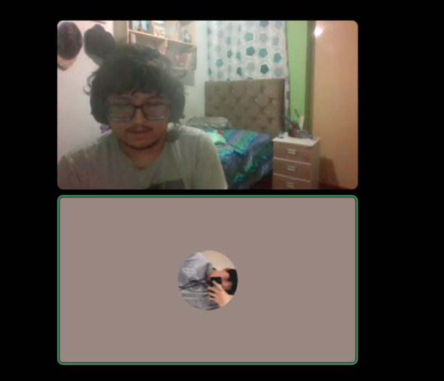

- Nombre: Giancarlo Castañeda  
- Edad: 20 años  
- Procedencia: Perú 
- Tiempo como cuidador: 1 año  
- Tipo de cuidado: Cuidador de adultos mayores a domicilio  

**Resumen:**

El entrevistado indicó que actualmente gestiona el cuidado del paciente mediante herramientas mayormente manuales. Para la medicación utiliza pastilleros semanales organizados con base en recetas médicas, complementando con alarmas en su celular para recordar los horarios. Las terapias y citas médicas las registra en un cuaderno físico junto con el historial del paciente.

En cuanto a herramientas, utiliza dispositivos médicos básicos como tensiómetro, oxímetro y termómetro, además de un cuaderno de bitácora para registrar eventos relevantes. A nivel digital, emplea principalmente alarmas y WhatsApp para comunicarse con los familiares.

El entrevistado señaló que uno de los principales problemas es la falta de coordinación durante los cambios de turno, donde la información no siempre se transmite correctamente, lo que puede generar pérdida de datos importantes sobre el estado del paciente.

Respecto a las dificultades del cuidado diario, mencionó el manejo de cambios de humor y episodios de confusión del paciente, así como la falta de apoyo inmediato de profesionales de salud para resolver dudas.

En relación con una posible solución digital, destacó la necesidad de funcionalidades como:
- Registro compartido en tiempo real entre cuidadores  
- Confirmación de administración de medicamentos  
- Recordatorios automáticos  
- Historial de signos vitales  
- Sección de notas para relevo de turno  

Finalmente, el entrevistado espera que una solución digital le permita reducir la carga mental, mejorar la organización del cuidado y generar mayor confianza con los familiares, al brindarles visibilidad del estado del paciente en tiempo real.

---

### Entrevista 2

**Información del entrevistado**
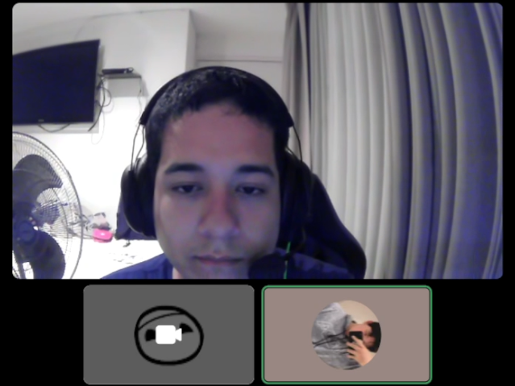

- Nombre: Renzo Uribe  
- Edad: 20 años  
- Procedencia: Perú  
- Tiempo como cuidador: 2 años  
- Tipo de cuidado: Cuidador de adultos mayores a domicilio  

**Resumen:**

El entrevistado indicó que gestiona el cuidado del paciente mediante una combinación de herramientas manuales y digitales. Para la medicación utiliza un pastillero semanal organizado por horarios (mañana, tarde y noche). En cuanto a terapias y citas médicas, emplea tanto un calendario físico como herramientas digitales como Google Calendar.

Respecto a las herramientas utilizadas en su día a día, mencionó el uso de hojas de papel, aplicaciones de notas y múltiples alarmas en su celular. Además, registra información relevante como alimentación, signos vitales y cambios de ánimo en notas personales.

El entrevistado señaló que uno de los principales problemas es la falta de coordinación e información, especialmente durante cambios de turno o cuando los familiares no comunican cambios en la medicación. Esto puede generar incertidumbre sobre si el paciente ya recibió una dosis o si hubo modificaciones en el tratamiento.

En cuanto a la comunicación, utiliza principalmente WhatsApp; sin embargo, considera que no es eficiente debido a la pérdida de información entre mensajes, lo que dificulta la búsqueda de datos importantes en situaciones críticas.

Entre las principales dificultades del cuidado diario, destacó:
- La responsabilidad de manejar múltiples pacientes  
- El control del stock de medicamentos y suministros  
- La necesidad de recordar citas y tareas  
- La gestión de cambios de ánimo en los pacientes  
- La dependencia de la memoria ante la falta de un sistema centralizado  

En relación con una solución digital, el entrevistado propuso funcionalidades como:
- Registro compartido de medicación con confirmación de dosis  
- Alertas automáticas en caso de olvido  
- Bitácora de salud con registro de signos vitales  
- Visualización gráfica para seguimiento médico  
- Botón de emergencia con notificación a familiares y envío de ubicación  

Finalmente, el entrevistado espera que una solución digital le permita mejorar la organización, reducir errores en el cuidado y tener mayor tranquilidad al contar con un historial claro del paciente, evitando depender únicamente de la memoria o de la comunicación informal.

---
### Entrevista 3

**Información del entrevistado**
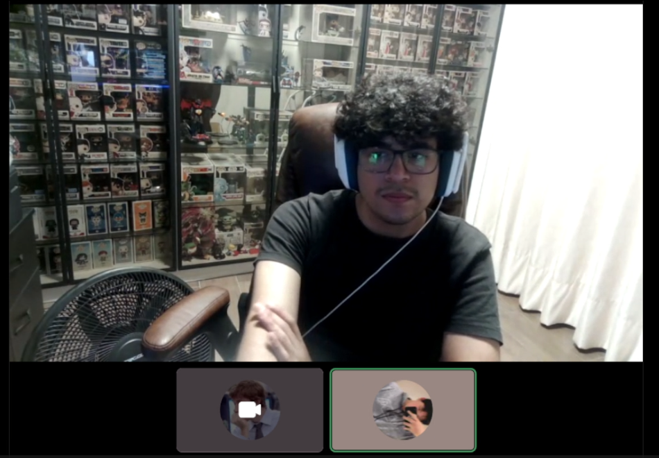
- Nombre: Sebastián Rubio Ortiz  
- Edad: 20 años  
- Procedencia: Perú  
- Tiempo como cuidador: Aproximadamente 1 año  
- Tipo de cuidado: Cuidador informal (inicio familiar y experiencia progresiva)  

**Resumen:**

El entrevistado indicó que organiza el cuidado del paciente utilizando principalmente herramientas digitales. Para la programación de citas y terapias emplea aplicaciones como Google Calendar, mientras que para la medicación utiliza una combinación de pastilleros físicos y recordatorios digitales en su celular.

En cuanto a las herramientas utilizadas, mencionó el uso constante del teléfono móvil para alarmas, cronómetros, notas y comunicación mediante WhatsApp. Señaló que estas herramientas son útiles, pero no están integradas entre sí.

El entrevistado destacó que uno de los principales problemas es la falta de coordinación entre cuidadores, especialmente debido al uso de distintos métodos (digitales y manuales). Indicó que el “choque generacional” dificulta la organización, ya que algunos cuidadores prefieren registrar información en papel, lo que puede generar pérdida de datos o falta de actualización en cambios de medicación.

Respecto a la comunicación, indicó que se realiza principalmente a través de grupos de WhatsApp, lo cual puede generar desorden y dificultar el acceso rápido a información relevante.

Entre las principales dificultades del cuidado diario, mencionó:
- La alta carga mental asociada a la responsabilidad del cuidado  
- El riesgo de cometer errores en la administración de medicación  
- La dificultad para organizar información de manera eficiente  
- La falta de un sistema unificado entre cuidadores  

En relación con una solución digital, el entrevistado propuso funcionalidades como:
- Interfaz intuitiva y de uso rápido  
- Sistema de checklist sincronizado entre cuidadores  
- Centralización de información médica del paciente  
- Gestión de stock de medicamentos  

Finalmente, el entrevistado espera que una solución digital le permita centralizar toda la información del paciente en un solo lugar, mejorar la coordinación entre cuidadores y facilitar la organización del cuidado diario de manera más eficiente.
#### Segmento: Pacientes geriátricos

---

### Entrevista 1

**Información del entrevistado**

- Nombre: Rosa María Quispe  
- Edad: 68 años  
- Procedencia: Lima, Perú  
- ¿Cuenta con apoyo de cuidador?: Sí (hija)  
- Nivel de autonomía: Media  
- ¿Utiliza celular?: Sí (uso básico)  

---

**Resumen:**

La entrevistada indicó que depende parcialmente de su hija para organizar su medicación y citas médicas. Utiliza alarmas en su celular para recordar algunos medicamentos, pero en ocasiones se olvida si ya los tomó o no. Señala que le gustaría tener una forma más clara de saber qué le toca hacer durante el día.

---

**Gestión del cuidado actual:**

Menciona que utiliza alarmas en su celular para recordar la medicación, pero también depende de su hija para confirmar horarios y dosis. Las citas médicas son anotadas en un cuaderno.

---

**Dificultades identificadas:**
- Olvido de medicación en algunos momentos  
- Confusión sobre si ya tomó una dosis  
- Dependencia de otra persona para confirmar información  

---

**Uso de tecnología:**

Utiliza celular principalmente para llamadas, WhatsApp y alarmas. Indica que no está familiarizada con aplicaciones complejas.

---

**Necesidades y expectativas:**

Le gustaría una herramienta simple que le indique claramente qué medicamentos debe tomar y en qué momento, sin generar confusión.

---

**Funcionalidades sugeridas:**
- Recordatorios claros con sonido  
- Confirmación visual de medicación tomada  
- Pantalla simple con actividades del día  

---

**Conclusión del entrevistado:**

Espera que una solución digital le ayude a sentirse más segura y menos dependiente, especialmente para recordar su medicación diaria.

---

### Entrevista 2

**Información del entrevistado**

- Nombre: Luis Alberto Rojas  
- Edad: 74 años  
- Procedencia: Arequipa, Perú  
- ¿Cuenta con apoyo de cuidador?: No (vive con su esposa)  
- Nivel de autonomía: Alta  
- ¿Utiliza celular?: Sí  

---

**Resumen:**

El entrevistado indicó que gestiona su cuidado de forma independiente, utilizando principalmente su memoria y algunos recordatorios en el celular. Sin embargo, reconoce que en ocasiones olvida detalles de su tratamiento o citas médicas.

---

**Gestión del cuidado actual:**

Se apoya en su memoria y en algunas alarmas para recordar la medicación. Las citas médicas las anota en un calendario físico.

---

**Dificultades identificadas:**
- Olvido ocasional de medicamentos  
- Falta de organización centralizada  
- Dificultad para llevar un historial de su salud  

---

**Uso de tecnología:**

Utiliza celular para llamadas, WhatsApp y ocasionalmente para alarmas. Se siente relativamente cómodo con tecnología básica.

---

**Necesidades y expectativas:**

Busca una herramienta que le permita tener todo organizado en un solo lugar y evitar olvidos.

---

**Funcionalidades sugeridas:**
- Recordatorios automáticos  
- Registro de medicamentos tomados  
- Historial simple de salud  

---

**Conclusión del entrevistado:**

Espera mejorar su organización diaria y reducir los errores en su tratamiento mediante una herramienta fácil de usar.

### Entrevista 3


**Información del entrevistado**

- Nombre: Laura Marcela Rios  
- Edad: 78 años  
- Procedencia: Magdalena, Lima  
- ¿Cuenta con apoyo de cuidador?: No (Pero vive con su familia)  
- Nivel de autonomía: Alta  
- ¿Utiliza celular?: Sí  

---

**Resumen:**

El entrevistado indicó que gestiona su cuidado de forma independiente, utilizando principalmente alarmas y recordatorios en su celular o tablet que usa. Sin embargo, reconoce que en ocasiones se olvida y sus hijos o las mismas alarmas le hacen acordar de sus medicamentos que debe de tomar

---

**Gestión del cuidado actual:**

Se apoya en su sus alarmas y recordatorios en su celular y tablet. Además, de poder caminar e ir a sus citas de manera presencial y sin ayuda, en la mayoria de casos.

---

**Dificultades identificadas:**
- Olvido ocasional de fechas  
- Discapacidad fisica en ciertos momentos  
- Dificultad para guardar sus documentos de una manera centralizada

---

**Uso de tecnología:**

Utiliza celular para llamadas, WhatsApp y bastante para alarmas y su calendario. Además, del uso frecuente de Tablet para sus entretenimiento u/o comunicación. Se siente cómoda con tecnología.

---

**Necesidades y expectativas:**

Busca una herramienta que le permita tener todo organizado en un solo lugar y evitar olvidos y que sea una manera rapida de transmitirle a sus hijos en caso la tengan que ayudar.

---

**Funcionalidades sugeridas:**
- Recordatorios automáticos  
- Agendado de citas acompañada
- Historial de documentos y citas pasadas

---

**Conclusión del entrevistado:**

Espera mejorar su organización diaria y reducir los errores y accidentes que pueda subrir en su tratamiento o camino a este, mediante una herramienta fácil de usar.

---
### 2.2.3. Análisis de entrevistas <a id="223-analisis-de-entrevistas"></a>

A partir de las entrevistas realizadas a los segmentos objetivo (cuidadores y pacientes geriátricos), se identificaron patrones claros en cuanto a la gestión del cuidado, dificultades actuales y necesidades de los usuarios.

Se analizaron un total de 5 entrevistas:
- 3 cuidadores
- 2 pacientes geriátricos

---
 Evidencias del proyecto:  
[Acceder al repositorio en Google Drive](https://drive.google.com/drive/folders/19tCAzW3sOqVhnpO8-5iWRA5_sTeS_uQQ?usp=sharing)

#### Análisis del segmento: Cuidadores

**Datos demográficos:**
- Edad promedio: 20 años  
- Rango: 20 - 20 años  
- Experiencia: 1 a 2 años  

---

**Herramientas utilizadas:**

- El 100% utiliza celular como herramienta principal  
- El 100% utiliza alarmas para recordar medicación  
- El 100% combina herramientas físicas (pastilleros, cuadernos) con digitales  
- El 100% utiliza WhatsApp para comunicación  

---

**Problemas identificados:**

- El 100% presenta problemas de coordinación entre cuidadores  
- El 100% ha experimentado pérdida de información  
- El 100% depende de múltiples herramientas no integradas  
- El 66.7% menciona dificultades en cambios de turno  
- El 66.7% señala desorden en la comunicación (WhatsApp)  

---

**Dificultades principales:**

- El 100% menciona alta carga mental  
- El 100% expresa preocupación por cometer errores en medicación  
- El 66.7% menciona problemas con organización de información  
- El 33.3% menciona falta de apoyo profesional inmediato  

---

**Funcionalidades más solicitadas:**

- Registro compartido en tiempo real: 100%  
- Confirmación de medicación: 100%  
- Alertas automáticas: 100%  
- Historial del paciente: 100%  
- Notas o relevo de turno: 66.7%  
- Botón de emergencia: 33.3%  
- Control de stock de medicamentos: 33.3%  

---

**Conclusiones del segmento:**

- Existe una fuerte dependencia de herramientas manuales y no especializadas  
- La coordinación entre cuidadores es el problema más crítico  
- La carga mental es alta debido a la responsabilidad del cuidado  
- Se requiere una solución que centralice la información y automatice procesos  
- La simplicidad y rapidez son factores clave para la adopción  

---

#### Análisis del segmento: Pacientes geriátricos

**Datos demográficos:**
- Edad promedio: 71 años  
- Rango: 68 - 74 años  

---

**Gestión del cuidado:**

- El 100% presenta dificultades para recordar medicación o actividades  
- El 50% depende de un cuidador para su organización  
- El 100% utiliza métodos básicos (memoria, cuaderno o alarmas simples)  

---

**Uso de tecnología:**

- El 100% utiliza celular (nivel básico)  
- El 100% utiliza funciones simples (llamadas, WhatsApp, alarmas)  
- El 50% presenta dificultad con aplicaciones complejas  

---

**Problemas identificados:**

- El 100% presenta riesgo de olvido de medicación  
- El 100% no cuenta con un sistema centralizado  
- El 50% presenta confusión sobre dosis administradas  

---

**Funcionalidades más solicitadas:**

- Recordatorios claros: 100%  
- Confirmación de medicación: 100%  
- Visualización simple de actividades: 100%  
- Interfaz sencilla: 100%  
- Historial básico: 50%  

---

**Conclusiones del segmento:**

- Los pacientes requieren soluciones extremadamente simples  
- Existe una alta dependencia de apoyo externo  
- La claridad visual y facilidad de uso son fundamentales  
- La solución debe reducir la confusión y aumentar la autonomía  

---

### Conclusión general del análisis

A partir de ambos segmentos, se identifican los siguientes insights clave:

- El 100% de los usuarios presenta problemas de organización del cuidado  
- El 100% utiliza herramientas no especializadas  
- El 100% requiere centralización de información  
- La coordinación entre cuidadores es el mayor problema  
- La carga mental es alta en cuidadores  
- Los pacientes necesitan simplicidad extrema  

---

### Implicaciones para el diseño de CareConnect

- Implementar un sistema centralizado de información  
- Diseñar una interfaz simple y accesible  
- Incorporar alertas y recordatorios inteligentes  
- Permitir la colaboración entre múltiples usuarios  
- Reducir la dependencia de herramientas externas  

CareConnect debe enfocarse en resolver la desorganización actual del cuidado, proporcionando una solución confiable, intuitiva y centrada en las necesidades reales de los usuarios.
## 2.3. Needfinding <a id="23-needfinding"></a>
### 2.3.1. User Personas <a id="231-user-personas"></a>

En esta sección se presentan los arquetipos construidos a partir de los hallazgos recogidos en el análisis de competencia (§2.1) y en el análisis de entrevistas (§2.2.3). Cada ficha concentra datos demográficos, hábitos, objetivos, frustraciones y nivel de adopción tecnológica observados durante la investigación, y sirve de referencia para las decisiones de diseño de CareConnect. Se elaboró una ficha por cada segmento objetivo definido en el Capítulo I (§1.3): el cuidador de pacientes geriátricos y el paciente geriátrico con autonomía parcial o acompañada.

Los atributos destacados son los que aparecieron de forma transversal en las entrevistas: uso intensivo del celular como herramienta principal, dependencia de soluciones no especializadas (WhatsApp, pastilleros, cuadernos), alta carga mental en cuidadores y necesidad de simplicidad extrema en pacientes. Estos rasgos orientan el tono, la jerarquía de información y las prioridades funcionales del producto.

---

#### User Persona 1 — Valeria Huamán (Cuidadora informal)


| Atributo | Valor |
|---|---|
| **Nombre** | Valeria Huamán Soto |
| **Edad** | 28 años |
| **Género** | Femenino |
| **Ocupación** | Asistente administrativa a tiempo parcial; cuidadora informal de su abuela |
| **Ubicación** | Lima Metropolitana, zona urbana (San Miguel) |
| **NSE** | C |
| **Estado civil** | Soltera, vive con su familia extendida |
| **Educación** | Superior técnica (Administración) |
| **Persona a cargo** | Abuela de 74 años con hipertensión, artrosis y movilidad reducida |
| **Tiempo cuidando** | 1 año y 8 meses |
| **Dispositivo principal** | Smartphone Android gama media |

**Biografía:**
Valeria divide su día entre el trabajo administrativo y el cuidado de su abuela, a quien asiste junto con su madre y una tía. Asumió el rol porque es la más hábil con el celular y se encarga de coordinar medicamentos, citas y turnos por WhatsApp. Lleva el control en un cuaderno y en alarmas del teléfono, pero varias veces ha tenido que llamar a su madre para confirmar si la abuela ya tomó una dosis. Le preocupa equivocarse y repite los mensajes "por las dudas".

**Objetivos:**
- Saber siempre en qué punto del tratamiento está su abuela sin tener que preguntar.
- Que cualquier cuidador de la familia pueda continuar el cuidado sin perder información.
- Reducir el tiempo que dedica a coordinar turnos y copiar datos entre herramientas.
- Tener evidencia rápida cuando el médico pide historial o dosis administradas.

**Frustraciones:**
- WhatsApp se llena de mensajes y termina perdiendo la indicación original.
- No hay forma fácil de confirmar si otra persona ya administró el medicamento.
- Copia la receta en el cuaderno y luego la vuelve a escribir en el celular para compartirla.
- El doctor le pide evolución semanal y tiene que reconstruirla de memoria.
- Olvidó una dosis por estar en una reunión de trabajo y cargó con la culpa varios días.

**Comportamientos y hábitos:**
- Revisa el celular cada 30 - 45 minutos durante su jornada.
- Usa alarmas con etiquetas específicas ("Enalapril 10mg", "Control cardio lunes").
- Combina WhatsApp, Google Calendar, notas del celular y cuaderno físico.
- Prefiere apps con flujos cortos; abandona si pide registrarse con más de tres datos.

**Nivel tecnológico:** Medio-alto. Se maneja bien con apps cotidianas (banca móvil, pedidos, mensajería) pero no con herramientas clínicas especializadas.

**Motivaciones:** Cariño familiar, responsabilidad compartida, reducción de errores, tranquilidad de saber que todo queda registrado.

**Frase representativa:**
> "Lo que más me estresa no es hacer las cosas, es acordarme de todo y avisarle a los demás sin equivocarme."

---

#### User Persona 2 — Don Rafael Medina (Paciente geriátrico)


| Atributo | Valor |
|---|---|
| **Nombre** | Rafael Medina Paredes |
| **Edad** | 72 años |
| **Género** | Masculino |
| **Ocupación** | Contador jubilado |
| **Ubicación** | Lima Metropolitana, zona urbana (Surquillo) |
| **NSE** | C |
| **Estado civil** | Casado; su hija lo visita a diario |
| **Educación** | Superior universitaria |
| **Condición** | Diabetes tipo 2 controlada, hipertensión, leve pérdida de memoria reciente |
| **Autonomía** | Parcial — cocina simple, camina solo dentro de casa, depende de apoyo para citas y medicación compleja |
| **Dispositivo principal** | Smartphone Android gama media con letras grandes |

**Biografía:**
Don Rafael vive con su esposa y recibe visitas frecuentes de su hija, quien coordina la medicación y acompaña las citas médicas. Maneja su celular para llamadas, WhatsApp y alarmas simples, pero se confunde cuando una app tiene demasiados menús o pide muchos pasos. Su mayor preocupación es "no molestar" a la familia, por lo que a veces omite avisar malestares pequeños. Le gusta sentir que participa de su propio cuidado.

**Objetivos:**
- Recordar sin ayuda qué medicamento toma y a qué hora.
- Confirmar rápido que ya hizo una actividad del día (tomar pastilla, hacer ejercicio).
- Consultar sus próximas citas sin llamar a su hija.
- Comunicar cómo se siente de forma simple cuando algo no anda bien.

**Frustraciones:**
- A veces duda si ya tomó la medicación o no, y termina no tomándola por miedo a duplicar dosis.
- Las apps que prueba tienen textos pequeños, botones poco claros y demasiados menús.
- Siente que depende mucho de su hija para cosas que antes resolvía solo.
- Se pierde entre recetas físicas, resultados y comprobantes de farmacia.

**Comportamientos y hábitos:**
- Usa el celular varias veces al día, siempre para tareas sencillas.
- Pide a su hija que le configure alarmas y le explique instrucciones médicas nuevas.
- Prefiere la voz y las imágenes grandes a leer textos largos.
- Evita probar apps nuevas a menos que alguien de confianza se las instale.

**Nivel tecnológico:** Bajo-medio. Funciones básicas dominadas; se incomoda con navegación compleja o formularios.

**Motivaciones:** Mantener autonomía, no sentirse una carga, cuidar su salud para seguir compartiendo tiempo con su familia.

**Frase representativa:**
> "Yo quiero saber qué toca hacer hoy sin tener que llamar a mi hija por cada cosita."

---

### 2.3.2. User Task Matrix <a id="232-user-task-matrix"></a>

A partir de los dos User Personas definidos en §2.3.1 —Valeria Huamán (cuidadora informal) y Don Rafael Medina (paciente geriátrico)—, se consolidan las tareas que ambos segmentos realizan en su día a día para llevar adelante el cuidado geriátrico. Es importante precisar que estas tareas se identifican con independencia de la existencia de CareConnect: representan actividades que los usuarios ya ejecutan con las herramientas que tienen a mano (WhatsApp, cuadernos, alarmas, llamadas, memoria), y que cualquier solución de software debería facilitar, no reemplazar.

Para cada tarea se indica la **Frecuencia** con la que el segmento la realiza (Alta / Media / Baja) y la **Importancia** que tiene dentro del proceso de cuidado (Alta / Media / Baja). La escala se apoya en los porcentajes obtenidos en el análisis de entrevistas (§2.2.3).

| **Tarea** | **Valeria (Cuidadora)**<br>Frecuencia | **Valeria (Cuidadora)**<br>Importancia | **Rafael (Paciente)**<br>Frecuencia | **Rafael (Paciente)**<br>Importancia |
|---|:---:|:---:|:---:|:---:|
| Administrar y/o tomar la medicación según horario | Alta | Alta | Alta | Alta |
| Recordar y confirmar si una dosis ya fue administrada | Alta | Alta | Alta | Alta |
| Registrar observaciones del paciente (síntomas, ánimo, signos) | Alta | Alta | Media | Media |
| Consultar la rutina y actividades del día (controles, terapias) | Alta | Alta | Alta | Alta |
| Agendar y asistir a citas médicas | Media | Alta | Media | Alta |
| Coordinar el cambio de turno entre cuidadores | Alta | Alta | N/A | N/A |
| Comunicar cambios o malestares del paciente a familiares / médicos | Alta | Alta | Media | Alta |
| Consultar historial clínico y evolución del paciente | Media | Alta | Baja | Media |
| Gestionar documentos médicos (recetas, resultados, comprobantes) | Media | Alta | Baja | Media |
| Buscar información sobre tratamiento o medicamentos | Media | Media | Baja | Media |
| Solicitar apoyo a cuidador o familiar ante una duda | Media | Media | Alta | Alta |
| Reportar que una actividad del día fue completada | Alta | Media | Alta | Alta |

---

**Tareas con mayor frecuencia e importancia:**
La administración y confirmación de medicación, la consulta de la rutina diaria y el reporte de actividades completadas son tareas que ambos segmentos realizan con frecuencia alta y consideran de alta importancia. Esto es consistente con el 100% de entrevistados que mencionó la medicación como eje del cuidado y con las funcionalidades más solicitadas en §2.2.3 (recordatorios, confirmación de medicación, visualización simple de actividades).

**Principales coincidencias entre ambos segmentos:**
Ambos User Personas coinciden en necesitar certeza sobre el estado del tratamiento: Valeria necesita saber si alguien más ya administró una dosis, y Rafael necesita saber si él mismo ya la tomó. Ambos usan el celular como herramienta principal y valoran la rapidez para acceder a información crítica. También comparten la tarea de consultar la rutina diaria y reportar su cumplimiento, aunque con matices: Valeria la vive como responsabilidad operativa, Rafael como una forma de participar en su propio cuidado.

**Principales diferencias:**
Las tareas vinculadas a la coordinación (cambio de turno, gestión documental, comunicación con múltiples actores) concentran alta frecuencia e importancia solo para Valeria; en Rafael aparecen con baja frecuencia porque las delega en su hija o esposa. En contraste, "solicitar apoyo" es una tarea de alta frecuencia para Rafael y media para Valeria, lo que refleja la asimetría de autonomía entre ambos: el paciente busca apoyo, el cuidador lo provee.

**Implicaciones para el diseño:**
Las tareas con alta frecuencia y alta importancia en ambos segmentos deben resolverse con flujos mínimos (uno o dos tap) y visibilidad inmediata en la pantalla principal. Las tareas asimétricas —coordinación para el cuidador, solicitud de apoyo para el paciente— justifican vistas diferenciadas por rol dentro de una misma aplicación compartida. El resto de tareas (consulta de historial, gestión documental, búsqueda de información) puede vivir detrás de un segundo nivel de navegación sin perjudicar la experiencia.

### 2.3.3. User Journey Mapping <a id="233-user-journey-mapping"></a>

El User Journey Map representa, por cada User Persona, la secuencia de fases que atraviesa durante el proceso de cuidado geriátrico cotidiano, las acciones concretas que realiza en cada fase, los pensamientos asociados, los principales pain points y la curva emocional. Se construyen dos mapas —uno para Valeria Huamán como cuidadora informal y otro para Rafael Medina como paciente geriátrico— a fin de visualizar cómo las mismas etapas del cuidado generan experiencias distintas según el rol.

---

#### User Journey — Valeria Huamán (Cuidadora informal)

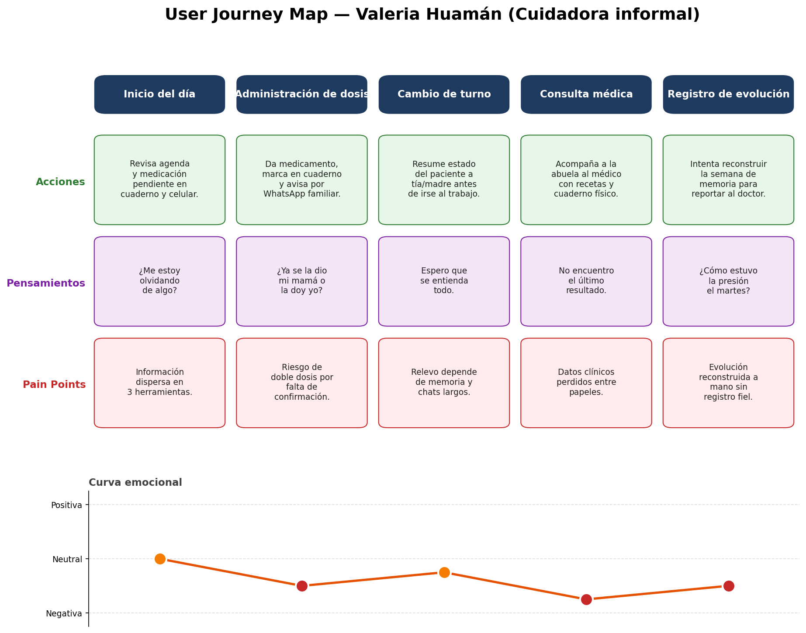

*Figura 6. User Journey Map de Valeria Huamán durante un día típico de cuidado.*

El recorrido de Valeria muestra una caída emocional progresiva a lo largo del día: arranca con incertidumbre ("¿me estoy olvidando de algo?"), se estabiliza brevemente al administrar la medicación y vuelve a caer en los momentos críticos de cambio de turno y consulta médica, donde la falta de una herramienta centralizada hace que la información dependa de memoria y cuadernos. El punto más bajo aparece en la consulta médica: cuando el doctor pide historial y evolución, Valeria debe reconstruirlo a mano. La fase de registro de evolución cierra el día con frustración por no tener un registro fiel de lo ocurrido.

#### User Journey — Rafael Medina (Paciente geriátrico)

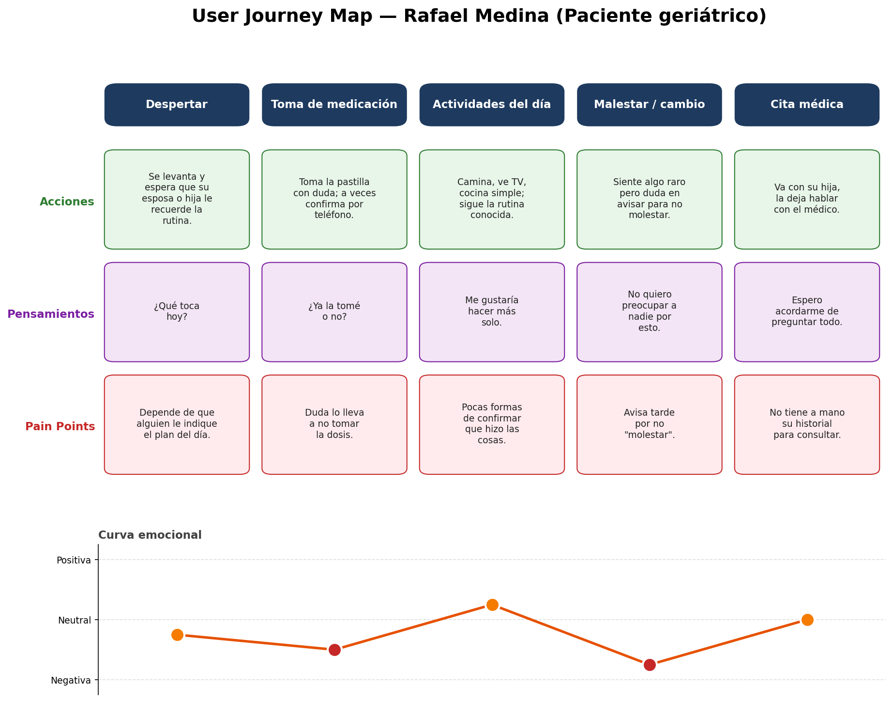

*Figura 7. User Journey Map de Rafael Medina durante un día típico.*

El recorrido de Rafael es más plano pero tiene un valle claro en la fase "malestar o cambio": por su intención de no molestar a la familia, tarda en avisar cuando algo está fuera de lo normal. Al momento de tomar la medicación también baja la curva porque, ante la duda de haberla tomado, prefiere omitirla. La fase de actividades del día es la más positiva (rutina conocida, sensación de autonomía), y la consulta médica recupera cierta estabilidad porque está acompañado, aunque persiste la frustración de no tener su historial al alcance.

---

### 2.3.4. Empathy Mapping <a id="234-empathy-mapping"></a>

El Empathy Map complementa al User Journey al detenerse no en el "qué hace" sino en el "qué siente, piensa y dice" el usuario. Cada mapa se organiza en cuatro cuadrantes —DICE, PIENSA, HACE y SIENTE— y consolida las citas, observaciones y reacciones recogidas durante las entrevistas (§2.2.3). Permiten al equipo anclar las decisiones de diseño y de contenido en el estado mental real de cada segmento, evitando suposiciones genéricas.

---

#### Empathy Map — Valeria Huamán (Cuidadora informal)

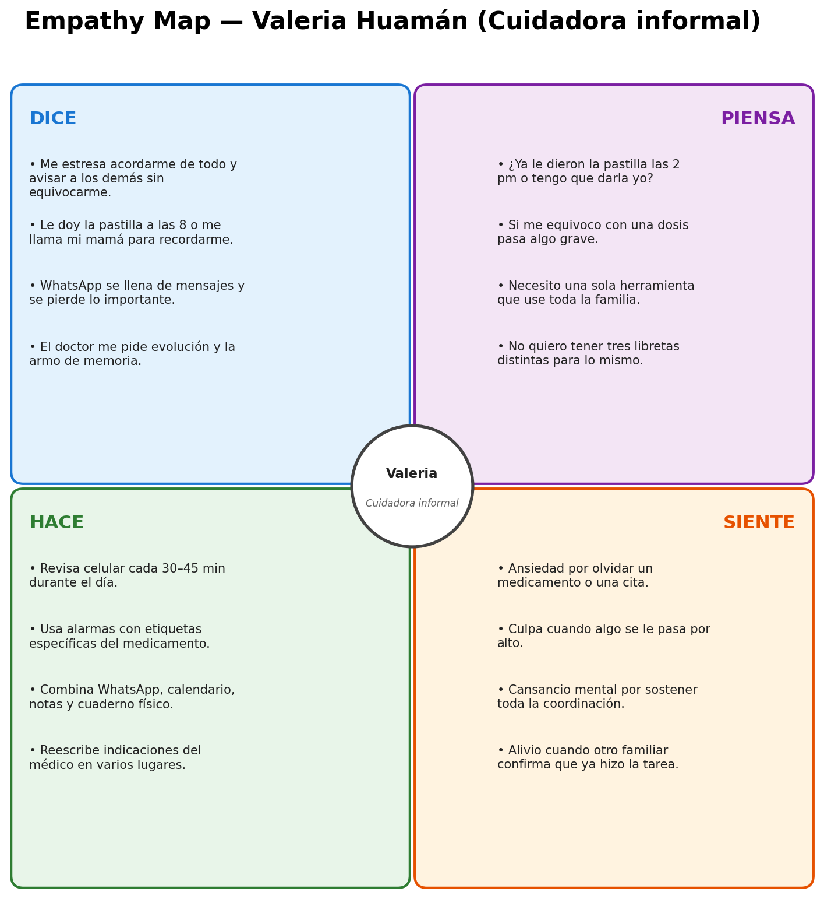

*Figura 8. Empathy Map de Valeria Huamán.*

En Valeria destaca una tensión entre el alto nivel de responsabilidad asumido y la falta de herramientas que la acompañen. **DICE** y **PIENSA** convergen en la misma preocupación: olvidar un medicamento o una indicación. **HACE** muestra un patrón claro de uso intensivo del celular combinado con cuaderno físico, lo que refleja la ausencia de una solución centralizada. **SIENTE** combina ansiedad y culpa con momentos puntuales de alivio cuando otro familiar confirma una acción. El mapa evidencia que CareConnect debe reducir la carga mental antes que sumar nuevas funciones.

#### Empathy Map — Rafael Medina (Paciente geriátrico)

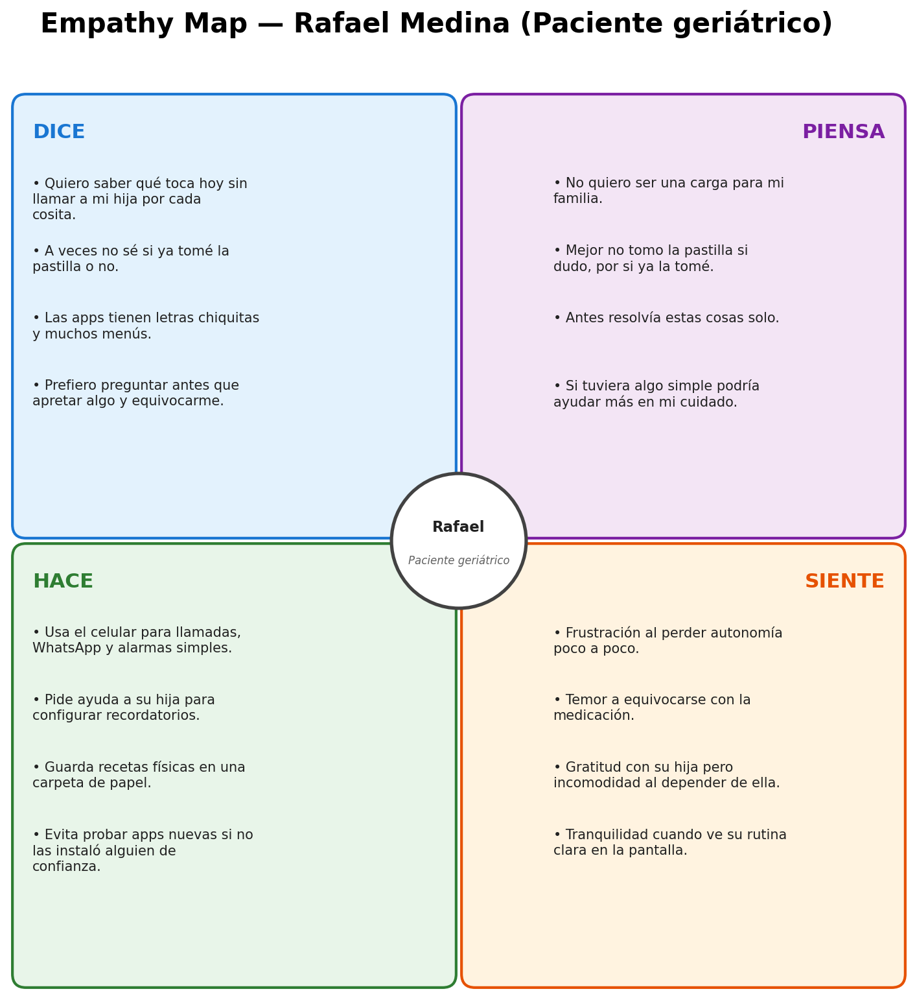

*Figura 9. Empathy Map de Rafael Medina.*

En Rafael el eje emocional dominante es la pérdida progresiva de autonomía. **DICE** muestra su deseo de resolver lo cotidiano sin tener que llamar a su hija por cada detalle. **PIENSA** revela una regla de decisión riesgosa: ante la duda, prefiere omitir la dosis. **HACE** confirma un uso muy acotado del celular y un rechazo natural a apps nuevas si no fueron instaladas por alguien de confianza. **SIENTE** mezcla frustración y gratitud, con tranquilidad cuando la información se presenta de forma clara. El mapa refuerza que la interfaz debe priorizar legibilidad, confirmación simple y lenguaje directo.
### 2.3.5. Ubiquitous Language <a id="235-ubiquitous-language"></a>

#### Health Event (Evento de salud)
Registro de una actividad relacionada con la salud del paciente, como una cita médica o la administración de medicación.

---

#### Appointment (Cita médica)
Evento de salud programado entre un paciente y un profesional de salud en una fecha y hora específica.

---

#### Medication Event (Evento de medicación)
Evento de salud que representa la administración o toma de un medicamento en un horario definido.

---

#### Patient (Paciente)
Usuario principal del sistema que gestiona su información de salud, eventos, documentos y seguimiento personal.

---

#### Caregiver (Cuidador)
Usuario autorizado por el paciente para supervisar su información de salud y apoyar su seguimiento.

---

#### Agenda (Agenda de salud)
Sistema que organiza y gestiona los eventos de salud del paciente en el tiempo, como citas y medicación.

---

#### Event Status (Estado del evento)
Condición de un evento de salud dentro del sistema, como pendiente, confirmado o no confirmado.

---

#### Event Confirmation (Confirmación de evento)
Acción mediante la cual el paciente valida la realización de un evento de salud programado.

---

#### Reschedule (Reprogramación)
Modificación de la fecha u hora de un evento de salud previamente registrado.

---

#### Notification (Notificación)
Mensaje informativo generado por el sistema para alertar al paciente o cuidador sobre eventos relevantes.

---

#### Alert (Alerta)
Notificación de alta prioridad enviada al cuidador cuando ocurre un incumplimiento o situación crítica.

---

#### Medical Document (Documento médico)
Archivo digital que contiene información clínica del paciente, como resultados, recetas o informes médicos.

---

#### Access Sharing (Acceso compartido)
Mecanismo mediante el cual el paciente otorga acceso a su información a un cuidador autorizado.

---

#### Permission (Permiso de acceso)
Reglas que determinan qué información puede visualizar o gestionar un cuidador dentro del sistema.

---

#### Diary Entry (Entrada de diario)
Registro cualitativo del paciente o cuidador sobre el estado, experiencia o seguimiento del paciente.

---

#### Diary (Diario de seguimiento)
Conjunto de entradas que permiten llevar un registro cualitativo del estado del paciente.

---

#### Authentication (Autenticación)
Proceso de verificación de identidad del usuario para permitir el acceso al sistema.

---

#### User Role (Rol de usuario)
Clasificación del usuario dentro del sistema, como paciente o cuidador, que determina sus permisos de acceso.

## 2.4. Requirements specification <a id="24-requirements-specification"></a>
### 2.4.1. User Stories <a id="241-user-stories"></a>

## Epics

| Epic ID | Nombre de la Épica        | Descripción                                                                                           |
|---------|---------------------------|-------------------------------------------------------------------------------------------------------|
| EP01    | Gestión de Agenda         | Como paciente o cuidador, quiero gestionar eventos de salud para organizar medicación y citas en el tiempo. |
| EP02    | Gestión de Notificaciones | Como paciente o cuidador, quiero recibir notificaciones para dar seguimiento oportuno a los eventos de salud. |
| EP03    | Gestión de Documentos     | Como paciente o cuidador, quiero gestionar documentos médicos para mantener un registro accesible.    |
| EP04    | Gestión de Consentimiento         | Como paciente, quiero compartir mi perfil con un cuidador para permitir el seguimiento de mi estado de salud. |
| EP05    | Diario de Seguimiento     | Como paciente o cuidador, quiero registrar notas de seguimiento para monitorear la evolución del estado de salud. |
| EP06    | Autenticación             | Como paciente o cuidador, quiero acceder al sistema de forma segura para proteger mi información personal. |

### US01 – Registrar evento de salud


| **Story ID** | US01 |
|-----------|-------|
| **User** | Paciente / Cuidador |
| **Priority** | Alta |
| **Epic** | Gestión de Agenda |
| **Description** | Como paciente o cuidador, deseo registrar un evento de salud (medicación o cita) para organizar las actividades médicas en un calendario. |
| **Acceptance Criteria** | Escenario 1: Registro exitoso de evento <br> Dado que el paciente o cuidador ingresa datos válidos del evento <br> Cuando registra el evento de salud <br> Entonces el sistema almacena el evento correctamente en la agenda <br><br> Escenario 2: Validación de datos obligatorios <br> Dado que el paciente o cuidador omite datos obligatorios <br> Cuando intenta registrar el evento <br> Entonces el sistema muestra un mensaje de error indicando los campos requeridos <br><br> Escenario 3: Visualización del evento <br> Dado que el evento fue registrado correctamente <br> Cuando el paciente o cuidador accede al calendario <br> Entonces el evento se visualiza en la fecha correspondiente |

---

### US02 – Confirmar evento de salud

| **Story ID** | US02 |
|-----------|-------|
| **User** | Paciente |
| **Priority** | Alta |
| **Epic** | Gestión de Agenda |
| **Description** | Como paciente, deseo confirmar un evento de salud para registrar el cumplimiento de mi tratamiento. |
| **Acceptance Criteria** | Escenario 1: Confirmación exitosa <br> Dado que existe un evento programado <br> Cuando el paciente confirma el evento <br> Entonces el sistema actualiza su estado a “confirmado” <br><br> Escenario 2: Visualización del estado <br> Dado que el evento fue confirmado <br> Cuando el paciente accede al calendario <br> Entonces el estado del evento se muestra como confirmado |

---

### US03 – Reprogramar evento de salud

| **Story ID** | US03 |
|-----------|-------|
| **User** | Paciente / Cuidador |
| **Priority** | Media |
| **Epic** | Gestión de Agenda |
| **Description** | Como paciente o cuidador, deseo reprogramar un evento de salud para ajustarlo a cambios en la disponibilidad. |
| **Acceptance Criteria** | Escenario 1: Reprogramación exitosa <br> Dado que existe un evento previamente registrado <br> Cuando el paciente o cuidador modifica la fecha u hora <br> Entonces el sistema actualiza el evento correctamente <br><br> Escenario 2: Validación de conflicto <br> Dado que existe otro evento en el mismo horario <br> Cuando el paciente o cuidador intenta reprogramar <br> Entonces el sistema evita el conflicto y muestra una advertencia |

---

### US04 – Recibir recordatorios de eventos

| **Story ID** | US04 |
|-----------|-------|
| **User** | Paciente |
| **Priority** | Alta |
| **Epic** | Gestión de Notificaciones |
| **Description** | Como paciente, deseo recibir recordatorios de mis eventos de salud para cumplir con mis actividades programadas. |
| **Acceptance Criteria** | Escenario 1: Envío de recordatorio <br> Dado que existe un evento programado <br> Cuando se aproxima la hora del evento <br> Entonces el paciente recibe una notificación <br><br> Escenario 2: Contenido de la notificación <br> Dado que se genera una notificación <br> Cuando el paciente la visualiza <br> Entonces esta contiene información relevante del evento |

---

### US05 – Recibir alertas de incumplimiento

| **Story ID** | US05 |
|-----------|-------|
| **User** | Cuidador |
| **Priority** | Alta |
| **Epic** | Gestión de Notificaciones |
| **Description** | Como cuidador, deseo recibir alertas cuando un evento no es confirmado para supervisar al paciente. |
| **Acceptance Criteria** | Escenario 1: Generación de alerta <br> Dado que un evento no ha sido confirmado <br> Cuando se supera el tiempo límite establecido <br> Entonces el cuidador recibe una alerta de incumplimiento <br><br> Escenario 2: Validación de permisos <br> Dado que el cuidador no tiene acceso al paciente <br> Cuando se genera la alerta <br> Entonces el sistema no envía la notificación |

---

### US06 – Visualizar notificaciones

| **Story ID** | US06 |
|-----------|-------|
| **User** | Cuidador |
| **Priority** | Media |
| **Epic** | Gestión de Notificaciones |
| **Description** | Como cuidador, deseo visualizar las notificaciones recibidas para monitorear el estado del paciente. |
| **Acceptance Criteria** | Escenario 1: Consulta de notificaciones <br> Dado que existen notificaciones registradas <br> Cuando el cuidador accede a la sección de notificaciones <br> Entonces el sistema muestra la lista de notificaciones <br><br> Escenario 2: Orden de visualización <br> Dado que existen múltiples notificaciones <br> Cuando el cuidador las visualiza <br> Entonces se muestran ordenadas por fecha o prioridad |

---

### US07 – Subir documento médico

| **Story ID** | US07 |
|-----------|-------|
| **User** | Paciente / Cuidador |
| **Priority** | Alta |
| **Epic** | Gestión de Documentos |
| **Description** | Como paciente o cuidador, deseo subir documentos médicos para mantener un registro digital accesible. |
| **Acceptance Criteria** | Escenario 1: Carga exitosa <br> Dado que el paciente o cuidador selecciona un archivo válido <br> Cuando lo sube al sistema <br> Entonces el documento se almacena correctamente <br><br> Escenario 2: Validación de archivo <br> Dado que el archivo no cumple con formato o tamaño permitido <br> Cuando el paciente o cuidador intenta subirlo <br> Entonces el sistema muestra un mensaje de error |

---

### US08 – Consultar documentos

| **Story ID** | US08 |
|-----------|-------|
| **User** | Paciente / Cuidador |
| **Priority** | Media |
| **Epic** | Gestión de Documentos |
| **Description** | Como paciente o cuidador, deseo consultar los documentos almacenados para revisar información médica. |
| **Acceptance Criteria** | Escenario 1: Visualización de documentos <br> Dado que existen documentos almacenados <br> Cuando el paciente o cuidador accede a la sección correspondiente <br> Entonces el sistema muestra la lista de documentos disponibles |

---

### US09 – Acceder a documentos compartidos

| **Story ID** | US09 |
|-----------|-------|
| **User** | Cuidador |
| **Priority** | Media |
| **Epic** | Gestión de Documentos |
| **Description** | Como cuidador, deseo acceder a los documentos del paciente para apoyar en su seguimiento. |
| **Acceptance Criteria** | Escenario 1: Acceso autorizado <br> Dado que el cuidador tiene permisos de acceso <br> Cuando consulta los documentos del paciente <br> Entonces el sistema permite su visualización <br><br> Escenario 2: Acceso denegado <br> Dado que el cuidador no tiene permisos <br> Cuando intenta acceder a los documentos <br> Entonces el sistema bloquea el acceso y muestra un mensaje de restricción |

---

### US10 – Registrar cuenta

| **Story ID** | US10 |
|-----------|-------|
| **User** | Paciente /Cuidador |
| **Priority** | Alta |
| **Epic** |  Autenticación  |
| **Description** | Como usuario, quiero tener permiso para poder crear mi propia cuenta |
| **Acceptance Criteria** | Escenario 1:  Creación de cuenta <br> Dado que el usuario otorgo los datos validos <br> Cuando registra su cuenta  <br> usuario es creado <br><br> Escenario 2: Creación denegada <br> Dado que el usuario no ya exite <br> Cuando intenta ingresar el correo <br> Entonces el sistema bloquea el acceso y muestra un mensaje de "el usuario con este correo ya existe"|

---

### US11 – Validar acceso por rol

| **Story ID** | US11 |
|-----------|-------|
| **User** | Paciente/Cuidador |
| **Priority** | Alta |
| **Epic** |  Autenticación  |
| **Description** | Como usuario, quiero validar el acceso según el rol del que poseo.   |
| **Acceptance Criteria** | Escenario 1: Acceso permitido <br> Dado que el usuario tiene permisos válidos <br> Cuando abre la aplicación <br> Entonces el sistema le muestra lo que posee<br><br> Escenario 2: Acceso denegado <br> Dado que el usuario no tiene permisos <br> Cuando intenta acceder a otra pestaña <br> Entonces el sistema bloquea el acceso y muestra un mensaje de restricción |

---

### US12 – Escribir nota

| **Story ID** | US12 |
|-----------|-------|
| **User** | Paciente/Cuidador |
| **Priority** | Media |
| **Epic** |  Diario de Seguimiento  |
| **Description** | Como paciente o cuidador, quiero escribir notas en mi diario para registrar mi estado o el de mi familiar. |
| **Acceptance Criteria** | Escenario 1: Nota registrada <br> Dado que el cuidador o paciente ingreso contenido válido <br> Cuando guardo la nota <br> Entonces la nota se almacena correctamente <br><br> Escenario 2: Nota vacía <br> Dado que el cuidador o paciente no ingreso ningún contenido <br> Cuando intento guardar <br> Entonces el sistema muestra un mensaje error |

---

### US13 – Consultar diarios compartidos

| **Story ID** | US13 |
|-----------|-------|
| **User** |  Cuidador|
| **Priority** | Media |
| **Epic** |  Diario de Seguimiento  |
| **Description** | Como cuidador, quiero consultar el diario compartido del paciente para conocer su estado.  |
| **Acceptance Criteria** | Escenario 1: Consulta exitosa <br> Dado que el cuidador posee acceso autorizado <br> Cuando consulta el diario del paciente <br> Entonces el sistema le muestra las notas <br><br> Escenario 2: Acceso denegado <br> Dado que el paciente no tiene permisos <br> Cuando intenta acceder a las notas del cuidador <br> Entonces el sistema bloquea el acceso y muestra un mensaje de restricción |

---

### US14 – Compartir perfil

| **Story ID** | US14 |
|-----------|-------|
| **User** | Cuidador |
| **Priority** |  Alta |
| **Epic** |  Gestión de Consentimiento   |
| **Description** |  Como paciente, quiero compartir mi perfil con familiares para que puedan ver mi información.|
| **Acceptance Criteria** | Escenario 1: Compartir exitoso <br> Dado que el familiar es un usuario válido <br> Cuando comparto mi perfil <br> Entonces el sistema el acceso a su cuenta es aceptado<br><br> Escenario 2: Error al compartir <br> Dado que el familiar no es un usuario válido <br> Cuando intenta acceder a los documentos <br> Entonces el sistema muestra un mensaje de usuario no existe |

---

### US15 – Consultar perfil compartido

| **Story ID** | US15 |
|-----------|-------|
| **User** | Cuidador |
| **Priority** | Media |
| **Epic** |  Gestión de Consentimiento   |
| **Description** | Como cuidador, quiero consultar el perfil compartido del paciente para acceder a su información.  |
| **Acceptance Criteria** | Escenario 1: Consulta exitosa <br> Dado el paciente me dio permiso <br> Cuando consulto el perfil <br> Entonces se muestra la información <br><br> Escenario 2: Acceso inválido <br> Dado que el paciente no tiene permisos <br> Cuando intenta consultar el perfil <br> Entonces el sistema bloquea el acceso y muestra un mensaje de restricción |

---

### US16 – Revocar acceso

| **Story ID** | US16 |
|-----------|-------|
| **User** | Paciente |
| **Priority** | Media |
| **Epic** |  Gestión de Consentimiento  |
| **Description** | Como paciente, quiero revocar el acceso a mi perfil para controlar quién puede ver mi información.  |
| **Acceptance Criteria** | Escenario 1: Revocación exitosa <br> Dado que el paciente otorgo los permisos <br> Cuando revoca el acceso <br> Entonces el sistema quita los privilegios al cuidador <br><br> Escenario 2: Acción no permitida <br> Dado que el paciente ya revoco el permiso al cuidador <br> Cuando intenta revocar el acceso <br> Entonces el sistema le muestra un mensaje de error |

---

### TS01 – Persistencia de eventos de agenda

| **Story ID** | TS01 |
|--------------|------|
| **User** | Desarrollador |
| **Priority** | Alta |
| **Description** | Como desarrollador, quiero implementar la persistencia de eventos de salud (citas y medicación) para garantizar su almacenamiento y consulta eficiente. |
| **Acceptance Criteria** | Escenario 1: Almacenamiento exitoso <br> Dado que se recibe un evento válido <br> Cuando el sistema lo procesa <br> Entonces el evento se almacena correctamente en la base de datos <br><br> Escenario 2: Integridad de datos <br> Dado que ocurre un error en el almacenamiento <br> Cuando el sistema intenta guardar el evento <br> Entonces se evita la persistencia de datos incompletos |

---

### TS02 – Gestión de estado de eventos

| **Story ID** | TS02 |
|--------------|------|
| **User** | Desarrollador |
| **Priority** | Alta |
| **Description** | Como desarrollador, quiero implementar la lógica de cambio de estado de los eventos (pendiente, confirmado, incumplido) para reflejar el seguimiento del paciente. |
| **Acceptance Criteria** | Escenario 1: Cambio de estado válido <br> Dado que existe un evento registrado <br> Cuando se actualiza su estado <br> Entonces el sistema persiste el nuevo estado correctamente <br><br> Escenario 2: Validación de transición <br> Dado un estado inválido <br> Cuando se intenta actualizar <br> Entonces el sistema rechaza la operación |

---

### TS03 – Programación de notificaciones

| **Story ID** | TS03 |
|--------------|------|
| **User** | Desarrollador |
| **Priority** | Alta |
| **Description** | Como desarrollador, quiero implementar un servicio de programación que genere notificaciones basadas en la fecha y hora de los eventos registrados. |
| **Acceptance Criteria** | Escenario 1: Programación correcta <br> Dado que existe un evento con fecha definida <br> Cuando se agenda la notificación <br> Entonces el sistema programa su envío correctamente <br><br> Escenario 2: Reprogramación <br> Dado que el evento cambia de horario <br> Cuando se actualiza <br> Entonces la notificación se reprograma automáticamente |

---

### TS04 – Envío de notificaciones

| **Story ID** | TS04 |
|--------------|------|
| **User** | Desarrollador |
| **Priority** | Alta |
| **Description** | Como desarrollador, quiero implementar el mecanismo de envío de notificaciones push hacia pacientes y cuidadores según reglas de negocio. |
| **Acceptance Criteria** | Escenario 1: Envío exitoso <br> Dado que existe una notificación programada <br> Cuando se cumple la condición de envío <br> Entonces el sistema envía la notificación al destinatario <br><br> Escenario 2: Manejo de fallos <br> Dado que falla el envío <br> Cuando ocurre el error <br> Entonces el sistema registra el incidente y reintenta según configuración |

---

### TS05 – Control de acceso a notificaciones

| **Story ID** | TS05 |
|--------------|------|
| **User** | Desarrollador |
| **Priority** | Media |
| **Description** | Como desarrollador, quiero implementar validaciones de permisos para asegurar que solo usuarios autorizados reciban notificaciones. |
| **Acceptance Criteria** | Escenario 1: Acceso autorizado <br> Dado que el usuario tiene permisos <br> Cuando se genera una notificación <br> Entonces el sistema permite su envío <br><br> Escenario 2: Acceso restringido <br> Dado que el usuario no tiene permisos <br> Cuando se genera una notificación <br> Entonces el sistema bloquea el envío |

---

### TS06 – Almacenamiento de documentos

| **Story ID** | TS06 |
|--------------|------|
| **User** | Desarrollador |
| **Priority** | Alta |
| **Description** | Como desarrollador, quiero implementar el almacenamiento de documentos médicos en un sistema seguro para garantizar su disponibilidad. |
| **Acceptance Criteria** | Escenario 1: Almacenamiento correcto <br> Dado que se recibe un archivo válido <br> Cuando el sistema lo procesa <br> Entonces el documento se almacena correctamente <br><br> Escenario 2: Validación de archivo <br> Dado un archivo inválido <br> Cuando se intenta almacenar <br> Entonces el sistema rechaza la operación |

---

### TS07 – Gestión de metadatos de documentos

| **Story ID** | TS07 |
|--------------|------|
| **User** | Desarrollador |
| **Priority** | Media |
| **Description** | Como desarrollador, quiero implementar el registro de metadatos (tipo, fecha, paciente, descripción) asociados a cada documento. |
| **Acceptance Criteria** | Escenario 1: Registro de metadatos <br> Dado que se almacena un documento <br> Cuando se registran sus atributos <br> Entonces el sistema guarda correctamente los metadatos <br><br> Escenario 2: Consistencia <br> Dado datos incompletos <br> Cuando se intenta registrar <br> Entonces el sistema valida y rechaza la operación |

---

### TS08 – Control de acceso a documentos

| **Story ID** | TS08 |
|--------------|------|
| **User** | Desarrollador |
| **Priority** | Alta |
| **Description** | Como desarrollador, quiero implementar mecanismos de autorización para controlar el acceso a documentos entre paciente y cuidador. |
| **Acceptance Criteria** | Escenario 1: Acceso permitido <br> Dado que el cuidador tiene permisos <br> Cuando solicita acceso <br> Entonces el sistema permite visualizar el documento <br><br> Escenario 2: Acceso denegado <br> Dado que no tiene permisos <br> Cuando intenta acceder <br> Entonces el sistema bloquea la operación |


### TS09 – Persistencia de usuarios

| **Story ID** | TS09 |
|--------------|------|
| **User** | Desarrollador |
| **Priority** | Alta |
| **Description** | Como desarrollador, quiero implementar la persistencia de usuarios para garantizar el registro correcto en la base de datos |
| **Acceptance Criteria** | Escenario 1: Registro exitoso <br> Dado que el usuario envia datos válidos de usuario <br> Cuando el sistema procesa el registro <br> Entonces el usuario se almacena correctamente en la base de datos <br><br> Escenario 2: Usuario duplicado <br> Dado que el usuario proporciona un correo que ya existe <br> Cuando el sistema intenta registrar el usuario<br> Entonces se evita el registro duplicado y se muestra un error |


### TS10 – Autorización basada en roles

| **Story ID** | TS10 |
|--------------|------|
| **User** | Desarrollador |
| **Priority** | Alta |
| **Description** | Como desarrollador, quiero implementar validación de acceso por roles para garantizar seguridad en los recursos. |
| **Acceptance Criteria** | Escenario 1: Acceso autorizado <br> Dado que el usuario tiene el rol correcto <br> Cuando intenta acceder a un recurso <br> Entonces el sistema permite el acceso <br><br> Escenario 2: Acceso denegado <br> Dado que el usuario no tiene permisos <br> Cuando intenta acceder<br> Entonces el sistema bloquea el acceso |

### TS11 – Persistencia de notas

| **Story ID** | TS11 |
|--------------|------|
| **User** | Desarrollador |
| **Priority** | Alta |
| **Description** | Como desarrollador, quiero almacenar notas del diario para asegurar su disponibilidad. |
| **Acceptance Criteria** | Escenario 1: Guardado exitoso<br>Dado que la notatiene contenido válido<br>Cuando el sistema guarda la nota<br>Entonces se almacena correctamente<br><br>Escenario 2: Nota inválida<br>Dado que la nota está vacía<br>Cuando el sistema intenta guardarla<br>Entonces se rechaza la operación |

### TS12 – Consulta de diario compartido

| **Story ID** | TS12 |
|--------------|------|
| **User** | Desarrollador |
| **Priority** | Media |
| **Description** | Como desarrollador, quiero implementar la consulta de diarios compartidos para permitir acceso a cuidadores. |
| **Acceptance Criteria** | Escenario 1: Consulta autorizada<br>Dado que el usuario tiene acceso<br>Cuando consulta el diario<br>Entonces se muestran las notas<br><br>Escenario 2: Acceso denegado<br>Dado que no tiene permisos<br>Cuando intenta consultar<br>Entonces el sistema bloquea el acceso |

### TS13 – Consulta de perfil compartido

| **Story ID** | TS13 |
|--------------|------|
| **User** | Desarrollador |
| **Priority** | Media |
| **Description** | Como desarrollador, quiero permitir la visualización de perfiles compartidos. |
| **Acceptance Criteria** | Escenario 1: Consulta exitosa<br> Dado que el usuario tiene acceso<br>Cuando consulta el perfil<br>Entonces se muestra la información<br><br>Escenario 2: Acceso inválido<br>Dado que no tiene permisos<br>Cuando intenta acceder<br>Entonces se bloquea el acceso |

### TS14 – Revocación de acceso

| **Story ID** | TS14 |
|--------------|------|
| **User** | Desarrollador |
| **Priority** | Media |
| **Description** | Como desarrollador, quiero implementar la revocación de accesos para controlar permisos. |
| **Acceptance Criteria** | Escenario 1: Revocación exitosa<br>Dado que existe acceso activo<br>Cuando el propietario revoca acceso<br>Entonces se elimina el permiso<br><br>Escenario 2: Usuario sin permiso<br>Dado que no es propietario<br>Cuando intenta revocar<br>Entonces se rechaza la acción|

### Spike Stories

Las Spike Stories son investigaciones técnicas acotadas en el tiempo, orientadas a reducir la incertidumbre antes de comprometer una User Story o decisión de arquitectura. A continuación se documentan los spikes identificados para CareConnect:

### SP01 – Investigar mecanismo de notificaciones push offline-first

| **Story ID** | SP01 |
|--------------|------|
| **Tipo** | Spike (técnico) |
| **Priority** | Alta |
| **Timebox** | 2 días |
| **Description** | Como equipo de desarrollo, queremos investigar cómo entregar notificaciones push de medicación en dispositivos Android con conectividad intermitente, comparando Firebase Cloud Messaging vs. AlarmManager local, para decidir la estrategia que usaremos en el Bounded Context de Notificaciones. |
| **Resultado esperado** | Documento corto con recomendación, prototipo mínimo, y criterios de decisión (latencia, batería, costo, complejidad). |

### SP02 – Validar mecanismo de Gestión de Consentimiento revocable

| **Story ID** | SP02 |
|--------------|------|
| **Tipo** | Spike (técnico + legal) |
| **Priority** | Alta |
| **Timebox** | 3 días |
| **Description** | Como equipo, queremos investigar patrones técnicos (tokens firmados con expiración + lista de revocación) y requisitos legales (Ley N° 29733, HIPAA-like) para implementar el otorgamiento y revocación de consentimiento del paciente sobre su información clínica. |
| **Resultado esperado** | Documento con esquema técnico, validación con caso de uso de revocación inmediata y referencias normativas aplicables. |

### SP03 – Evaluar Flutter vs. Kotlin Multiplatform para la app móvil

| **Story ID** | SP03 |
|--------------|------|
| **Tipo** | Spike (arquitectura) |
| **Priority** | Media |
| **Timebox** | 2 días |
| **Description** | Como equipo, queremos comparar Flutter y Kotlin Multiplatform en términos de productividad, performance, soporte de notificaciones nativas y curva de aprendizaje para decidir el stack móvil del MVP. |
| **Resultado esperado** | Matriz comparativa, prototipos en cada tecnología consumiendo un endpoint REST y recomendación final. |

### SP04 – Investigar almacenamiento seguro de documentos médicos

| **Story ID** | SP04 |
|--------------|------|
| **Tipo** | Spike (técnico) |
| **Priority** | Media |
| **Timebox** | 2 días |
| **Description** | Como equipo, queremos investigar opciones de almacenamiento cifrado en reposo y en tránsito para documentos clínicos del paciente (recetas, resultados), comparando S3 con SSE-KMS, GCS y un esquema local cifrado. |
| **Resultado esperado** | Recomendación de servicio, esquema de cifrado y plan de manejo de claves. |

### SP05 – Diseñar estrategia offline-first para Diario y Agenda

| **Story ID** | SP05 |
|--------------|------|
| **Tipo** | Spike (arquitectura) |
| **Priority** | Media |
| **Timebox** | 2 días |
| **Description** | Como equipo, queremos definir cómo sincronizar Diario y Agenda entre el dispositivo (SQLite/Room) y el backend tras periodos sin conexión, evitando conflictos y pérdidas de información. |
| **Resultado esperado** | Documento de estrategia de sincronización con manejo de conflictos y prototipo mínimo. |

### 2.4.2. Impact Mapping <a id="242-impact-mapping"></a>

A continuación se presenta el Impact Map, el cual permite visualizar de manera clara cómo las funcionalidades clave de la aplicación se alinean con los objetivos de negocio, considerando a los actores involucrados y los impactos esperados en su comportamiento.


### 2.4.3. Product Backlog <a id="243-product-backlog"></a>
En esta sección se presenta el Product Backlog, que contiene las historias de usuario priorizadas y sus respectivas estimaciones de esfuerzo en puntos de historia. Este backlog es una herramienta clave para la planificación y gestión del desarrollo del producto, permitiendo al equipo enfocarse en las funcionalidades más importantes y valiosas para los usuarios.

| Orden | User Story ID | Título | Descripción | Story Points |
|------:|---------------|--------|-------------|-------------|
| 1 | US1 | Registrar evento de salud | Como paciente o cuidador, deseo registrar un evento de salud (medicación o cita) para organizar las actividades médicas en un calendario. | 3 |
| 2 | US2 | Confirmar evento de salud | Como paciente, deseo confirmar un evento de salud para registrar el cumplimiento de mi tratamiento. | 3 |
| 3 | US3 | Reprogramar evento de salud | Como paciente o cuidador, deseo reprogramar un evento de salud para ajustarlo a cambios en la disponibilidad. | 3 |
| 4 | US4 | Recibir recordatorios de eventos | Como paciente, deseo recibir recordatorios de mis eventos de salud para cumplir con mis actividades programadas. | 2 |
| 5 | US5 | Recibir alertas de incumplimiento | Como cuidador, deseo recibir alertas cuando un evento no es confirmado para supervisar al paciente.| 2 |
| 6 | US6 | Visualizar notificaciones | Como cuidador, deseo visualizar las notificaciones recibidas para monitorear el estado del paciente. | 1 |
| 7 | US7 | Subir documento médico | Como paciente o cuidador, deseo subir documentos médicos para mantener un registro digital accesible. | 2 |
| 8 | US8 | Consultar documentos | Como paciente o cuidador, deseo consultar los documentos almacenados para revisar información médica. | 1 |
| 9 | US9 | Acceder a documentos compartidos | Como cuidador, deseo acceder a los documentos del paciente para apoyar en su seguimiento. | 3|
| 10 | US10 |  Registrar cuenta | Como usuario, quiero tener permiso para poder crear mi propia cuenta| 2 |
| 11 | US11 | Validar acceso por rol | Como usuario, quiero validar el acceso según el rol del que poseo. | 3|
| 12 | US12 | Escribir nota | Como paciente o cuidador, quiero escribir notas en mi diario para registrar mi estado o el de mi familiar. | 2 |
| 13 | US13 | Consultar diarios compartidos | Como cuidador, quiero consultar el diario compartido del paciente para conocer su estado. | 3 |
| 14 | US14 | Compartir perfil | Como paciente, quiero compartir mi perfil con familiares para que puedan ver mi información. | 3 |
| 15 | US15| Consultar perfil compartido | Como cuidador, quiero consultar el perfil compartido del paciente para acceder a su información. | 3 |
| 16 | US16 | Revocar acceso | Como paciente, quiero revocar el acceso a mi perfil para controlar quién puede ver mi información. | 3 |
| 17 | TS1 | Persistencia de eventos de agenda | Como desarrollador, quiero implementar la persistencia de eventos de salud (citas y medicación) para garantizar su almacenamiento y consulta eficiente. | 3 |
| 18 | TS2 | Gestión de estado de eventos | Como desarrollador, quiero implementar la lógica de cambio de estado de los eventos (pendiente, confirmado, incumplido) para reflejar el seguimiento del paciente. | 3 |
| 19 | TS3 | Programación de notificaciones | Como desarrollador, quiero implementar un servicio de programación que genere notificaciones basadas en la fecha y hora de los eventos registrados. | 3 |
| 20 | TS4 | Envío de notificaciones | Como desarrollador, quiero implementar el mecanismo de envío de notificaciones push hacia pacientes y cuidadores según reglas de negocio. | 2 |
| 21 | TS5 | Control de acceso a notificaciones | Como desarrollador, quiero implementar validaciones de permisos para asegurar que solo usuarios autorizados reciban notificaciones. | 3 |
| 22 | TS6 | Almacenamiento de documentos| Como desarrollador, quiero implementar el almacenamiento de documentos médicos en un sistema seguro para garantizar su disponibilidad. | 2 |
| 23 | TS7 | Gestión de metadatos de documentos |Como desarrollador, quiero implementar el registro de metadatos (tipo, fecha, paciente, descripción) asociados a cada documento. | 3 |
| 24 | TS8 | Control de acceso a documentos | Como desarrollador, quiero implementar mecanismos de autorización para controlar el acceso a documentos entre paciente y cuidador. | 3 |
| 25 | TS9 | Persistencia de usuarios | Como desarrollador, quiero implementar la persistencia de usuarios para garantizar el registro correcto en la base de datos | 2 |
| 26 | TS10 | Autorización basada en roles | Como desarrollador, quiero implementar validación de acceso por roles para garantizar seguridad en los recursos. | 2 |
| 26 | TS11 | Persistencia de notas | Como desarrollador, quiero almacenar notas del diario para asegurar su disponibilidad. | 2 |
| 26 | TS12 | Consulta de diario compartido | Como desarrollador, quiero implementar la consulta de diarios compartidos para permitir acceso a cuidadores. | 3 |
| 26 | TS13 | Consulta de perfil compartido | Como desarrollador, quiero permitir la visualización de perfiles compartidos. | 3 |
| 26 | TS14 | Revocación de acceso | Como desarrollador, quiero implementar la revocación de accesos para controlar permisos. | 5 |


## 2.5. Strategic-Level Domain-Driven Design <a id="25-strategic-level-domain-driven-design"></a>
### 2.5.1. EventStorming <a id="251-eventstorming"></a>

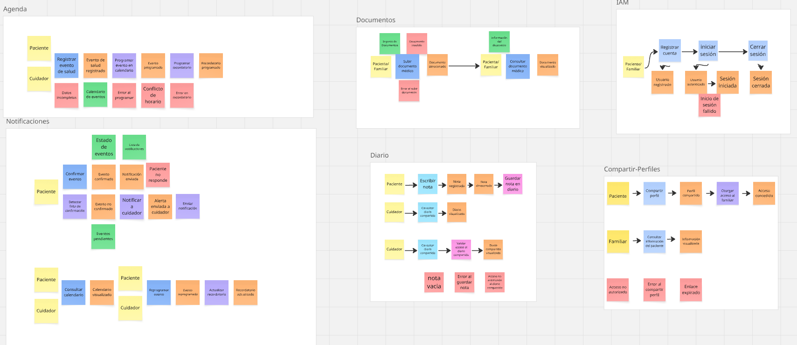

#### 2.5.1.1. Candidate Context Discovery <a id="2511-candidate-context-discovery"></a>

Se aplicaron las tres estrategias indicadas en el enunciado para identificar los bounded contexts:
##### 3.1 Estrategia: Start-with-Value
Se identificaron las partes del dominio con mayor valor para el negocio (core). El sistema tiene como propósito principal coordinar el cuidado de salud entre pacientes, cuidadores y familiares.

| Modulo  | Valor de Negocio | Tipo de Dominio |
|------:|-------------|-------------|
| Agenda|	Coordinación de eventos de salud — núcleo del sistema|	Core Domain|
| Notificaciones|	Alerta y confirmación a cuidadores y pacientes	|Core Domain|
| Diario|	Registro del estado del paciente — diferenciador clave	|Core Domain|
| Documentos| Soporte de documentación clínica compartida|	Supporting Domain|
|Gestión de Consentimiento|	Habilita la colaboración paciente-familiar|	Supporting Domain|
|IAM	|Autenticación y gestión de sesiones	|Generic Domain|

##### 3.2 Estrategia: Start-with-Simple

Se descompuso el timeline del EventStorm en steps secuenciales para identificar modelos simples con propósito claro. Cada módulo tiene actores y flujos definidos, lo que permite establecer límites claros entre contextos.

| Contexto  | Actores Involucrados | Flujo Principal |
|------:|-------------|-------------|
| Agenda|	Paciente, Cuidador|	Registrar evento → Programar → Recordatorio|
| Notificaciones	|Paciente, Cuidador	|Detectar evento → Notificar → Confirmar / Reprogramar|
| Documentos|	Paciente/Familiar, Cuidador	|Subir documento → Almacenar → Consultar|
| Diario|	Paciente, Cuidador	|Escribir nota → Almacenar → Compartir → Visualizar|
|IAM|	Paciente/Cuidador	|Registrar cuenta → Iniciar sesión → Cerrar sesión|
|Gestión de Consentimiento|	Paciente, Cuidador	|Compartir perfil → Otorgar acceso → Visualizar info|

##### 3.3 Estrategia: Look-for-Pivotal-Events
Se identificaron los eventos clave del negocio que indican cruces entre diferentes partes del proceso. Estos eventos actúan como fronteras naturales entre bounded contexts.

| Pivotal Event  | Contexto Origen | Contexto Destino |
|------:|-------------|-------------|
| Evento de salud registrado|	Agenda|	Notificaciones|
| Notificacion enviada|	Notificaciones|	Agenda (confirmacion/reprogramacion)|
| Nota guardada en diario|	Diario|	Cuidador (monitoreo del paciente)|
| Acceso concedido al familiar	|Gestión de Consentimiento|	Diario / Documentos (lectura compartida)|
|Sesion iniciada|IAM	|Todos los contextos (prerequisito global)|
|Documento medico almacenado|	Documentos|	Paciente/Familiar (consulta)|


Con estas estrategias pudimos identificar los bounded context que obtuvimos en el Event Storming

#### 2.5.1.2. Domain Message Flows Modeling <a id="2512-domain-message-flows-modeling"></a>

Para el desarrollo del Message Flow Modeling usaremos el Domain Storytelling, el cual es una tecnica de modelado colaborativo en la que los expertos de dominio narran como realizan su trabajo. El modelador escucha y registra estas historias usando un lenguaje pictografico que combina:
•	Actores (personas o sistemas de software)
•	Objetos de trabajo (documentos, datos, mensajes)
•	Actividades (flechas numeradas que indican el flujo secuencial)
•	Anotaciones (escenarios alternativos y condiciones de error)

Para cada flujo se identificaron: el actor iniciador, los bounded contexts involucrados, la secuencia de mensajes intercambiados y los escenarios alternativos (caminos de error).

#### DS-01: Paciente registra evento de salud y recibe recordatorio

Historia: El paciente inicia sesion, registra un evento de salud en la Agenda, el sistema lo programa y envia una notificacion al cuidador, quien confirma su asistencia.

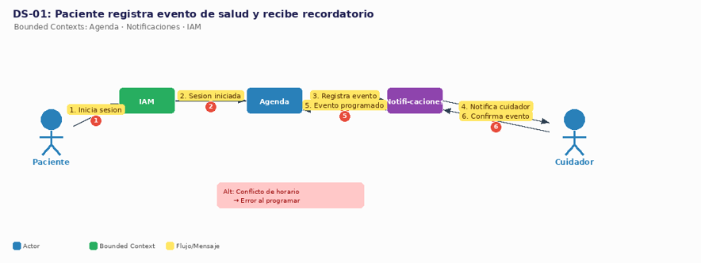

##### Bounded Contexts Involucrados:
1.  IAM — autentica al paciente
2.  Agenda — gestiona el registro y programacion del evento
3. 	Notificaciones — envia alerta al cuidador y recibe confirmacion

##### Flujo Principal:

| #  | Actor   | Mensaje / Accion | Destino | Resultado
|------:|-------------|-------------|-------------|-------------|
|1|	Paciente|	Inicia sesion en el sistema|	IAM	|Sesion iniciada
|2	|IAM|	Retorna token de sesion activa|	Agenda|	Acceso habilitado
|3	|Paciente|	Registra evento de salud con fecha y hora|	Agenda|	Evento de salud registrado
|4|	Agenda|	Programa evento y genera recordatorio|	Notificaciones|	Evento programado
|5|	Notificaciones	|Envia alerta al cuidador	|Cuidador	|Notificacion enviada
|6|	Cuidador|	Confirma asistencia al evento	|Notificaciones|	Evento confirmado


##### Escenarios Alternativos:
| Escenario Alternativo| Respuesta del Sistema   |
|------:|-------------|
|Conflicto de horario detectado|	Agenda notifica conflicto → Paciente reprograma el evento|
|Paciente no responde confirmacion|	Notificaciones envia alerta al cuidador → Cuidador toma accion|
Datos incompletos al registrar|	Agenda rechaza el evento → Muestra error con campos requeridos|


#### DS-02: Paciente sube documento medico y cuidador lo consulta

Historia: El paciente o familiar sube un documento medico al sistema. El documento queda disponible para que el cuidador autorizado lo consulte a traves del contexto de Gestión de Consentimiento.

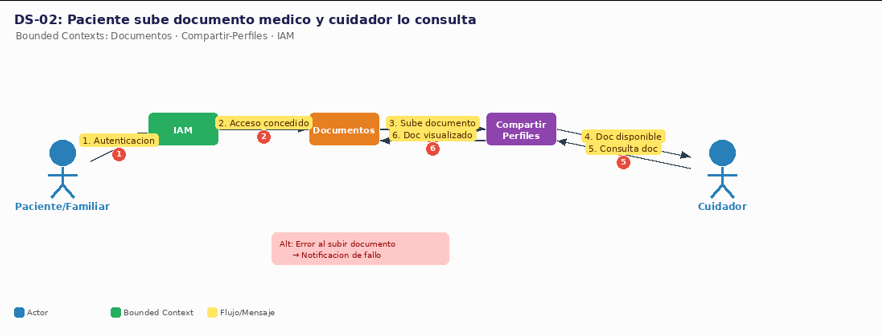

##### Bounded Contexts Involucrados:

1.	IAM — autentica al paciente o familiar
2.	Documentos — gestiona subida y almacenamiento del archivo
3.	Gestión de Consentimiento — controla el acceso del cuidador al documento

##### Flujo Principal:

| #  | Actor   | Mensaje / Accion | Destino | Resultado
|------:|-------------|-------------|-------------|-------------|
|1|	Paciente/Familiar|	Se autentica en el sistema|	IAM	|Sesion activa|
|2	|IAM|	Concede acceso al modulo de documentos|	Documentos|	Acceso concedido|
|3	|Paciente/Familiar	|Sube documento medico (PDF, imagen)	|Documentos	|Documento almacenado
|4|	Documentos|	Notifica disponibilidad al cuidador|	Gestión de Consentimiento	|Documento disponible
|5|	Cuidador	|Solicita consultar el documento medico|	Gestión de Consentimiento	|Acceso validado|
|6|	Gestión de Consentimiento|	Retorna documento para visualizacion	|Cuidador	|Documento visualizado|

##### Escenarios Alternativos:
| Escenario Alternativo| Respuesta del Sistema   |
|------:|-------------|
|Error al subir documento (formato invalido)|	Documentos rechaza el archivo → Muestra mensaje de error al usuario|
|Cuidador sin permisos de acceso	|Gestión de Consentimiento deniega la solicitud → Acceso no autorizado|
|Documento no encontrado	|Documentos retorna error 404 → Informacion del documento no disponible|


#### DS-03: Paciente escribe en diario y cuidador monitorea su estado

Historia: El paciente escribe una nota personal en su diario clinico. La nota queda almacenada y, si el diario ha sido compartido, el cuidador puede visualizarlo en tiempo real.

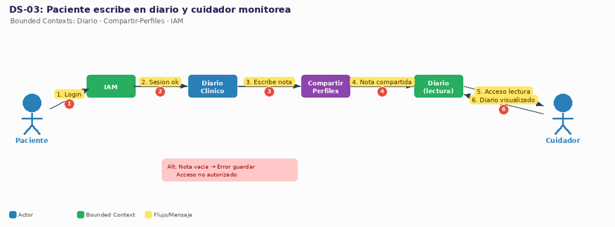


##### Bounded Contexts Involucrados:

1.	IAM — autentica al paciente o familiar
2.	Diario  — gestiona el registro y almacenamiento de notas
3.	Gestión de Consentimiento — controla el acceso del cuidador al documento

##### Flujo Principal:

| #  | Actor   | Mensaje / Accion | Destino | Resultado
|------:|-------------|-------------|-------------|-------------|
|1|	Paciente|	Inicia sesion en el sistema	|IAM	|Sesion iniciada|
|2|	IAM	|Habilita acceso al diario clinico	|Diario 	|Acceso habilitado|
|3|	Paciente	|Escribe nota de estado de salud	|Diario |	Nota registrada y almacenada|
|4|	Diario |	Marca nota como disponible para compartir	|Gestión de Consentimiento|	Nota compartida|
|5|	Cuidador	|Solicita lectura del diario compartido	|Gestión de Consentimiento	|Acceso de lectura concedido|
|6|	Gestión de Consentimiento|	Retorna contenido del diario al cuidador	|Cuidador	|Diario compartido visualizado|


##### Escenarios Alternativos:
| Escenario Alternativo| Respuesta del Sistema   |
|------:|-------------|
|Nota vacia al intentar guardar|	Diario Clinico rechaza el guardado → Muestra error: nota vacia|
|Acceso no autorizado al diario	|Gestión de Consentimiento deniega acceso → Acceso no autorizado al diario compartido|
|Diario no compartido aun con el cuidador|	Sistema solicita al paciente activar el permiso de lectura|


#### DS-04: Paciente comparte su perfil con un familiar

Historia: El paciente decide compartir su perfil de salud con un familiar. Genera un enlace de acceso, el familiar lo recibe y puede consultar la información del paciente de forma controlada.

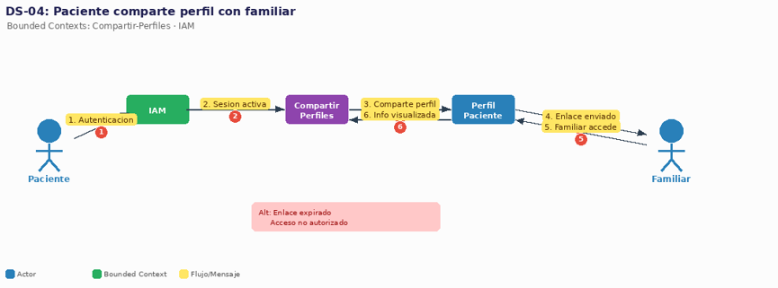

##### Bounded Contexts Involucrados:

1.	IAM — autentica al paciente o familiar
3.	Gestión de Consentimiento — controla el acceso del cuidador al documento

##### Flujo Principal:

| #  | Actor   | Mensaje / Accion | Destino | Resultado
|------:|-------------|-------------|-------------|-------------|
|1|	Paciente|	Se autentica para gestionar su perfil|	IAM|	Sesión activa|
|2|	IAM|	Valida identidad y autoriza acción|	Gestión de Consentimiento	|Sesión verificada|
|3|	Paciente|	Solicita compartir perfil con familiar	|Gestión de Consentimiento|	Perfil compartido — enlace generado|
|4|	Gestión de Consentimiento	|Envía enlace de acceso al familiar	|Familiar|	Enlace recibido|
|5|	Familiar|	Accede mediante el enlace recibido	|Gestión de Consentimiento	|Acceso al familiar concedido|
|6|	Gestión de Consentimiento|	Muestra información del paciente al familiar	|Familiar	|Información del paciente visualizado|


##### Escenarios Alternativos:
| Escenario Alternativo| Respuesta del Sistema   |
|------:|-------------|
|Enlace expirado al intentar acceder	|Gestión de Consentimiento rechaza el acceso → Enlace expirado|
|Acceso no autorizado (enlace invalido)	|Sistema deniega la solicitud → Acceso no autorizado|
|Error al compartir perfil	|Gestión de Consentimiento retorna error → Acceso no concedido|

#### 2.5.1.3. Bounded Context Canvases <a id="2513-bounded-context-canvases"></a>

Segun el valor de negocio identificado en el Candidate Context Discovery, el orden de elaboracion de los canvases es:

| #  | Bounded Context   | Tipo | Justificacion| 
|------:|-------------|-------------|-------------|
|1|	Agenda|	Core Domain|	Nucleo del sistema — coordina todos los eventos de salud|
|2|	Notificaciones|	Core Domain|	Cierra el loop de la Agenda — alerta y confirmacion|
|3|	Diario de Seguimiento|	Core Domain|	Diferenciador del producto — seguimiento continuo|
|4|	Documentos|	Supporting Domain	|Soporte al historial clinico del paciente|
|5|	Gestión de Consentimiento|	Supporting Domain	|Permite el acceso controlado y revocable de terceros autorizados a la información clínica del paciente|
|6|	Autenticación (IAM)	|Generic Domain	|Prerequisito de todos los contextos — candidato a externalizarse|

A continuación se presentan los Bounded Context Canvases elaborados por el equipo en Miro, uno por cada bounded context identificado. Cada canvas consolida en una sola vista los campos definidos en la plantilla de Nick Tune: Name, Purpose, Strategic Classification, Domain Roles, Inbound/Outbound Communication, Ubiquitous Language, Business Decisions y Assumptions.

#### Bounded Context Canvas 1 — BC-01 Agenda

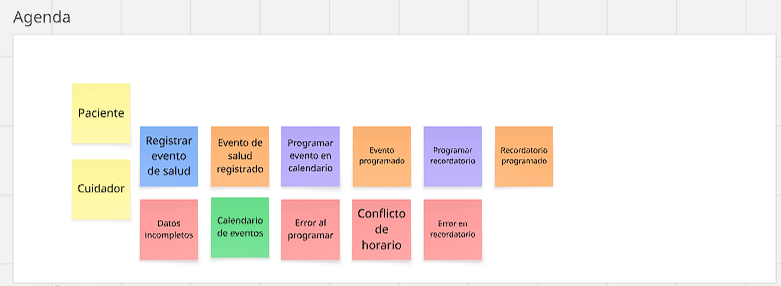

*Figura 11. Bounded Context Canvas para el contexto Agenda.*


#### Bounded Context Canvas 2 — BC-02 Notificaciones

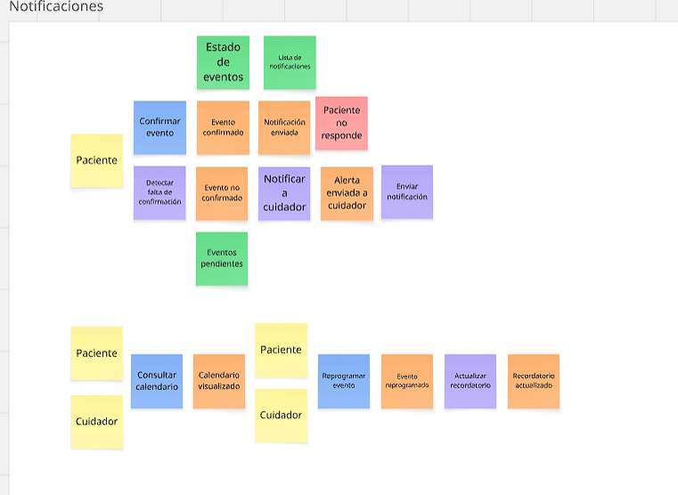

*Figura 12. Bounded Context Canvas para el contexto Notificaciones.*

#### Bounded Context Canvas 3 — BC-03 Diario de Seguimiento

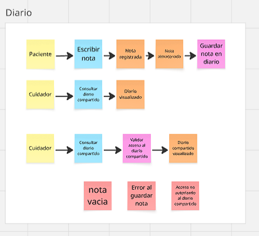

*Figura 13. Bounded Context Canvas para el contexto Diario de Seguimiento.*

#### Bounded Context Canvas 4 — BC-04 Documentos

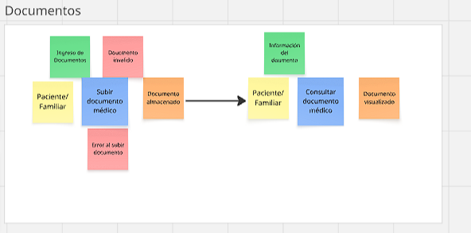

*Figura 14. Bounded Context Canvas para el contexto Documentos.*

#### Bounded Context Canvas 5 — BC-05 Gestión de Consentimiento

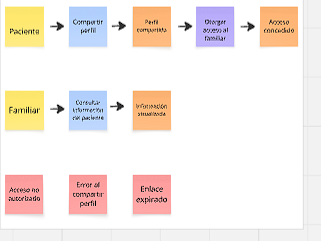

*Figura 15. Bounded Context Canvas para el contexto Gestión de Consentimiento.*

#### Bounded Context Canvas 6 — BC-06 Autenticación (IAM)

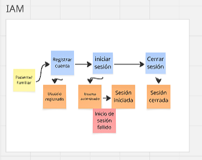

*Figura 16. Bounded Context Canvas para el contexto Autenticación (IAM).*


### 2.5.2. Context Mapping <a id="252-context-mapping"></a>

En esta sección se documenta el proceso seguido por el equipo para producir el Context Map de CareConnect, entendido como la visualización de las relaciones estructurales entre los bounded contexts identificados durante el EventStorming (§2.5.1). El punto de partida fueron los seis candidate contexts derivados de las épicas del producto —Autenticación, Gestión de Consentimiento, Agenda, Notificaciones, Diario de Seguimiento y Documentos—, los dos actores definidos en el Context Level Diagram (paciente geriátrico y cuidador) y los sistemas externos con los que el producto necesita integrarse (Google Sign-In, Firebase Cloud Messaging y SendGrid).

La elaboración no se resolvió en una única iteración: el equipo construyó varias alternativas, las comparó a partir de preguntas de diseño deliberadas y seleccionó la que mejor equilibraba cohesión, acoplamiento y capacidad de evolución. A continuación se describen las alternativas consideradas y, a partir de ellas, el Context Map final adoptado con los patrones de relación entre bounded contexts propios de Domain-Driven Design.

---

#### Alternativas de Context Mapping evaluadas

Cada alternativa responde a una de las preguntas de diseño recomendadas para este tipo de ejercicio. Se conservan aquí las discusiones para que la decisión final sea trazable.

**Alternativa 1 — ¿Qué pasaría si fusionamos Diario de Seguimiento y Documentos en un solo bounded context?**
Ambos contextos manejan información generada en torno al paciente. Sin embargo, Diario se ocupa de notas cualitativas con alta frecuencia de escritura y consulta conversacional, mientras que Documentos gestiona archivos clínicos (recetas, resultados de laboratorio) con ciclo de vida más lento y control de acceso explícito. Fusionarlos diluiría dos Ubiquitous Languages distintos ("entrada de diario" vs. "documento médico"), mezclaría reglas de invariantes y dificultaría escalar cada módulo en forma independiente. **Se descarta.**

**Alternativa 2 — ¿Qué pasaría si duplicamos la lógica de notificaciones dentro de Agenda, Gestión de Consentimiento y Documentos para romper la dependencia con Notificaciones?**
Cada bounded context quedaría responsable de generar sus propios recordatorios, eliminando la dependencia transversal. El problema es doble: se duplicarían las integraciones con Firebase Cloud Messaging y SendGrid (con su Anti-Corruption Layer correspondiente) y se perdería la política común de reintentos y preferencias de notificación que cada usuario configura una sola vez. **Se descarta.** Conviene mantener Notificaciones como bounded context dedicado que recibe eventos de dominio desde los demás.

**Alternativa 3 — ¿Qué pasaría si creamos un shared service de control de acceso para reducir la duplicación entre Documentos, Agenda y Diario?**
Hoy, cada uno de estos contextos necesita saber qué cuidadores están autorizados a leer información del paciente. La alternativa de incorporar la lógica de permisos en cada bounded context produciría inconsistencias cuando el paciente revoque accesos. En su lugar, Gestión de Consentimiento se consolida como fuente de verdad y publica eventos de dominio (`AccessGrantedEvent`, `AccessRevokedEvent`) que los demás contextos consumen para mantener su propia proyección de permisos. **Se adopta.**

**Alternativa 4 — ¿Qué pasaría si Autenticación y Gestión de Consentimiento fueran el mismo bounded context?**
Ambos participan en la identidad del usuario, pero resuelven preocupaciones distintas: Autenticación responde "¿quién es este usuario?" mientras que Gestión de Consentimiento responde "¿qué puede ver este usuario del paciente?". Unirlos rompe el principio de responsabilidad única y mezcla la gestión de sesiones con las reglas de negocio del acceso compartido. **Se descarta.**

**Alternativa 5 — ¿Qué pasaría si aislamos los core capabilities (Agenda, Diario, Documentos) y movemos el resto a subdomains de soporte y genéricos?**
Los tres contextos que encapsulan la experiencia clínica del paciente son los que concentran la ventaja competitiva del producto y son tratados como **Core Subdomains**. Notificaciones y Gestión de Consentimiento son **Supporting Subdomains** porque habilitan al core pero no lo constituyen. Autenticación se clasifica como **Generic Subdomain** porque su responsabilidad es comparable a la de cualquier otro sistema y apoya un proveedor externo. **Se adopta.**

**Alternativa 6 — ¿Qué pasaría si tratamos Firebase Cloud Messaging, SendGrid y Google Sign-In como extensiones del sistema en vez de integraciones externas?**
Esto implicaría que nuestros bounded contexts conformaran su modelo al de esos proveedores (relación Conformist), lo que nos dejaría atados a cambios de contrato ajenos. **Se descarta.** Se opta por interponer una **Anti-Corruption Layer** en Notificaciones y en Autenticación para traducir los modelos externos al lenguaje propio del dominio.

---

#### Context Map seleccionado

A partir de las alternativas evaluadas, el Context Map final consolida los seis bounded contexts del producto más los tres sistemas externos, organizados en tres capas visuales: el eje de identidad arriba (Autenticación y Gestión de Consentimiento), los core subdomains clínicos en el medio (Agenda, Diario de Seguimiento y Documentos) y el subdomain de soporte para notificaciones en la parte inferior, flanqueado por los sistemas externos a los que se conecta.

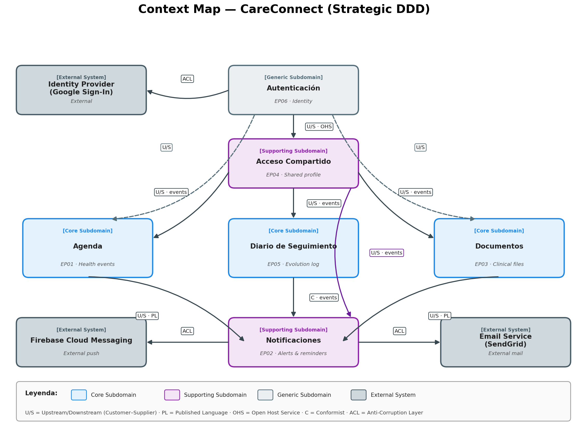

*Figura 10. Context Map estratégico de CareConnect, con los patrones de relación entre bounded contexts y sistemas externos.*

---

#### Patrones DDD aplicados en las relaciones

Las flechas del diagrama se anotan con los patrones de Strategic Design que corresponden a cada relación. A continuación se explican y se justifican en el contexto del producto.

| Relación | Patrón | Justificación |
|---|---|---|
| Autenticación → Gestión de Consentimiento | **Customer/Supplier (U/S) + Open Host Service (OHS)** | Autenticación es upstream porque provee la identidad sobre la que Gestión de Consentimiento opera. Expone un contrato público estable (OHS) para que el downstream no dependa de detalles internos. |
| Autenticación → Agenda / Diario / Documentos | **Customer/Supplier (U/S)** | Cada core context consulta la identidad autenticada para autorizar operaciones sobre el paciente. |
| Autenticación → Identity Provider (Google) | **Anti-Corruption Layer (ACL)** | La ACL traduce los tokens y atributos de Google Sign-In al modelo de usuario propio del dominio, evitando que un cambio en el proveedor externo contamine el resto del sistema. |
| Gestión de Consentimiento → Agenda / Diario / Documentos | **Customer/Supplier (U/S) + events** | Gestión de Consentimiento publica `AccessGrantedEvent` y `AccessRevokedEvent` como Published Language; los core contexts se suscriben para mantener sus proyecciones de permisos actualizadas. |
| Agenda → Notificaciones | **Customer/Supplier (U/S) + Published Language (PL)** | Agenda publica eventos de dominio (`MedicationScheduled`, `AppointmentCreated`) con un contrato estable que Notificaciones consume para programar recordatorios. |
| Documentos → Notificaciones | **Customer/Supplier (U/S) + Published Language (PL)** | Documentos emite eventos cuando un archivo clínico se sube o se vuelve accesible; Notificaciones transforma esos eventos en alertas dirigidas al cuidador. |
| Diario → Notificaciones | **Conformist (C)** | Diario se apoya de forma ocasional en Notificaciones para enviar recordatorios de registro; adopta el contrato tal como existe sin negociar cambios, por lo que se clasifica como Conformist. |
| Gestión de Consentimiento → Notificaciones | **Customer/Supplier (U/S) + events** | Las invitaciones y revocaciones de acceso disparan notificaciones hacia el familiar autorizado. |
| Notificaciones → Firebase Cloud Messaging | **Anti-Corruption Layer (ACL)** | Aísla el contrato de FCM; si Google cambia su SDK o modelo de payload, el cambio queda contenido en el adaptador. |
| Notificaciones → SendGrid | **Anti-Corruption Layer (ACL)** | Mismo razonamiento para el envío de correos transaccionales: se traduce el modelo interno de "notificación" al formato esperado por SendGrid. |

**Nota sobre Shared Kernel:** Se evaluó introducir un Shared Kernel para tipos primitivos compartidos (identificadores de usuario, paciente y cuidador). Se descartó su uso formal porque acopla los ciclos de liberación de múltiples bounded contexts; en su lugar, cada contexto mantiene su propio value object equivalente y la conversión se realiza en los bordes mediante Published Language, preservando la independencia entre módulos.

---

#### Conclusión del proceso

El Context Map adoptado mantiene los tres core subdomains aislados entre sí, reservando el acoplamiento necesario hacia Autenticación (identidad) y Gestión de Consentimiento (permisos) a través de eventos de dominio. Notificaciones se comporta como infraestructura de salida común, consumiendo eventos del resto y exponiendo únicamente adaptadores hacia los servicios externos. Esta configuración permite evolucionar cada bounded context de forma independiente, reemplazar proveedores externos sin contaminar el dominio y escalar selectivamente los módulos donde se concentre más tráfico, sin sacrificar la consistencia conceptual del producto.

### 2.5.3. Software Architecture <a id="253-software-architecture"></a>

En esta sección se presenta la representación de la arquitectura de software para la solución CareConnect, aplicando el C4 Model y utilizando Structurizr como herramienta de elaboración. La arquitectura abarca todos los productos digitales que forman parte del alcance: el Landing Page, los Web Services (RESTful API), y la Mobile Application nativa y multiplataforma. Los diagramas presentados a continuación permiten visualizar la solución desde distintos niveles de abstracción, partiendo del contexto general del sistema, pasando por la descomposición en containers y en sus seis bounded contexts, hasta la distribución física del despliegue.

La solución está organizada alrededor de seis bounded contexts identificados durante el diseño estratégico, uno por cada épica del producto:

| Bounded Context | Épica | Responsabilidad principal |
|-----------------|-------|---------------------------|
| Agenda | EP01 Gestión de Agenda | Gestión de eventos de salud, citas y medicación en el calendario. |
| Notificaciones | EP02 Gestión de Notificaciones | Programación, envío y visualización de recordatorios y alertas. |
| Documentos | EP03 Gestión de Documentos | Almacenamiento, consulta y control de acceso a documentos médicos. |
| Gestión de Consentimiento | EP04 Gestión de Consentimiento | Compartir y revocar el perfil del paciente con los cuidadores. |
| Diario de Seguimiento | EP05 Diario de Seguimiento | Registro y consulta de notas sobre la evolución del paciente. |
| Autenticación | EP06 Autenticación | Gestión de cuentas, sesiones y control de acceso por rol. |

#### 2.5.3.1. Software Architecture Context Level Diagrams <a id="2531-software-architecture-context-level-diagrams"></a>

El Context Diagram muestra el sistema CareConnect como una caja central, rodeado por los actores que interactúan con él y los sistemas externos de los cuales depende. Este diagrama permite entender el alcance del sistema y sus principales relaciones a alto nivel.

Los actores identificados corresponden exactamente a los dos segmentos objetivo de la solución:

- **Geriatric Patient (Paciente geriátrico):** Usuario que utiliza la aplicación para recibir recordatorios de medicación y citas, confirmar sus eventos de salud, registrar notas en su diario y compartir su perfil con cuidadores. Interactúa con el sistema a través de la Mobile Application.
- **Caregiver (Cuidador):** Usuario que supervisa al paciente, gestiona la medicación, terapias y registros clínicos, recibe alertas de incumplimiento y consulta el perfil compartido del paciente. Interactúa con el sistema a través de la Mobile Application.

Los sistemas externos identificados son:

- **Email Service (e.g., SendGrid):** Utilizado para el envío de correos de verificación, recuperación de contraseña y notificaciones por email.
- **Push Notification Service (e.g., Firebase Cloud Messaging):** Servicio externo para el envío de notificaciones push a los dispositivos móviles de pacientes y cuidadores.
- **Identity Provider:** Servicio de autenticación externo que permite el inicio de sesión mediante proveedores como Google Sign-In.


*Figura 1. Software Architecture Context Level Diagram para CareConnect.*

#### 2.5.3.2. Software Architecture Container Level Diagrams <a id="2532-software-architecture-container-level-diagrams"></a>

El Container Diagram descompone el sistema CareConnect en sus elementos de alto nivel, mostrando cómo se distribuyen las responsabilidades entre los distintos containers y las principales decisiones de tecnología adoptadas. A nivel de container, el sistema se presenta con un **Backend único** (no disgregado por bounded context); la descomposición interna en bounded contexts pertenece al nivel de componente (§2.6) y no se muestra en este diagrama.

Los containers identificados son:

- **Landing Page:** Sitio web desarrollado con React. Presenta el modelo de negocio, las características del producto y los enlaces de descarga.
- **Mobile Application:** Aplicación nativa Android desarrollada con Kotlin y Jetpack Compose. Constituye la interfaz principal mediante la cual el paciente geriátrico y el cuidador interactúan con el sistema. Se comunica con el Backend a través de HTTPS/JSON.
- **Backend (RESTful Web Services):** Servicio único desarrollado con Spring Boot (Java) que expone una API REST documentada con OpenAPI/Swagger. Concentra la lógica de negocio de los seis bounded contexts (Agenda, Notificaciones, Diario de Seguimiento, Documentos, Gestión de Consentimiento y Autenticación) en un mismo despliegue. La descomposición interna por bounded context se documenta a nivel de componente.
- **Database:** Base de datos relacional (MySQL 8) que persiste la información del sistema. Es consumida exclusivamente por el Backend.
- **Local Storage (SQLite / Room):** Almacenamiento local en el dispositivo móvil que permite el acceso offline a información crítica del paciente, medicación pendiente y registros recientes.

Las relaciones principales entre containers son:

| Origen | Destino | Descripción | Protocolo |
|--------|---------|-------------|-----------|
| Mobile Application | Backend | Consume la API RESTful del sistema | HTTPS / JSON |
| Mobile Application | Local Storage | Almacena y consulta datos para acceso offline | SQLite / Room |
| Mobile Application | Push Notification Service | Recibe notificaciones push | FCM |
| Backend | Database | Persiste y consulta datos del dominio | JDBC / JPA |
| Backend | Email Service / Push Notification Service | Envía emails transaccionales y notificaciones push | HTTPS / SMTP |
| Backend | Identity Provider | Verifica autenticación federada (Google Sign-In) | HTTPS / OAuth 2.0 |


*Figura 2. Software Architecture Container Level Diagram para CareConnect, con el Backend representado como un único container responsable de la API REST del sistema. La descomposición interna por bounded context se presenta en los diagramas de componentes (§2.6).*

#### 2.5.3.3. Software Architecture Deployment Diagrams <a id="2533-software-architecture-deployment-diagrams"></a>

El Deployment Diagram muestra la distribución física del sistema CareConnect, destacando cómo los componentes de software se despliegan sobre la infraestructura de hardware y los entornos de ejecución. Este diagrama permite visualizar los nodos físicos y virtuales, las relaciones de red entre ellos y la asignación de containers a cada nodo. El API Gateway empaqueta en un mismo despliegue los seis bounded contexts (Agenda, Notificaciones, Documentos, Gestión de Consentimiento, Diario y Autenticación), que comparten el mismo motor de persistencia relacional.

Los nodos de despliegue identificados son:

- **User's Mobile Device (Android):** Utilizado tanto por el paciente geriátrico como por el cuidador.
  - Ejecuta la **Mobile Application** (APK distribuido vía Firebase App Distribution).
  - Contiene el **Local Storage** (SQLite/Room) para persistencia offline.
  - Se comunica con el backend a través de HTTPS sobre internet.

- **User's Web Browser:**
  - Renderiza el **Landing Page** estático, servido desde un proveedor de hosting.

- **Cloud Hosting Provider (e.g., Railway / Render / AWS):**
  - **Web Server Node:** Aloja el **API Gateway / RESTful Web Services** (Spring Boot). Recibe peticiones HTTPS desde la Mobile Application y ejecuta la lógica de negocio.
  - **Database Server Node:** Aloja la **Database** relacional (MySQL 8). Accedida únicamente desde el Web Server Node a través de la red interna del proveedor.

- **Static Hosting Provider (e.g., GitHub Pages / Netlify / Vercel):**
  - Sirve los archivos estáticos del **Landing Page** (HTML, CSS, JS) a los navegadores web de los visitantes.

- **Firebase (Google Cloud):**
  - **Firebase Cloud Messaging:** Servicio de notificaciones push que envía alertas a los dispositivos móviles.
  - **Firebase App Distribution:** Servicio para la distribución y prueba de la aplicación móvil en dispositivos antes del lanzamiento.

- **External Email Service (e.g., SendGrid):**
  - Procesa y envía correos electrónicos disparados desde el backend.

Las conexiones de red principales son:

| Origen | Destino | Protocolo | Descripción |
|--------|---------|-----------|-------------|
| Mobile Device | Cloud Web Server | HTTPS | Consumo de RESTful API |
| Mobile Device | Firebase Cloud Messaging | HTTPS | Recepción de notificaciones push |
| Web Browser | Static Hosting | HTTPS | Carga del Landing Page |
| Cloud Web Server | Database Server | TCP/JDBC | Persistencia de datos |
| Cloud Web Server | SendGrid | HTTPS/SMTP | Envío de emails |
| Cloud Web Server | Firebase Cloud Messaging | HTTPS | Disparo de notificaciones |


*Figura 3. Software Architecture Deployment Diagram para CareConnect.*

## 2.6. Tactical-Level Domain-Driven Design <a id="26-tactical-level-domain-driven-design"></a>

### 2.6.1. Bounded Context: Agenda

#### 2.6.1.1. Domain Layer

| Componente | Tipo | Descripción |
|-----------|------|-------------|
| Agenda | Aggregate Root | Gestiona la consistencia transaccional de los eventos de salud del paciente. |
| HealthEvent | Entity | Representa un evento de salud, como una cita médica, medicación o actividad terapéutica. |
| Reminder | Entity | Representa un recordatorio asociado a un evento programado. |
| EventDateTime | Value Object | Encapsula la fecha y hora del evento. |
| EventStatus | Value Object | Representa el estado actual del evento. |
| EventType | Value Object | Define la categoría del evento de salud. |
| EventSchedulerService | Domain Service | Gestiona las reglas de programación de eventos. |
| ScheduleValidationService | Domain Service | Valida conflictos y restricciones de horario. |
| AgendaRepository | Repository | Define el contrato de persistencia del agregado Agenda. |
| EventCreatedEvent | Domain Event | Se publica cuando se crea un evento. |
| EventConfirmedEvent | Domain Event | Se publica cuando se confirma un evento. |
| EventRescheduledEvent | Domain Event | Se publica cuando se reprograma un evento. |
| EventDeletedEvent | Domain Event | Se publica cuando se elimina un evento. |

#### 2.6.1.2. Interface Layer

| Componente | Tipo | Descripción |
|-----------|------|-------------|
| AgendaActivity | Activity | Punto de entrada principal del módulo de agenda. |
| CalendarFragment | Fragment | Presenta los eventos de salud en formato calendario. |
| EventDetailFragment | Fragment | Muestra la información detallada de un evento seleccionado. |
| AgendaViewModel | ViewModel | Gestiona el estado de la interfaz y coordina Commands y Queries con la capa de aplicación. |

#### 2.6.1.3. Application Layer

| Componente | Tipo | Descripción |
|-----------|------|-------------|
| CreateEventCommand | Command | Solicita la creación de un nuevo evento de salud. |
| ConfirmEventCommand | Command | Solicita la confirmación de un evento programado. |
| RescheduleEventCommand | Command | Solicita la reprogramación de un evento existente. |
| DeleteEventCommand | Command | Solicita la eliminación de un evento. |
| CreateEventHandler | Command Handler | Procesa la creación de eventos. |
| ConfirmEventHandler | Command Handler | Procesa la confirmación de eventos. |
| RescheduleEventHandler | Command Handler | Procesa la reprogramación de eventos. |
| DeleteEventHandler | Command Handler | Procesa la eliminación de eventos. |
| GetEventsQuery | Query | Recupera todos los eventos registrados. |
| GetEventByIdQuery | Query | Recupera un evento por su identificador. |
| GetEventsByDateQuery | Query | Recupera los eventos programados para una fecha específica. |
| GetEventsHandler | Query Handler | Procesa la consulta de todos los eventos. |
| GetEventByIdHandler | Query Handler | Procesa la consulta por identificador. |
| GetEventsByDateHandler | Query Handler | Procesa la consulta por fecha. |
| EventDTO | DTO | Transfiere información de eventos entre capas. |
| ReminderDTO | DTO | Transfiere información de recordatorios. |

#### 2.6.1.4. Infrastructure Layer

| Componente | Tipo | Descripción |
|-----------|------|-------------|
| AgendaRepositoryImpl | Repository Implementation | Implementa la persistencia del agregado Agenda. |
| EventDao | DAO | Proporciona operaciones de acceso a datos para eventos. |
| EventEntity | Persistence Entity | Representa un evento dentro de la base de datos local. |
| WorkManagerScheduler | Scheduler | Programa recordatorios y tareas en segundo plano. |
| EventMapper | Mapper | Convierte objetos entre Domain, DTO y Persistence. |

#### 2.6.1.5. Bounded Context Software Architecture Component Level Diagrams


#### 2.6.1.6. Bounded Context Software Architecture Code Level Diagrams
##### 2.6.1.6.1. Bounded Context Domain Layer Class Diagrams

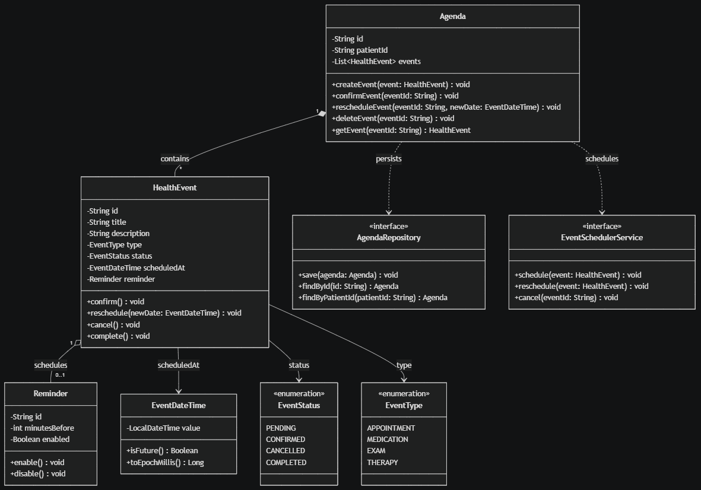

##### 2.6.1.6.2. Bounded Context Database Design Diagram

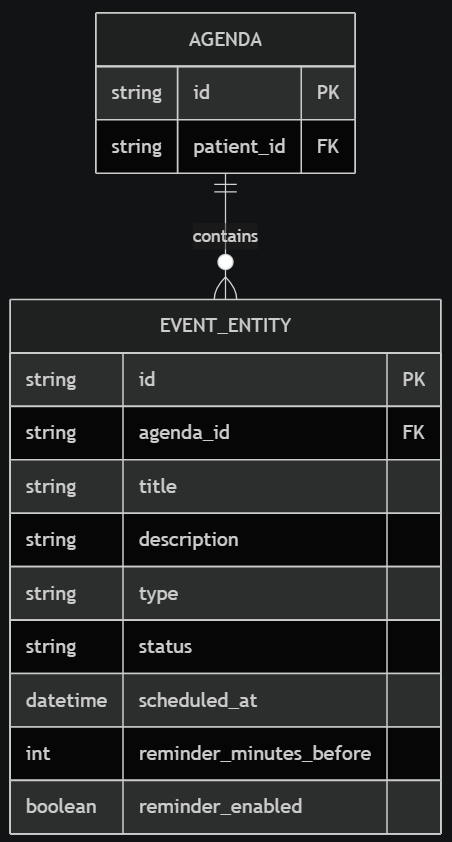

---

### 2.6.2. Bounded Context: Notificaciones

Este bounded context es responsable de la planificación, envío, recepción, visualización y control de acceso de las notificaciones y alertas que reciben pacientes y cuidadores dentro de la plataforma CareConnect. Cubre las historias de usuario US04 (recordatorios de eventos), US05 (alertas de incumplimiento) y US06 (visualización de notificaciones), así como las historias técnicas TS03 (programación), TS04 (envío) y TS05 (control de acceso). Se integra con Firebase Cloud Messaging (FCM) para push, con SendGrid para email y con el bounded context de Agenda a través de eventos de dominio.

#### 2.6.2.1. Domain Layer

| Componente | Tipo | Descripción |
|-----------|------|-------------|
| NotificationCenter | Aggregate Root | Gestiona la consistencia transaccional de las notificaciones y alertas de un destinatario. |
| Notification | Entity | Representa una notificación individual (recordatorio, alerta o informativa) dirigida a un usuario. |
| Alert | Entity | Representa una alerta de incumplimiento generada cuando un evento no es confirmado a tiempo. |
| NotificationPreference | Entity | Representa las preferencias del usuario sobre canales y tipos de notificación. |
| NotificationContent | Value Object | Encapsula el título, el mensaje y el payload asociado a la notificación. |
| NotificationType | Value Object | Define la categoría de la notificación (REMINDER, ALERT, INFO). |
| NotificationPriority | Value Object | Representa el nivel de prioridad de la notificación (LOW, MEDIUM, HIGH, CRITICAL). |
| NotificationStatus | Value Object | Representa el estado actual de la notificación (SCHEDULED, SENT, DELIVERED, READ, FAILED). |
| DeliveryChannel | Value Object | Indica el canal de entrega de la notificación (PUSH, EMAIL, IN_APP). |
| RecipientId | Value Object | Identifica de forma única al destinatario (paciente o cuidador). |
| ScheduledAt | Value Object | Encapsula la fecha y hora programada de envío. |
| NotificationDispatchService | Domain Service | Aplica las reglas de negocio para despachar una notificación al canal adecuado. |
| AlertEvaluationService | Domain Service | Evalúa si se debe generar una alerta de incumplimiento ante un evento no confirmado. |
| NotificationAccessPolicy | Domain Service | Valida que el destinatario tenga los permisos necesarios para recibir la notificación (TS05). |
| NotificationRepository | Repository | Define el contrato de persistencia del agregado NotificationCenter. |
| NotificationScheduledEvent | Domain Event | Se publica cuando se programa una nueva notificación. |
| NotificationSentEvent | Domain Event | Se publica cuando se envía una notificación al canal de entrega. |
| NotificationDeliveredEvent | Domain Event | Se publica cuando el canal confirma la entrega al dispositivo. |
| NotificationReadEvent | Domain Event | Se publica cuando el destinatario marca la notificación como leída. |
| AlertTriggeredEvent | Domain Event | Se publica cuando se genera una alerta de incumplimiento. |
| NotificationFailedEvent | Domain Event | Se publica cuando falla el envío o la entrega de la notificación. |

#### 2.6.2.2. Interface Layer

| Componente | Tipo | Descripción |
|-----------|------|-------------|
| NotificationCenterActivity | Activity | Punto de entrada principal del módulo de notificaciones en la aplicación móvil. |
| NotificationListFragment | Fragment | Presenta la lista de notificaciones recibidas ordenadas por fecha y prioridad (US06). |
| NotificationDetailFragment | Fragment | Muestra el contenido detallado de una notificación seleccionada. |
| AlertBannerFragment | Fragment | Presenta alertas críticas de incumplimiento de manera prominente al cuidador (US05). |
| NotificationSettingsFragment | Fragment | Permite al usuario configurar sus preferencias de notificación. |
| NotificationViewModel | ViewModel | Gestiona el estado de la lista y el detalle, coordinando Commands y Queries con la capa de aplicación. |
| AlertsViewModel | ViewModel | Gestiona el estado de las alertas activas visibles para el cuidador. |
| NotificationPreferencesViewModel | ViewModel | Gestiona el estado de las preferencias de notificación del usuario. |

#### 2.6.2.3. Application Layer

| Componente | Tipo | Descripción |
|-----------|------|-------------|
| ScheduleNotificationCommand | Command | Solicita la programación de una nueva notificación (TS03). |
| SendNotificationCommand | Command | Solicita el envío inmediato de una notificación (TS04). |
| CancelScheduledNotificationCommand | Command | Solicita la cancelación de una notificación previamente programada. |
| MarkNotificationAsReadCommand | Command | Solicita el marcado de una notificación como leída. |
| TriggerAlertCommand | Command | Solicita la generación de una alerta de incumplimiento (US05). |
| UpdateNotificationPreferencesCommand | Command | Solicita la actualización de las preferencias del usuario. |
| ScheduleNotificationHandler | Command Handler | Procesa la programación de notificaciones. |
| SendNotificationHandler | Command Handler | Procesa el envío de notificaciones a través del canal correspondiente. |
| CancelScheduledNotificationHandler | Command Handler | Procesa la cancelación de notificaciones programadas. |
| MarkNotificationAsReadHandler | Command Handler | Procesa el marcado de lectura. |
| TriggerAlertHandler | Command Handler | Procesa la generación de alertas, aplicando NotificationAccessPolicy. |
| UpdateNotificationPreferencesHandler | Command Handler | Procesa la actualización de preferencias. |
| GetNotificationsQuery | Query | Recupera todas las notificaciones del destinatario. |
| GetNotificationByIdQuery | Query | Recupera una notificación por su identificador. |
| GetUnreadNotificationsQuery | Query | Recupera las notificaciones no leídas del destinatario. |
| GetActiveAlertsQuery | Query | Recupera las alertas activas del cuidador. |
| GetNotificationPreferencesQuery | Query | Recupera las preferencias de notificación del usuario. |
| GetNotificationsHandler | Query Handler | Procesa la consulta de todas las notificaciones. |
| GetNotificationByIdHandler | Query Handler | Procesa la consulta por identificador. |
| GetUnreadNotificationsHandler | Query Handler | Procesa la consulta de notificaciones no leídas. |
| GetActiveAlertsHandler | Query Handler | Procesa la consulta de alertas activas. |
| GetNotificationPreferencesHandler | Query Handler | Procesa la consulta de preferencias. |
| HealthEventCreatedListener | Event Listener | Reacciona al evento EventCreatedEvent del contexto Agenda para programar recordatorios. |
| HealthEventRescheduledListener | Event Listener | Reacciona al evento EventRescheduledEvent para reprogramar notificaciones. |
| HealthEventMissedListener | Event Listener | Reacciona al vencimiento sin confirmación para disparar TriggerAlertCommand. |
| NotificationDTO | DTO | Transfiere información de notificaciones entre capas. |
| AlertDTO | DTO | Transfiere información de alertas. |
| NotificationPreferenceDTO | DTO | Transfiere información de preferencias de notificación. |

#### 2.6.2.4. Infrastructure Layer

| Componente | Tipo | Descripción |
|-----------|------|-------------|
| NotificationRepositoryImpl | Repository Implementation | Implementa la persistencia del agregado NotificationCenter. |
| AppDatabase | Database | Configura la base de datos local utilizando Room para persistencia offline de notificaciones. |
| NotificationDao | DAO | Proporciona operaciones de acceso a datos para las notificaciones. |
| AlertDao | DAO | Proporciona operaciones de acceso a datos para las alertas. |
| NotificationPreferenceDao | DAO | Proporciona operaciones de acceso a datos para las preferencias. |
| NotificationEntity | Persistence Entity | Representa una notificación dentro de la base de datos local. |
| AlertEntity | Persistence Entity | Representa una alerta dentro de la base de datos local. |
| NotificationPreferenceEntity | Persistence Entity | Representa las preferencias dentro de la base de datos local. |
| FCMPushNotificationAdapter | External Service Adapter | Adaptador hacia Firebase Cloud Messaging para el envío de notificaciones push (TS04). |
| SendGridEmailAdapter | External Service Adapter | Adaptador hacia SendGrid para el envío de notificaciones por correo electrónico. |
| CareConnectFirebaseMessagingService | Platform Service | Servicio Android que recibe las notificaciones push entregadas por FCM. |
| WorkManagerNotificationScheduler | Scheduler | Programa el envío diferido de notificaciones y el reintento ante fallos (TS03). |
| AlertEvaluationWorker | Background Worker | Worker periódico que dispara AlertEvaluationService sobre eventos vencidos sin confirmación. |
| NotificationMapper | Mapper | Convierte objetos Notification entre Domain, DTO y Persistence. |
| AlertMapper | Mapper | Convierte objetos Alert entre Domain, DTO y Persistence. |
| NotificationPreferenceMapper | Mapper | Convierte objetos NotificationPreference entre Domain, DTO y Persistence. |
| RetryPolicyConfig | Configuration | Define la política de reintentos para fallos de envío (TS04). |

#### 2.6.2.5. Bounded Context Software Architecture Component Level Diagrams

El Component Diagram del bounded context Notificaciones presenta, en un layout vertical y con un número reducido de componentes, la organización interna del módulo en cuatro capas claramente separadas: Interface (API REST), Application (servicio de aplicación), Domain (servicios de dominio) e Infrastructure (repositorio, scheduler y adaptadores a FCM y SendGrid). También muestra la integración de entrada desde la Mobile Application y desde el bounded context Agenda, y las salidas hacia la base de datos y los servicios externos.


*Figura 4. Component Level Diagram del bounded context Notificaciones, organizado por capas.*

#### 2.6.2.6. Bounded Context Software Architecture Code Level Diagrams

##### 2.6.2.6.1. Bounded Context Domain Layer Class Diagrams

El Class Diagram de la capa de dominio del bounded context Notificaciones muestra el agregado NotificationCenter, sus entidades internas (Notification, Alert, NotificationPreference), los value objects que describen su comportamiento, los domain services que encapsulan las reglas de negocio y los domain events que comunican cambios relevantes hacia otros contextos.


*Figura 5. Domain Layer Class Diagram del bounded context Notificaciones.*

##### 2.6.2.6.2. Bounded Context Database Design Diagram

El Database Design Diagram del bounded context Notificaciones muestra el esquema relacional que soporta la persistencia del agregado NotificationCenter y sus entidades asociadas. Está compuesto por cuatro tablas propias del contexto (`notifications`, `alerts`, `notification_preferences` y `notification_delivery_attempts`) y una referencia conceptual a la tabla `users`, que pertenece al bounded context de Autenticación y se muestra únicamente a efectos de integridad referencial. Cada notificación se asocia a un destinatario mediante `recipient_id`, puede referenciar al evento de salud que la originó (`health_event_id`, cuya autoridad reside en el bounded context Agenda) y mantiene una trazabilidad temporal de su ciclo de vida (scheduled → sent → delivered → read / failed). La tabla `notification_delivery_attempts` implementa la bitácora de reintentos requerida por la historia técnica TS04 (Envío de notificaciones), mientras que `alerts` captura las alertas de incumplimiento generadas por la historia US05 y, opcionalmente, referencia la notificación que las disparó.

| Tabla | Propósito | Historias de usuario / técnicas |
|-------|-----------|--------------------------------|
| `notifications` | Almacena las notificaciones programadas, enviadas y leídas. | US04, US06, TS03, TS04 |
| `alerts` | Almacena las alertas de incumplimiento generadas para los cuidadores. | US05 |
| `notification_preferences` | Persiste las preferencias de canal y tipo por usuario. | US06 |
| `notification_delivery_attempts` | Registra los intentos de envío y sus fallos para reintentos. | TS04 |
| `users` *(referenciada)* | Tabla propietaria del bounded context Autenticación. | TS05 |

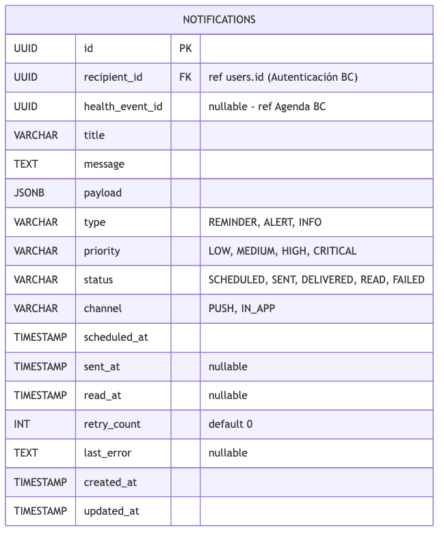

*Figura 6. Database Design Diagram del bounded context Notificaciones.*

---

### 2.6.3. Bounded Context: Diario de Seguimiento

#### 2.6.3.1. Domain Layer

| Componente | Tipo | Descripción |
|-----------|------|-------------|
| Diary | Aggregate Root | Gestiona la consistencia de las entradas del diario del paciente. |
| DiaryEntry | Entity | Representa una nota registrada por el paciente. |
| EntryContent | Value Object | Encapsula el contenido textual de la nota del diario. |
| EntryDate | Value Object | Representa la fecha de creación de la entrada. |
| DiaryRepository | Repository | Define el contrato de persistencia del diario de seguimiento. |
| DiaryEntryCreatedEvent | Domain Event | Se publica cuando se crea una nueva entrada en el diario. |
| DiaryEntryUpdatedEvent | Domain Event | Se publica cuando se actualiza una entrada existente. |
| DiaryEntryDeletedEvent | Domain Event | Se publica cuando se elimina una entrada del diario. |

#### 2.6.3.2. Interface Layer

| Componente | Tipo | Descripción |
|-----------|------|-------------|
| DiaryActivity | Activity | Punto de entrada principal del módulo diario. |
| DiaryEntryFragment | Fragment | Permite crear y visualizar entradas del diario. |
| DiaryDetailFragment | Fragment | Muestra el detalle de una entrada seleccionada. |
| DiaryViewModel | ViewModel | Gestiona el estado de la interfaz y la comunicación con Application Layer. |

#### 2.6.3.3. Application Layer

| Componente | Tipo | Descripción |
|-----------|------|-------------|
| CreateDiaryEntryCommand | Command | Solicita la creación de una nueva entrada. |
| UpdateDiaryEntryCommand | Command | Solicita la actualización de una entrada existente. |
| DeleteDiaryEntryCommand | Command | Solicita la eliminación de una entrada del diario. |
| CreateDiaryEntryHandler | Command Handler | Procesa la creación de entradas del diario. |
| UpdateDiaryEntryHandler | Command Handler | Procesa la actualización de entradas. |
| DeleteDiaryEntryHandler | Command Handler | Procesa la eliminación de entradas. |
| GetDiaryEntriesQuery | Query | Recupera todas las entradas del diario. |
| GetDiaryEntryByIdQuery | Query | Recupera una entrada específica por ID. |
| GetDiaryEntriesHandler | Query Handler | Procesa la consulta de todas las entradas. |
| GetDiaryEntryByIdHandler | Query Handler | Procesa la consulta por identificador. |
| DiaryEntryDTO | DTO | Transfiere información de entradas entre capas. |

#### 2.6.3.4. Infrastructure Layer

| Componente | Tipo | Descripción |
|-----------|------|-------------|
| DiaryRepositoryImpl | Repository Implementation | Implementa la persistencia del diario usando base de datos local. |
| AppDatabase | Database | Configuración de la base de datos del sistema. |
| DiaryDao | DAO | Acceso a datos de las entradas del diario. |
| DiaryEntity | Persistence Entity | Representa una entrada del diario en la base de datos. |
| DiaryMapper | Mapper | Convierte entre Domain, DTO y Persistence models. |

#### 2.6.3.5. Bounded Context Software Architecture Component Level Diagrams
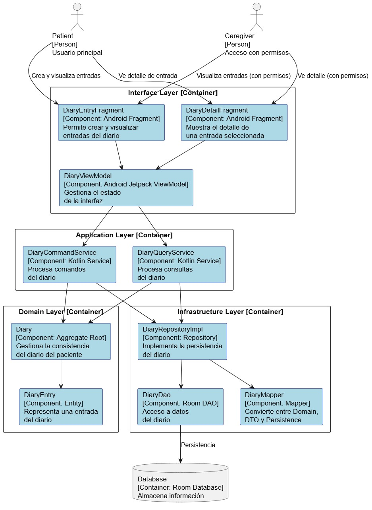

#### 2.6.3.6. Bounded Context Software Architecture Code Level Diagrams
##### 2.6.3.6.1. Bounded Context Domain Layer Class Diagrams
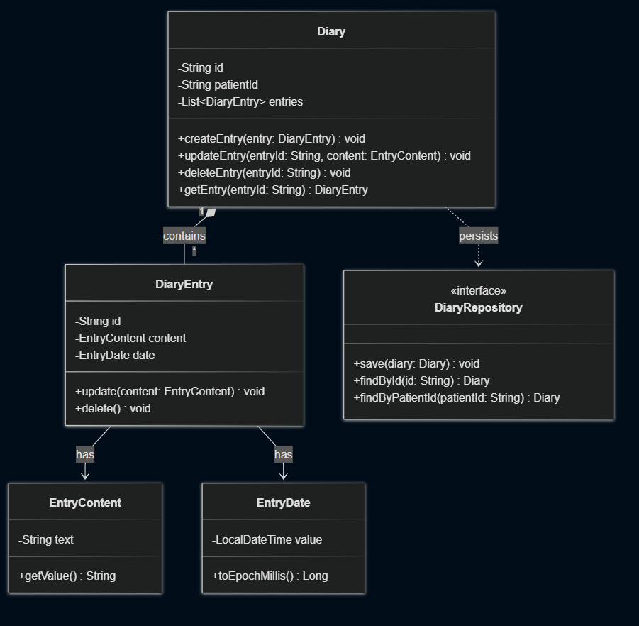

##### 2.6.3.6.2. Bounded Context Database Design Diagram
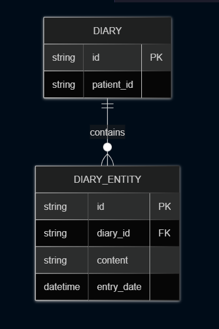
### 2.6.4. Bounded Context: Gestión de Consentimiento <a id="264-bounded-context"></a>

Este bounded context gestiona el ciclo de vida del acceso compartido entre un paciente y sus familiares. Cubre las historias de usuario **US14** (compartir perfil), **US15** (consultar perfil compartido) y **US16** (revocar acceso), correspondientes a la épica **EP04 – Gestión de Consentimiento**. Se integra con el bounded context de Notificaciones mediante eventos de dominio para informar cuando un acceso es creado, aceptado o revocado.

---

#### 2.6.4.1. Domain Layer <a id="2641-domain-layer"></a>

| Componente | Tipo | Descripción |
|---|---|---|
| `ProfileSharing` | Aggregate Root | Gestiona la consistencia transaccional del ciclo de compartir y revocar acceso al perfil del paciente. |
| `SharedAccess` | Entity | Representa un vínculo de acceso activo entre un paciente y un familiar autorizado. |
| `AccessRequest` | Entity | Representa una solicitud de acceso enviada por el paciente hacia un familiar. |
| `ShareToken` | Value Object | Encapsula el token de invitación generado para compartir el perfil. |
| `AccessStatus` | Value Object | Representa el estado del acceso (`PENDING`, `ACTIVE`, `REVOKED`, `EXPIRED`). |
| `AccessPermission` | Value Object | Define el nivel de permisos otorgados al familiar (`READ_ONLY`, `FULL_ACCESS`). |
| `ExpirationDate` | Value Object | Encapsula la fecha y hora de expiración del acceso compartido. |
| `ProfileSharingService` | Domain Service | Aplica las reglas de negocio para generar, validar y revocar accesos al perfil. |
| `AccessValidationService` | Domain Service | Valida que el familiar sea un usuario existente y que el token no haya expirado. |
| `SharedProfileRepository` | Repository | Define el contrato de persistencia del agregado `ProfileSharing`. |
| `ProfileSharedEvent` | Domain Event | Se publica cuando el paciente comparte su perfil con un familiar. |
| `AccessGrantedEvent` | Domain Event | Se publica cuando el familiar acepta el acceso y este queda activo. |
| `AccessRevokedEvent` | Domain Event | Se publica cuando el paciente revoca el acceso a un familiar. |
| `AccessExpiredEvent` | Domain Event | Se publica cuando el token de acceso expira sin ser aceptado. |

---

#### 2.6.4.2. Interface Layer <a id="2642-interface-layer"></a>

| Componente | Tipo | Descripción |
|---|---|---|
| `ShareProfileActivity` | Activity | Punto de entrada principal del módulo de compartir perfiles en la aplicación móvil. |
| `ShareProfileFragment` | Fragment | Permite al paciente ingresar los datos del familiar y generar el enlace de acceso (US14). |
| `SharedAccessListFragment` | Fragment | Muestra la lista de familiares con acceso activo al perfil del paciente (US16). |
| `FamilyPatientProfileFragment` | Fragment | Presenta al familiar la información del paciente cuyo perfil fue compartido (US15). |
| `ShareProfileViewModel` | ViewModel | Gestiona el estado del formulario de compartir y coordina Commands con la capa de aplicación. |
| `SharedAccessViewModel` | ViewModel | Gestiona el estado de la lista de accesos activos y las acciones de revocación. |

---

#### 2.6.4.3. Application Layer <a id="2643-application-layer"></a>

| Componente | Tipo | Descripción |
|---|---|---|
| `ShareProfileCommand` | Command | Solicita la creación de un acceso compartido y la generación del token de invitación. |
| `RevokeAccessCommand` | Command | Solicita la revocación del acceso de un familiar específico. |
| `AcceptSharedAccessCommand` | Command | Solicita la activación del acceso cuando el familiar acepta la invitación. |
| `ShareProfileHandler` | Command Handler | Procesa la generación del token y el registro del acceso pendiente. |
| `RevokeAccessHandler` | Command Handler | Procesa la revocación del acceso, actualizando el estado a `REVOKED`. |
| `AcceptSharedAccessHandler` | Command Handler | Procesa la activación del acceso, validando token y fecha de expiración. |
| `GetSharedAccessListQuery` | Query | Recupera la lista de familiares con acceso al perfil del paciente. |
| `GetPatientSharedProfileQuery` | Query | Recupera la información del perfil del paciente visible para el familiar autorizado. |
| `GetSharedAccessListHandler` | Query Handler | Procesa la consulta de accesos activos del paciente. |
| `GetPatientSharedProfileHandler` | Query Handler | Procesa la consulta del perfil compartido, validando permisos del familiar. |
| `SharedAccessDTO` | DTO | Transfiere información de accesos compartidos entre capas. |
| `PatientSharedProfileDTO` | DTO | Transfiere la información del perfil del paciente hacia la vista del familiar. |

---

#### 2.6.4.4. Infrastructure Layer <a id="2644-infrastructure-layer"></a>

| Componente | Tipo | Descripción |
|---|---|---|
| `SharedProfileRepositoryImpl` | Repository Implementation | Implementa la persistencia del agregado `ProfileSharing`. |
| `SharedAccessDao` | DAO | Proporciona operaciones de acceso a datos para los registros de acceso compartido. |
| `SharedAccessEntity` | Persistence Entity | Representa un acceso compartido dentro de la base de datos local. |
| `AccessRequestEntity` | Persistence Entity | Representa una solicitud de acceso pendiente en la base de datos. |
| `SharedAccessMapper` | Mapper | Convierte objetos entre Domain, DTO y Persistence. |
| `TokenGeneratorService` | External Utility | Genera tokens únicos y seguros para las invitaciones de acceso. |
| `NotificationBoundedContextAdapter` | Adapter | Publica eventos hacia el bounded context de Notificaciones cuando se genera o revoca un acceso. |

---

#### 2.6.4.5. Bounded Context Software Architecture Component Level Diagrams <a id="2645-component-level-diagrams"></a>

El Component Diagram del bounded context Gestión de Consentimiento presenta la organización interna del módulo en cuatro capas: Interface (REST Controllers), Application (Command y Query Services), Domain (servicios de dominio y repositorio) e Infrastructure (repositorio implementado, generador de tokens y adaptador hacia Notificaciones). Muestra las entradas desde la Mobile Application y la integración de salida hacia la base de datos y el bounded context de Notificaciones.

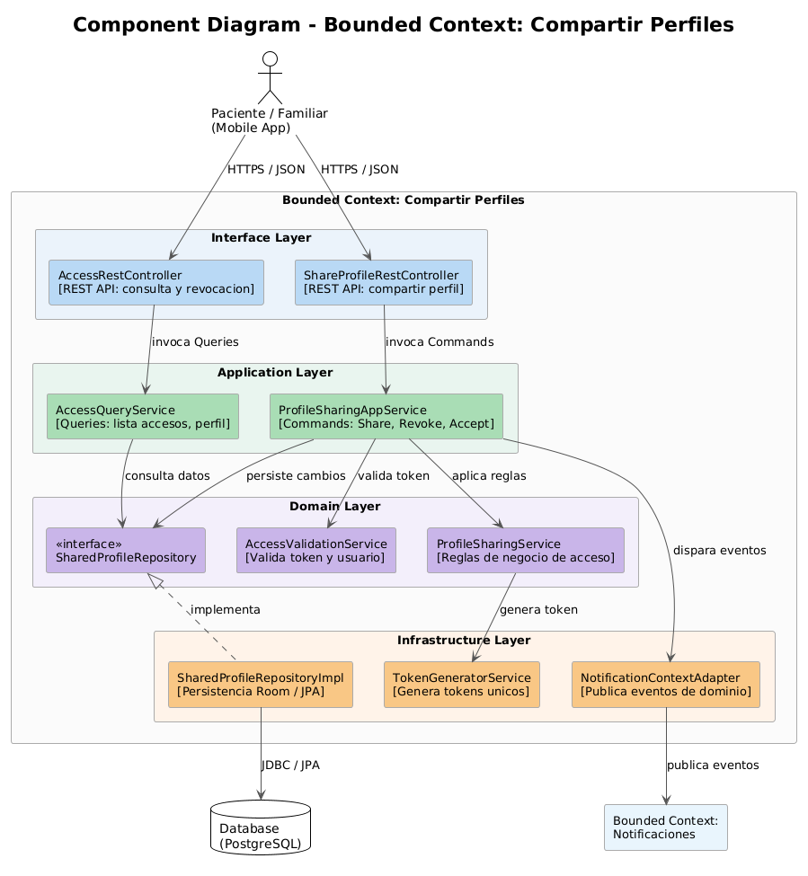

---

#### 2.6.4.6. Bounded Context Software Architecture Code Level Diagrams <a id="2646-code-level-diagrams"></a>

##### 2.6.4.6.1. Bounded Context Domain Layer Class Diagrams <a id="26461-domain-layer-class-diagrams"></a>

El diagrama de clases de la capa de dominio muestra el agregado `ProfileSharing` como raíz, sus entidades internas (`SharedAccess`, `AccessRequest`), los value objects (`ShareToken`, `ExpirationDate`, `AccessStatus`, `AccessPermission`), los domain services (`ProfileSharingService`, `AccessValidationService`), el contrato de repositorio y los domain events publicados durante el ciclo de compartir, aceptar, revocar y expirar accesos.

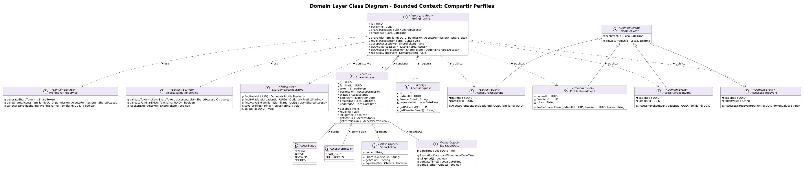

##### 2.6.4.6.2. Bounded Context Database Design Diagram <a id="26462-database-design-diagram"></a>

El diagrama de base de datos representa las tablas `profile_sharings`, `shared_accesses` y `access_requests`, junto con sus relaciones (1..N) y restricciones de integridad. El campo `token` en `shared_accesses` es único; `permission` y `status` se almacenan como strings con valores acotados equivalentes a los enums de dominio.

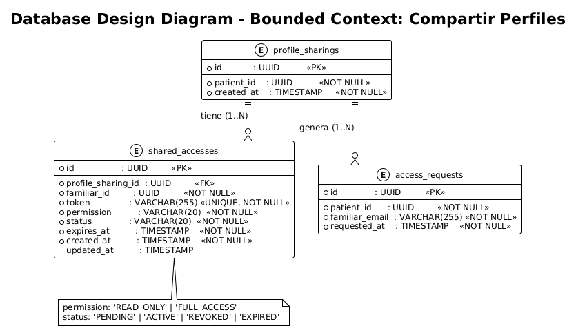

---

### 2.6.5. Bounded Context: Documentos

---

#### 2.6.5.1. Domain Layer

| Componente | Tipo | Descripción |
|-----------|------|-------------|
| MedicalDocument | Aggregate Root | Representa el conjunto de documentos médicos de un paciente y controla su consistencia. Es el punto de entrada para gestionar documentos. |
| DocumentItem | Entity | Representa un documento médico individual como receta, resultado de laboratorio o informe clínico. |
| DocumentType | Value Object | Define el tipo de documento médico (receta, laboratorio, informe, etc.). |
| DocumentMetadata | Value Object | Contiene información adicional del documento como fecha, descripción y origen. |
| DocumentRepository | Repository | Define el contrato de persistencia del agregado MedicalDocument. |
| DocumentUploadedEvent | Domain Event | Se publica cuando un documento médico es registrado en el sistema. |
| DocumentAccessedEvent | Domain Event | Se publica cuando un documento es consultado por un usuario autorizado. |

---

#### 2.6.5.2. Interface Layer

| Componente | Tipo | Descripción |
|-----------|------|-------------|
| DocumentsActivity | Activity | Pantalla principal del módulo de gestión de documentos médicos. |
| DocumentsFragment | Fragment | Muestra la lista de documentos del paciente. |
| DocumentDetailFragment | Fragment | Muestra el detalle de un documento médico seleccionado. |
| DocumentsViewModel | ViewModel | Gestiona el estado de la interfaz y coordina Commands y Queries del módulo. |

---

#### 2.6.5.3. Application Layer

| Componente | Tipo | Descripción |
|-----------|------|-------------|
| UploadDocumentCommand | Command | Solicita la carga de un nuevo documento médico. |
| DeleteDocumentCommand | Command | Solicita la eliminación de un documento médico. |
| UploadDocumentHandler | Command Handler | Procesa la carga de documentos médicos. |
| DeleteDocumentHandler | Command Handler | Procesa la eliminación de documentos médicos. |
| GetDocumentsQuery | Query | Recupera todos los documentos del paciente. |
| GetDocumentByIdQuery | Query | Recupera un documento específico por su identificador. |
| GetDocumentsHandler | Query Handler | Procesa la consulta de documentos médicos. |
| GetDocumentByIdHandler | Query Handler | Procesa la consulta de un documento específico. |
| MedicalDocumentDTO | DTO | Transfiere información de documentos entre capas del sistema. |

---

#### 2.6.5.4. Infrastructure Layer

| Componente | Tipo | Descripción |
|-----------|------|-------------|
| DocumentRepositoryImpl | Repository Implementation | Implementa la persistencia del agregado MedicalDocument usando base de datos local. |
| DocumentDao | DAO | Proporciona acceso a los datos de documentos médicos. |
| DocumentEntity | Persistence Entity | Representa un documento médico en la base de datos. |
| DocumentMapper | Mapper | Convierte entre modelos de Domain, DTO y Persistence. |

#### 2.6.5.5. Bounded Context Software Architecture Component Level Diagrams 


#### 2.6.4.6. Bounded Context Software Architecture Code Level Diagrams <a id="2646-code-level-diagrams"></a>

##### 2.6.4.6.1. Bounded Context Domain Layer Class Diagrams <a id="26461-domain-layer-class-diagrams"></a>

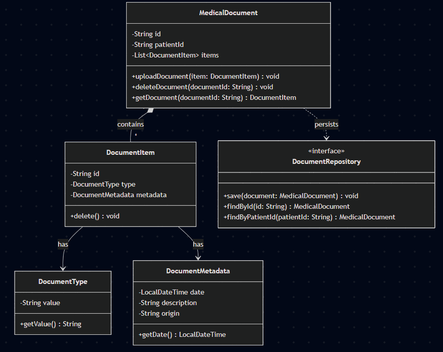


##### 2.6.4.6.2. Bounded Context Database Design Diagram <a id="26462-database-design-diagram"></a>

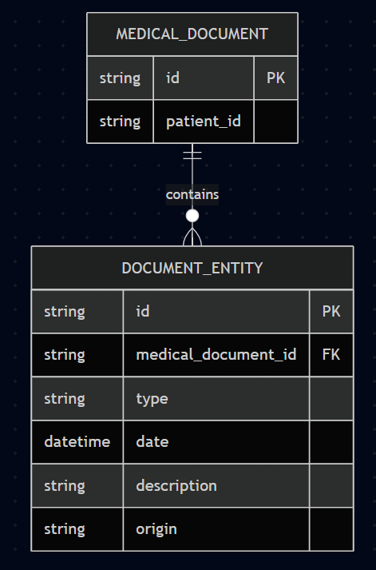

<div style="page-break-before: always;"></div>

# Capítulo III: Solution UI/UX Design

## 3.1. Product design <a id="31-product-design"></a>

### 3.1.1. Style Guidelines <a id="311-style-guidelines"></a>

#### 3.1.1.1. General Style Guidelines <a id="3111-general-style-guidelines"></a>

Las guías de estilo de CareConnect se aplican de forma consistente tanto al Landing Page como a la aplicación móvil. Definen identidad visual, tono de marca, paleta de colores, tipografía, sistema de espaciado, iconografía y componentes UI. La implementación móvil sigue Material 3 y los tokens están declarados en `presentation/theme/Color.kt` y `presentation/theme/Type.kt` del repositorio `CareStacks/FrontEnd`.

**Identidad y tono de marca**

CareConnect es una marca pensada para el sector salud y bienestar geriátrico. El tono es cercano, sereno y responsable. La voz transmite confianza sin tecnicismos innecesarios y prioriza claridad sobre estética. Los mensajes evitan jerga médica, alarmismo y diminutivos infantilizantes.

**Paleta de colores**

La paleta se basa en tres colores principales (Primary, Secondary, Tertiary) más un Neutral oscuro y una serie de superficies cálidas. Se complementa con variantes por estado para badges (pendiente, confirmado, omitido, leído, urgente, médico).

| Token | Hex | Uso |
|---|---|---|
| `Primary` | `#6C63A6` | Color principal de marca, botones primarios, indicadores activos. |
| `PrimaryLight` | `#E6E1F6` | Fondos suaves, chips, estados hover. |
| `PrimaryDark` | `#51498A` | Énfasis sobre Primary, headers de cards seleccionados. |
| `Secondary` | `#B7D7C2` | Acciones secundarias, fondos de éxito leve. |
| `Tertiary` | `#F2A65A` | Acentos, etiquetas de prioridad media. |
| `Neutral` | `#2F3440` | Texto sobre superficies claras y elementos contundentes. |
| `Background` | `#FAF7F2` | Fondo general de la aplicación. |
| `BackgroundSoft` | `#F7F6FC` | Fondo de secciones diferenciadas. |
| `Surface` | `#FFFFFF` | Cards, dialogs y superficies elevadas. |
| `TextPrimary` | `#111827` | Texto principal. |
| `TextSecondary` | `#5F6170` | Texto de apoyo. |
| `TextMuted` | `#8F8D99` | Texto secundario de menor jerarquía y placeholders. |
| `Border` | `#E1DDE8` | Bordes de cards e inputs. |
| `Disabled` | `#D8D6E0` | Componentes deshabilitados. |

**Variantes por estado y colores de feedback:**

| Token | Background | Text | Uso |
|---|---|---|---|
| Status Pending | `#E8EAF4` | `#5F6270` | Evento pendiente de confirmación. |
| Status Confirmed | `#C8EAD4` | `#4F7D5C` | Evento confirmado, dosis administrada. |
| Status Missed | `#FFD2D2` | `#C01818` | Evento omitido o vencido. |
| Status Read | `#E6D9FF` | `#5C4E9D` | Notificación leída. |
| Status Urgent | `#FFD2D2` | `#C01818` | Alerta urgente al cuidador. |
| Status Medical | `#E6D9FF` | `#5C4E9D` | Información clínica destacada. |

**Tipografía**

La aplicación móvil utiliza la familia `FontFamily.SansSerif` de Android (mapeada al sistema). La escala tipográfica está alineada con Material 3.

| Token Material 3 | Peso | Tamaño / Line-height | Uso |
|---|---|---|---|
| `headlineLarge` | Bold | 30 / 38 sp | Títulos de pantalla principales. |
| `headlineMedium` | Bold | 26 / 34 sp | Sub-cabeceras importantes. |
| `titleLarge` | Bold | 22 / 30 sp | Títulos de cards y secciones. |
| `titleMedium` | SemiBold | 18 / 26 sp | Encabezados de listas. |
| `bodyLarge` | Normal | 16 / 24 sp | Texto principal. |
| `bodyMedium` | Normal | 14 / 22 sp | Texto secundario. |
| `bodySmall` | Normal | 12 / 18 sp | Metadatos y leyendas. |
| `labelLarge` | Bold | 16 / 22 sp | Botones primarios. |
| `labelMedium` | SemiBold | 13 / 18 sp | Chips y badges. |

**Espaciado y geometría**

- Escala base: múltiplos de **4 dp** (4, 8, 12, 16, 20, 24, 32, 40, 56).
- Padding por defecto de pantalla: **16 dp** lateral.
- Radio de esquina (`shape`): cards y botones a **16 dp**; chips a **12 dp**; inputs a **12 dp**.
- Elevación: cards a **2 dp**, dialogs a **6 dp**.

**Iconografía**

- Material Symbols (outlined) como librería de iconos por defecto.
- Tamaño estándar 24 dp; en `AppIcon` se permite escalar hasta 32 dp para acciones primarias.
- Color por defecto: `IconMuted` (`#7C788A`); sobre fondos accionables, `Primary`.

**Componentes UI implementados**

Los componentes reutilizables se encuentran en `presentation/components/` e incluyen:

- `AppTopBar`, `BottomBar` — navegación.
- `AppTextField`, `AppPasswordField` — entradas con validación.
- `FilledButton`, `SecondaryFilledButton`, `OutlinedActionButton`, `TextActionButton` — variantes de botón.
- `AppCard` — contenedor base de cards.
- `StatusBadge` — chip de estado (pendiente, confirmado, omitido, leído, urgente, médico).
- `CareScreenHeader` — encabezado consistente de pantallas internas.
- `AppIcon` — wrapper sobre `Icon` con sizing y tinting predefinidos.

**Accesibilidad**

- Contraste mínimo AA (4.5:1) sobre todas las combinaciones de texto sobre superficie.
- Tamaño mínimo de texto principal: 14 sp; tamaño de táctil mínimo: 48 dp.
- Estados de foco visibles en componentes interactivos.
- Etiquetas semánticas en todos los inputs (`contentDescription`) para soporte de TalkBack.

---

### 3.1.2. Information Architecture <a id="312-information-architecture"></a>

La arquitectura de información de CareConnect se diseñó pensando en dos perfiles claros (paciente geriátrico y cuidador) y en flujos cortos para tareas con alta frecuencia. La misma estructura se aplica al Landing Page (sitio público) y a la aplicación móvil (producto), con adaptaciones específicas según el medio.

#### 3.1.2.1. Organization Systems <a id="3121-organization-systems"></a>

Se aplican tres esquemas complementarios de organización de contenido:

| Esquema | Aplicación |
|---|---|
| **Jerárquico** | El Landing Page se organiza de lo más amplio (problemática, propuesta de valor) a lo más específico (features, integrantes, CTA). |
| **Por rol** | La aplicación móvil presenta vistas diferenciadas para `Paciente` y `Cuidador` desde el login, manteniendo el mismo backend. |
| **Por tarea** | Dentro de cada rol, el contenido se agrupa por tareas frecuentes: Hoy (agenda del día), Diario, Documentos, Compartir, Notificaciones, Perfil. |

**Sitemap del Landing Page (`carestacks` en Vercel):**

```
/
├── #hero — Propuesta de valor y CTA "Descargar App"
├── #problema — Datos de envejecimiento y descoordinación
├── #solucion — Funcionalidades de CareConnect
├── #segmentos — Cuidadores / Pacientes geriátricos
├── #equipo — Integrantes de CareStacks
└── #contacto — Formulario y redes
```

**Mapa de pantallas de la Mobile App (estructura por rol):**

```
OnBoarding
├── Welcome → Login → Register
└── Sesión iniciada
    ├── Rol: Paciente
    │   ├── Inicio (Hoy)
    │   ├── Agenda
    │   ├── Diario (lista) → Nueva Nota
    │   ├── Documentos → Subir Documento
    │   ├── Notificaciones
    │   ├── Compartir Perfil (Gestión de Consentimiento)
    │   └── Perfil
    └── Rol: Cuidador
        ├── Inicio (Hoy del paciente)
        ├── Agenda del paciente
        ├── Diario compartido
        ├── Documentos compartidos
        ├── Notificaciones / Alertas
        ├── Perfil compartido del paciente
        └── Perfil
```

#### 3.1.2.2. Labelling Systems <a id="3122-labelling-systems"></a>

El sistema de etiquetado prioriza palabras del Ubiquitous Language (§2.3.5) sobre términos técnicos. Se evitan tecnicismos clínicos y se usan verbos cortos en imperativo para acciones.

| Categoría | Convención | Ejemplos |
|---|---|---|
| **Tabs de navegación inferior** | Sustantivos simples, una sola palabra | "Hoy", "Agenda", "Diario", "Documentos", "Perfil" |
| **Botones de acción primaria** | Verbo en imperativo + objeto | "Confirmar dosis", "Subir documento", "Compartir perfil" |
| **Estados** | Adjetivo o sustantivo corto en badge | "Pendiente", "Confirmado", "Omitido", "Leído", "Urgente" |
| **Mensajes de error** | Frase breve orientada al usuario, no al sistema | "El correo no tiene un formato válido", no "Invalid email regex" |
| **Confirmaciones destructivas** | Pregunta directa con verbo destacado | "¿Revocar acceso a María?" |
| **Empty states** | Frase + acción sugerida | "No tienes notas todavía. Toca + para escribir tu primera nota." |

#### 3.1.2.3. SEO Tags and Meta Tags <a id="3123-seo-tags-and-meta-tags"></a>

El Landing Page utiliza meta tags estándar y Open Graph para garantizar visibilidad en buscadores y previews enriquecidos al compartir el enlace.

```html
<!-- Primary -->
<title>CareConnect — Cuidado geriátrico organizado, en un solo lugar</title>
<meta name="description" content="CareConnect es una aplicación móvil para coordinar el cuidado geriátrico: medicación, citas, diario y documentos compartidos entre paciente y cuidador.">
<meta name="keywords" content="cuidado geriatrico, adulto mayor, medicacion, cuidadores, salud, app movil, recordatorios, perú">
<meta name="author" content="CareStacks">
<meta name="robots" content="index, follow">

<!-- Open Graph -->
<meta property="og:type" content="website">
<meta property="og:title" content="CareConnect — Cuidado geriátrico organizado">
<meta property="og:description" content="Coordina medicación, citas, diario y documentos del paciente geriátrico.">
<meta property="og:image" content="https://landing-page-lovat-ten.vercel.app/og-cover.png">
<meta property="og:url" content="https://landing-page-lovat-ten.vercel.app">

<!-- Twitter -->
<meta name="twitter:card" content="summary_large_image">
<meta name="twitter:title" content="CareConnect — Cuidado geriátrico organizado">
<meta name="twitter:description" content="Coordina medicación, citas, diario y documentos del paciente geriátrico.">

<!-- Viewport y mobile -->
<meta name="viewport" content="width=device-width, initial-scale=1.0">
<meta name="theme-color" content="#6C63A6">
```

#### 3.1.2.4. Searching Systems <a id="3124-searching-systems"></a>

El alcance del MVP no incluye un buscador global, pero se definen los siguientes mecanismos de localización de contenido alineados con las tareas más frecuentes:

| Pantalla | Mecanismo | Comportamiento |
|---|---|---|
| **Agenda** | Filtro por fecha | Selector de día con vista compacta y vista semanal. |
| **Documentos** | Filtro por tipo | Chips: "Todos", "Recetas", "Resultados", "Informes". |
| **Diario** | Orden cronológico inverso | Notas más recientes arriba; scroll infinito con paginación. |
| **Notificaciones** | Filtro por estado | Tabs "No leídas" / "Todas"; acción "Marcar todas como leídas". |
| **Compartir Perfil** | Lista de accesos activos | Ordenada por fecha de otorgamiento; acción rápida "Revocar". |

#### 3.1.2.5. Navigation Systems <a id="3125-navigation-systems"></a>

La aplicación móvil usa tres patrones de navegación combinados implementados con Jetpack Navigation Compose:

1. **Navegación raíz (Root NavHost)** — gestiona el flujo `OnBoarding → Login/Register → Main`.
2. **Navegación principal por pestañas (Bottom Navigation)** — accesos persistentes: Hoy · Agenda · Diario · Documentos · Perfil. La pestaña Notificaciones se accede desde el `AppTopBar` para no saturar la barra inferior.
3. **Navegación interna de cada tab** — flujos hijos como `Diario → Nueva Nota` o `Documentos → Subir Documento`, con back stack independiente por tab.

**Reglas:**
- Solo cinco entradas en la barra inferior (siguiendo Material 3).
- Botón "Atrás" físico/sistema respeta el back stack del tab activo.
- Acciones rápidas se exponen mediante FAB (`Floating Action Button`) en pantallas de listas (Diario, Documentos).
- `AppTopBar` muestra título de pantalla, ícono de notificaciones y avatar/menú.

En el Landing Page, la navegación es horizontal en desktop (header sticky con anclas a secciones) y colapsa en un menú hamburguesa en breakpoint < 768 px.

---

### 3.1.3. Landing Page UI Design <a id="313-landing-page-ui-design"></a>

El Landing Page es el primer punto de contacto público con CareConnect. Su objetivo es comunicar la propuesta de valor, mostrar a los segmentos objetivo y conducir a la descarga de la aplicación. Está desplegado en Vercel en `https://landing-page-lovat-ten.vercel.app`.

#### 3.1.3.1. Landing Page Wireframe <a id="3131-landing-page-wireframe"></a>

El wireframe describe la estructura, jerarquía y bloques de contenido del Landing Page en su versión responsive (desktop ≥ 1280 px, tablet 768 px – 1279 px, mobile < 768 px). Se enfoca en estructura, no en estilos.

**Bloques principales (orden de aparición vertical):**

| # | Bloque | Contenido | Comportamiento responsive |
|---|---|---|---|
| 1 | Header sticky | Logo CareConnect, enlaces ancla (Problema, Solución, Equipo) y CTA "Descargar" | En mobile colapsa a hamburguesa. |
| 2 | Hero | Título, subtítulo, CTA primario "Descargar App", CTA secundario "Conocer más", imagen de la app | Imagen pasa debajo del texto en mobile. |
| 3 | Problemática | Tres tarjetas con cifras de envejecimiento, no adherencia y descoordinación | 3 columnas en desktop, 1 columna en mobile. |
| 4 | Solución | Lista de funcionalidades (Agenda, Notificaciones, Diario, Documentos, Compartir, Autenticación) con ícono + descripción corta | Grid 3×2 en desktop, 1 columna en mobile. |
| 5 | Segmentos objetivo | Dos cards (Cuidadores / Pacientes) con foto referencial, descripción y beneficio principal | 2 columnas en desktop, 1 columna en mobile. |
| 6 | Equipo | Cinco cards de integrantes con foto, nombre, rol y enlaces a GitHub/LinkedIn | 5 columnas en desktop, 2 en tablet, 1 en mobile. |
| 7 | CTA final | Banner con "Empieza a coordinar mejor el cuidado" + botón a descarga | Banner full-width siempre. |
| 8 | Footer | Logo, enlaces a repos públicos, correo de contacto, año y derechos | 3 columnas en desktop, apilado en mobile. |

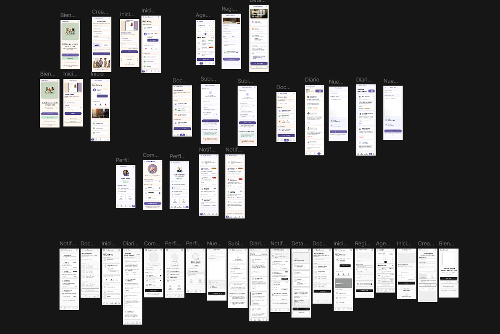

*Figura 23. Wireframe del Landing Page de CareConnect — versión desktop.*

#### 3.1.3.2. Landing Page Mock-up <a id="3132-landing-page-mock-up"></a>

El mockup aplica al wireframe la guía de estilo descrita en §3.1.1.1: paleta morada CareConnect (`#6C63A6` como Primary), tipografía Sans-Serif con la escala Material 3, espaciado en múltiplos de 4 px (16 / 24 / 40 / 56 px), botones a 16 px de radio y cards con sombra suave sobre fondo `#FAF7F2`.

**Decisiones de diseño visual:**
- **Hero**: ilustración o screenshot de la app a la derecha, texto a la izquierda, gradiente sutil de `PrimaryLight` → `Background`.
- **Tarjetas de problemática**: fondo `Surface`, borde `Border`, número grande en `Primary`, texto descriptivo en `TextSecondary`.
- **Solución**: cada feature usa un ícono Material Symbols con tinte `Primary` sobre fondo `PrimaryLight` redondeado.
- **Segmentos**: cards más anchas con foto a la izquierda y texto a la derecha; CTA secundaria interna a "Ver historia" (opcional).
- **Equipo**: foto circular, nombre en `titleMedium`, rol en `bodySmall` con `TextSecondary`, iconos sociales pequeños en `IconMuted`.
- **CTA final**: banner full-bleed con fondo `Primary` y texto blanco; botón de fondo `Surface` con texto `Primary`.

**URL de producción:** `https://landing-page-lovat-ten.vercel.app`

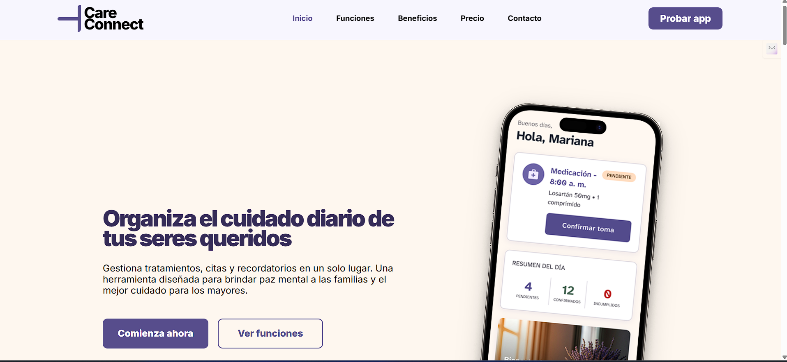

*Figura 24. Mockup del Landing Page de CareConnect — hero y sección problemática.*

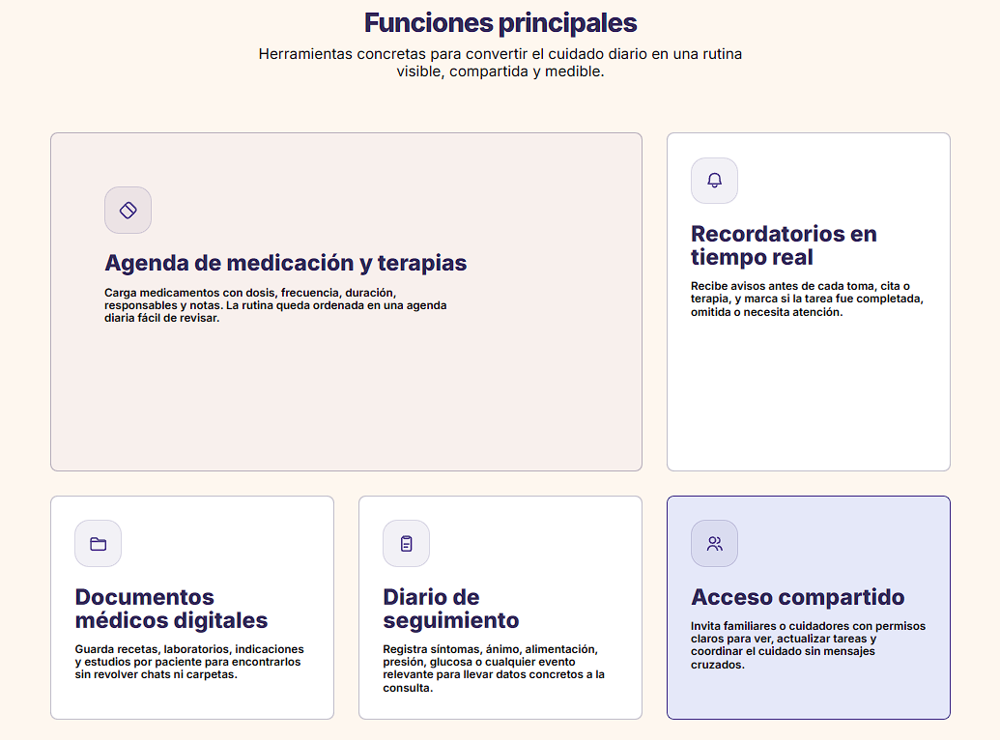

*Figura 25. Mockup del Landing Page de CareConnect — solución, segmentos y equipo.*

### 3.1.4. Mobile Applications UX/UI Design <a id="314-mobile-applications-uxui-design"></a>
#### 3.1.4.1. Mobile Applications Wireframes <a id="3141-mobile-applications-wireframes"></a>

Con los bounded context que establecimos y los user stories, realizamos los siguientes wireframes para las pantallas de nuestra aplicación.


IAM: Pantallas para la verificación e ingreso del usuario

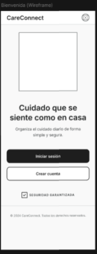

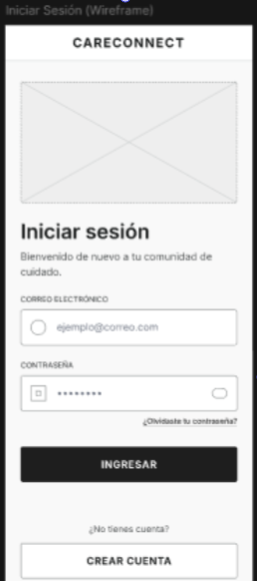

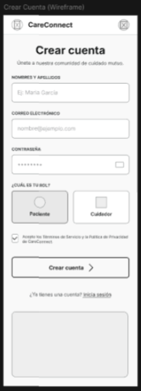

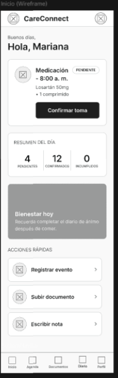

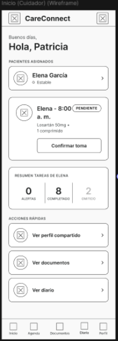

Agenda: Pantallas para el calendario de eventos que el paciente debe seguir

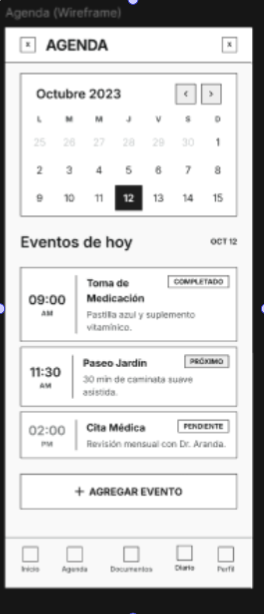

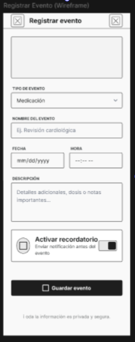

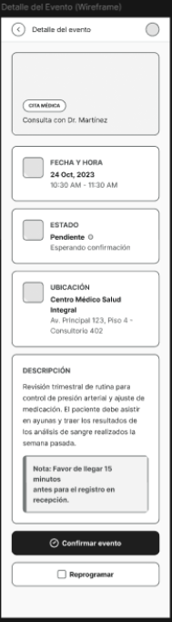

Notificaciones: Pantallas para los diferentes mensajes que recibe el cuidador y paciente

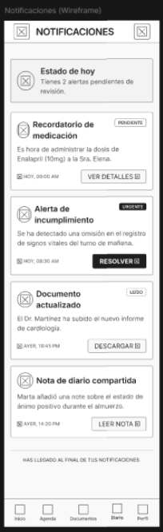


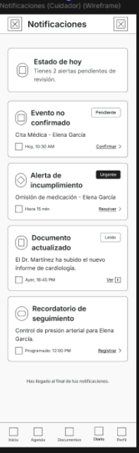


Gestión de Consentimiento: Pantallas para darle permisos para que el paciente le de permiso al cuidado

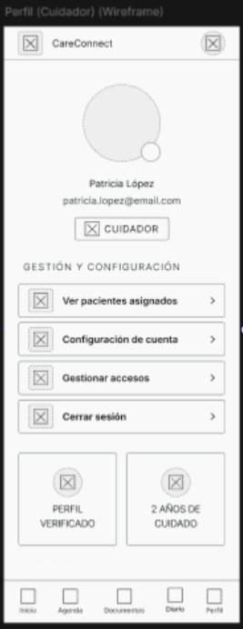

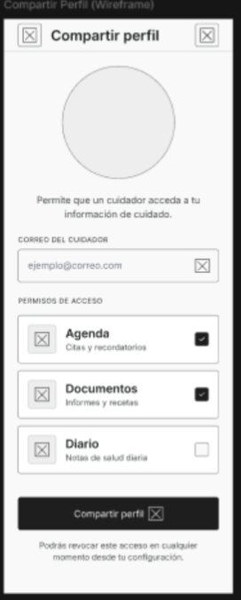


Documentos: Pantallas para el ingreso de documentos para el historial medico del paciente

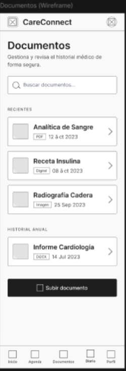

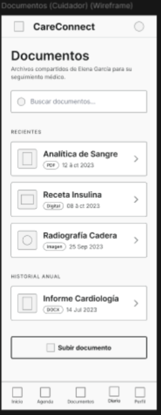

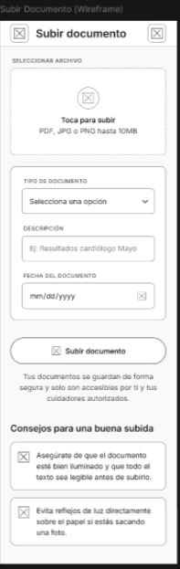

Diario: Pantallas para visualizar las notas del progreso y mejora del paciente

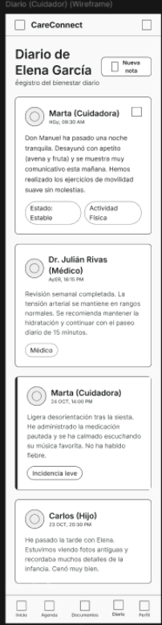

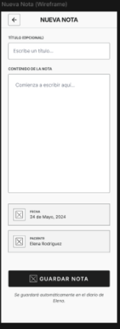

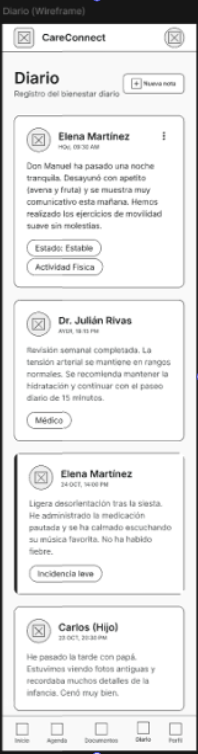

#### 3.1.4.2. Mobile Applications Wireflow Diagrams <a id="3142-mobile-applications-wireflow-diagrams"></a>

Task Flow 1: Autenticación y acceso por rol

Objetivo: Registrar una cuenta nueva y validar el ingreso a la plataforma según el rol del usuario (Paciente o Cuidador).

Pasos del Task Flow:

1. El usuario abre la app y visualiza la pantalla de bienvenida con las opciones de inicio.
2. Selecciona "Crear cuenta" e ingresa nombre, correo electrónico y contraseña.
3. Elige su rol: Paciente o Cuidador, y acepta los términos de servicio.
4. El sistema valida los datos; si el correo ya existe muestra el error correspondiente.
5. El usuario inicia sesión; el sistema valida el rol y redirige al home correspondiente.
6. Intentar acceder a secciones sin permiso bloquea el acceso con mensaje de restricción.

User Goal 1: Como usuario, quiero crear mi cuenta para acceder a la plataforma. 

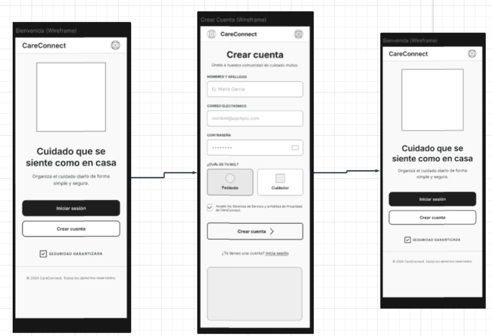

User Goal 2: Como usuario, quiero iniciar sesión y ver la vista según mi rol.

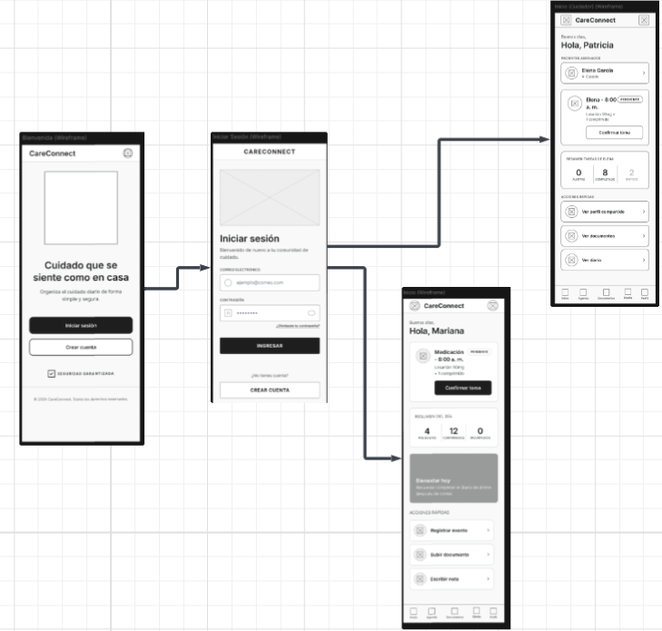

Task Flow 2: Gestión de agenda

Objetivo: Registrar y confirmar eventos de salud (medicaciones y citas médicas) en el calendario personal.

Pasos del Task Flow:

1. El paciente o cuidador accede a la sección "Agenda" desde el menú inferior.
2. Visualiza el calendario mensual con los eventos ya registrados.
3. Toca "+ Agregar evento" y completa tipo, nombre, fecha, hora y descripción.
4. Si omite campos obligatorios, el sistema muestra un mensaje de error de validación.
5. El evento se guarda y aparece en el calendario en la fecha correspondiente.
6. El paciente accede al detalle y confirma el evento; el estado cambia a "Confirmado".
7. Si necesita modificar la fecha, reprograma; el sistema verifica conflictos de horario.

User Goal 3: Como paciente o cuidador, quiero registrar un evento de salud en el calendario.

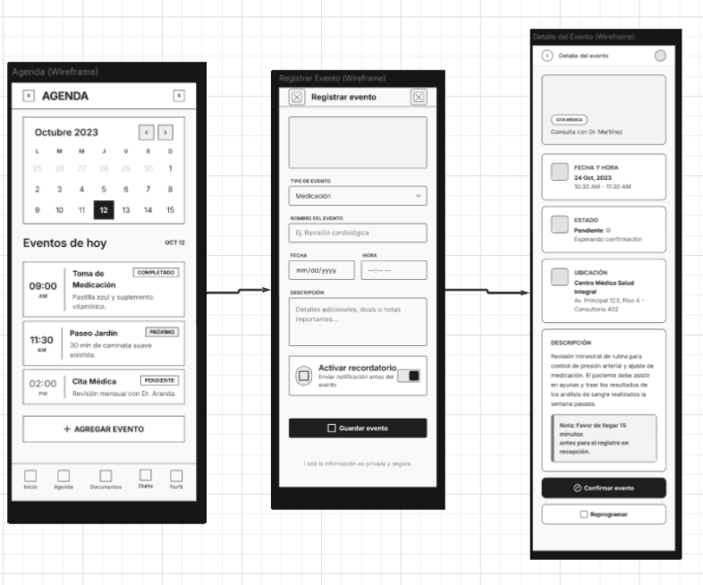

User Goal 4: Como paciente, quiero confirmar o reprogramar un evento de salud.

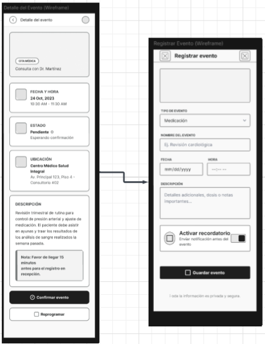


Task Flow 3: Notificaciones y alertas


Objetivo: Recibir recordatorios automáticos de eventos programados, alertas de incumplimiento para cuidadores y gestionar el historial de notificaciones.

Pasos del Task Flow:

1. El sistema detecta que un evento está próximo y envía un recordatorio al paciente.
2. El paciente recibe la notificación con nombre, hora y tipo del evento.
3. Si el evento no es confirmado en el tiempo límite, el sistema genera una alerta urgente.
4. El cuidador con permisos recibe la alerta de incumplimiento y puede resolver.
5. Paciente y cuidador pueden acceder al historial completo, ordenado por fecha o prioridad.

User Goal 5: Como paciente, quiero recibir recordatorios y visualizar mis notificaciones.

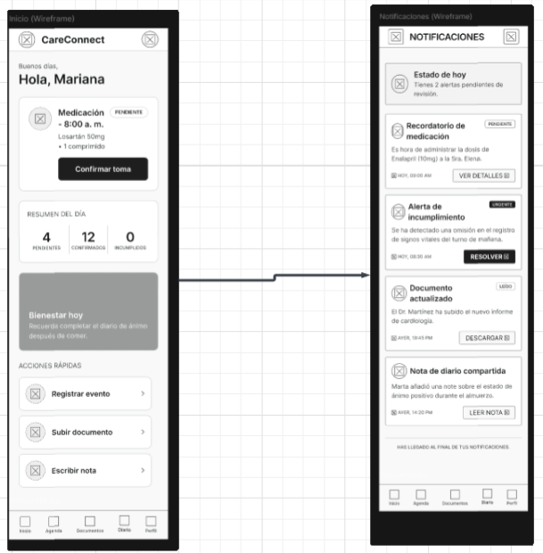


User Goal 6: Como cuidador, quiero recibir y gestionar alertas de incumplimiento del paciente.

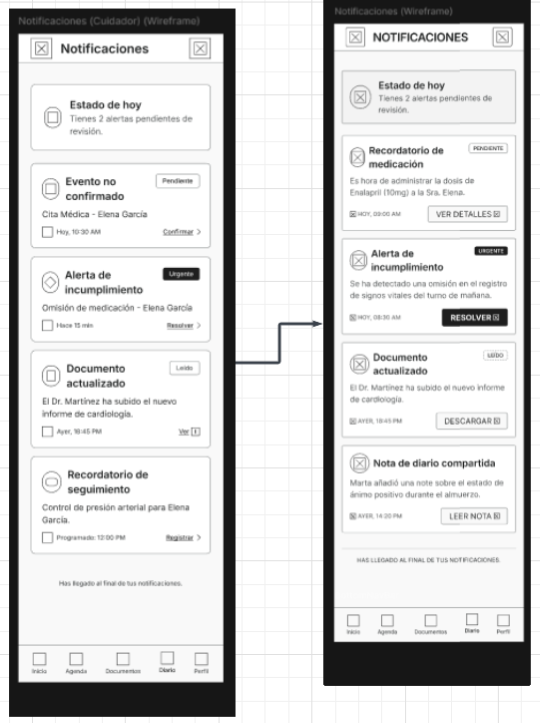

Task Flow 4: Gestión de documentos médicos

Objetivo: Subir, consultar y compartir documentos médicos de forma segura entre paciente y cuidador autorizado.

Pasos del Task Flow:

1. El paciente o cuidador accede a la sección "Documentos" desde el menú.
2. Visualiza la lista de documentos almacenados (analíticas, recetas, informes).
3. Toca "Subir documento", selecciona el archivo (PDF, JPG, PNG hasta 10MB) y completa el tipo y descripción.
4. Si el formato o tamaño no es válido, el sistema muestra un mensaje de error.
5. El documento se almacena y aparece en la lista con fecha y tipo.
6. El cuidador con acceso autorizado consulta los documentos del paciente asignado.
7. Si no tiene permisos, el acceso es bloqueado con mensaje de restricción.

User Goal 7: Como paciente o cuidador, quiero subir y consultar documentos médicos. 

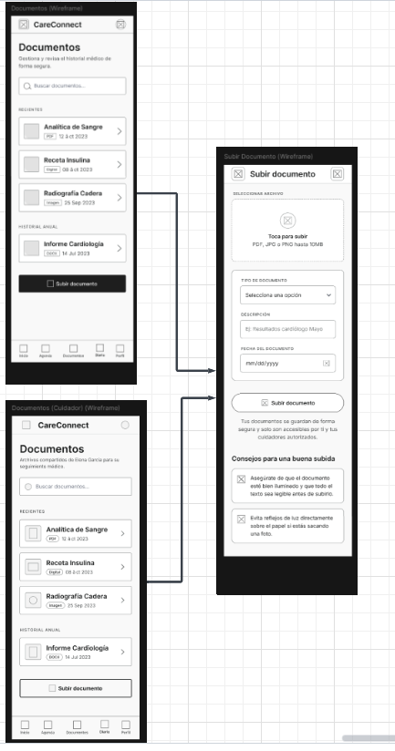

User Goal 8: Como cuidador, quiero acceder a los documentos compartidos del paciente.

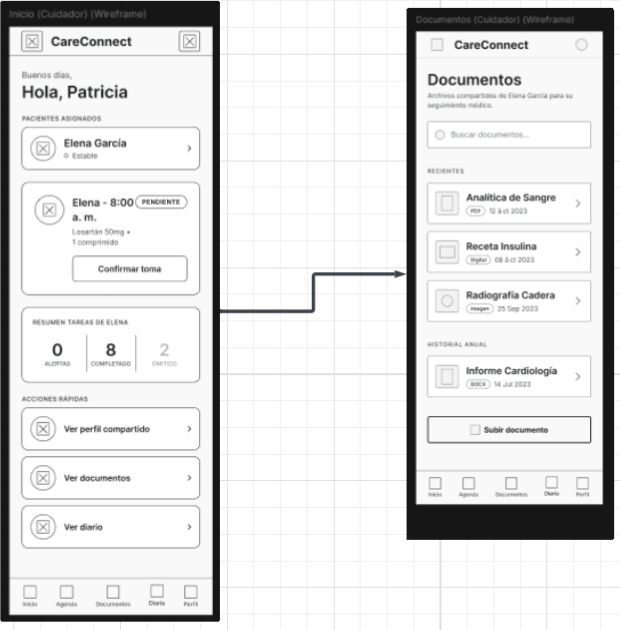

Task Flow 5: Diario de seguimiento

Objetivo: Registrar notas de bienestar diario y permitir al cuidador autorizado consultar el historial compartido del paciente.

Pasos del Task Flow:

1. El paciente o cuidador accede a la sección "Diario" desde el menú.
2. Visualiza el historial de notas registradas, ordenadas por fecha y autor.
3. Toca "+ Nueva nota" e ingresa un título opcional y el contenido de la nota.
4. Si intenta guardar una nota vacía, el sistema muestra un mensaje de error.
5. La nota se guarda y aparece en el diario con fecha, autor y etiquetas de estado.
6. El cuidador con acceso autorizado puede consultar el diario compartido del paciente.


User Goal 9: Como paciente o cuidador, quiero escribir y ver notas en el diario. 

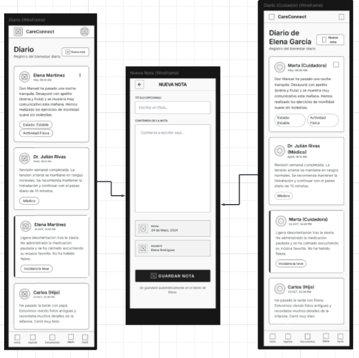

Task Flow 6: Acceso compartido y gestión de perfil

Objetivo: El paciente comparte su perfil con un cuidador, define los permisos de acceso y puede revocarlos en cualquier momento.

Pasos del Task Flow:

1. El paciente accede a "Perfil" y selecciona la opción "Compartir perfil".
2. Ingresa el correo del cuidador y selecciona los permisos: Agenda, Documentos, Diario.
3. Si el correo no pertenece a un usuario registrado, el sistema muestra "usuario no existe".
4. El cuidador autorizado puede consultar el perfil compartido del paciente.
5. Si el cuidador no tiene permisos válidos, el acceso es bloqueado con mensaje de restricción.
6. El paciente puede revocar el acceso desde "Gestionar accesos"; el cuidador pierde los privilegios inmediatamente.

User Goal 10: Como paciente, quiero compartir mi perfil con un cuidador y definir permisos.

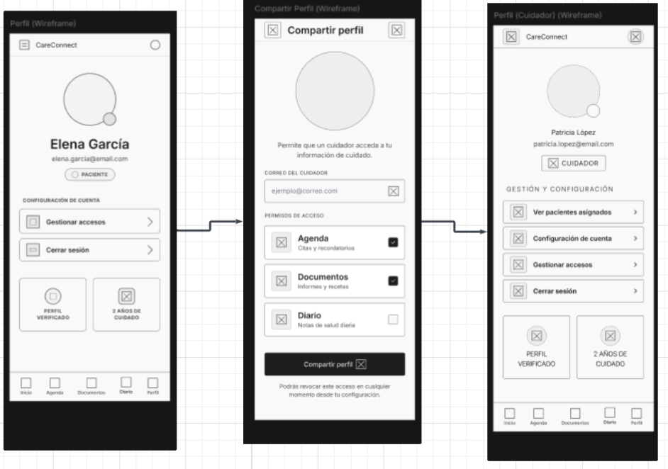

#### 3.1.4.3. Mobile Applications Mock-ups <a id="3143-mobile-applications-mock-ups"></a>
Una vez terminado los wireframes, realizamos los mockups que son más cercanos a la visión final de las pantallas que vamos a implementar

IAM: Pantallas para la verificación e ingreso del usuario
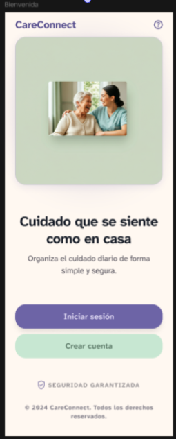

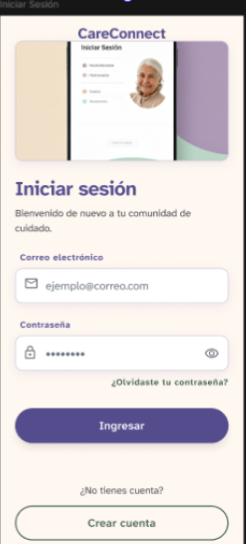

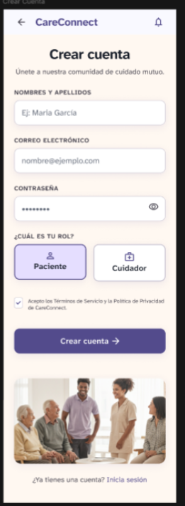

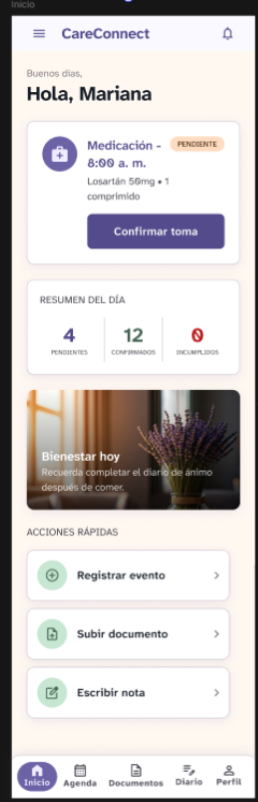

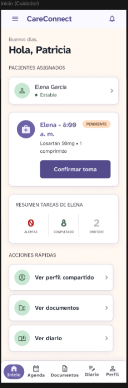

Agenda: Pantallas para el calendario de eventos que el paciente debe seguir

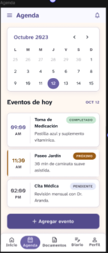

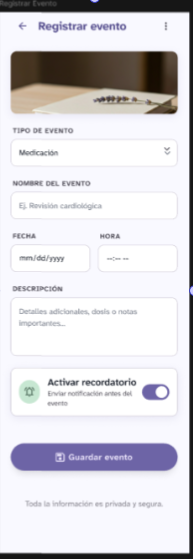

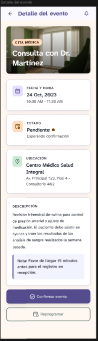

Notificaciones: Pantallas para los diferentes mensajes que recibe el cuidador y paciente

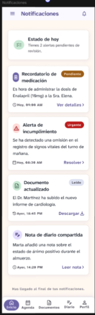

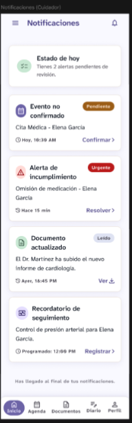

Gestión de Consentimiento: Pantallas para darle permisos para que el paciente le de permiso al cuidado

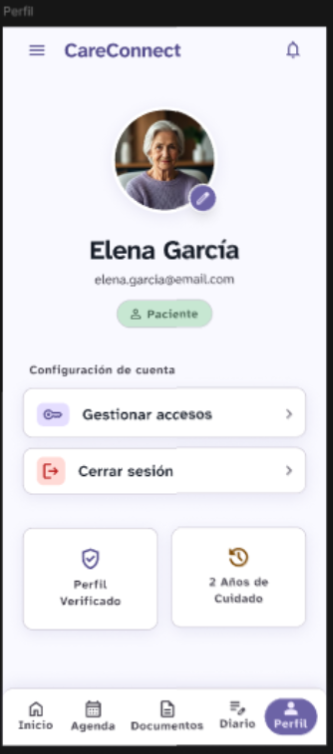

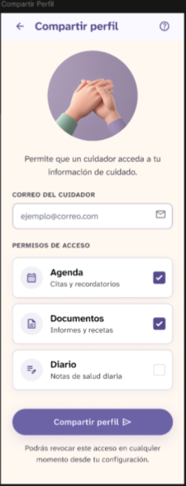

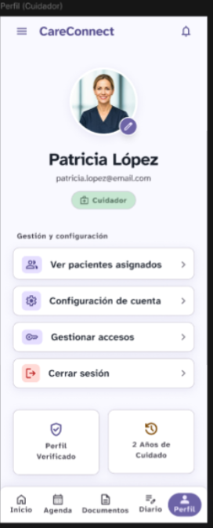


Documentos: Pantallas para el ingreso de documentos para el historial medico del paciente

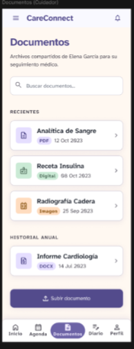

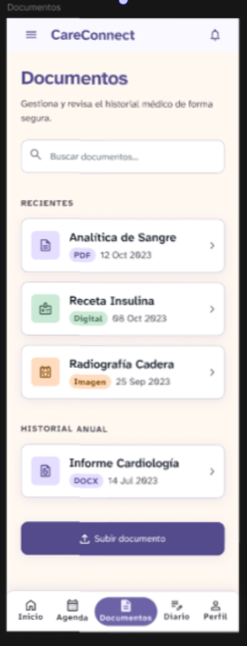

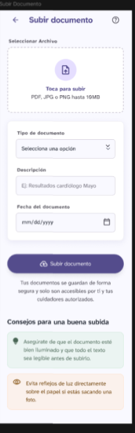


Diario: Pantallas para visualizar las notas del progreso y mejora del paciente

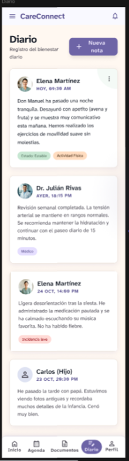

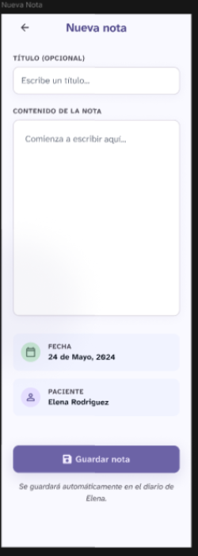

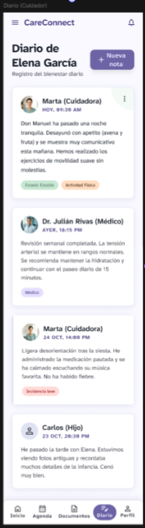

#### 3.1.4.4. Mobile Applications User Flow Diagrams <a id="3144-mobile-applications-user-flow-diagrams"></a>

User Flow 1:

Relacionado con el User Goal 1: Como usuario, quiero crear mi cuenta para acceder a la plataforma. 

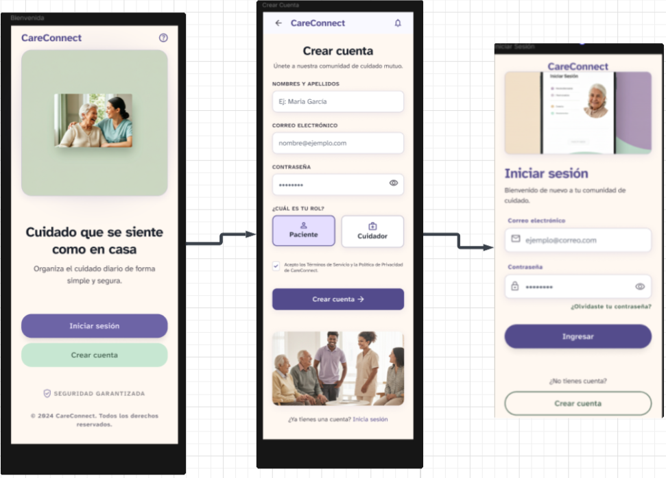

User Flow 2:

Relacionado con el User Goal 2: Como usuario, quiero iniciar sesión y ver la vista según mi rol.

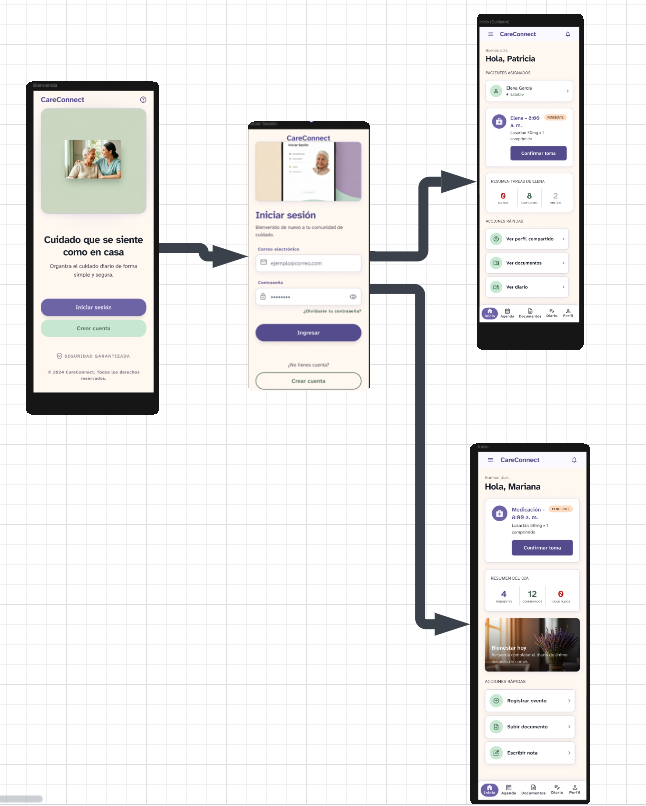

User Flow 3:

Relacionado con el User Goal 3: Como paciente o cuidador, quiero registrar un evento de salud en el calendario.

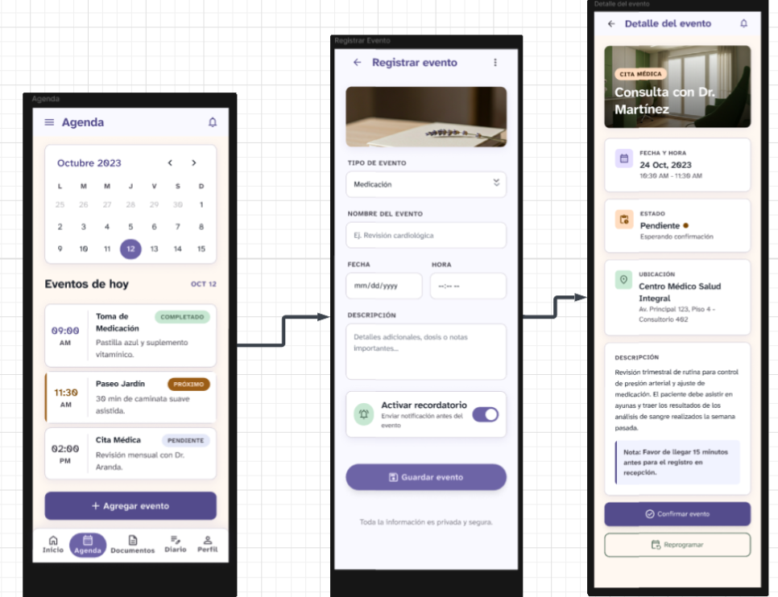

User Flow 4:

Relacionado con el User Goal 4: Como paciente, quiero confirmar o reprogramar un evento de salud.

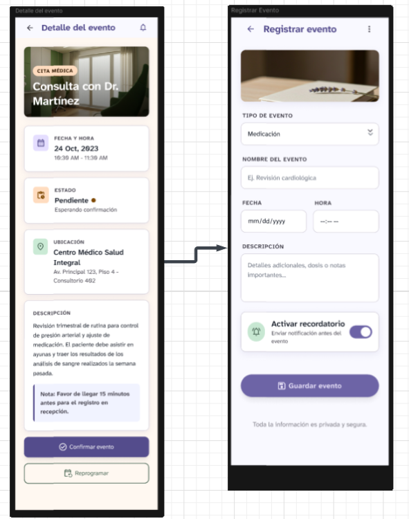

User Flow 5:

Relacionado con el User Goal 5: Como paciente, quiero recibir recordatorios y visualizar mis notificaciones.

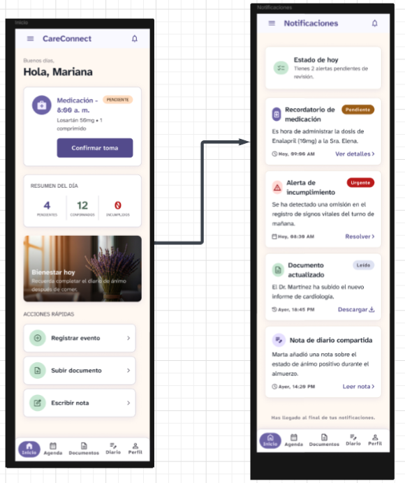

User Flow 6:

Relacionado con el User Goal 6: Como cuidador, quiero recibir y gestionar alertas de incumplimiento del paciente.

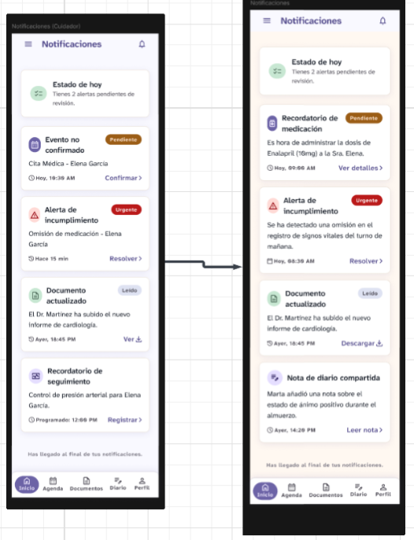

User Flow 7:

Relacionado con el User Goal 7: Como paciente o cuidador, quiero subir y consultar documentos médicos. 

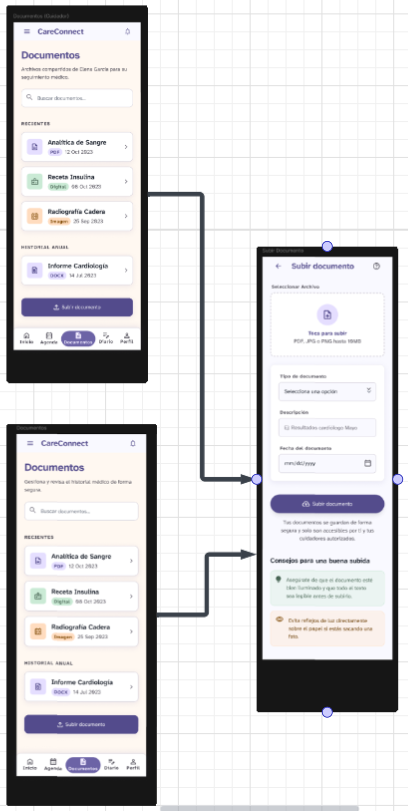

User Flow 8:

Relacionado con el User Goal 8: Como cuidador, quiero acceder a los documentos compartidos del paciente.

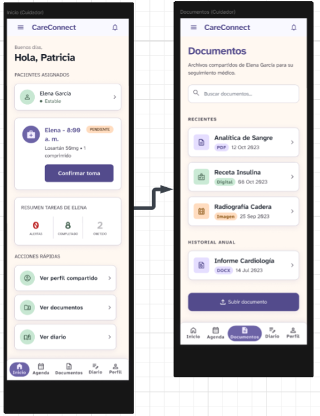

User Flow 9:

Relacionado con el User Goal 9: Como paciente o cuidador, quiero escribir y ver notas en el diario. 

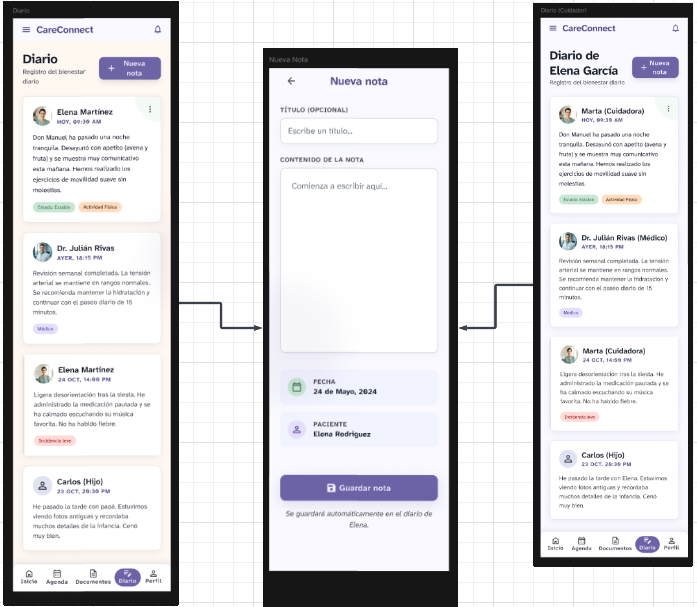

User Flow 10:

Relacionado con el User Goal 10: Como paciente, quiero compartir mi perfil con un cuidador y definir permisos.

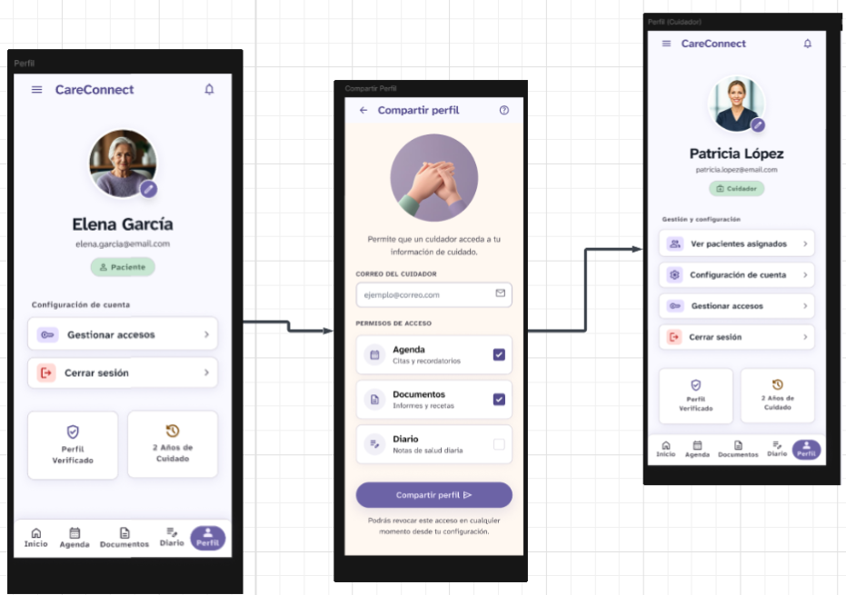


#### 3.1.4.5. Mobile Applications Prototyping <a id="3145-mobile-applications-prototyping"></a>

---

Video del Prototipo:

[(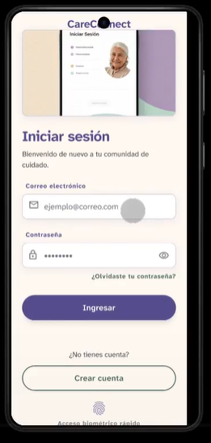)](https://upcedupe-my.sharepoint.com/:v:/g/personal/u202315968_upc_edu_pe/IQBTpFI_EMmAQ7WjSZjKPZ4BAdee4htT3CMdUceU0VxHwnU?nav=eyJyZWZlcnJhbEluZm8iOnsicmVmZXJyYWxBcHAiOiJPbmVEcml2ZUZvckJ1c2luZXNzIiwicmVmZXJyYWxBcHBQbGF0Zm9ybSI6IldlYiIsInJlZmVycmFsTW9kZSI6InZpZXciLCJyZWZlcnJhbFZpZXciOiJNeUZpbGVzTGlua0NvcHkifX0&e=aDG7l6)


# Capítulo IV: Product Implementation & Validation

## 4.1. Product Implementation & Validation <a id="41-product-implementation--validation"></a>

En esta sección se presenta la configuración general utilizada para la implementación y validación del producto **CareConnect**, una aplicación móvil desarrollada por la startup **CareStacks** y orientada a la gestión del cuidado geriátrico. El objetivo de esta etapa es establecer las herramientas, procesos y lineamientos técnicos necesarios para construir una solución funcional, organizada y alineada con los requerimientos definidos en los capítulos anteriores.

CareConnect busca facilitar la coordinación entre pacientes geriátricos y cuidadores mediante funcionalidades como la gestión de eventos de salud, recordatorios, alertas, documentos médicos, diario de seguimiento y acceso compartido a la información del paciente. Para lograrlo, el producto se estructura en diferentes módulos o bounded contexts: **Agenda**, **Notificaciones**, **Documentos**, **Gestión de Consentimiento**, **Diario de Seguimiento** y **Autenticación**.

La implementación del producto considera una aplicación móvil, servicios backend RESTful, almacenamiento local para soporte offline, base de datos relacional y servicios externos para notificaciones y autenticación. Esta organización permite que el sistema sea modular, mantenible y preparado para futuras mejoras.

---
### 4.1.1. Software Configuration Management <a id="411-software-configuration-management"></a>

La gestión de configuración de software comprende el conjunto de herramientas, convenciones y procesos utilizados para desarrollar, controlar, integrar y desplegar el producto CareConnect. Esta gestión permite que el equipo trabaje de forma ordenada, mantenga trazabilidad sobre los cambios realizados y reduzca errores durante la implementación.

Para CareConnect, la configuración de software se organizó en cuatro aspectos principales:

- Configuración del entorno de desarrollo.
- Gestión del código fuente.
- Guía de estilo y convenciones de código.
- Configuración para despliegue de la solución.

Estos elementos permiten mantener una base técnica sólida durante el desarrollo de la aplicación móvil, el backend y los demás componentes del ecosistema del producto.

---


#### 4.1.1.1. Software Development Environment Configuration <a id="4111-software-development-environment-configuration"></a>

El entorno de desarrollo de CareConnect fue definido considerando las necesidades de una aplicación móvil conectada a servicios backend, con almacenamiento local, notificaciones push y manejo de información sensible del paciente. El objetivo fue que todos los integrantes del equipo puedan trabajar en condiciones similares y ejecutar el proyecto sin depender de configuraciones individuales desordenadas.

### Herramientas utilizadas

| Herramienta | Propósito dentro del proyecto |
|---|---|
| Android Studio | Entorno principal para desarrollar, ejecutar y depurar la aplicación móvil. |
| Kotlin | Lenguaje utilizado para implementar la aplicación móvil nativa en Android. |
| Jetpack Compose | Framework declarativo de UI usado para construir todas las pantallas del cliente móvil. |
| Java 21 | Lenguaje utilizado en el backend bajo Spring Boot 4.0.6. |
| Spring Boot 4.0.6 | Framework principal del backend; expone una API REST documentada con OpenAPI. |
| Spring Data JPA / Hibernate | Mapeo objeto-relacional para persistencia de entidades de cada bounded context. |
| Spring Security | Configuración de autenticación, hashing de contraseñas y validación de sesión. |
| MySQL 8 | Motor de base de datos relacional del backend (perfil `dev` y `prod`). |
| H2 | Motor en memoria utilizado en las pruebas automatizadas del backend. |
| Room / SQLite | Almacenamiento local en el dispositivo móvil para soporte offline (caché de pantallas). |
| Firebase Cloud Messaging | Servicio para el envío y recepción de notificaciones push. |
| SendGrid | Servicio externo para el envío de correos electrónicos transaccionales. |
| Vercel | Hosting estático del Landing Page con CI/CD automático por push. |
| Git | Sistema de control de versiones utilizado por el equipo. |
| GitHub | Plataforma para alojar los repositorios (`CareStacks/BackEnd`, `CareStacks/FrontEnd`, `CareStacks/Landing-Page`, `CareStacks/Report`) y gestionar la colaboración. |
| OpenAPI / Swagger UI | Documentación y prueba de endpoints expuestos por el backend en `/swagger-ui.html`. |
| Figma | Herramienta para diseñar wireframes, mockups y prototipos. |
| Miro | Pizarra colaborativa para EventStorming, Context Mapping y Bounded Context Canvases. |
| Structurizr | Herramienta para los diagramas C4 (Context, Container, Component y Deployment). |

### Configuración del entorno móvil

La aplicación móvil se desarrolla utilizando Android Studio como entorno principal. Este entorno permite implementar pantallas, conectar la interfaz con la lógica de negocio, ejecutar pruebas en emuladores y validar funcionalidades en dispositivos físicos.

| Elemento | Descripción |
|---|---|
| Android SDK | Permite compilar y ejecutar la aplicación en dispositivos Android. |
| Emulador Android | Facilita la prueba de la aplicación sin depender únicamente de dispositivos físicos. |
| Dispositivo físico Android | Permite validar funcionalidades reales como notificaciones, rendimiento y almacenamiento local. |
| Gradle | Herramienta utilizada para la compilación y gestión de dependencias. |
| Room / SQLite | Permite almacenar datos relevantes de forma local para acceso offline. |

### Configuración del backend

El backend de CareConnect es un servicio Spring Boot único (no disgregado) que concentra los seis bounded contexts del dominio en módulos internos: Agenda, Notificaciones, Documentos, Gestión de Consentimiento, Diario de Seguimiento y Autenticación (IAM). Cada módulo sigue la organización por capas Domain / Application / Infrastructure / Interfaces.

| Elemento | Descripción |
|---|---|
| Spring Boot 4.0.6 | Framework principal del backend; arranca el contenedor embebido y expone la API REST en el puerto 8080. |
| Java 21 | Lenguaje del backend. |
| Maven | Herramienta de construcción y gestión de dependencias (`pom.xml`). |
| MySQL 8 | Base de datos relacional para los entornos de desarrollo y producción. |
| H2 | Base de datos en memoria utilizada en las pruebas automatizadas. |
| Spring Data JPA / Hibernate | ORM para mapear las entidades del dominio a tablas. `ddl-auto: update` en `dev`. |
| Spring Security | Configuración de seguridad (hashing BCrypt, filtros, validación de sesión). |
| Springdoc OpenAPI | Documentación viva en `/swagger-ui.html` y especificación en `/v3/api-docs`. |

### Configuración de servicios externos

CareConnect utiliza servicios externos para funcionalidades complementarias que fortalecen la experiencia del usuario y evitan implementar desde cero componentes ya existentes.

| Servicio externo | Uso dentro de CareConnect |
|---|---|
| Firebase Cloud Messaging | Envío de recordatorios, alertas y notificaciones push. |
| SendGrid | Envío de correos electrónicos como recuperación de cuenta o invitaciones. |
| Google Sign-In / Identity Provider | Soporte para autenticación externa. |
| Firebase App Distribution | Distribución de versiones de prueba de la aplicación móvil. |

### Requisitos mínimos del entorno

| Recurso | Requisito recomendado |
|---|---|
| Sistema operativo | Windows 10/11, macOS o Linux |
| Memoria RAM | 8 GB mínimo, 16 GB recomendado |
| Android Studio | Versión estable reciente |
| JDK | Java 17 o superior |
| Base de datos | PostgreSQL local o en la nube |
| Git | Instalado y configurado con GitHub |
| Dispositivo de prueba | Emulador Android o dispositivo físico Android |

---

#### 4.1.1.2. Source Code Management <a id="4112-source-code-management"></a>

La gestión del código fuente se realiza mediante **Git** y **GitHub**, permitiendo registrar los cambios del proyecto, organizar el trabajo por ramas y facilitar la colaboración entre los integrantes del equipo.

El uso de control de versiones permite mantener un historial de avances, identificar errores, revisar cambios antes de integrarlos y asegurar que el desarrollo del producto sea trazable durante cada sprint.

### Repositorios del proyecto

El proyecto puede organizarse en repositorios separados según el tipo de componente desarrollado.

| Repositorio | Propósito |
|---|---|
| CareConnect Mobile Application | Contiene el código fuente de la aplicación móvil. |
| CareConnect Backend Services | Contiene los servicios RESTful y la lógica de negocio del sistema. |
| CareConnect Landing Page | Contiene el sitio web informativo del producto. |
| CareConnect Report | Contiene la documentación del informe del proyecto. |

### Estrategia de ramas

Para el desarrollo de CareConnect se propone una estrategia de ramas que separa el código estable del código en desarrollo.

| Rama | Propósito |
|---|---|
| `main` | Contiene la versión estable y validada del proyecto. |
| `develop` | Contiene la integración de funcionalidades en desarrollo. |
| `feature/nombre-funcionalidad` | Rama utilizada para desarrollar una funcionalidad específica. |
| `fix/nombre-correccion` | Rama utilizada para corregir errores detectados. |
| `release/version` | Rama utilizada para preparar una versión entregable. |

### Flujo de trabajo

El flujo de trabajo definido para el equipo es el siguiente:

1. Crear una rama desde `develop` para una funcionalidad específica.
2. Implementar cambios relacionados con una historia de usuario o tarea técnica.
3. Realizar commits pequeños y descriptivos.
4. Crear un Pull Request hacia `develop`.
5. Revisar los cambios por parte del equipo.
6. Integrar la rama cuando la funcionalidad esté validada.
7. Fusionar hacia `main` cuando se tenga una versión estable.

### Convención de commits

Para mantener un historial claro, se utiliza una convención de mensajes de commit basada en el tipo de cambio realizado.

| Tipo de commit | Uso |
|---|---|
| `feat:` | Nueva funcionalidad. |
| `fix:` | Corrección de errores. |
| `docs:` | Cambios en documentación. |
| `style:` | Cambios de formato que no afectan la lógica. |
| `refactor:` | Reestructuración interna del código. |
| `test:` | Agregado o modificación de pruebas. |
| `chore:` | Cambios de configuración o mantenimiento. |

### Ejemplos de commits

```bash
feat: add health event creation screen
feat: implement medication reminder scheduling
fix: correct empty diary entry validation
docs: update mobile architecture documentation
refactor: improve notification service structure
test: add unit tests for access validation
chore: configure firebase messaging dependency
```

### Gestión de Pull Requests

Los Pull Requests permiten revisar y validar los cambios antes de integrarlos a la rama principal de desarrollo. Cada Pull Request debe incluir una descripción breve, evidencia de funcionamiento y referencia a la historia de usuario o tarea técnica correspondiente.

| Elemento | Descripción |
|---|---|
| Título claro | Indica la funcionalidad o corrección realizada. |
| Descripción | Explica brevemente qué se implementó. |
| Evidencia | Incluye capturas, pruebas o resultados de ejecución. |
| Rama destino | Normalmente `develop`. |
| Revisión | Validación por parte de al menos un integrante del equipo. |

---


#### 4.1.1.3. Source Code Style Guide & Conventions <a id="4113-source-code-style-guide--conventions"></a>

Las convenciones de estilo de código permiten mantener una estructura uniforme en los distintos módulos de CareConnect. Esto facilita la lectura, revisión, integración y mantenimiento del proyecto, especialmente al trabajar con varios integrantes en paralelo.

CareConnect adopta una estructura basada en capas, separando responsabilidades entre **Interface**, **Application**, **Domain** e **Infrastructure**. Esta organización se alinea con el enfoque de Domain-Driven Design utilizado en el diseño del sistema.

### Convenciones generales

| Convención | Descripción |
|---|---|
| Nombres descriptivos | Las clases, métodos y variables deben indicar claramente su responsabilidad. |
| Separación por capas | Cada componente debe ubicarse en la capa correspondiente. |
| Bajo acoplamiento | Los módulos deben depender de abstracciones y no de implementaciones concretas. |
| Alta cohesión | Cada clase o componente debe tener una responsabilidad clara. |
| Código legible | Se prioriza claridad y mantenibilidad. |
| Comentarios útiles | Se comentan decisiones importantes, no código evidente. |

### Organización por capas

| Capa | Responsabilidad |
|---|---|
| Domain | Contiene entidades, value objects, aggregate roots, domain services, repositories y domain events. |
| Application | Contiene commands, queries, handlers, DTOs y casos de uso. |
| Interface | Contiene activities, fragments, viewmodels, controllers o elementos de presentación. |
| Infrastructure | Contiene DAOs, entidades de persistencia, adaptadores externos, mappers y configuraciones. |

### Convenciones de nombres

| Tipo de componente | Convención | Ejemplo |
|---|---|---|
| Activity | PascalCase + `Activity` | `AgendaActivity` |
| Fragment | PascalCase + `Fragment` | `CalendarFragment` |
| ViewModel | PascalCase + `ViewModel` | `AgendaViewModel` |
| Command | PascalCase + `Command` | `CreateEventCommand` |
| Handler | PascalCase + `Handler` | `CreateEventHandler` |
| Query | PascalCase + `Query` | `GetEventsQuery` |
| DTO | PascalCase + `DTO` | `EventDTO` |
| Repository | PascalCase + `Repository` | `AgendaRepository` |
| DAO | PascalCase + `Dao` | `EventDao` |
| Mapper | PascalCase + `Mapper` | `EventMapper` |
| Domain Event | PascalCase + `Event` | `EventCreatedEvent` |

### Convenciones para Kotlin / Android

| Elemento | Convención |
|---|---|
| Clases | PascalCase |
| Funciones | camelCase |
| Variables | camelCase |
| Constantes | UPPER_SNAKE_CASE |
| Paquetes | minúsculas, separados por punto |
| Recursos XML | snake_case |
| IDs de vistas | snake_case descriptivo |

### Ejemplo de clase ViewModel

```kotlin
class AgendaViewModel : ViewModel() {
    fun createHealthEvent(command: CreateEventCommand) {
        // La lógica se coordina con la capa de aplicación
    }
}
```

### Ejemplo de DTO

```kotlin
data class EventDTO(
    val id: String,
    val title: String,
    val date: String,
    val status: String
)
```

### Convenciones para endpoints REST

Los endpoints deben seguir una estructura clara, utilizando sustantivos en plural y métodos HTTP según la acción realizada.

| Método | Uso | Ejemplo |
|---|---|---|
| GET | Consultar información | `/api/events` |
| GET | Consultar recurso por ID | `/api/events/{id}` |
| POST | Crear recurso | `/api/events` |
| PUT | Actualizar recurso completo | `/api/events/{id}` |
| PATCH | Actualizar parcialmente | `/api/events/{id}/confirm` |
| DELETE | Eliminar recurso | `/api/events/{id}` |

### Endpoints por bounded context

| Bounded Context | Endpoint ejemplo |
|---|---|
| Agenda | `/api/events` |
| Notificaciones | `/api/notifications` |
| Documentos | `/api/documents` |
| Diario de Seguimiento | `/api/diary/entries` |
| Gestión de Consentimiento | `/api/shared-profiles` |
| Autenticación | `/api/auth/login` |

### Convenciones para base de datos

| Elemento | Convención | Ejemplo |
|---|---|---|
| Tablas | snake_case en plural | `health_events` |
| Columnas | snake_case | `created_at` |
| Primary Key | `id` | `id` |
| Foreign Key | `<entity>_id` | `patient_id` |
| Fechas | sufijo `_at` | `updated_at` |

### Buenas prácticas aplicadas

- Evitar lógica de negocio dentro de Activities o Fragments.
- Utilizar ViewModels para gestionar el estado de interfaz.
- Mantener las reglas de negocio dentro del dominio.
- Utilizar DTOs para transferir información entre capas.
- Usar mappers para convertir entre modelos de dominio, DTO y persistencia.
- Validar entradas del usuario antes de procesarlas.
- Manejar errores con mensajes claros para el usuario.
- Evitar exponer información sensible en logs o repositorios.

---


#### 4.1.1.4. Software Deployment Configuration <a id="4114-software-deployment-configuration"></a>

La configuración de despliegue describe cómo se prepara y publica la solución CareConnect para su uso en entornos de prueba o producción. Debido a que el producto incluye una aplicación móvil, backend, base de datos, landing page y servicios externos, el despliegue se organiza por componentes.

### Componentes desplegables

| Componente | Medio de despliegue | Descripción |
|---|---|---|
| Mobile Application | APK / Firebase App Distribution | Distribución de la aplicación móvil para pruebas internas. |
| Backend RESTful API | Railway, Render, AWS o proveedor cloud similar | Despliegue del API Gateway y servicios backend. |
| Database | PostgreSQL administrado o servidor cloud | Persistencia central de datos del sistema. |
| Landing Page | GitHub Pages, Netlify o Vercel | Publicación del sitio web informativo. |
| Push Notifications | Firebase Cloud Messaging | Servicio externo para envío de notificaciones push. |
| Email Service | SendGrid | Servicio externo para correos transaccionales. |

### Despliegue de la aplicación móvil

La aplicación móvil se empaqueta como archivo APK para ser instalada en dispositivos Android o distribuida mediante Firebase App Distribution. Esto permite compartir versiones preliminares con integrantes del equipo y usuarios testers antes de una publicación oficial.

Proceso general:

1. Configurar las dependencias y servicios necesarios en el proyecto móvil.
2. Generar una versión de prueba del APK desde Android Studio.
3. Validar la instalación en un dispositivo físico.
4. Subir el APK a Firebase App Distribution.
5. Compartir la versión con usuarios testers.
6. Recopilar feedback y registrar incidencias.

### Despliegue del backend

El backend se despliega como una aplicación Spring Boot en un proveedor cloud. Este servicio expone los endpoints RESTful consumidos por la aplicación móvil y se conecta con la base de datos relacional.

Proceso general:

1. Configurar el proyecto backend con sus dependencias.
2. Definir variables de entorno para base de datos, servicios externos y credenciales.
3. Construir el proyecto mediante Maven o Gradle.
4. Desplegar el artefacto en el proveedor cloud.
5. Verificar el estado del servicio mediante endpoints de prueba.
6. Validar la documentación de endpoints en Swagger/OpenAPI.

### Variables de entorno recomendadas

| Variable | Descripción |
|---|---|
| `DATABASE_URL` | URL de conexión a PostgreSQL. |
| `DATABASE_USERNAME` | Usuario de base de datos. |
| `DATABASE_PASSWORD` | Contraseña de base de datos. |
| `JWT_SECRET` | Clave secreta para generación de tokens. |
| `SENDGRID_API_KEY` | Clave para integración con SendGrid. |
| `FIREBASE_PROJECT_ID` | Identificador del proyecto Firebase. |
| `FCM_SERVER_KEY` | Clave para envío de notificaciones push. |
| `GOOGLE_CLIENT_ID` | Identificador para autenticación con Google. |

### Despliegue de la base de datos

La base de datos se configura en PostgreSQL, alojada en un servidor cloud o servicio administrado. Esta base almacena la información principal del sistema, incluyendo usuarios, eventos de salud, documentos, entradas de diario, notificaciones y accesos compartidos.

Consideraciones principales:

- Utilizar conexión segura mediante SSL.
- Restringir el acceso directo a la base de datos.
- Mantener respaldos periódicos.
- Utilizar migraciones para cambios en la estructura.
- Evitar exponer credenciales en el repositorio.

### Despliegue de la landing page

La landing page se publica como un sitio estático en una plataforma como GitHub Pages, Netlify o Vercel. Su función es presentar el producto, explicar la propuesta de valor y facilitar el contacto o acceso a la aplicación.

Proceso general:

1. Construir los archivos estáticos del sitio.
2. Subir el proyecto al repositorio correspondiente.
3. Configurar la plataforma de hosting.
4. Validar la URL pública.
5. Probar la visualización en escritorio y móvil.

### Configuración de Firebase Cloud Messaging

Firebase Cloud Messaging se utiliza para enviar notificaciones push a pacientes y cuidadores.

| Paso | Descripción |
|---|---|
| Crear proyecto Firebase | Registrar CareConnect en Firebase Console. |
| Registrar aplicación Android | Asociar el package name de la app móvil. |
| Descargar configuración | Agregar `google-services.json` al proyecto móvil. |
| Configurar dependencias | Añadir librerías necesarias para Firebase Messaging. |
| Implementar servicio receptor | Crear el servicio que recibe notificaciones push. |
| Probar envío | Validar recepción en un dispositivo físico. |

### Entornos de despliegue

| Entorno | Propósito |
|---|---|
| Development | Ambiente local utilizado por cada integrante para programar. |
| Testing | Ambiente para validar funcionalidades antes de integrarlas. |
| Staging | Ambiente similar a producción para pruebas finales. |
| Production | Ambiente final destinado a usuarios reales. |

### Criterios de validación del despliegue

| Criterio | Validación |
|---|---|
| La app móvil instala correctamente | Se prueba en emulador y dispositivo físico. |
| El login funciona | Se valida registro, inicio de sesión y control por rol. |
| Los eventos de agenda se registran | Se prueba creación, consulta y confirmación de eventos. |
| Las notificaciones llegan al dispositivo | Se valida Firebase Cloud Messaging. |
| Los documentos se pueden cargar y consultar | Se prueba flujo de subida y visualización. |
| El diario permite registrar notas | Se valida creación y consulta de entradas. |
| El acceso compartido funciona | Se prueba compartir y revocar perfil. |
| Swagger está disponible | Se verifica documentación de endpoints. |
| La base de datos responde correctamente | Se validan operaciones de lectura y escritura. |
| La landing page carga públicamente | Se prueba en navegador móvil y escritorio. |

### Riesgos de despliegue identificados

| Riesgo | Impacto | Mitigación |
|---|---|---|
| Fallo en configuración de Firebase | Las notificaciones no llegan al usuario. | Probar en dispositivo físico y revisar credenciales. |
| Variables de entorno incorrectas | El backend no conecta con servicios externos. | Documentar variables y validar antes del despliegue. |
| Base de datos inaccesible | La aplicación no puede guardar información. | Usar servicio administrado y restringir accesos. |
| APK no compatible con algunos dispositivos | Usuarios no pueden instalar la app. | Definir versión mínima de Android y probar en distintos dispositivos. |
| Exposición de credenciales | Riesgo de seguridad. | Usar variables de entorno y evitar subir secretos a GitHub. |
| Errores en migraciones | Pérdida o inconsistencia de datos. | Probar migraciones en staging antes de producción. |

### Conclusión de la configuración de despliegue

La configuración de despliegue de CareConnect permite distribuir la aplicación móvil, exponer los servicios backend, mantener una base de datos centralizada y utilizar servicios externos para notificaciones y correos. Esta organización facilita la validación progresiva del producto, permite realizar pruebas con usuarios reales y prepara la solución para futuras iteraciones de mejora.


## URLs del Backend

- [Backend live](https://careconnect-backend-hvyq.onrender.com)
- [OpenAPI / Docs JSON](https://careconnect-backend-hvyq.onrender.com/v3/api-docs)
- [Swagger UI](https://careconnect-backend-hvyq.onrender.com/swagger-ui.html)

## 4.2. Landing Page & Mobile Application Implementation <a id="42-landing-page--mobile-application-implementation"></a>

### 4.2.1. Sprint 1 <a id="421-sprint-1"></a>

#### 4.2.1.1. Sprint Planning 1 <a id="4211-sprint-planning-1"></a>

El Sprint 1 corresponde al primer ciclo de desarrollo de CareConnect y se enfoca en establecer las bases técnicas del producto: publicar la Landing Page, configurar los repositorios y los entornos de desarrollo, generar el scaffolding de la aplicación móvil Android y comenzar con la implementación del Bounded Context de Autenticación.

| Sprint Planning |  |
|---|---|
| **Sprint #** | 1 |
| **Sprint Planning Background** | Es el primer Sprint del proyecto. No hay implementación previa de referencia. El equipo parte del Product Backlog priorizado en 2.4.3 y de los wireframes y mockups aprobados en 3.1. |
| **Date** | 2026-05-04 |
| **Time** | 19:00 – 21:00 (UTC-5) |
| **Location** | Sesión remota vía Discord |
| **Prepared By** | Salcedo Champi, Matias Rodolfo (Product Owner / Project Manager) |
| **Attendees (to planning meeting)** | Salcedo Champi, Matias Rodolfo · Santillan Alvarado, Melina Liz · Costa Morales, Christofer William · Nikaido Vargas, Javier Masaru · Osores Marchese, Pietro |
| **Sprint n - 1 Review Summary** | No aplica (primer Sprint). |
| **Sprint n - 1 Retrospective Summary** | No aplica (primer Sprint). |
| **Sprint Goal** | Establecer las bases técnicas del producto CareConnect: publicar la Landing Page funcional, configurar los repositorios y las convenciones de trabajo, levantar el scaffolding de la aplicación móvil Android (Kotlin + Jetpack Compose) y del backend (Spring Boot), e implementar el flujo de Registro e Inicio de Sesión del Bounded Context de Autenticación. |
| **Sprint Velocity** | 25 Story Points |
| **Sum of Story Points** | 25 |

**Definition of Done acordada para el Sprint 1:**
- La historia o tarea está integrada a la rama `develop` mediante Pull Request aprobado por al menos un revisor distinto al autor.
- El código pasa el linter del stack correspondiente (Ktlint para Android, Checkstyle para Spring Boot).
- Existe al menos una prueba unitaria o instrumentada asociada cuando aplica.
- La funcionalidad es verificable en el entorno local del equipo.
- La documentación asociada está actualizada en el `README` del repositorio o en el informe.

---

#### 4.2.1.2. Sprint Backlog 1 <a id="4212-sprint-backlog-1"></a>

Las historias y tareas seleccionadas para el Sprint 1 se centran en habilitar el desarrollo del resto del producto: scaffolding, Landing Page, Autenticación y los wireframes/mockups iniciales convertidos en pantallas Android.

| Sprint | User Story ID | Título | Tarea técnica asociada | Description | Estimation (SP) | Assigned To | Status |
|---|---|---|---|---|---|---|---|
| 1 | US10 | Registrar cuenta | T-US10-01: Diseñar pantalla de registro en Jetpack Compose | Implementar el formulario de registro con validaciones de email y contraseña en la app móvil. | 2 | Santillan Alvarado, Melina Liz | Done |
| 1 | US10 | Registrar cuenta | T-US10-02: Endpoint `POST /api/v1/auth/register` en backend | Crear el endpoint REST de registro con hashing bcrypt y persistencia en PostgreSQL. | 3 | Nikaido Vargas, Javier Masaru | In Progress |
| 1 | US11 | Validar acceso por rol | T-US11-01: Pantalla de login con Compose | Implementar la pantalla de login con manejo de errores. | 2 | Santillan Alvarado, Melina Liz | Done |
| 1 | US11 | Validar acceso por rol | T-US11-02: Endpoint `POST /api/v1/auth/login` con JWT | Generar token JWT firmado tras autenticación exitosa. | 3 | Nikaido Vargas, Javier Masaru | In Progress |
| 1 | — | Landing Page MVP | T-LP-01: Estructurar landing en HTML5 + CSS3 + JS responsivo | Hero, secciones de problemática, solución, segmentos objetivo, integrantes y CTA. | 3 | Osores Marchese, Pietro | Done |
| 1 | — | Landing Page MVP | T-LP-02: Deploy en Vercel/GitHub Pages | Configurar dominio público y dejar URL accesible al stakeholder. | 1 | Osores Marchese, Pietro | Done |
| 1 | — | Setup técnico | T-SET-01: Crear repos `BackEnd`, `FrontEnd`, `Landing-Page`, `Report` con sus `README` | Inicializar repositorios en la organización GitHub `CareStacks`. | 1 | Salcedo Champi, Matias Rodolfo | Done |
| 1 | — | Setup técnico | T-SET-02: Definir GitFlow (`main`, `develop`, `docs/*`, `feature/*`) y CODEOWNERS | Documentar el flujo de ramas y la política de revisión. | 1 | Salcedo Champi, Matias Rodolfo | Done |
| 1 | — | Setup técnico | T-SET-03: Configurar proyecto Android (Compose, theme, navegación base) | Scaffolding del proyecto móvil con tema y arquitectura inicial por capas. | 2 | Santillan Alvarado, Melina Liz | Done |
| 1 | — | Setup técnico | T-SET-04: Configurar proyecto Spring Boot inicial | `pom.xml`/`build.gradle`, perfiles `local`/`prod`, conexión inicial a PostgreSQL. | 2 | Nikaido Vargas, Javier Masaru | In Progress |
| 1 | — | Setup técnico | T-SET-05: Configurar Swagger / OpenAPI en backend | Exponer documentación viva en `/swagger-ui.html`. | 1 | Nikaido Vargas, Javier Masaru | To Do |
| 1 | — | Wireframes a pantallas | T-WF-01: Implementar pantallas de Bienvenida, Login y Registro a partir de los wireframes | Convertir los wireframes de §3.1.4 en Composables navegables. | 2 | Costa Morales, Christofer William | Done |
| 1 | SP01 | Spike push offline-first | Investigar FCM vs. AlarmManager local | Documentar la comparativa y recomendar la estrategia de notificaciones push para el producto. | 2 | Costa Morales, Christofer William | Done |

**Total comprometido:** 25 SP.

---

#### 4.2.1.3. Development Evidence for Sprint Review <a id="4213-development-evidence"></a>

La evidencia de desarrollo del Sprint 1 se compone de los commits realizados en los repositorios de la organización `CareStacks` durante el periodo del Sprint (del 2026-05-04 al 2026-05-15). Se trabaja bajo **Conventional Commits** (`feat:`, `fix:`, `docs:`, `chore:`, `merge:`).

**Backend (`CareStacks/BackEnd`)**

| Branch | Commit ID | Commiteado por | Fecha | Mensaje |
|---|---|---|---|---|
| `main` | `12eebaa` | Pietro Osores | 2026-05-13 | Merge pull request #1 from CareStacks/develop |
| `develop` | `e972326` | Pietro Osores | 2026-05-13 | Merge branch 'main' into develop |
| `develop` | `4748cb3` | Pietro Osores | 2026-05-13 | chore(project): Remove obsolete pom backup |
| `develop` | `07c3462` | Pietro Osores | 2026-05-13 | docs(readme): Update backend overview |
| `develop` | `af07d41` | Pietro Osores | 2026-05-13 | chore(swagger): Update OpenAPI bounded context description |
| `feature/diary` | `accdd61` | Pietro Osores | 2026-05-13 | feat(diary): Complete patient diary endpoints |
| `feature/diary` | `682d1b4` | Pietro Osores | 2026-05-13 | merge(feature/diary): integrate diary bounded context |
| `feature/notifications` | `a081923` | Pietro Osores | 2026-05-13 | merge(feature/notifications): integrate notifications bounded context |
| `feature/agenda` | `44bf376` | Pietro Osores | 2026-05-13 | merge(feature/agenda): integrate agenda bounded context |
| `feature/iam` | `51e08c7` | Pietro Osores | 2026-05-13 | feat(iam): Complete session validation and account locking |
| `feature/iam` | `518c278` | Pietro Osores | 2026-05-13 | merge(feature/iam): integrate IAM bounded context |
| `feature/documents` | `e51efd3` | Pietro Osores | 2026-05-13 | feat(documents): Complete medical documents bounded context |
| `feature/documents` | `a5f7fea` | Pietro Osores | 2026-05-13 | merge(feature/documents): integrate documents bounded context |
| `develop` | `50720e0` | Pietro Osores | 2026-05-12 | fix: configure MySQL password in application.yml |
| `develop` | `a6e54f4` | Pietro Osores | 2026-05-12 | chore: update project configuration and add README |
| `develop` | `e13ca56` | Pietro Osores | 2026-05-12 | feat(agenda): add agenda bounded context |

**FrontEnd (`CareStacks/FrontEnd`)**

| Branch | Commit ID | Commiteado por | Fecha | Mensaje |
|---|---|---|---|---|
| `main` | `1a5d1c0` | Pietro Osores | 2026-05-15 | feat: Replace app icon with CareConnect logo |
| `feature/perfil-screen` | `38273ef` | Pietro Osores | 2026-05-15 | feat: Add profile sharing screens |
| `hotfix/header-position` | `ff6160d` | Pietro Osores | 2026-05-14 | fix: Correct app header positioning |
| `feature/nueva-nota-screen` | `8bc3598` | Pietro Osores | 2026-05-14 | feat: Add new diary note screen |
| `feature/diario-screen` | `c2b5f0d` | Pietro Osores | 2026-05-14 | feat: Add cached diary screen |
| `feature/subir-documento-screen` | `9de06af` | Pietro Osores | 2026-05-14 | feat: Add document upload screen |
| `feature/notificaciones-screen` | `651e20c` | Pietro Osores | 2026-05-14 | feat: Add cached notifications screen |
| `feature/documentos-screen` | `6fb1a67` | Pietro Osores | 2026-05-14 | feat: Add cached documents screen |
| `feature/Agenda` | `ea283ef` | Melina Santillan | 2026-05-14 | feat: configure main navigation and UI foundation |
| `main` | `43d1925` | Melina Santillan | 2026-05-12 | chore: set up main activity with app theme |
| `main` | `69bb347` | Melina Santillan | 2026-05-12 | feat: add base UI theme and reusable components |
| `main` | `e75d0b6` | Melina Santillan | 2026-05-10 | feat: initial Android app setup |

**Landing Page (`CareStacks/Landing-Page`)**

| Branch | Commit ID | Commiteado por | Fecha | Mensaje |
|---|---|---|---|---|
| `main` | `c6dac1e` | Equipo CareStacks | 2026-05-15 | feat(add): add deployment link |
| `main` | `264b0d4` | Equipo CareStacks | 2026-05-15 | feat: init repository |
| `main` | `2462c38` | Equipo CareStacks | 2026-05-04 | Initial commit |

> *Stack:* React 19 + Vite + TypeScript. Despliegue automático en Vercel (`https://landing-page-lovat-ten.vercel.app`) por cada push a `main`.

**Report (`CareStacks/Report`)**

| Branch | Commit ID | Commiteado por | Fecha | Mensaje |
|---|---|---|---|---|
| `develop` | `bda826a` | Equipo CareStacks | 2026-05-15 | Merge remote-tracking branch 'origin/docs/capitulo-4' into develop |
| `docs/capitulo-4` | `1d4a634` | Equipo CareStacks | 2026-05-15 | docs: Added Prototyping video and user flow diagrams |
| `develop` | `72f9349` | Equipo CareStacks | 2026-05-15 | Merge remote-tracking branch 'origin/docs/capitulo-4' into develop |
| `main` | `05eae23` | miniChorri | 2026-04-24 | docs: Added jpeg image in profile |

---

#### 4.2.1.4. Testing Suite Evidence for Sprint Review <a id="4214-testing-suite-evidence"></a>

Para el Sprint 1 se contemplan pruebas unitarias e instrumentadas mínimas que validen el scaffolding y los primeros endpoints implementados.

| Test ID | Tipo | Componente | Descripción | Resultado esperado | Estado |
|---|---|---|---|---|---|
| T01 | Unit (JUnit) | `BackEnd / AuthService` | Validar que el registro de un usuario hashea correctamente la contraseña con bcrypt. | Hash distinto a la contraseña en plano y verificable. | No implementado en este Sprint |
| T02 | Unit (JUnit) | `BackEnd / AuthService` | Validar que un login con credenciales correctas retorna un JWT con `sub` y `exp`. | JWT válido y firmado. | No implementado en este Sprint |
| T03 | Unit (JUnit) | `BackEnd / AuthController` | Validar que un registro con email duplicado retorna `409 Conflict`. | Respuesta HTTP 409 y cuerpo con mensaje. | No implementado en este Sprint |
| T04 | Instrumented (Compose UI Test) | `FrontEnd / LoginScreen` | Validar que el botón de login se deshabilita cuando los campos están vacíos. | Botón deshabilitado y mensaje guía visible. | Done |
| T05 | Instrumented (Compose UI Test) | `FrontEnd / RegisterScreen` | Validar que un email mal formado muestra error de validación. | Error visible y submit bloqueado. | Done |
| T06 | Smoke | `Landing-Page` | Validar que la URL pública retorna HTTP 200 y la sección "Solución" es visible. | 200 OK y elemento `#solucion` renderizado. | Done |

**Cobertura objetivo (Sprint 1):** ≥ 40% en módulos de Autenticación. La medición se actualizará al cierre del Sprint mediante JaCoCo (backend) y el reporte de cobertura de Android Studio (frontend).

---

#### 4.2.1.5. Execution Evidence for Sprint Review <a id="4215-execution-evidence"></a>

A continuación se documenta la evidencia de ejecución de los entregables del Sprint 1.

**Landing Page publicada:**

- URL pública: `https://landing-page-lovat-ten.vercel.app`
- Contenido: hero con propuesta de valor, sección de problemática con citas, segmentos objetivo, integrantes y CTA hacia descarga del APK.

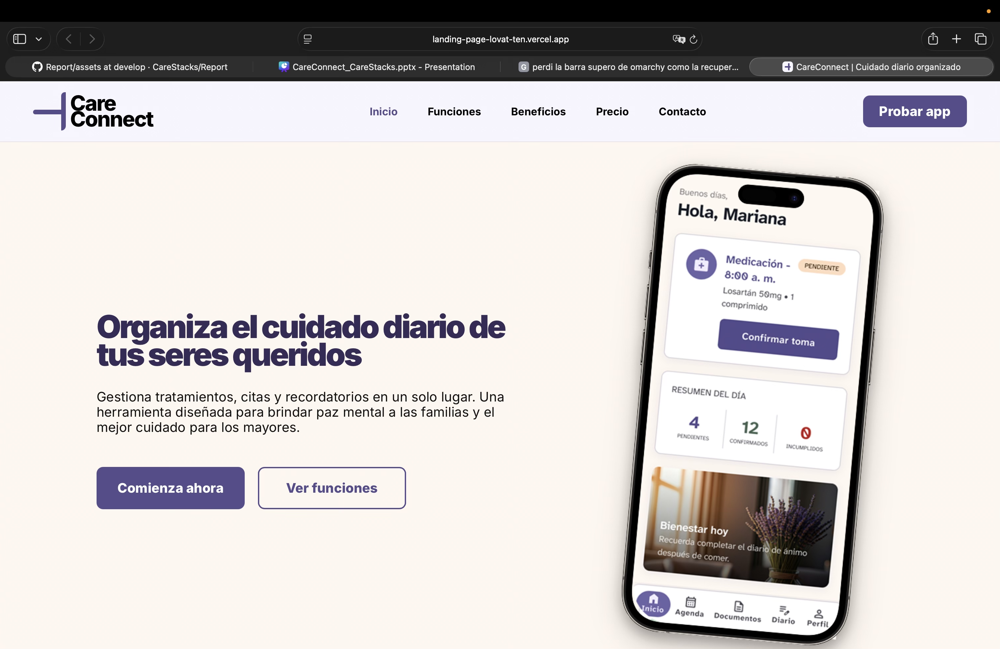

*Figura 17. Landing Page de CareConnect en producción — sección hero.*

**Aplicación móvil — pantallas implementadas:**

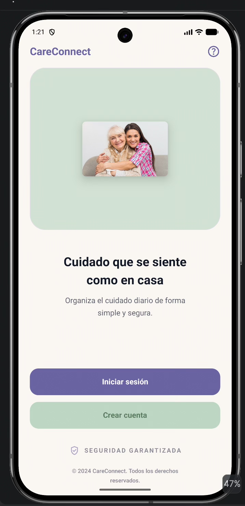

*Figura 18. Pantalla de bienvenida de CareConnect Mobile.*

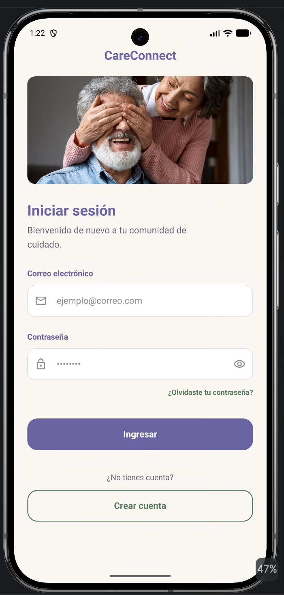

*Figura 19. Pantalla de login con validaciones en línea.*

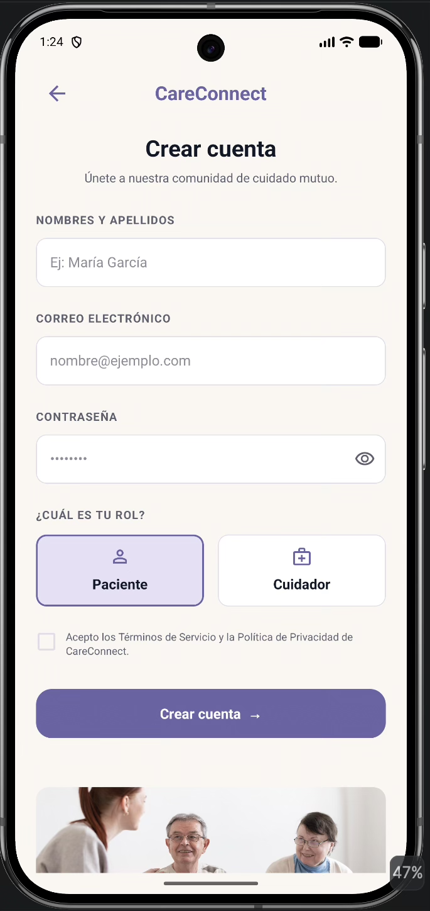

*Figura 20. Pantalla de registro de cuenta.*

**Backend — ejecución local:**

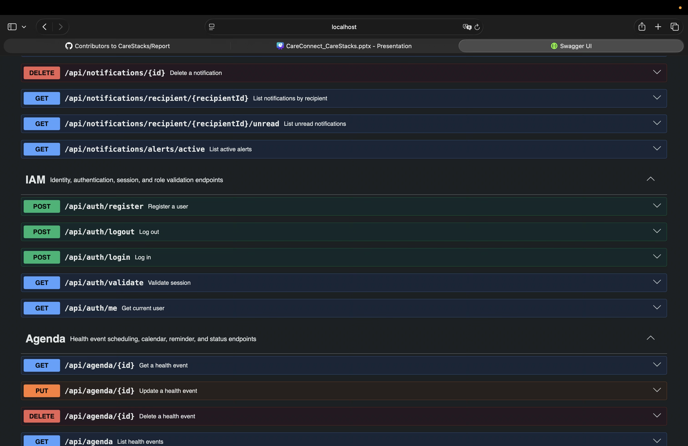

*Figura 21. Documentación viva de los endpoints de Autenticación expuesta vía Swagger UI en `https://careconnect-backend-hvyq.onrender.com/swagger-ui.html`.*

---

#### 4.2.1.6. Services Documentation Evidence for Sprint Review <a id="4216-services-documentation-evidence"></a>

El backend de CareConnect expone su documentación viva mediante **OpenAPI 3 / Swagger UI** (`https://careconnect-backend-hvyq.onrender.com/swagger-ui.html`). Durante el Sprint 1 se cerraron los endpoints de los cinco bounded contexts implementados en el repositorio `CareStacks/BackEnd`. Cada controller está bajo `*/interfaces/*Controller.java`.

**Autenticación (IAM) — `AuthController` — base path `/api/auth`**

| Método | Path | Descripción |
|---|---|---|
| `POST` | `/api/auth/register` | Crea una nueva cuenta de usuario (paciente o cuidador). |
| `POST` | `/api/auth/login` | Autentica al usuario y devuelve un JWT firmado. |
| `POST` | `/api/auth/logout` | Invalida la sesión activa del usuario. |
| `GET` | `/api/auth/me` | Retorna los datos del usuario autenticado. |
| `GET` | `/api/auth/validate` | Valida si la sesión actual está activa. |

**Agenda — `AgendaController` — base path `/api/agenda`**

| Método | Path | Descripción |
|---|---|---|
| `POST` | `/api/agenda` | Registra un nuevo evento de salud. |
| `GET` | `/api/agenda` | Lista todos los eventos de salud. |
| `GET` | `/api/agenda/patient/{patientId}` | Lista los eventos de un paciente. |
| `GET` | `/api/agenda/date` | Filtra eventos por fecha. |
| `GET` | `/api/agenda/{id}` | Obtiene el detalle de un evento. |
| `PUT` | `/api/agenda/{id}` | Actualiza un evento de salud. |
| `PATCH` | `/api/agenda/{id}/confirm` | Marca un evento como confirmado. |
| `PATCH` | `/api/agenda/{id}/reschedule` | Reprograma un evento. |
| `PATCH` | `/api/agenda/{id}/cancel` | Cancela un evento. |
| `DELETE` | `/api/agenda/{id}` | Elimina un evento. |

**Notificaciones — `NotificationController` — base path `/api/notifications`**

| Método | Path | Descripción |
|---|---|---|
| `POST` | `/api/notifications` | Crea una notificación. |
| `POST` | `/api/notifications/reminders` | Genera un recordatorio asociado a un evento. |
| `GET` | `/api/notifications` | Lista todas las notificaciones. |
| `GET` | `/api/notifications/recipient/{recipientId}` | Lista las notificaciones de un destinatario. |
| `GET` | `/api/notifications/recipient/{recipientId}/unread` | Lista las notificaciones no leídas. |
| `GET` | `/api/notifications/{id}` | Detalle de una notificación. |
| `PATCH` | `/api/notifications/{id}/send` | Marca como enviada. |
| `PATCH` | `/api/notifications/{id}/read` | Marca como leída. |
| `PATCH` | `/api/notifications/read-all` | Marca todas como leídas. |
| `PATCH` | `/api/notifications/{id}/cancel` | Cancela una notificación. |
| `DELETE` | `/api/notifications/{id}` | Elimina una notificación. |
| `POST` | `/api/notifications/alerts` | Genera una alerta. |
| `GET` | `/api/notifications/alerts/active` | Lista las alertas activas. |
| `PATCH` | `/api/notifications/alerts/{id}/resolve` | Resuelve una alerta. |
| `GET` | `/api/notifications/preferences/{recipientId}` | Lee las preferencias del destinatario. |
| `PUT` | `/api/notifications/preferences/{recipientId}` | Actualiza las preferencias del destinatario. |

**Documentos — `DocumentController` — base path `/api/documents`**

| Método | Path | Descripción |
|---|---|---|
| `POST` | `/api/documents` | Crea un documento médico. |
| `GET` | `/api/documents` | Lista todos los documentos. |
| `GET` | `/api/documents/patient/{patientId}` | Documentos de un paciente. |
| `GET` | `/api/documents/{id}` | Detalle de un documento. |
| `POST` | `/api/documents/{medicalDocumentId}/items` | Adjunta un item al documento. |
| `GET` | `/api/documents/{medicalDocumentId}/items/{documentItemId}` | Lee un item del documento. |
| `DELETE` | `/api/documents/{medicalDocumentId}/items/{documentItemId}` | Elimina un item del documento. |
| `DELETE` | `/api/documents/{id}` | Elimina el documento completo. |

**Diario de Seguimiento — `DiaryController` — base path `/api/diary`**

| Método | Path | Descripción |
|---|---|---|
| `POST` | `/api/diary` | Crea una nota de diario. |
| `GET` | `/api/diary` | Lista todas las notas. |
| `GET` | `/api/diary/{id}` | Detalle de una nota. |
| `GET` | `/api/diary/patient/{patientId}` | Notas de un paciente. |
| `PUT` | `/api/diary/{id}` | Actualiza una nota. |
| `DELETE` | `/api/diary/{id}` | Elimina una nota. |

**Convenciones del API:**
- Versionado por recurso bajo `/api/<recurso>`.
- Autenticación mediante JWT con cabecera `Authorization: Bearer <token>`.
- Errores en formato Problem Details (RFC 7807).
- Documentación viva accesible en `/swagger-ui.html` y especificación OpenAPI en `/v3/api-docs`.

---

#### 4.2.1.7. Software Deployment Evidence for Sprint Review <a id="4217-software-deployment-evidence"></a>

Al cierre del Sprint 1 se logró desplegar los siguientes componentes del producto:

| Componente | Entorno | Proveedor | URL / Distribución | Estado |
|---|---|---|---|---|
| Landing Page | Producción | Vercel | `https://landing-page-lovat-ten.vercel.app` | Desplegado |
| Mobile App (APK) | Pruebas internas | Firebase App Distribution | Distribución privada al grupo de testers del equipo | Desplegado (build debug) |
| Backend API | Desarrollo claude | Render | `https://careconnect-backend-hvyq.onrender.com/swagger-ui.html` | Operativo en entorno claude |
| Database | Desarrollo local | PostgreSQL local / Docker | Contenedor `postgres:16` levantado vía `docker compose up` | Configurado |

**Pipeline de despliegue actual:**

- **Landing Page**: integración continua con Vercel — cada push a `main` dispara un build y deploy automáticos.
- **Mobile App**: build manual desde Android Studio → upload del APK a Firebase App Distribution con notas de release.
- **Backend**: ejecución local en `https://careconnect-backend-hvyq.onrender.com/swagger-ui.html` con Spring Boot + MySQL. El despliegue cloud se evaluará en una iteración posterior.

---

#### 4.2.1.8. Team Collaboration Insights during Sprint <a id="4218-team-collaboration-insights"></a>

### 4.2.2. Sprint 2 <a id="422-sprint-2"></a>

El Sprint 2 corresponde al segundo ciclo de desarrollo de **CareConnect**. En este Sprint, el equipo dejó de centrarse únicamente en la configuración inicial del producto y avanzó hacia una versión más integrada del sistema. Mientras que el Sprint 1 permitió establecer la base técnica, la Landing Page, el backend inicial, la autenticación y las primeras pantallas móviles, el Sprint 2 se orientó a completar los componentes necesarios para que el producto pueda ser utilizado desde la perspectiva del cuidador.

A partir de la coordinación interna del equipo, se definieron tres objetivos principales para este Sprint: **desarrollar las pantallas del cuidador con Flutter**, **finalizar al 100% el backend** y **conectar el backend con las pantallas móviles**. Esta decisión permitió enfocar el trabajo en una experiencia más funcional para el segmento de cuidadores de pacientes geriátricos, quienes necesitan consultar información del paciente, revisar alertas, acceder a documentos, visualizar diarios compartidos y dar seguimiento a las actividades de cuidado.


*Figura 23. Coordinación interna del equipo donde se define que el Sprint 2 se enfocaría en pantallas del cuidador con Flutter, finalización del backend e integración entre backend y pantallas.*

---

#### 4.2.2.1. Sprint Planning 2 <a id="4221-sprint-planning-2"></a>

El Sprint Planning 2 se realizó con el objetivo de definir el alcance funcional y técnico del segundo Sprint. Luego de revisar los avances obtenidos en el Sprint 1, el equipo identificó que el siguiente paso era cerrar el backend y conectar la aplicación móvil con los servicios REST desplegados. Además, se decidió priorizar las pantallas del cuidador, debido a que este segmento representa uno de los actores principales en la gestión diaria del cuidado geriátrico.

Durante la planificación, el equipo acordó que el Sprint 2 debía entregar un avance visible y demostrable: una aplicación móvil con pantallas del cuidador desarrolladas en Flutter y conectadas al backend, junto con una API finalizada y documentada mediante Swagger/OpenAPI.

| Sprint Planning |  |
|---|---|
| **Sprint #** | 2 |
| **Sprint Planning Background** | El Sprint 1 permitió publicar la Landing Page, configurar los repositorios, levantar la base del backend, documentar los primeros endpoints y crear pantallas iniciales de la aplicación móvil. Para el Sprint 2, el equipo priorizó el desarrollo de pantallas del cuidador, la finalización del backend y la integración entre la app móvil y los servicios REST. |
| **Date** | 2026-05-18 |
| **Time** | 20:00 – 22:00 (UTC-5) |
| **Location** | Sesión remota vía Discord y coordinación complementaria por WhatsApp |
| **Prepared By** | Salcedo Champi, Matias Rodolfo |
| **Attendees (to planning meeting)** | Salcedo Champi, Matias Rodolfo · Santillan Alvarado, Melina Liz · Costa Morales, Christofer William · Nikaido Vargas, Javier Masaru · Osores Marchese, Pietro |
| **Sprint 1 Review Summary** | En el Sprint 1 se logró establecer la base del ecosistema CareConnect: Landing Page publicada, configuración de repositorios, primeras pantallas móviles, backend inicial, documentación Swagger/OpenAPI y estructura base del informe. |
| **Sprint 1 Retrospective Summary** | El equipo identificó como aciertos la organización por repositorios, la documentación temprana y el avance del backend. Como oportunidad de mejora, se detectó la necesidad de integrar antes las pantallas móviles con el backend para evitar avances visuales desconectados de la lógica real del sistema. |
| **Sprint Goal** | Finalizar el backend de CareConnect, desarrollar las pantallas principales del cuidador en Flutter e integrar dichas pantallas con los endpoints REST desplegados, permitiendo una primera experiencia funcional de consulta y seguimiento del paciente. |
| **Sprint Velocity** | 30 Story Points |
| **Sum of Story Points** | 30 |

**Sprint Goal redactado con enfoque de producto:**

Nuestro foco está en entregar una experiencia funcional para el cuidador dentro de CareConnect. Creemos que esto aporta valor al segmento de cuidadores porque les permite acceder desde la app móvil a información centralizada del paciente, como agenda, notificaciones, documentos médicos, diario de seguimiento y perfil compartido.

Esto se confirmará cuando el cuidador pueda navegar por las pantallas principales desarrolladas en Flutter, consumir datos desde el backend desplegado y visualizar respuestas provenientes de los endpoints documentados en Swagger/OpenAPI.

**Definition of Done acordada para el Sprint 2:**

- La pantalla móvil está implementada en Flutter y conectada a la navegación principal.
- El backend expone los endpoints necesarios para los módulos principales.
- La integración app-backend consume servicios mediante HTTP.
- Las respuestas del backend se muestran correctamente en las pantallas del cuidador.
- Los errores de conexión o respuestas vacías se manejan con mensajes adecuados.
- Los endpoints se encuentran documentados en Swagger/OpenAPI.
- Las tareas del Sprint se encuentran cerradas o justificadas en el tablero de trabajo.
- La evidencia de ejecución incluye capturas de pantallas, URLs del backend y documentación de servicios.
- La documentación del informe se actualiza con los avances del Sprint 2.

---

#### 4.2.2.2. Sprint Backlog 2 <a id="4222-sprint-backlog-2"></a>

El Sprint Backlog 2 se construyó a partir de tres líneas de trabajo: finalización del backend, desarrollo de pantallas del cuidador con Flutter e integración entre la aplicación móvil y la API REST. Esta organización permitió que el equipo avance de manera coordinada entre backend y frontend móvil, evitando que las pantallas sean solo estáticas.

Las tareas seleccionadas responden a funcionalidades importantes para el cuidador: visualizar alertas, consultar notificaciones, revisar documentos médicos, acceder al diario compartido y visualizar información del perfil compartido del paciente.

| Sprint | User Story ID | Título | Work-Item / Task ID | Tarea técnica asociada | Description | Estimation (SP) | Assigned To | Status |
|---|---|---|---|---|---|---:|---|---|
| 2 | US05 | Recibir alertas de incumplimiento | T-US05-01 | Implementar pantalla de alertas del cuidador en Flutter | Crear una vista para listar alertas relacionadas con eventos no confirmados o pendientes del paciente. | 3 | Santillan Alvarado, Melina Liz | Done |
| 2 | US06 | Visualizar notificaciones | T-US06-01 | Implementar pantalla de notificaciones del cuidador | Crear pantalla para mostrar notificaciones ordenadas por fecha o prioridad. | 3 | Santillan Alvarado, Melina Liz | Done |
| 2 | US08 | Consultar documentos | T-US08-01 | Implementar pantalla de documentos médicos | Crear vista de documentos disponibles del paciente para el cuidador. | 3 | Osores Marchese, Pietro | Done |
| 2 | US09 | Acceder a documentos compartidos | T-US09-01 | Integrar documentos compartidos con backend | Consumir endpoint de documentos y validar acceso del cuidador autorizado. | 3 | Osores Marchese, Pietro | Done |
| 2 | US13 | Consultar diarios compartidos | T-US13-01 | Implementar pantalla de diario compartido | Mostrar notas del paciente disponibles para el cuidador. | 3 | Costa Morales, Christofer William | Done |
| 2 | US15 | Consultar perfil compartido | T-US15-01 | Implementar pantalla de perfil compartido del paciente | Mostrar información básica del paciente al cuidador autorizado. | 3 | Costa Morales, Christofer William | Done |
| 2 | TS03 | Programación de notificaciones | T-TS03-01 | Completar lógica backend de notificaciones | Implementar reglas para generar notificaciones basadas en eventos de salud. | 3 | Nikaido Vargas, Javier Masaru | Done |
| 2 | TS06 | Almacenamiento de documentos | T-TS06-01 | Completar backend de documentos | Finalizar endpoints de carga, consulta y validación de documentos médicos. | 3 | Nikaido Vargas, Javier Masaru | Done |
| 2 | TS11 | Persistencia de notas | T-TS11-01 | Completar backend del diario de seguimiento | Finalizar persistencia y consulta de notas del paciente. | 2 | Nikaido Vargas, Javier Masaru | Done |
| 2 | TS13 | Consulta de perfil compartido | T-TS13-01 | Completar backend de perfil compartido | Implementar consulta de perfiles compartidos con validación de permisos. | 2 | Salcedo Champi, Matias Rodolfo | Done |
| 2 | — | Integración App-Backend | T-INT-01 | Crear cliente HTTP en Flutter | Configurar servicio de conexión con el backend desplegado en Render. | 2 | Salcedo Champi, Matias Rodolfo | Done |
| 2 | — | Integración App-Backend | T-INT-02 | Conectar pantallas del cuidador con endpoints REST | Consumir datos desde agenda, notificaciones, documentos, diario y perfiles compartidos. | 2 | Equipo CareStacks | Done |

**Total comprometido:** 30 Story Points.

---

#### 4.2.2.3. Development Evidence for Sprint Review <a id="4223-development-evidence-for-sprint-review"></a>

La evidencia de desarrollo del Sprint 2 corresponde a los avances realizados en los repositorios de CareStacks durante la implementación de las pantallas del cuidador, la finalización del backend y la integración entre ambos componentes.

El backend fue consolidado como una API funcional y documentada, mientras que la aplicación móvil incorporó pantallas desarrolladas en Flutter para representar los flujos principales del cuidador. La integración permitió que la aplicación pueda consumir datos desde el backend desplegado, reduciendo la dependencia de datos estáticos o simulados.

> Nota: reemplazar los valores `[commit-id]` por los identificadores reales de GitHub antes de la entrega final.

**Backend (`CareStacks/BackEnd`)**

| Repository | Branch | Commit ID | Commit Message | Commit Message Body | Commited on |
|---|---|---|---|---|---|
| `CareStacks/BackEnd` | `feature/notifications` | `[commit-id]` | `feat: complete notifications bounded context` | Se completan servicios y endpoints para consulta de notificaciones y alertas del cuidador. | 2026-05-24 |
| `CareStacks/BackEnd` | `feature/documents` | `[commit-id]` | `feat: complete medical documents endpoints` | Se agregan endpoints para consultar documentos médicos y validar acceso autorizado. | 2026-05-25 |
| `CareStacks/BackEnd` | `feature/diary` | `[commit-id]` | `feat: complete shared diary endpoints` | Se implementa consulta de diario compartido para cuidadores autorizados. | 2026-05-26 |
| `CareStacks/BackEnd` | `feature/shared-profile` | `[commit-id]` | `feat: implement shared profile queries` | Se agrega consulta de perfil compartido con validación de permisos. | 2026-05-27 |
| `CareStacks/BackEnd` | `develop` | `[commit-id]` | `merge: integrate sprint 2 backend features` | Se integran los bounded contexts finalizados a la rama de desarrollo. | 2026-05-28 |
| `CareStacks/BackEnd` | `main` | `[commit-id]` | `release: deploy sprint 2 backend version` | Se publica versión del backend en Render con Swagger/OpenAPI disponible. | 2026-05-29 |

**Mobile Application Flutter (`CareStacks/FrontEnd`)**

| Repository | Branch | Commit ID | Commit Message | Commit Message Body | Commited on |
|---|---|---|---|---|---|
| `CareStacks/FrontEnd` | `feature/caregiver-dashboard` | `[commit-id]` | `feat: add caregiver dashboard screen` | Se implementa pantalla principal del cuidador con acceso a módulos clave. | 2026-05-24 |
| `CareStacks/FrontEnd` | `feature/caregiver-notifications` | `[commit-id]` | `feat: add caregiver notifications screen` | Se implementa listado de notificaciones y alertas del cuidador. | 2026-05-25 |
| `CareStacks/FrontEnd` | `feature/caregiver-documents` | `[commit-id]` | `feat: add caregiver documents screen` | Se implementa pantalla para consulta de documentos médicos compartidos. | 2026-05-26 |
| `CareStacks/FrontEnd` | `feature/caregiver-diary` | `[commit-id]` | `feat: add shared diary screen` | Se implementa pantalla para consultar notas de seguimiento del paciente. | 2026-05-27 |
| `CareStacks/FrontEnd` | `feature/backend-integration` | `[commit-id]` | `feat: connect caregiver screens with backend api` | Se crea cliente HTTP y se conectan pantallas del cuidador con endpoints REST. | 2026-05-29 |
| `CareStacks/FrontEnd` | `develop` | `[commit-id]` | `merge: integrate caregiver mobile flow` | Se integran las pantallas del cuidador y la conexión con backend. | 2026-05-30 |

**Report (`CareStacks/Report`)**

| Repository | Branch | Commit ID | Commit Message | Commit Message Body | Commited on |
|---|---|---|---|---|---|
| `CareStacks/Report` | `docs/sprint-2` | `[commit-id]` | `docs: add sprint 2 implementation evidence` | Se documenta planificación, backlog, evidencias, testing, despliegue y colaboración del Sprint 2. | 2026-05-30 |
| `CareStacks/Report` | `develop` | `[commit-id]` | `merge: integrate sprint 2 report section` | Se integra la documentación del Sprint 2 al informe principal. | 2026-05-31 |

---

#### 4.2.2.4. Testing Suite Evidence for Sprint Review <a id="4224-testing-suite-evidence-for-sprint-review"></a>

Durante el Sprint 2 se definieron y ejecutaron pruebas orientadas a validar el funcionamiento del backend finalizado y la integración de las pantallas del cuidador con los servicios REST. Las pruebas se enfocaron en comprobar que los datos puedan ser solicitados desde la aplicación móvil, que los endpoints respondan correctamente y que se manejen escenarios de error.

| Test ID | Tipo | Componente | User Story relacionada | Descripción | Resultado esperado | Estado |
|---|---|---|---|---|---|---|
| T07 | Unit | `BackEnd / NotificationService` | US05, US06 | Validar que el servicio retorna notificaciones del cuidador ordenadas por fecha. | Lista de notificaciones ordenada correctamente. | Done |
| T08 | Unit | `BackEnd / DocumentService` | US08, US09 | Validar que solo usuarios autorizados puedan consultar documentos compartidos. | Acceso permitido solo para cuidadores con permisos. | Done |
| T09 | Unit | `BackEnd / DiaryService` | US13 | Validar consulta de notas compartidas del paciente. | El cuidador autorizado visualiza las notas disponibles. | Done |
| T10 | Unit | `BackEnd / SharedProfileService` | US15 | Validar consulta de perfil compartido. | El sistema retorna información del paciente si existe permiso activo. | Done |
| T11 | Integration | `BackEnd / API REST` | TS03, TS06, TS11, TS13 | Validar consumo de endpoints desde cliente HTTP. | La API responde con HTTP 200 para consultas válidas. | Done |
| T12 | Mobile Widget Test | `Flutter / CaregiverDashboardScreen` | US15 | Validar carga de la pantalla principal del cuidador. | Se renderizan cards de agenda, notificaciones, documentos y diario. | Done |
| T13 | Mobile Integration Test | `Flutter / Backend Client` | US06, US08, US13 | Validar que el cliente HTTP consuma datos del backend desplegado. | La app muestra datos o estados vacíos controlados. | Done |
| T14 | Smoke Test | `Backend Render Deployment` | General | Validar acceso público a Swagger UI y OpenAPI JSON. | Swagger y `/v3/api-docs` responden correctamente. | Done |

**Resultado general del testing:**

Las pruebas permitieron comprobar que el backend se encuentra operativo para los flujos principales del cuidador y que las pantallas móviles pueden integrarse con los servicios REST. Además, se validó que la documentación Swagger/OpenAPI se encuentre disponible para facilitar la revisión de endpoints y pruebas manuales.

---

#### 4.2.2.5. Execution Evidence for Sprint Review <a id="4225-execution-evidence-for-sprint-review"></a>

A continuación se documenta la evidencia de ejecución de los entregables del Sprint 2. Esta evidencia muestra el avance de la aplicación móvil desde la perspectiva del cuidador, incluyendo las pantallas principales implementadas, la navegación entre módulos y la visualización de información del paciente asignado.

Durante este Sprint se implementaron las vistas principales del cuidador, permitiendo consultar pacientes vinculados, revisar eventos de agenda, acceder a documentos médicos, visualizar entradas del diario, revisar el perfil del cuidador y consultar notificaciones relevantes. Estas pantallas evidencian que el producto avanzó hacia una experiencia funcional y navegable, alineada con las historias de usuario priorizadas para el seguimiento del cuidado geriátrico.

**Pantallas del cuidador implementadas en Sprint 2:**

<div align="center">

<table>
  <tr>
    <td align="center">
      <br>
      <em>Figura 24. Pantalla principal del cuidador con paciente asignado, evento pendiente y resumen del día.</em>
    </td>
    <td align="center">
      <br>
      <em>Figura 25. Continuación de la pantalla principal con resumen del paciente y accesos rápidos.</em>
    </td>
  </tr>
  <tr>
    <td align="center">
      <br>
      <em>Figura 26. Pantalla de agenda con eventos de medicación y control geriátrico.</em>
    </td>
    <td align="center">
      <br>
      <em>Figura 27. Pantalla de documentos médicos recientes del paciente.</em>
    </td>
  </tr>
  <tr>
    <td align="center">
      <br>
      <em>Figura 28. Pantalla de diario con registros de bienestar y seguimiento del paciente.</em>
    </td>
    <td align="center">
      <br>
      <em>Figura 29. Pantalla de perfil del cuidador con resumen de cuidado y pacientes vinculados.</em>
    </td>
  </tr>
  <tr>
    <td align="center" colspan="2">
      <br>
      <em>Figura 30. Pantalla de notificaciones con alertas y avisos pendientes del cuidador.</em>
    </td>
  </tr>
</table>

</div>

**Integración con backend:**

Además de las pantallas móviles, el Sprint 2 mantuvo la integración con el backend desplegado para consultar información relacionada con pacientes, agenda, documentos, diario y notificaciones. La documentación de servicios quedó disponible mediante Swagger/OpenAPI para facilitar la validación manual de endpoints.

**Backend desplegado:**

- [Backend live](https://careconnect-backend-hvyq.onrender.com)
- [OpenAPI / Docs JSON](https://careconnect-backend-hvyq.onrender.com/v3/api-docs)
- [Swagger UI](https://careconnect-backend-hvyq.onrender.com/swagger-ui.html)

**Descripción de la evidencia presentada:**

Las capturas muestran que, durante el Sprint 2, se logró implementar una navegación completa para el rol de cuidador. La pantalla de inicio presenta información resumida del paciente asignado, próximos eventos y accesos rápidos hacia las funcionalidades principales. La sección de agenda permite visualizar eventos de salud como medicación diaria y controles geriátricos. La pantalla de documentos centraliza archivos médicos recientes, mientras que el diario permite consultar registros de bienestar y notas de seguimiento. Además, el perfil del cuidador muestra información personal, resumen de cuidado y pacientes vinculados. Finalmente, la sección de notificaciones permite revisar avisos pendientes relacionados con eventos de salud y asignación del plan de cuidado.

**Resultado alcanzado:**

Al cierre del Sprint 2, el equipo logró una primera experiencia funcional para el cuidador. Las pantallas principales fueron implementadas y organizadas en módulos coherentes con el Product Backlog: Inicio, Agenda, Documentos, Diario, Perfil y Notificaciones. Esto permitió validar visualmente el flujo de consulta y seguimiento del paciente geriátrico desde la perspectiva del cuidador, consolidando un avance importante respecto al Sprint 1. Además, el backend quedó expuesto mediante documentación Swagger/OpenAPI, permitiendo verificar los servicios REST necesarios para la integración.

---

#### 4.2.2.6. Services Documentation Evidence for Sprint Review <a id="4226-services-documentation-evidence-for-sprint-review"></a>

Durante el Sprint 2 se actualizó y validó la documentación de servicios REST del backend de CareConnect. La documentación viva se encuentra disponible mediante Swagger UI y OpenAPI JSON.

- [Backend live](https://careconnect-backend-hvyq.onrender.com)
- [OpenAPI / Docs JSON](https://careconnect-backend-hvyq.onrender.com/v3/api-docs)
- [Swagger UI](https://careconnect-backend-hvyq.onrender.com/swagger-ui.html)

Los endpoints documentados se relacionan con los bounded contexts principales del producto: Autenticación, Agenda, Notificaciones, Documentos, Diario de Seguimiento y Gestión de Consentimiento.

| Bounded Context | Endpoint base | Métodos principales | Acciones soportadas |
|---|---|---|---|
| Autenticación | `/api/auth` | `POST`, `GET` | Registro, inicio de sesión, validación de usuario autenticado y cierre de sesión. |
| Agenda | `/api/agenda` | `GET`, `POST`, `PUT`, `PATCH`, `DELETE` | Registro, consulta, reprogramación y confirmación de eventos de salud. |
| Notificaciones | `/api/notifications` | `GET`, `POST`, `PATCH` | Consulta de notificaciones, generación de alertas y marcado de notificaciones revisadas. |
| Documentos | `/api/documents` | `GET`, `POST`, `DELETE` | Carga, consulta y eliminación de documentos médicos. |
| Diario de Seguimiento | `/api/diary` | `GET`, `POST`, `PUT`, `DELETE` | Registro, consulta y edición de notas de seguimiento. |
| Gestión de Consentimiento | `/api/shared-profiles` | `GET`, `POST`, `DELETE` | Compartir perfil, consultar perfil compartido y revocar accesos. |

**Endpoints priorizados para la integración móvil del cuidador:**

| Método | Path | Funcionalidad relacionada | Uso en la app móvil |
|---|---|---|---|
| `GET` | `/api/notifications` | Visualizar notificaciones | Pantalla de alertas del cuidador. |
| `GET` | `/api/documents` | Consultar documentos médicos | Pantalla de documentos compartidos. |
| `GET` | `/api/diary` | Consultar diario compartido | Pantalla de seguimiento del paciente. |
| `GET` | `/api/shared-profiles` | Consultar perfil compartido | Pantalla de información del paciente. |
| `GET` | `/api/agenda` | Consultar eventos de salud | Pantalla principal del cuidador. |

**Resultado de documentación:**

La documentación de servicios permitió al equipo móvil identificar rápidamente los endpoints necesarios para conectar las pantallas del cuidador con el backend. Esto redujo el tiempo de integración y permitió validar los flujos principales sin depender de comunicación informal entre frontend y backend.

---

#### 4.2.2.7. Software Deployment Evidence for Sprint Review <a id="4227-software-deployment-evidence-for-sprint-review"></a>

Durante el Sprint 2 se consolidó el despliegue del backend y se preparó la aplicación móvil para pruebas internas. El objetivo principal fue contar con un backend accesible públicamente para permitir la integración con Flutter y validar los flujos principales del cuidador.

| Componente | Entorno | Proveedor / Medio | URL / Distribución | Estado |
|---|---|---|---|---|
| Backend API | Producción / Testing | Render | [https://careconnect-backend-hvyq.onrender.com](https://careconnect-backend-hvyq.onrender.com) | Desplegado |
| Swagger UI | Producción / Testing | Render | [https://careconnect-backend-hvyq.onrender.com/swagger-ui.html](https://careconnect-backend-hvyq.onrender.com/swagger-ui.html) | Operativo |
| OpenAPI JSON | Producción / Testing | Render | [https://careconnect-backend-hvyq.onrender.com/v3/api-docs](https://careconnect-backend-hvyq.onrender.com/v3/api-docs) | Operativo |
| Mobile App Flutter | Pruebas internas | APK local / Firebase App Distribution | Distribución privada al equipo | En pruebas |
| Landing Page | Producción | Vercel | `https://landing-page-lovat-ten.vercel.app` | Sin cambios principales en este Sprint |

**Actividades de despliegue realizadas:**

- Se validó que el backend se encuentre disponible públicamente desde Render.
- Se verificó el acceso a Swagger UI y OpenAPI JSON.
- Se configuró la URL base del backend dentro del cliente HTTP de Flutter.
- Se realizaron pruebas de consumo de endpoints desde las pantallas del cuidador.
- Se preparó una build móvil para pruebas internas del equipo.
- Se mantuvo la Landing Page desplegada desde el Sprint anterior.

**Pipeline de despliegue actualizado:**

- **Backend:** push a repositorio → build en Render → publicación de API → validación en Swagger.
- **Mobile App:** build local de Flutter → instalación en dispositivo/emulador → pruebas de integración con backend.
- **Landing Page:** despliegue continuo en Vercel sin cambios funcionales relevantes durante este Sprint.

**Resultado de despliegue:**

El Sprint 2 permitió pasar de una API en desarrollo a un backend accesible para integración real con la aplicación móvil. Esto fue clave para validar que las pantallas del cuidador no solo existan visualmente, sino que puedan conectarse a los servicios REST del producto.

---

#### 4.2.2.8. Team Collaboration Insights during Sprint <a id="4228-team-collaboration-insights-during-sprint"></a>

Durante el Sprint 2, el equipo CareStacks reforzó su coordinación mediante reuniones remotas, mensajes por WhatsApp y división de responsabilidades por componente. La captura de WhatsApp evidencia que el equipo alineó el alcance del Sprint alrededor de tres entregables principales: pantallas del cuidador con Flutter, backend completo e integración entre backend y frontend móvil.

**Ceremonias Scrum realizadas:**

| Ceremonia | Fecha | Duración | Participantes |
|---|---|---|---|
| Sprint Planning 2 | 2026-05-18 | 2h | Todo el equipo |
| Daily Standups asíncronos por WhatsApp | Diario | 10 min | Todo el equipo |
| Revisión técnica backend-frontend | 2026-05-24 | 1h | Equipo backend y mobile |
| Sprint Review 2 | 2026-05-31 | 1.5h | Todo el equipo |
| Sprint Retrospective 2 | 2026-05-31 | 1h | Todo el equipo |

**Distribución del trabajo por integrante:**

| Integrante | Rol en Sprint | Foco principal | SP comprometidos |
|---|---|---|---:|
| Salcedo Champi, Matias Rodolfo | Product Owner / Integración | Integración app-backend y perfil compartido | 5 |
| Santillan Alvarado, Melina Liz | Mobile Developer | Pantallas del cuidador en Flutter: dashboard, alertas y notificaciones | 6 |
| Costa Morales, Christofer William | Mobile Developer | Pantallas de diario compartido y perfil del paciente | 6 |
| Nikaido Vargas, Javier Masaru | Backend Developer | Finalización del backend y endpoints principales | 9 |
| Osores Marchese, Pietro | Mobile / Backend Support | Pantalla de documentos y validación de acceso | 4 |

**Actividad colaborativa durante el Sprint:**

- Se utilizó WhatsApp para coordinar prioridades rápidas y resolver bloqueos.
- Se trabajó con ramas por funcionalidad para separar backend, pantallas e integración.
- Se realizaron revisiones cruzadas entre mobile y backend para asegurar que los endpoints respondan a las necesidades de la app.
- Se validó la documentación Swagger antes de conectar las pantallas con Flutter.
- Se ajustaron tareas del Sprint para priorizar la experiencia del cuidador.
- Se registró en el informe la decisión principal del Sprint para mantener trazabilidad del alcance.

*Figura 30. Evidencia de coordinación donde se acuerda que el Sprint 2 incluiría desarrollo de pantallas del cuidador con Flutter, finalización del backend e integración backend-pantallas.*

**Lecciones aprendidas del Sprint 2:**

1. La integración entre backend y móvil debe iniciarse temprano para detectar diferencias entre los datos esperados por la interfaz y las respuestas reales del API.
2. Swagger/OpenAPI facilitó la comunicación entre los integrantes encargados del backend y quienes desarrollaron las pantallas móviles.
3. El enfoque en un usuario específico, en este caso el cuidador, ayudó a mantener el Sprint más claro y orientado a valor.
4. La coordinación por WhatsApp fue útil para decisiones rápidas, pero las decisiones importantes deben trasladarse al informe y al tablero del Sprint para conservar trazabilidad.
5. Completar el backend antes de cerrar las pantallas permitió reducir trabajo duplicado y evitar pantallas desconectadas de la lógica real del sistema.

**Conclusión del Sprint 2:**

El Sprint 2 permitió consolidar un avance importante en CareConnect, ya que el equipo pasó de una base técnica inicial a una versión más integrada del producto. Se completó el backend, se desarrollaron las pantallas principales del cuidador en Flutter y se realizó la conexión entre la aplicación móvil y los servicios REST desplegados.

Con este Sprint, CareConnect queda mejor preparado para validar flujos reales de cuidado geriátrico desde la perspectiva del cuidador, especialmente en consulta de agenda, notificaciones, documentos médicos, diario de seguimiento y perfil compartido del paciente.


## 4.3. Validation Interviews <a id="43-validation-interviews"></a>

En esta sección se presenta el proceso de validación realizado para evaluar la propuesta de solución **CareConnect** con usuarios representativos de los segmentos objetivo. A diferencia de las entrevistas iniciales de descubrimiento, esta etapa se enfocó en validar la comprensión, utilidad y facilidad de uso del prototipo de la aplicación móvil.

La validación se centró en los principales flujos de la solución: gestión de eventos de salud, confirmación de actividades, recepción de recordatorios, consulta de documentos médicos, registro en diario de seguimiento y acceso compartido entre paciente y cuidador.

El objetivo principal fue comprobar si CareConnect responde adecuadamente a las necesidades identificadas en los capítulos anteriores: desorganización del cuidado, pérdida de información, dependencia de herramientas dispersas, falta de coordinación entre cuidadores y dificultad de los pacientes geriátricos para recordar actividades de salud.

---
### 4.3.1. Diseño de Entrevistas <a id="431-diseno-de-entrevistas"></a>

Las entrevistas de validación fueron diseñadas bajo un enfoque semiestructurado. Esto permitió contar con preguntas base para todos los participantes, pero también dejar espacio para comentarios espontáneos sobre la experiencia de uso del prototipo.

La validación se realizó con dos segmentos:

| Segmento | Perfil evaluado | Objetivo de validación |
|---|---|---|
| Cuidadores de pacientes geriátricos | Personas que apoyan en la medicación, citas, seguimiento diario y comunicación con familiares. | Evaluar si la aplicación ayuda a organizar mejor el cuidado, reducir olvidos y mejorar la coordinación. |
| Pacientes geriátricos | Adultos mayores con autonomía parcial o acompañada que requieren recordatorios y seguimiento de salud. | Evaluar si la aplicación es clara, simple y útil para recordar actividades y participar en su propio cuidado. |

#### Objetivos específicos de la validación

| Objetivo | Descripción |
|---|---|
| Validar la utilidad percibida | Identificar si los usuarios consideran que CareConnect resuelve un problema real dentro del cuidado geriátrico. |
| Evaluar la comprensión de la interfaz | Verificar si los usuarios entienden las pantallas, botones, mensajes y acciones principales. |
| Validar los flujos principales | Revisar si los usuarios pueden completar tareas clave sin demasiada orientación. |
| Identificar fricciones de uso | Detectar pantallas confusas, exceso de pasos o elementos difíciles de interpretar. |
| Recoger oportunidades de mejora | Obtener sugerencias para próximas iteraciones del producto. |

#### Prototipo evaluado

El prototipo evaluado corresponde a una versión navegable de la aplicación móvil CareConnect. Este prototipo incluye las pantallas principales necesarias para representar la experiencia del usuario, aunque no todas las funcionalidades se encuentran conectadas a una base de datos real.

| Módulo evaluado | Funcionalidad revisada |
|---|---|
| Inicio / Home | Visualización de actividades pendientes del día. |
| Agenda | Registro y consulta de eventos de salud. |
| Notificaciones | Recordatorios y alertas de actividades no confirmadas. |
| Documentos | Consulta de documentos médicos del paciente. |
| Diario | Registro de notas de seguimiento. |
| Gestión de Consentimiento | Compartir información del paciente con un cuidador o familiar. |

#### Tareas asignadas durante la entrevista

A cada participante se le pidió realizar tareas específicas dentro del prototipo. Estas tareas fueron seleccionadas porque representan acciones críticas dentro del uso diario de CareConnect.

| Código | Tarea | Segmento evaluado | Criterio de éxito |
|---|---|---|---|
| T01 | Revisar las actividades pendientes del día. | Paciente / Cuidador | El usuario identifica qué actividad debe realizar primero. |
| T02 | Registrar un nuevo evento de salud. | Cuidador | El usuario crea una medicación, cita o terapia sin confundirse. |
| T03 | Confirmar una actividad realizada. | Paciente / Cuidador | El usuario entiende cómo marcar una actividad como completada. |
| T04 | Revisar una notificación o alerta. | Paciente / Cuidador | El usuario comprende el mensaje y la acción esperada. |
| T05 | Consultar un documento médico. | Cuidador | El usuario encuentra un documento sin depender de otra herramienta. |
| T06 | Registrar una nota en el diario. | Paciente / Cuidador | El usuario escribe una observación y comprende su utilidad. |
| T07 | Compartir el perfil del paciente. | Paciente / Cuidador | El usuario entiende que el acceso se otorga con permiso del paciente. |

#### Métricas de evaluación

Para ordenar los resultados, se utilizaron criterios cualitativos y cuantitativos simples.

| Métrica | Descripción | Escala |
|---|---|---|
| Facilidad de uso | Qué tan fácil resultó completar la tarea. | 1 = difícil, 5 = muy fácil |
| Comprensión | Qué tan claro fue el propósito de la pantalla. | 1 = confuso, 5 = muy claro |
| Utilidad percibida | Qué tanto valor aporta la función al usuario. | 1 = poco útil, 5 = muy útil |
| Confianza | Qué tan seguro se sintió el usuario al usar la función. | 1 = inseguro, 5 = muy seguro |
| Intención de uso | Disposición del usuario a usar la aplicación en su rutina. | Baja / Media / Alta |

#### Preguntas para cuidadores

- ¿Qué tan útil le parece tener una agenda centralizada para medicación, citas y terapias?
- ¿La pantalla principal le permite entender rápidamente qué actividades están pendientes?
- ¿La confirmación de actividades le ayudaría a evitar dudas sobre si una medicación ya fue administrada?
- ¿Las alertas le parecen claras y oportunas?
- ¿El diario de seguimiento le ayudaría a registrar información importante para otros cuidadores?
- ¿Le parece útil poder consultar documentos médicos desde la aplicación?
- ¿Qué funcionalidad usaría con más frecuencia?
- ¿Qué parte del prototipo le pareció confusa o mejorable?
- ¿Usaría CareConnect en una rutina real de cuidado? ¿Por qué?

#### Preguntas para pacientes geriátricos

- ¿Le resulta fácil entender qué actividades tiene pendientes durante el día?
- ¿Los textos, botones e íconos son claros para usted?
- ¿Le parece útil recibir recordatorios de medicamentos o citas?
- ¿Entiende cómo confirmar que ya realizó una actividad?
- ¿Se sentiría más tranquilo si un familiar o cuidador pudiera revisar su información con permiso?
- ¿Qué pantalla le pareció más útil?
- ¿Qué pantalla le pareció más difícil de usar?
- ¿Usaría una aplicación como CareConnect para organizar su cuidado diario?

---

### 4.3.2. Registro de Entrevistas <a id="432-registro-de-entrevistas"></a>

### 4.3.2. Registro de Entrevistas <a id="432-registro-de-entrevistas"></a>

En esta sección se presentan las entrevistas de validación realizadas a los segmentos objetivo de **CareConnect**. El propósito de estas entrevistas fue recoger la percepción de los usuarios frente al prototipo y validar si las funcionalidades propuestas responden a necesidades reales dentro del cuidado geriátrico.

Las entrevistas se dividieron en dos segmentos:

- **Segmento 1:** Cuidadores de pacientes geriátricos.
- **Segmento 2:** Pacientes geriátricos.

Durante las entrevistas se evaluaron aspectos como la utilidad de la agenda centralizada, claridad de la pantalla principal, confirmación de actividades, alertas, diario de seguimiento, consulta de documentos médicos, acceso compartido e intención de uso en una rutina real.

---

#### Segmento 1: Cuidadores de pacientes geriátricos

---

#### Entrevista de validación 1

| Campo | Información |
|---|---|
| Entrevistado | Daniel Rodríguez |
| Segmento | Cuidador de pacientes geriátricos |
| Experiencia | Cuidador de varios pacientes geriátricos |
| Modalidad | Virtual |
| Duración aproximada | 4 minutos |
| Producto evaluado | Landing page / prototipo de CareConnect |

**Resumen de la entrevista:**

Daniel Rodríguez indicó que CareConnect le parece una solución muy útil para organizar el cuidado de pacientes geriátricos. Desde su experiencia como cuidador, considera que contar con una agenda centralizada para medicación, citas y terapias ayudaría a mantener la información más ordenada y reduciría la posibilidad de olvidar medicamentos o actividades importantes.

Respecto a la pantalla principal, mencionó que la distribución le pareció clara, ya que los recordatorios están visibles y permiten identificar rápidamente las actividades pendientes. También señaló que la confirmación de actividades sería bastante útil, especialmente cuando varias personas participan en el cuidado del mismo paciente, porque ayuda a evitar confusiones sobre si una medicación ya fue administrada.

En relación con las alertas, Daniel comentó que le parecen claras y oportunas, debido a que aparecen en momentos adecuados y permiten hacer un mejor seguimiento de las tareas. Además, valoró el diario de seguimiento como una buena forma de mantener organizada la comunicación entre cuidadores y familiares.

También consideró útil poder consultar documentos médicos desde la aplicación, ya que esto ayudaría a coordinar responsabilidades y mantener informados a los familiares involucrados en el cuidado del paciente.

**Comentarios principales del entrevistado:**

- La agenda centralizada ayudaría a organizar mejor medicamentos, citas y terapias.
- La pantalla principal permite entender rápidamente qué actividades están pendientes.
- La confirmación de actividades evitaría confusiones entre cuidadores.
- Las alertas son claras y aparecen en momentos adecuados.
- El diario de seguimiento permitiría mantener una comunicación más organizada.
- La consulta de documentos médicos ayudaría a coordinar responsabilidades con familiares.

**Funcionalidad más valorada:**

Daniel indicó que la funcionalidad que usaría con mayor frecuencia sería la **agenda**, principalmente por los recordatorios de medicación. Según su experiencia, uno de los problemas más frecuentes en el cuidado diario son las confusiones relacionadas con horarios, medicamentos y actividades pendientes.

**Aspectos de mejora identificados:**

El entrevistado mencionó que la navegación entre algunas secciones podría mejorar. Aunque no la considera complicada, señaló que al inicio algunas funcionalidades no son tan evidentes de encontrar.

**Oportunidades de mejora:**

- Mejorar la visibilidad de las secciones principales.
- Hacer más evidente la ubicación de funcionalidades importantes.
- Reforzar la navegación inicial para usuarios nuevos.
- Priorizar accesos rápidos a agenda, alertas y diario de seguimiento.

**Intención de uso:**

Daniel afirmó que sí utilizaría CareConnect en una rutina real de cuidado, porque considera que la aplicación sería útil para organizar tareas, mejorar la comunicación y reducir olvidos o confusiones durante el seguimiento de pacientes geriátricos.

---

#### Entrevista de validación 2

| Campo | Información |
|---|---|
| Entrevistada | Valeria Dobbertin |
| Edad | 20 años |
| Segmento | Cuidadora informal de pacientes geriátricos |
| Experiencia | Cuida a sus abuelos en sus tiempos libres |
| Modalidad | Virtual |
| Duración aproximada | 4 minutos |
| Producto evaluado | Landing page / prototipo de CareConnect |

**Resumen de la entrevista:**

Valeria Dobbertin indicó que CareConnect le parece una herramienta útil para organizar el cuidado de sus abuelos. Considera que una agenda centralizada para medicación, citas y terapias permitiría tener toda la información en un solo lugar, evitando olvidos, especialmente cuando existen muchas actividades o medicamentos que controlar durante el día.

Sobre la pantalla principal, mencionó que la información se ve clara y organizada, permitiendo identificar rápidamente qué actividades faltan realizar y cuáles ya fueron completadas. También valoró positivamente la confirmación de actividades, ya que esta función ayudaría a evitar confusiones o repeticiones, sobre todo cuando varias personas participan en el cuidado del paciente.

Respecto a las alertas, comentó que son fáciles de entender y que aparecen en momentos adecuados, por lo que serían útiles para recordar tareas importantes. En relación con el diario de seguimiento, señaló que permitiría dejar observaciones relevantes sobre el estado del paciente y facilitaría la comunicación entre las personas encargadas del cuidado.

Asimismo, consideró que consultar documentos médicos desde la aplicación es una función práctica, ya que evita tener documentos separados o perder información importante. Además, permite acceder rápidamente a información médica cuando sea necesario.

**Comentarios principales de la entrevistada:**

- La agenda centralizada permite organizar mejor medicamentos, citas y terapias.
- La pantalla principal muestra la información de forma clara.
- La confirmación de actividades ayuda a evitar confusiones entre cuidadores.
- Las alertas son fáciles de entender y oportunas.
- El diario de seguimiento facilita registrar observaciones importantes.
- La consulta de documentos médicos evita la pérdida de información.

**Funcionalidad más valorada:**

Valeria señaló que usaría con mayor frecuencia la **agenda y las alertas**, ya que ambas funciones ayudan a organizar las actividades diarias y recordar horarios importantes dentro de la rutina de cuidado.

**Aspectos de mejora identificados:**

La entrevistada mencionó que, en general, el prototipo le pareció intuitivo. Sin embargo, sugirió que algunas secciones podrían tener textos o íconos más visibles para entenderlas con mayor rapidez.

**Oportunidades de mejora:**

- Aumentar la visibilidad de algunos textos e íconos.
- Mejorar la jerarquía visual de las secciones principales.
- Hacer más reconocibles las funciones clave desde la pantalla inicial.
- Mantener una interfaz simple e intuitiva para cuidadores familiares.

**Intención de uso:**

Valeria afirmó que sí usaría CareConnect en una rutina real de cuidado, ya que considera que la aplicación ayuda a organizar tareas, facilita la comunicación entre familiares y reduce la posibilidad de olvidar actividades importantes.

---

#### Síntesis de entrevistas del Segmento 1

A partir de las entrevistas realizadas a Daniel Rodríguez y Valeria Dobbertin, se identifican coincidencias importantes respecto al valor de CareConnect para cuidadores de pacientes geriátricos.

Ambos entrevistados consideran que la aplicación sería útil para organizar mejor las actividades de cuidado, especialmente en relación con la medicación, citas, terapias y recordatorios. También coinciden en que la confirmación de actividades ayudaría a evitar confusiones cuando varias personas participan en el cuidado del mismo paciente.

La agenda y las alertas fueron las funcionalidades más valoradas por ambos participantes, ya que responden directamente a uno de los principales problemas del cuidado diario: recordar y verificar actividades importantes. Además, el diario de seguimiento y la consulta de documentos médicos fueron percibidos como funciones útiles para mejorar la comunicación y mantener información relevante centralizada.

| Aspecto evaluado | Resultado observado |
|---|---|
| Utilidad de la agenda | Alta. Ambos entrevistados la consideran clave para organizar medicamentos, citas y terapias. |
| Claridad de la pantalla principal | Positiva. Los participantes indicaron que permite identificar actividades pendientes. |
| Confirmación de actividades | Muy valorada. Ayuda a evitar dudas sobre si una medicación ya fue administrada. |
| Alertas | Claras y oportunas. Se perciben como útiles para recordar tareas importantes. |
| Diario de seguimiento | Útil para registrar observaciones y mejorar la comunicación entre cuidadores y familiares. |
| Documentos médicos | Función práctica para evitar pérdida de información y facilitar el acceso rápido. |
| Intención de uso | Alta. Ambos entrevistados afirmaron que usarían CareConnect en una rutina real de cuidado. |

**Principales oportunidades de mejora identificadas:**

- Mejorar la navegación entre secciones.
- Hacer más visibles los textos e íconos principales.
- Reforzar los accesos rápidos a agenda, alertas y diario.
- Mantener una interfaz clara para usuarios que necesitan actuar rápido durante la rutina de cuidado.

**Conclusión del segmento:**

Las entrevistas de validación del segmento de cuidadores permiten concluir que CareConnect responde adecuadamente a necesidades reales de organización, comunicación y seguimiento del cuidado geriátrico. Los participantes valoran especialmente la centralización de información, los recordatorios, la confirmación de actividades y la posibilidad de mantener una comunicación más ordenada entre cuidadores y familiares. No obstante, se recomienda mejorar la claridad visual y la navegación inicial para facilitar una adopción más rápida del producto.

---

#### Segmento 2: Pacientes geriátricos

---

#### Entrevista de validación 3

| Campo | Información |
|---|---|
| Entrevistada | Nelly Ramírez |
| Edad | 70 años |
| Segmento | Paciente geriátrico |
| Modalidad | Virtual / Presencial |
| Duración aproximada | 3 minutos |
| Producto evaluado | Landing page / prototipo de CareConnect |

**Resumen de la entrevista:**

Nelly Ramírez indicó que, en general, pudo entender las actividades pendientes mostradas en el prototipo, aunque señaló que en algunos momentos la comprensión no fue completamente inmediata. Comentó que los textos, botones e íconos le resultaron claros en su mayoría, lo cual evidencia una percepción positiva sobre la interfaz inicial.

La entrevistada consideró muy útil recibir recordatorios para medicamentos o citas médicas, ya que este tipo de avisos puede ayudar a evitar olvidos dentro de su rutina diaria. Además, valoró positivamente la posibilidad de tener citas, medicamentos y documentos centralizados en una sola aplicación.

Sin embargo, indicó que la acción para confirmar que una actividad ya fue realizada no se visualiza con suficiente claridad. Este punto representa una oportunidad importante de mejora, debido a que la confirmación de actividades es una función clave dentro de CareConnect.

También mencionó que se sentiría más tranquila si un familiar, cuidador o incluso su médico pudiera revisar su información con su permiso. La pantalla que más le llamó la atención fue la pantalla de inicio, ya que le permite tener una primera vista de la información relevante.

**Comentarios principales de la entrevistada:**

- Las actividades pendientes se entienden, aunque podrían mostrarse de forma más clara.
- Los textos, botones e íconos son claros en su mayoría.
- Los recordatorios para medicamentos y citas médicas le parecen muy útiles.
- Tener citas, medicamentos y documentos en una sola aplicación le parece conveniente.
- Le gustaría que familiares, cuidadores o médicos puedan revisar su información con autorización.
- La pantalla de inicio fue la más útil para ella.

**Funcionalidad más valorada:**

Nelly valoró principalmente la **pantalla de inicio** y los **recordatorios**, debido a que le permiten visualizar información importante y recibir apoyo para no olvidar medicamentos o citas.

**Aspectos de mejora identificados:**

La entrevistada mencionó que no logró identificar con claridad cómo confirmar que una actividad ya fue realizada. Además, sugirió incorporar una guía con voz o sonidos para facilitar el uso de la aplicación en adultos mayores.

**Oportunidades de mejora:**

- Hacer más visible la opción para confirmar actividades realizadas.
- Incorporar una guía inicial asistida por voz o sonidos.
- Utilizar mensajes más directos para acciones importantes.
- Reforzar la accesibilidad para adultos mayores.

**Intención de uso:**

Nelly afirmó que sí usaría una aplicación como CareConnect para organizar su cuidado, ya que considera útil tener recordatorios, información centralizada y apoyo de familiares o profesionales de salud.

---

#### Entrevista de validación 4

| Campo | Información |
|---|---|
| Entrevistada | Lucila Nakamura |
| Edad | 75 años |
| Segmento | Paciente geriátrico |
| Modalidad | Virtual / Presencial |
| Duración aproximada | 3 minutos |
| Producto evaluado | Landing page / prototipo de CareConnect |

**Resumen de la entrevista:**

Lucila Nakamura indicó que le resultó fácil entender qué actividades pendientes tenía durante el día según el prototipo. Comentó que los textos y botones le parecieron claros, aunque señaló que los íconos se veían muy pequeños, por lo que podrían pasar desapercibidos o no comunicar rápidamente su función.

La entrevistada consideró muy útil recibir recordatorios de medicamentos o citas, ya que reconoce que en la vida diaria es común olvidar alguna actividad importante. También valoró positivamente tener citas, medicamentos y documentos reunidos en una sola aplicación, porque esto facilitaría la organización de su información personal de salud.

Respecto al acceso compartido, Lucila indicó que se sentiría más tranquila si un familiar o cuidador pudiera revisar su información con su permiso, ya que esto permitiría un mejor seguimiento. La pantalla que más útil le pareció fue la pantalla de inicio, porque resume la información y permite acceder a las funciones principales.

Sin embargo, mencionó que la pantalla de notificaciones le pareció más difícil de entender. Además, recomendó diferenciar las funciones por colores, ya que si todo se muestra con un solo color, el usuario puede perderse al navegar. También sugirió agrandar los íconos para que sean más reconocibles sin depender únicamente de la lectura.

**Comentarios principales de la entrevistada:**

- Las actividades pendientes se entienden con facilidad.
- Los textos y botones son claros.
- Los íconos deberían ser más grandes.
- Los recordatorios de medicamentos o citas son muy útiles.
- Tener información centralizada ayuda a evitar olvidos.
- El acceso compartido con familiares o cuidadores genera tranquilidad.
- La pantalla de inicio es útil porque resume la información.
- La sección de notificaciones fue la más difícil de entender.

**Funcionalidad más valorada:**

Lucila valoró principalmente la **pantalla de inicio** y los **recordatorios**, ya que le permiten revisar rápidamente sus actividades y evitar olvidos relacionados con su cuidado.

**Aspectos de mejora identificados:**

La entrevistada recomendó mejorar la diferenciación visual entre secciones. Señaló que usar colores distintos para cada función ayudaría a que el usuario se ubique mejor dentro de la aplicación. También indicó que los íconos deberían ser más grandes y más representativos.

**Oportunidades de mejora:**

- Aumentar el tamaño de los íconos.
- Diferenciar secciones o funciones mediante colores.
- Mejorar la claridad de la pantalla de notificaciones.
- Usar imágenes o íconos más representativos.
- Facilitar la orientación del usuario dentro de la aplicación.

**Intención de uso:**

Lucila afirmó que sí usaría una aplicación como CareConnect para organizar su cuidado, ya que considera útiles los recordatorios, la pantalla de inicio y la posibilidad de tener información médica centralizada.

---

#### Síntesis de entrevistas del Segmento 2

A partir de las entrevistas realizadas a Nelly Ramírez y Lucila Nakamura, se identificó que las pacientes geriátricas perciben CareConnect como una solución útil para organizar su cuidado diario, especialmente por los recordatorios, la pantalla de inicio y la centralización de información médica.

Ambas entrevistadas valoran positivamente recibir recordatorios de medicamentos y citas médicas. También consideran útil tener citas, medicamentos y documentos en una sola aplicación, ya que esto puede reducir olvidos y facilitar el seguimiento de su salud.

La pantalla de inicio fue la más valorada en ambas entrevistas, debido a que resume información importante y permite revisar rápidamente actividades pendientes. Sin embargo, también se identificaron oportunidades de mejora relacionadas con accesibilidad, claridad visual y orientación dentro de la aplicación.

| Aspecto evaluado | Resultado observado |
|---|---|
| Comprensión de actividades pendientes | Positiva, aunque se recomienda reforzar la claridad visual. |
| Textos y botones | Generalmente claros para las entrevistadas. |
| Íconos | Requieren mejora. Se sugirió hacerlos más grandes y reconocibles. |
| Recordatorios | Muy valorados para medicamentos y citas médicas. |
| Centralización de información | Percibida como útil para reducir olvidos y tener todo en un solo lugar. |
| Acceso compartido | Genera tranquilidad si se realiza con autorización del paciente. |
| Pantalla más útil | La pantalla de inicio fue la más valorada. |
| Pantalla o acción más difícil | Confirmación de actividad y notificaciones requieren mayor claridad. |
| Intención de uso | Alta. Ambas entrevistadas afirmaron que usarían CareConnect. |

**Principales oportunidades de mejora identificadas:**

- Aumentar el tamaño de íconos y elementos visuales.
- Mejorar la claridad de la confirmación de actividades.
- Diferenciar secciones mediante colores.
- Incorporar guía por voz o sonidos para adultos mayores.
- Simplificar y reforzar la sección de notificaciones.
- Usar textos más directos para acciones importantes.

**Conclusión del segmento:**

Las entrevistas de validación del segmento de pacientes geriátricos permiten concluir que CareConnect es percibida como una herramienta útil para apoyar la organización del cuidado diario. Las entrevistadas valoran especialmente los recordatorios, la pantalla de inicio y la centralización de información médica. No obstante, para mejorar la adopción en adultos mayores, se recomienda reforzar la accesibilidad visual, aumentar el tamaño de íconos, mejorar la claridad de las notificaciones e incluir mecanismos de orientación como guía de voz o sonidos.

---
#### Links de las Entrevistas
[Presione aqui](https://drive.google.com/drive/folders/1VYjVySQl0oseLNgTZZUiOr7G8rnr98jq?usp=sharing)

#### Conclusión general del registro de entrevistas

Las entrevistas de validación realizadas a cuidadores y pacientes geriátricos muestran una aceptación positiva del prototipo de CareConnect. En ambos segmentos, los participantes identificaron valor en la centralización de información, los recordatorios, la agenda y la posibilidad de mejorar la comunicación entre las personas involucradas en el cuidado.

En el caso de los cuidadores, las funcionalidades más valoradas fueron la agenda, las alertas, la confirmación de actividades, el diario de seguimiento y la consulta de documentos médicos. Estas funciones responden a problemas reales de coordinación, pérdida de información y carga mental durante el cuidado diario.

En el caso de los pacientes geriátricos, las funcionalidades más valoradas fueron los recordatorios, la pantalla de inicio y la posibilidad de tener información médica organizada en una sola aplicación. Sin embargo, este segmento requiere mayores ajustes de accesibilidad, especialmente en tamaño de íconos, claridad de acciones, diferenciación visual y soporte guiado.

En general, los resultados validan que CareConnect responde a necesidades reales de ambos segmentos. Para las siguientes iteraciones, se recomienda priorizar mejoras de navegación, accesibilidad visual y claridad en las funciones críticas, con el fin de facilitar la adopción del producto en contextos reales de cuidado geriátrico.

### 4.3.3. Evaluaciones según heurísticas <a id="433-evaluaciones-segun-heuristicas"></a>

Para complementar las entrevistas de validación, se realizó una evaluación heurística del prototipo de **CareConnect**. Esta evaluación permitió identificar problemas de usabilidad relacionados con claridad visual, navegación, comprensión de acciones, accesibilidad y facilidad de uso para los dos segmentos objetivo: cuidadores de pacientes geriátricos y pacientes geriátricos.

La evaluación se basó en los comentarios recogidos durante las entrevistas de validación y en la observación de las funcionalidades principales del prototipo: agenda, pantalla de inicio, alertas, confirmación de actividades, diario de seguimiento, consulta de documentos médicos y acceso compartido.

---

#### Escala de severidad utilizada

| Nivel | Severidad | Descripción |
|---|---|---|
| 0 | Sin problema | No se identifica un problema de usabilidad. |
| 1 | Cosmético | No afecta directamente el uso, pero puede mejorar la experiencia visual. |
| 2 | Menor | Genera una pequeña dificultad, pero el usuario puede continuar. |
| 3 | Mayor | Dificulta completar una tarea importante o genera confusión. |
| 4 | Crítico | Impide completar una tarea clave del sistema. |

---

#### Evaluación heurística del prototipo

| Heurística | Evaluación en CareConnect | Evidencia encontrada | Severidad | Recomendación |
|---|---|---|---|---|
| Visibilidad del estado del sistema | El prototipo permite visualizar actividades pendientes y recordatorios desde la pantalla principal. | Daniel y Valeria indicaron que la pantalla principal permite identificar actividades pendientes. Sin embargo, Nelly no identificó claramente cómo confirmar una actividad realizada. | 2 | Hacer más visibles los estados de las actividades: pendiente, completada y vencida. |
| Relación entre el sistema y el mundo real | La aplicación utiliza conceptos cercanos al usuario, como medicamentos, citas, terapias y documentos médicos. | Los entrevistados entendieron la utilidad de tener citas, medicamentos y documentos en una sola aplicación. | 1 | Mantener lenguaje simple y evitar términos técnicos en pacientes geriátricos. |
| Control y libertad del usuario | El usuario puede navegar entre secciones, pero algunas funciones no son tan evidentes al inicio. | Daniel mencionó que la navegación entre algunas secciones podría mejorar porque ciertas funcionalidades no son tan fáciles de encontrar al principio. | 2 | Agregar accesos directos a las funciones principales desde la pantalla de inicio. |
| Consistencia y estándares | El diseño general del prototipo fue percibido como claro e intuitivo. | Valeria señaló que el prototipo le pareció intuitivo, aunque algunos textos e íconos podrían ser más visibles. | 1 | Mantener estilos consistentes en botones, tarjetas, íconos y secciones. |
| Prevención de errores | La confirmación de actividades ayuda a evitar confusiones sobre si una medicación ya fue administrada. | Daniel y Valeria valoraron esta función porque evita dudas cuando varios cuidadores participan en el cuidado. | 2 | Reforzar la confirmación con mensajes claros como “Actividad completada” o “Medicamento tomado”. |
| Reconocimiento antes que memoria | La pantalla de inicio resume información importante, reduciendo la necesidad de recordar datos manualmente. | Nelly y Lucila indicaron que la pantalla de inicio fue la más útil porque resume la información principal. | 1 | Priorizar una sección “Hoy” con medicamentos, citas y alertas más importantes. |
| Flexibilidad y eficiencia de uso | La agenda y las alertas permiten organizar actividades diarias y recordar horarios importantes. | Daniel usaría principalmente la agenda, mientras que Valeria usaría con más frecuencia la agenda y las alertas. | 1 | Mantener la agenda como función principal y permitir registrar actividades frecuentes con pocos pasos. |
| Diseño estético y minimalista | La interfaz fue entendida en general, pero algunos elementos visuales requieren mejora para adultos mayores. | Lucila indicó que los íconos se ven pequeños y que sería mejor diferenciar funciones con colores. | 3 | Aumentar el tamaño de íconos, mejorar contraste y diferenciar secciones por color. |
| Ayuda para reconocer y recuperarse de errores | El prototipo no evidencia todavía suficiente guía para acciones que pueden resultar confusas. | Nelly no identificó claramente cómo confirmar una actividad realizada. | 3 | Agregar ayudas visuales, mensajes breves o instrucciones debajo de acciones importantes. |
| Ayuda y documentación | El prototipo no cuenta con una guía inicial visible para adultos mayores. | Nelly sugirió incorporar una guía con voz o sonidos para facilitar el uso. | 3 | Implementar una guía inicial, asistencia por voz o sonidos para usuarios geriátricos. |

---

#### Problemas de usabilidad identificados

| Problema identificado | Segmento afectado | Impacto | Severidad | Propuesta de mejora |
|---|---|---|---|---|
| Algunos íconos son pequeños o poco visibles. | Pacientes geriátricos | Puede dificultar la identificación rápida de funciones. | 3 | Aumentar tamaño de íconos y usar imágenes más representativas. |
| La confirmación de actividades no se entiende claramente en todos los casos. | Pacientes geriátricos | Puede impedir que el usuario registre correctamente una actividad completada. | 3 | Usar botones más directos como “Ya lo hice” o “Ya tomé mi medicamento”. |
| La navegación entre secciones puede no ser evidente al inicio. | Cuidadores | Puede retrasar el acceso a funcionalidades importantes. | 2 | Agregar accesos rápidos desde la pantalla principal. |
| La sección de notificaciones puede resultar confusa. | Pacientes geriátricos | Puede dificultar la comprensión de alertas o recordatorios. | 3 | Separar notificaciones por tipo: medicamento, cita, alerta o documento. |
| Falta mayor diferenciación visual entre funciones. | Pacientes geriátricos | El usuario puede perderse si todas las secciones se ven similares. | 3 | Usar colores diferenciados por módulo o tipo de actividad. |
| No existe una guía asistida para adultos mayores. | Pacientes geriátricos | Puede generar dependencia de otra persona para aprender a usar la app. | 3 | Incorporar guía inicial con voz, sonidos o pasos cortos. |

---

#### Hallazgos positivos de usabilidad

| Hallazgo positivo | Evidencia |
|---|---|
| La agenda fue percibida como una funcionalidad clave. | Daniel indicó que usaría principalmente la agenda por los recordatorios de medicación. |
| La pantalla de inicio fue valorada por pacientes geriátricos. | Nelly y Lucila señalaron que la pantalla inicial fue la más útil. |
| Las alertas fueron consideradas oportunas por cuidadores. | Daniel y Valeria indicaron que las alertas son claras y aparecen en momentos adecuados. |
| La centralización de información fue bien recibida. | Los entrevistados valoraron tener medicamentos, citas y documentos en una sola aplicación. |
| La confirmación de actividades fue valorada por cuidadores. | Daniel y Valeria indicaron que ayuda a evitar confusiones entre varias personas que cuidan al mismo paciente. |
| El acceso compartido genera confianza. | Nelly y Lucila indicaron que se sentirían más tranquilas si un familiar, cuidador o médico pudiera revisar su información con permiso. |

---

#### Recomendaciones de mejora para la siguiente iteración

| Recomendación | Justificación |
|---|---|
| Implementar una pantalla principal tipo “Hoy”. | Permite que el paciente vea rápidamente medicamentos, citas y actividades pendientes sin navegar demasiado. |
| Aumentar el tamaño de textos e íconos. | Mejora la accesibilidad para pacientes geriátricos. |
| Diferenciar funciones por colores. | Ayuda a que los usuarios se ubiquen mejor dentro de la aplicación. |
| Mejorar la confirmación de actividades. | Evita dudas sobre si una medicación, cita o tarea ya fue realizada. |
| Simplificar la sección de notificaciones. | Facilita que los adultos mayores entiendan qué acción deben realizar. |
| Agregar guía inicial con voz o sonidos. | Apoya a usuarios con menor experiencia tecnológica. |
| Hacer más visibles los accesos principales. | Mejora la navegación para cuidadores y pacientes. |
| Mantener lenguaje simple y directo. | Reduce confusión y facilita el uso en contextos reales de cuidado. |

---

#### Conclusión de la evaluación heurística

La evaluación heurística permitió identificar que el prototipo de **CareConnect** presenta una propuesta clara y útil para ambos segmentos objetivo. Los cuidadores valoran principalmente la agenda, las alertas, la confirmación de actividades, el diario de seguimiento y la consulta de documentos médicos. Por su parte, los pacientes geriátricos valoran especialmente la pantalla de inicio, los recordatorios y la posibilidad de tener su información médica organizada en un solo lugar.

Sin embargo, también se identificaron aspectos que deben mejorarse para facilitar la adopción del producto, especialmente en adultos mayores. Las principales mejoras deben enfocarse en accesibilidad visual, íconos más grandes, diferenciación por colores, navegación más simple, confirmación de actividades más evidente y una guía asistida con voz o sonidos.

En conclusión, CareConnect cumple con una necesidad real de organización y seguimiento del cuidado geriátrico, pero su próxima iteración debe priorizar una experiencia más accesible, directa y visualmente clara para garantizar que tanto pacientes como cuidadores puedan utilizarla con seguridad y confianza.

---

# Conclusiones <a id="conclusiones"></a>

A partir del desarrollo del proyecto CareConnect, se concluye que existe una necesidad real de soluciones digitales orientadas a la organización del cuidado geriátrico. Los cuidadores y pacientes entrevistados evidencian problemas relacionados con la descoordinación, el uso de herramientas dispersas, la falta de recordatorios centralizados y la dificultad para acceder rápidamente a información médica relevante.

La propuesta de CareConnect responde a esta problemática mediante una aplicación móvil que centraliza eventos de salud, recordatorios, documentos médicos, notas de seguimiento y perfiles compartidos. Esta integración permite reducir la carga mental de los cuidadores, mejorar la participación del paciente en su propio cuidado y fortalecer la comunicación entre los actores involucrados.

Desde el punto de vista técnico, la división del sistema en bounded contexts permite organizar mejor las responsabilidades del producto. Los contextos de Agenda, Notificaciones, Documentos, Diario de Seguimiento, Gestión de Consentimiento y Autenticación facilitan una arquitectura modular, mantenible y alineada con los principios de Domain-Driven Design.

La configuración del entorno de desarrollo, la gestión del código fuente, las convenciones de estilo y la planificación del despliegue permiten que el equipo trabaje de forma ordenada y trazable. Esto es importante para garantizar que las funcionalidades puedan evolucionar sin afectar negativamente la calidad del producto.

Finalmente, CareConnect representa una solución viable para mejorar la gestión del cuidado geriátrico, especialmente en contextos donde la información todavía se maneja mediante cuadernos, alarmas aisladas o mensajes de WhatsApp. Su enfoque en simplicidad, colaboración y centralización de información permite ofrecer una experiencia más segura y clara tanto para pacientes como para cuidadores.


# Glosario <a id="glosario"></a>

| Término | Definición |
|---|---|
| **Aggregate Root** | Entidad de dominio responsable de mantener la consistencia transaccional de un grupo de objetos relacionados; toda modificación al agregado pasa por su raíz. |
| **Anti-Corruption Layer (ACL)** | Capa de traducción entre dos bounded contexts que protege al consumidor de cambios en el modelo del proveedor. |
| **Bounded Context** | Frontera lingüística y de modelo dentro del dominio donde un término del Ubiquitous Language tiene un único significado preciso. |
| **Bounded Context Canvas** | Plantilla colaborativa que documenta un bounded context: propósito, clasificación, lenguaje, capacidades, dependencias y críticas de diseño. |
| **C4 Model** | Marco de visualización de arquitectura de software en cuatro niveles: Contexto, Container, Component y Code. |
| **Caregiver (Cuidador)** | Persona formal (enfermero, asistente) o informal (familiar) responsable del seguimiento diario del paciente geriátrico. |
| **CareConnect** | Producto desarrollado por la startup CareStacks; aplicación móvil para la gestión del cuidado geriátrico. |
| **CI/CD** | Conjunto de prácticas para integrar (Continuous Integration) y desplegar (Continuous Delivery/Deployment) cambios de software de forma automática. |
| **Context Map** | Diagrama estratégico que documenta los bounded contexts existentes y los patrones de relación entre ellos. |
| **DDD (Domain-Driven Design)** | Enfoque de diseño de software centrado en modelar el dominio del negocio y su lenguaje. |
| **DoD (Definition of Done)** | Conjunto de criterios que debe cumplir un ítem del backlog para considerarse completado en un Sprint. |
| **EventStorming** | Técnica colaborativa de modelado en la que los participantes descubren eventos de dominio, comandos y agregados mediante notas adhesivas. |
| **FCM (Firebase Cloud Messaging)** | Servicio de Google para envío de notificaciones push a dispositivos móviles. |
| **Geriatric Patient (Paciente geriátrico)** | Adulto mayor que requiere seguimiento frecuente de medicación, citas y actividades de cuidado. |
| **Gestión de Consentimiento** | Bounded context que permite al paciente otorgar y revocar el acceso de terceros autorizados a su información clínica. |
| **IAM (Identity and Access Management)** | Bounded context responsable del registro, autenticación y gestión de sesiones. |
| **JWT (JSON Web Token)** | Estándar de token firmado utilizado para autenticación y transporte seguro de claims. |
| **Jetpack Compose** | Toolkit declarativo de UI de Android, utilizado en CareConnect Mobile. |
| **Landing Page** | Sitio web público de CareConnect, desplegado en Vercel. |
| **Lean UX Canvas** | Lienzo que sintetiza problema de negocio, outcomes, usuarios, soluciones e hipótesis. |
| **MVP (Minimum Viable Product)** | Versión mínima viable del producto que entrega valor y permite validar hipótesis con usuarios reales. |
| **Open Host Service (OHS)** | Patrón de DDD en el que un bounded context publica una API pública estable para otros contextos. |
| **OpenAPI / Swagger** | Estándar de descripción de APIs REST y herramienta de visualización (`/swagger-ui.html`). |
| **PR (Pull Request)** | Solicitud de incorporación de cambios desde una rama hacia otra, revisada por al menos un miembro del equipo. |
| **Published Language** | Lenguaje compartido entre bounded contexts, usualmente expresado como eventos de dominio. |
| **REST (Representational State Transfer)** | Estilo arquitectónico para servicios web sobre HTTP. |
| **SMART** | Acrónimo de objetivos: Specific, Measurable, Achievable, Relevant, Time-bound. |
| **Spike Story** | Investigación técnica acotada en el tiempo, orientada a reducir incertidumbre antes de comprometer una user story. |
| **Sprint** | Iteración de duración fija (2–4 semanas) en Scrum, que entrega un incremento de producto. |
| **Story Points (SP)** | Unidad relativa de estimación de esfuerzo de una historia o tarea. |
| **Ubiquitous Language** | Lenguaje compartido por expertos del dominio y desarrolladores que se refleja en código, documentación y conversación. |
| **User Persona** | Arquetipo de usuario construido con datos de investigación que orienta decisiones de diseño. |
| **User Story (US)** | Descripción breve de una funcionalidad desde la perspectiva del usuario. |

---

# Bibliografía <a id="bibliografia"></a>

Las referencias siguen el formato APA 7ma edición.

- Beard, J. R., Officer, A., de Carvalho, I. A., Sadana, R., Pot, A. M., Michel, J.-P., … Chatterji, S. (2016). The World report on ageing and health: a policy framework for healthy ageing. *The Lancet*, 387(10033), 2145–2154. https://doi.org/10.1016/S0140-6736(15)00516-4
- Brandolini, A. (2021). *Introducing EventStorming: An act of deliberate collective learning*. Leanpub.
- Evans, E. (2003). *Domain-Driven Design: Tackling Complexity in the Heart of Software*. Addison-Wesley.
- Fowler, M. (2018, June 7). *Bounded Context*. martinfowler.com. https://martinfowler.com/bliki/BoundedContext.html
- Gothelf, J., & Seiden, J. (2016). *Lean UX: Designing Great Products with Agile Teams* (2nd ed.). O'Reilly Media.
- Instituto Nacional de Estadística e Informática [INEI]. (2024). *Situación de la Población Adulta Mayor* (Informe técnico N° 01-2024). Lima, Perú: INEI.
- International Organization for Standardization. (2018). *ISO 9241-11:2018 — Ergonomics of human-system interaction — Part 11: Usability: Definitions and concepts*. ISO.
- Ley N° 29733 (2011). *Ley de Protección de Datos Personales*. Diario Oficial El Peruano, Lima, Perú.
- Material Design Team. (2024). *Material Design 3 — Foundations & Guidelines*. Google. https://m3.material.io
- Nielsen, J. (1994). *Usability Engineering*. Morgan Kaufmann.
- Nielsen, J. (1994, April 24). *10 Usability Heuristics for User Interface Design*. Nielsen Norman Group. https://www.nngroup.com/articles/ten-usability-heuristics/
- Sutherland, J., & Schwaber, K. (2020). *The Scrum Guide*. https://scrumguides.org
- Tune, N. (2018). *Bounded Context Canvas (v3)*. DDD Crew. https://github.com/ddd-crew/bounded-context-canvas
- Vernon, V. (2013). *Implementing Domain-Driven Design*. Addison-Wesley.
- Wirfs-Brock, R., & McKean, A. (2002). *Object Design: Roles, Responsibilities, and Collaborations*. Addison-Wesley.
- World Health Organization. (2022). *Ageing and health* [Fact sheet]. WHO. https://www.who.int/news-room/fact-sheets/detail/ageing-and-health
- World Wide Web Consortium. (2023). *Web Content Accessibility Guidelines (WCAG) 2.2*. W3C Recommendation. https://www.w3.org/TR/WCAG22/

---

# Anexos <a id="anexos"></a>

## Anexo A — Repositorios de código fuente

Todos los repositorios se encuentran bajo la organización GitHub `CareStacks`:

| Repositorio | URL | Descripción |
|---|---|---|
| Report | https://github.com/CareStacks/Report | Informe del proyecto (este documento), versionado en Markdown. |
| BackEnd | https://github.com/CareStacks/BackEnd | API REST en Spring Boot 4.0.6 + MySQL. |
| FrontEnd | https://github.com/CareStacks/FrontEnd | Aplicación móvil Android en Kotlin + Jetpack Compose. |
| Landing-Page | https://github.com/CareStacks/Landing-Page | Sitio público desplegado en Vercel. |

## Anexo B — Despliegues públicos

| Componente | URL / Distribución |
|---|---|
| Landing Page | https://landing-page-lovat-ten.vercel.app |
| Backend API | `https://careconnect-backend-hvyq.onrender.com/swagger-ui.html` (entorno de  render)|
| Documentación Swagger UI | `https://careconnect-backend-hvyq.onrender.com/swagger-ui.html` (desarrollo claude) |
| Mobile App (APK) | Firebase App Distribution — distribución privada |

## Anexo C — Tableros y herramientas colaborativas

| Herramienta | Propósito | Acceso |
|---|---|---|
| GitHub Projects | Tablero Kanban del Sprint | Privado, miembros de `CareStacks` |
| Miro | EventStorming, Context Mapping, Bounded Context Canvases | Workspace del equipo |
| Figma | Wireframes y mockups | Workspace del equipo |
| Discord | Comunicación sincrónica y reuniones del Sprint | Servidor privado del equipo |
| WhatsApp | Coordinación diaria y daily standups asíncronos | Grupo cerrado del equipo |
| Google Drive | Evidencias de entrevistas, grabaciones y assets fuente | Carpeta compartida |

## Anexo D — Convenciones del API

- **Base path:** `/api`
- **Autenticación:** `Authorization: Bearer <JWT>`
- **Formato de error:** Problem Details (RFC 7807) con `type`, `title`, `status`, `detail`, `instance`.
- **Versionado:** prefijo `/api/<recurso>`; el versionado por mayor (`/v2`) se introducirá en breaking changes.
- **Convención de IDs:** `UUID v4`.
- **Documentación viva:** `/swagger-ui.html` y `/v3/api-docs`.

## Anexo E — Mapeo Bounded Context → Repositorio → Endpoint base

| Bounded Context | Módulo (`BackEnd`) | Endpoint base | Controller |
|---|---|---|---|
| Autenticación (IAM) | `iam/` | `/api/auth` | `AuthController` |
| Agenda | `agenda/` | `/api/agenda` | `AgendaController` |
| Notificaciones | `notifications/` | `/api/notifications` | `NotificationController` |
| Documentos | `documents/` | `/api/documents` | `DocumentController` |
| Diario de Seguimiento | `diary/` | `/api/diary` | `DiaryController` |
| Gestión de Consentimiento | No implementado en este Sprint | — | — |
